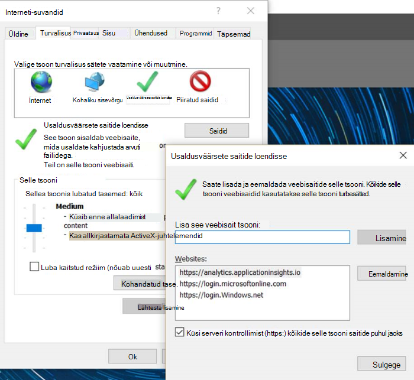
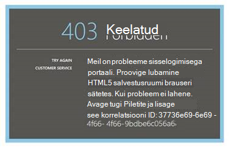

<properties 
    pageTitle="Tõrkeotsingu Analytics - tööriista võimas otsing, rakenduse ülevaated | Microsoft Azure'i" 
    description="Rakenduse ülevaated analytics probleeme? Alustage siit. " 
    services="application-insights" 
    documentationCenter=""
    authors="alancameronwills" 
    manager="douge"/>

<tags 
    ms.service="application-insights" 
    ms.workload="tbd" 
    ms.tgt_pltfrm="ibiza" 
    ms.devlang="na" 
    ms.topic="article" 
    ms.date="07/11/2016" 
    ms.author="awills"/>

# Klõpsake rakenduse ülevaated Analytics tõrkeotsing

[Rakenduse ülevaateid Analytics](app-insights-analytics.md)probleeme? Alustage siit. Analytics on võimas otsing tööriist, Visual Studio rakenduse ülevaated.

## Piirangud

* Praegu päringutulemite on piiratud andmete viimase nädala jooksul.
* Me proovida brauserid: Chrome'i, serva ja Internet Exploreri uusim väljaanded.

## Mitteühilduvad teadaolevad brauseri laiendid

* Ghostery

Keela pikendamise või kasutage mõnda muud brauserit.

##"Ootamatu tõrge"

Portaali käitusaja – töötlemata erandi ajal ilmnes sisemine tõrge.

* Puhastada brauseri vahemälu. 

## 403... proovige uuesti laadimine

Autentimise seotud ilmnes tõrge (autentimisel või Accessi Turbeloa tekitamise ajal). Portaali võib-olla ei ole võimalik taastada brauseri sätteid muutmata.

* Kontrollimaks, kas [kolmanda osapoole küpsised lubatakse](#cookies) brauseris. 

## 403... turvalisus zone kinnitamine

Autentimise seotud ilmnes tõrge (autentimisel või Accessi Turbeloa tekitamise ajal). Portaali võib-olla ei ole võimalik taastada brauseri sätteid muutmata.

1. Kontrollimaks, kas [kolmanda osapoole küpsised lubatakse](#cookies) brauseris. 

2. Kas kasutate lemmik, järjehoidja või salvestatud lingi avamiseks Analytics portaali? Saate sisse logitud erinevate mandaat, kui te varem link salvestamisel?

2. Proovige kasutada rakenduses-era/inkognito brauseriaknas (pärast sulgemist kõik sellised Windowsi). Peate oma mandaat. 

2. Avage teise (tavaline) brauseriaken ja valige [Azure](https://portal.azure.com). Logi välja. Avage oma link ja logige sisse õige mandaat.

2. Serva ja Internet Exploreri kasutajad saavad ka selle vea, kui usaldusväärse tsooni sätted pole toetatud.

    Veenduge, et nii [Analytics portaali](https://analytics.applicationinsights.io) ja [Azure Active Directory portaalis](https://portal.azure.com) on sama tsoonis:

 * Avage Internet Exploreris **Interneti-suvandid**, **Turve**, **usaldusväärsete saitide** **saidid**.

    

    Veebisaitide loendist, kui mõni järgmised URL-id on kaasatud, veenduge, et teised on kaasatud ka.

    https://Analytics.applicationinsights.IO 
   https://login.microsoftonline.com 
   https://login.Windows.net

## 404... Ressursi ei leitud

Ressurssi on kustutatud rakenduse ülevaated ja pole enam saadaval. See võib juhtuda siis, kui salvestasite Analytics lehe URL-i.

## 403... Luba

Teil pole õigust selle rakenduse avamiseks Analytics.

* Kas teile kuvati link kellegi teise? Paluge tal veenduge, et olete [lugejad või osaliste selle ressursirühma](app-insights-resources-roles-access-control.md).
* Kas lingi erineva mandaadi abil salvestada? Avage [Azure'i portaalis](https://portal.azure.com), logige välja ja seejärel proovige seda linki uuesti, pakkudes õige mandaat.

## 403... HTML5 salvestusruum

Meie portaal kasutab HTML5 localStorage ja sessionStorage.

* Chrome: Sätted, privaatsus, sisu seaded.
* Internet Explorer: Interneti-suvandid, vahekaardil Täpsemalt turvalisus, luba DOM-mälu

## 404... Tellimust ei leitud

URL on kehtetu. 

* Avage rakendus ressursi [Rakenduse ülevaated](https://portal.azure.com)portaalis. Seejärel saate kasutada analüüsi nuppu.

## 404... lehe pole olemas

URL on kehtetu.

* Avage rakendus ressursi [Rakenduse ülevaated](https://portal.azure.com)portaalis. Seejärel saate kasutada analüüsi nuppu.

## Muude tootjate küpsised

  [Kolmanda osapoole küpsised lubatakse keelamine](http://www.digitalcitizen.life/how-disable-third-party-cookies-all-major-browsers)vaadata, kuid Pange tähele, tuleb **lubada** neid.

## Kui kõik muu ebaõnnestub    

[Võtke meiega ühendust](app-insights-get-dev-support.md).
 
[AZURE.INCLUDE [app-insights-analytics-footer](../../includes/app-insights-analytics-footer.md)]

