<properties 
    pageTitle="Analüüsi -, rakenduse ülevaated tööriista võimas Otsing abil | Microsoft Azure'i" 
    description="Analytics, rakenduse teadmisi võimas diagnostika otsing tööriista abil. " 
    services="application-insights" 
    documentationCenter=""
    authors="danhadari" 
    manager="douge"/>

<tags 
    ms.service="application-insights" 
    ms.workload="tbd" 
    ms.tgt_pltfrm="ibiza" 
    ms.devlang="na" 
    ms.topic="article" 
    ms.date="10/21/2016" 
    ms.author="awills"/>

# Rakenduse ülevaated Analytics kasutamine

[Analytics](app-insights-analytics.md) on [Rakenduse ülevaated](app-insights-overview.md)võimsaid otsingufunktsiooni. Nende lehtede kirjeldada Analytics päringukeele.

* **[Vaata tutvustavat videot](https://applicationanalytics-media.azureedge.net/home_page_video.mp4)**.
* Kui teie rakendus pole andmete saatmine veel rakenduse ülevaated **[test drive Analytics meie jäljendatud andmeid](https://analytics.applicationinsights.io/demo)** .

## Avatud Analytics

Oma rakenduse Avaleht ressurss rakenduse ülevaated, seejärel klõpsake käsku analüütika.

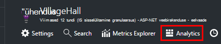

Tekstisisene õpetuse annab teile ideid selle kohta, mida saate teha.

On [rohkem tutvustuse siin](app-insights-analytics-tour.md).

## Päringu oma telemeetria

### Kirjutage päring

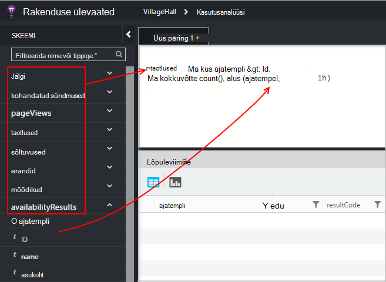

Alustage mõne loetletud vasakule (või [vahemiku](app-insights-analytics-reference.md#range-operator) või [Liidu](app-insights-analytics-reference.md#union-operator) tehtemärgid) tabelite nimed. Kasutage `|` [operaatorite](app-insights-analytics-reference.md#queries-and-operators)loomiseks. IntelliSense'i palub teil tehtemärgid ja mõned avaldise elemendid, mida saate kasutada.

Vaadake teemat [Analytics keele ülevaade](app-insights-analytics-tour.md) ja [keel viide](app-insights-analytics-reference.md).

### Päringu käitamine

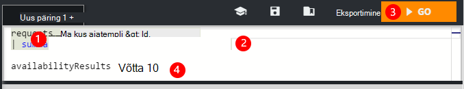

1. Saate ühe reapiirid päringu.
2. Asetage kursor tekstivälja või lõpus olevat päringut, mida soovite käivitada.
3. Klõpsake päringu käivitamiseks avage.
4. Ärge pange päringule tühje ridu. Saate hoida päringute eraldatud ühe päringu vahekaarti, eraldades need tühje ridu. Ainult üks kursor töötab.

### Päringu salvestamine

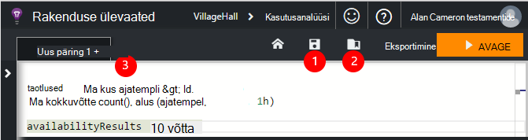

1. Praeguse päringu faili salvestada.
2. Avage salvestatud päringu fail.
3. Päringu uue faili loomine.

## Üksikasju vt

Laiendage tulemuste atribuudid selle täieliku loendi kuvamiseks ükskõik millisele reale. Saate laiendada vara, mis on struktureeritud väärtus – nt, kohandatud mõõtmetega suuruseni või mõnes erandi virnas.

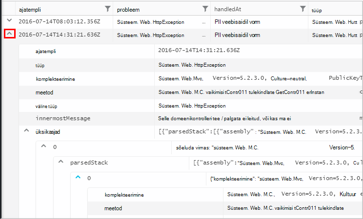

 

## Korraldage tulemused

Saate sortida, filtreerida, paginate ning oma päringu tulemite rühmitada.

> [AZURE.NOTE] Sortimise, rühmitamise ja filtreerimine brauseris ei päringu uuesti käivitada. Ainult ümber korraldada, viimase päringu tagastatud tulemite. 
> 
> Nende toimingute tegemiseks server enne tulemused tagastatakse kirjutage oma päringu [sortimine](app-insights-analytics-reference.md#sort-operator), [Summeeri](app-insights-analytics-reference.md#summarize-operator) ja [kus](app-insights-analytics-reference.md#where-operator) tehtemärkide abil.

Valige veerud, mida soovite näha, veerupäised ümberkorraldamiseks lohistage ja veergude suuruse muutmiseks lohistage nende äärised.

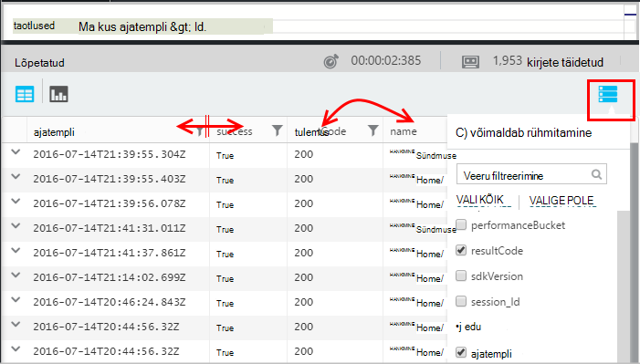

### Üksuste sortimine ja filtreerimine

Sortige veeru juhataja klõpsates tulemusi. Sortimiseks muul viisil ja valige kolmanda aja algse tellimine päringu tagastatud taastamiseks klõpsake uuesti.

Kasutage Otsingu kitsendamiseks filtriikooni.

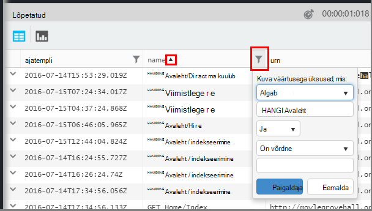

### Üksuste rühmitamine

Sortimine mitme veeru alusel, kasutage rühmitamist. Selle lubada, ja seejärel lohistage veerupäiste ruumi tabeli kohale.

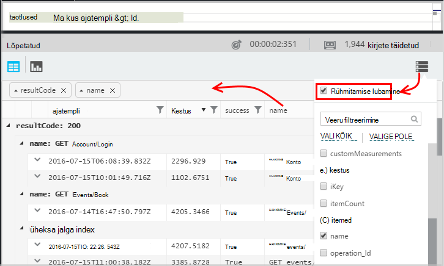

### Puuduvad mõningaid tulemusi?

On umbes 10 k ridade portaalist tagastatud tulemuste piirang. Hoiatus kuvatakse, kui lähete üle piiri. Sel juhul sortimine tabelis tulemused ei Kuva alati saate kõik tegelik esimese või viimase tulemused. 

See on hea tava on pihta limiit vältimiseks. Tehtemärkide kasutamine näiteks:

* [Kui ajatempli > ago(3d)](app-insights-analytics-reference.md#where-operator)
* [100 ülemist ajatempli järgi](app-insights-analytics-reference.md#top-operator) 
* [võtta 100](app-insights-analytics-reference.md#take-operator)
* [Summeeri](app-insights-analytics-reference.md#summarize-operator) 

## Diagrammid

Valige diagramm, mida soovite tüüp.

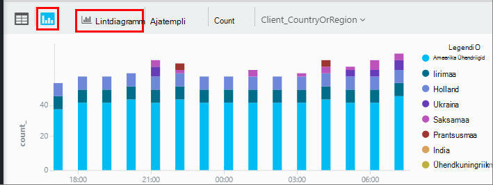

Kui teil on õige tüüpi mitmesse veergu, saate valida x ja y-telge ja mõõtmed tükeldamiseks tulemuste veerg.

Vaikimisi tulemused kuvatakse algselt tabelina ja valite skeemi käsitsi. Kuid abil saate [muuta direktiivi](app-insights-analytics-reference.md#render-directive) päringu lõpus Valige diagramm.

## Armatuurlauale kinnitamine

Saate kinnitada skeem või tabeli [ühiskasutusega armatuurlaudade](app-insights-dashboards.md) - ainult ühte nuppu PIN-kood. (Võib soovite [uuendada oma rakenduse hindade paketi](app-insights-pricing.md) selle funktsiooni sisselülitamiseks.) 

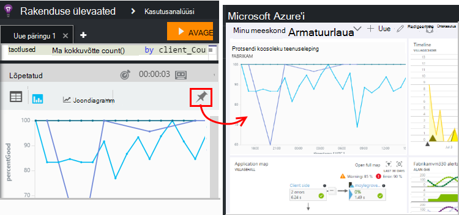

See tähendab, et kui lisate koos armatuurlaual, et saaksite jälgida jõudluse või web teenuste kasutamist, saate lisada üsna keerukas analüüsi muude mõõdikute kõrval. 

Tabeli armatuurlaud, saate kinnitada, kui see on neli või vähem veerud. Kuvatakse ainult seitse ülemist rida.

#### Armatuurlaua värskendamine

Kinnitatud armatuurlaud Diagramm värskendatakse automaatselt käivitades uuesti päringu ligikaudu igal pool tundi.

#### Automaatse lihtsustamine

Mõnel juhul rakendatakse teatud lihtsustamine diagrammi kui kinnitate armatuurlauale.

Kui kinnitamine diagramm, mis kuvatakse eraldi alused (tavaliselt lintdiagramm), vähem täidetud alused palju rühmitatakse automaatselt ühe aluse "muud". Näiteks see päring

    requests | summarize count_search = count() by client_CountryOrRegion

Analytics näeb välja umbes järgmine:

Aga kui kinnitate armatuurlauale, see näeb välja umbes järgmine:

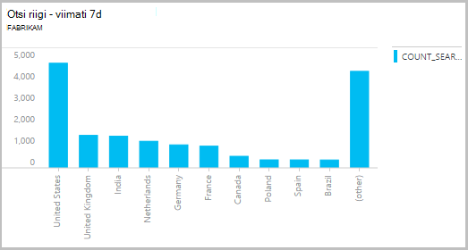

## Eksport Excelisse

Kui käivitate päringu, saate alla laadida CSV-faili. Klõpsake nuppu **ekspordi Excelisse**.

## Power BI eksportimine

Asetage kursor päringu ja valige **eksportimine Power BI**.

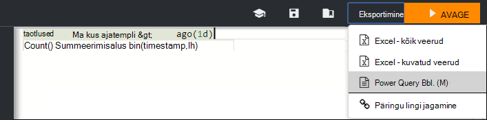

Käivitage päring Power BI. Saate häälestada selle Värskenda ajakava.

Power BI abil saate luua armatuurlaudu, mis koondavad andmeid paljudest erinevatest andmeallikatest.

[Lugege lisateavet Power BI ekspordi](app-insights-export-power-bi.md)

[AZURE.INCLUDE [app-insights-analytics-footer](../../includes/app-insights-analytics-footer.md)]

