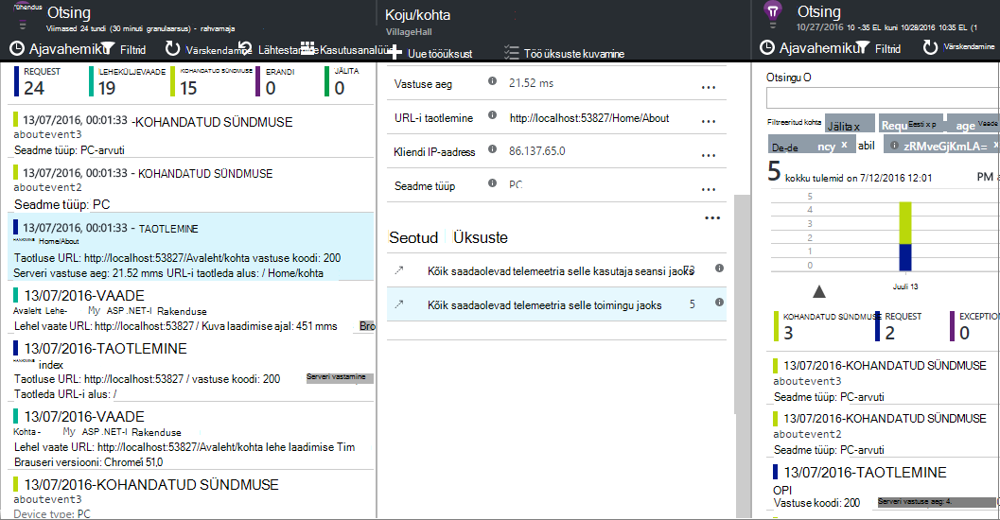

<properties 
    pageTitle="Rakenduse ülevaateid API kohandatud sündmused ja mõõdikute | Microsoft Azure'i" 
    description="Mõned koodiread lisamine oma seadme või töölaua rakenduse, veebilehe või teenuse kasutuskoha jälgimise ja probleemide." 
    services="application-insights"
    documentationCenter="" 
    authors="alancameronwills" 
    manager="douge"/>
 
<tags 
    ms.service="application-insights" 
    ms.workload="tbd" 
    ms.tgt_pltfrm="ibiza" 
    ms.devlang="multiple" 
    ms.topic="article" 
    ms.date="10/19/2016" 
    ms.author="awills"/>

# <a name="application-insights-api-for-custom-events-and-metrics"></a>Rakenduse ülevaateid API kohandatud sündmused ja mõõdikud 

*Rakenduse ülevaated on eelvaade.*

Lisada mõne koodiread rakenduse välja selgitada, mida kasutajad teevad selle või aidata diagnoosida probleeme. Saate saata telemeetria seade ja töölauarakendused, veebikliendid ja web servereid. [Visual Studio rakenduse ülevaated](app-insights-overview.md) core telemeetria API võimaldab teil saata kohandatud sündmused ja mõõdikute ja oma standard telemeetria versioonid. See API on sama API, mida kasutatakse normaliseeritud rakenduse ülevaated andmete kollektsiooni.

## <a name="api-summary"></a>API Kokkuvõte

API on ühtne üle kõik platvormid, peale mõne small variatsioonid.

Meetod | Kasutatakse
---|---
[`TrackPageView`](#page-views) | Lehtede, kuvarit, labad või vormid
[`TrackEvent`](#track-event) | Kasutaja toimingud ja muid sündmusi. Kasutada kasutaja käitumise jälgimiseks või jõudluse jälgimist.
[`TrackMetric`](#track-metric) | Jõudluse mõõtmed nagu järjekorda pikkusega pole seotud kindla sündmused
[`TrackException`](#track-exception)|Logige diagnoosimise erandid. Saate jälitada, kus toimub seoses muid sündmusi ja uurida virnas jälgi.
[`TrackRequest`](#track-request)| Logige sageduse ja jõudluse analüüs serveri taotlusi kestus.
[`TrackTrace`](#track-trace)|Diagnostika Logi sõnumid. Samuti saate hõivata 3-osaline logid.
[`TrackDependency`](#track-dependency)|Logige kestus ja sagedus kõned välise komponendid, millest sõltub teie rakendus.

Saate [lisada atribuudid ja mõõdikute](#properties) enamik need telemeetria kõned. 


## <a name="prep"></a>Enne alustamist

Kui need pole seda veel teinud:

* Projekti rakenduse ülevaateid SDK lisamiseks tehke järgmist.
 * [ASP.net-i projekti][greenbrown]
 * [Java projekti][java] 
 * [JavaScripti iga veebileht][client]   

* Seadme või web server koodis on järgmised.

    *C#:*`using Microsoft.ApplicationInsights;`

    *VB:*`Imports Microsoft.ApplicationInsights`

    *Java:*`import com.microsoft.applicationinsights.TelemetryClient;`

## <a name="construct-a-telemetryclient"></a>Ehitada on TelemetryClient

Ehitada TelemetryClient eksemplar (v.a JavaScript veebilehtede):

*C#:* 

    private TelemetryClient telemetry = new TelemetryClient();

*VB:* 

    Private Dim telemetry As New TelemetryClient

*Java*

    private TelemetryClient telemetry = new TelemetryClient();

TelemetryClient on jutulõnga ohutu.

Soovitame kasutada näiteks `TelemetryClient` iga mooduli rakenduse. Näiteks võib olla üks `TelemetryClient` oma veebiteenuse aruande business loogika sündmustele reageerida sissetuleva http, ja teise vahevara tunni teatada. Saate seada atribuudid `TelemetryClient.Context.User.Id` kasutajate ja seansid, jälgida või `TelemetryClient.Context.Device.Id` masina tuvastamiseks. See teave on lisatud kõik sündmused, mis on saadetud astme.


## <a name="track-event"></a>Jälgida sündmuste

Rakenduse ülevaated, *kohandatud sündmuse* koostamine on andmepunkt, saate kuvada nii [Mõõdikute] Exploreris[ metrics] on liidetud count ning ka üksikute sündmuste [Diagnostika]otsingus[diagnostic]. (See pole seotud MVC või muude framework "sündmused.") 

Lisa TrackEvent kõned koodi loendamiseks, kui sageli kasutajad valida mingi kindla funktsiooni, kui sageli nad saavutada eesmärkidele, või võib-olla teatud tüüpi vea teha. 

Näiteks mängu rakenduses saata sündmuse iga kord, kui kasutaja võitis mängu: 

*JavaScripti*

    appInsights.trackEvent("WinGame");

*C#:*
    
    telemetry.TrackEvent("WinGame");

*VB*


    telemetry.TrackEvent("WinGame")

*Java*

    telemetry.trackEvent("WinGame");


### <a name="view-your-events-in-the-azure-portal"></a>Saate vaadata oma sündmused Azure'i portaalis

Teie sündmuste arv vaatamiseks avage [Meetermõõdustik Exploreri](app-insights-metrics-explorer.md) blade uue diagrammi lisamine ja valige sündmused.  


Loendab erinevate sündmuste võrdlemiseks määrata diagrammitüübi koordinaatvõrk ja rühma ürituse nime järgi.


Klõpsake ruudustiku kaudu sündmuse nimi kuvamiseks üksikuid esinemiskordade sündmusega.


Klõpsake mõnda korduvat täpsemaks vaatamiseks.

Keskenduda teatud sündmuste otsing või meetermõõdustik Explorer, määrata blade filter sündmuse nimed, mis teile huvi.


## <a name="track-metric"></a>Meetermõõdustik jälgimine

TrackMetric abil saate saata mõõdikute pole seotud kindla sündmused. Näiteks saate jälgida järjekorra pikkus intervalliga. 

Mõõdikute kuvatakse statistilised diagrammid argumendil Exploreris, kuid erinevalt sündmusi, ei saa otsida üksikute sündmuste diagnostika otsing.

Argumendil väärtused peaksid olema > = 0 õigesti kuvada.


*JavaScripti*

    appInsights.trackMetric("Queue", queue.Length);

*C#:*

    telemetry.TrackMetric("Queue", queue.Length);

*VB*

    telemetry.TrackMetric("Queue", queue.Length)

*Java*

    telemetry.trackMetric("Queue", queue.Length);

Tegelikult, võib see tehke tausta teemas.

*C#:*

    private void Run() {
     var appInsights = new TelemetryClient();
     while (true) {
      Thread.Sleep(60000);
      appInsights.TrackMetric("Queue", queue.Length);
     }
    }


Tulemite vaatamiseks avage mõõdikute Explorer ja uue diagrammi lisamine. Määrata seda, et kuvada teie meetermõõdustik.


On mõned [piirangud mõõdikute arvu](#limits) saate kasutada.

## <a name="page-views"></a>Lehe vaated

Seadme või veebilehe rakenduse, saadetakse lehe vaate telemeetria vaikimisi iga Kuva või lehe laadimisel. Kuid saate selle muuta lehe vaated jälgimiseks täiendavaid või erinevaid ajal. Näiteks rakendus, mis kuvab vahekaarte või labad, võiksite jälgida iga kord, kui kasutaja avab uue blade "leht". 


Kasutaja- ja seansi andmeid ei saadeta atribuutidena koos lehe vaateid, nii, et kasutaja ja seansi diagrammide elavamaks lehe vaate telemeetria korral.

#### <a name="custom-page-views"></a>Kohandatud vaated

*JavaScripti*

    appInsights.trackPageView("tab1");

*C#:*

    telemetry.TrackPageView("GameReviewPage");

*VB*

    telemetry.TrackPageView("GameReviewPage")


Kui teil on mitu vahekaarti muu HTML-lehtede sees, saate määrata URL-i liiga:

    appInsights.trackPageView("tab1", "http://fabrikam.com/page1.htm");

#### <a name="timing-page-views"></a>Ajastuse lehe vaated

Vaikimisi kellaaegu teatatud mõõdetuna "Kuva laadimise ajal" on kui brauseri saadab kutse, kuni nimetatakse brauseri lehe laadimise sündmus.

Selle asemel saate teha järgmist.

* Määrata ka konkreetsete kestus [trackPageView](https://github.com/Microsoft/ApplicationInsights-JS/blob/master/API-reference.md#trackpageview) kõne.
 * `appInsights.trackPageView("tab1", null, null, null, durationInMilliseconds);`
* Kõnede ajastamise lehe vaate kasutamine `startTrackPage` ja `stopTrackPage`.

*JavaScripti*

    // To start timing a page:
    appInsights.startTrackPage("Page1");

... 

    // To stop timing and log the page:
    appInsights.stopTrackPage("Page1", url, properties, measurements);

Nime saate kasutada, nagu esimese parameetrina seob käivitamise ja lõpetamise kõnesid. Vaikimisi praeguse lehe nimi. 

Tulemiks oleva lehe laadimise kestused mõõdiku Explorer kuvatakse tuletatud intervalli käivitamise ja lõpetamise kõnesid. See on teile mis tegelikult aega.

## <a name="track-request"></a>Päringu jälgi

Serveri SDK kasutatava sisselogimiseks HTTP päringuid. 

Saate ka helistada seda ise kui soovite simuleerida taotlusi kontekstis kui teil pole teenuse moodulit web töötab.

*C#:*

    // At start of processing this request:

    // Operation Id and Name are attached to all telemetry and help you identify
    // telemetry associated with one request:
    telemetry.Context.Operation.Id = Guid.NewGuid().ToString();
    telemetry.Context.Operation.Name = requestName;
    
    var stopwatch = System.Diagnostics.Stopwatch.StartNew();

    // ... process the request ...

    stopwatch.Stop();
    telemetry.TrackRequest(requestName, DateTime.Now,
       stopwatch.Elapsed, 
       "200", true);  // Response code, success


## <a name="operation-context"></a>Toiming kontekst

Telemeetria üksuste koos seotud, lisades neile levinud toimingut ID. Jälitamise mooduli taotluse see erandid ja muid sündmusi, mis on saadetud HTTP-päring töötlemise ajal. [Otsingu](app-insights-diagnostic-search.md) -ja [Analytics](app-insights-analytics.md), saate kerge vaevaga taotluse seotud sündmused ID-d. 

Lihtsaim viis seadmiseks ID on seada keskkonnas toimingu abil seda mudelit:

    // Establish an operation context and associated telemetry item:
    using (var operation = telemetry.StartOperation<RequestTelemetry>("operationName"))
    {
        // Telemetry sent in here will use the same operation ID.
        ...
        telemetry.TrackEvent(...); // or other Track* calls
        ...
        // Set properties of containing telemetry item - for example:
        operation.Telemetry.ResponseCode = "200";
        
        // Optional: explicitly send telemetry item:
        telemetry.StopOperation(operation);

    } // When operation is disposed, telemetry item is sent.

Samuti säte toiming keskkonnas `StartOperation` loob telemeetria üksuse tüüp, määrake ja saadab, kui saate kasutada toimingut, või kui helistate otseselt `StopOperation`. Kui kasutate `RequestTelemetry` telemeetria tüübiks, siis selle kestus seatakse ajastatud intervalli käivitamise ja lõpetamise.

Toiming kontekstides ei saa pesastada. Kui seal on juba mõni toiming konteksti, on seotud kõigile keskkonnas üksustele, sh StartOperation loodud üksuse tema ID-d.

Otsing, kasutatakse toimingu kontekstile seostuvate üksuste loendi loomiseks:




## <a name="track-exception"></a>Erandi jälgimine

Saata rakenduse ülevaated erandid: lugeda [neid][metrics], nimega sagedus probleemile; ning [uurida üksikute sündmuste][diagnostic]. Aruanded sisaldavad virnas jälgi.

*C#:*

    try
    {
        ...
    }
    catch (Exception ex)
    {
       telemetry.TrackException(ex);
    }

*JavaScripti*

    try
    {
       ...
    }
    catch (ex)
    {
       appInsights.trackException(ex);
    }

Funktsiooni SDK-d jaole juba palju erandeid automaatselt, nii, et te ei pea alati kõne TrackException otseselt.

* ASP.net-i: [kinni püüdma erandid koodi kirjutamine](app-insights-asp-net-exceptions.md)
* J2EE: [erandid püütakse automaatselt](app-insights-java-get-started.md#exceptions-and-request-failures)
* JavaScripti: Püütud automaatselt. Kui soovite keelata automaatse saidikogumi, Joone lisamine rakendusse veebilehtede lisatav koodilõigu.

    ```
    ({
      instrumentationKey: "your key"
      , disableExceptionTracking: true
    })
    ```


## <a name="track-trace"></a>Jälita jälgimine 

Kasutage seda aidata diagnoosida probleeme, saates lingirea rada rakenduse ülevaated. Saate saata osa Diagnostikaandmete ja kontrollida neid [diagnostika]otsingus[diagnostic]. 

 

[Logige adapterit] [ trace] kasutada seda API portaali kolmanda osapoole logid saata.


*C#:*

    telemetry.TrackTrace(message, SeverityLevel.Warning, properties);


Saate otsida sõnumi sisu, kuid (erinevalt kinnisvarahindade) ei saa filtreerida selle.

Mahupiirangu `message` on palju suuremad kui piirang atribuudid.
TrackTrace eelis on see, et saate panna andmete suhteliselt pikka sõnumit. Näiteks võib kodeerida postituse andmed.  


Lisaks saate lisada oma sõnum raskusaste tase. Ja muude telemeetria, nt saate lisada atribuudi väärtused, aidata filtreerimisel või otsingu jaoks erinevaid jälgi kasutatavad. Näiteks:


    var telemetry = new Microsoft.ApplicationInsights.TelemetryClient();
    telemetry.TrackTrace("Slow database response",
                   SeverityLevel.Warning,
                   new Dictionary<string,string> { {"database", db.ID} });

See võimaldab teil, väljale [Otsi][diagnostic], hõlpsasti filtreerida teatud raskusaste taseme seotud kindla andmebaasi kõik sõnumid.

## <a name="track-dependency"></a>Sõltuvus jälgimine

Selle kõne abil saate jälgida vastamise aeg ning edukust kõnede mõne välise tükk koodi. Tulemused kuvatakse sõltuvus diagrammide portaalis. 

```C#

            var success = false;
            var startTime = DateTime.UtcNow;
            var timer = System.Diagnostics.Stopwatch.StartNew();
            try
            {
                success = dependency.Call();
            }
            finally
            {
                timer.Stop();
                telemetry.TrackDependency("myDependency", "myCall", startTime, timer.Elapsed, success);
            }
```

Pidage meeles, et SDK-d kaasata [sõltuvus moodul](app-insights-dependencies.md) , mis leiab ja jälgib teatud sõltuvus server nõuab automaatselt – näiteks andmebaasid ja REST API-de. Peate installima agent serverisse mooduli töö tegemiseks. Kui soovite jälitada kõnesid, mis pole vastuolus automatiseeritud jälitus või kui te ei soovi installida agent, kasutaks seda kõne.

Standardse sõltuvus jälgimise moodul väljalülitamiseks [ApplicationInsights.config](app-insights-configuration-with-applicationinsights-config.md) redigeerida ja kustutada viide `DependencyCollector.DependencyTrackingTelemetryModule`.


## <a name="flushing-data"></a>Flushing andmed

Tavaliselt SDK saadab aeg-ajalt valitud minimeerimiseks mõju kasutaja andmeid. Kuid mõnel juhul võiksite tühjendage Alustuseks puhvri – näiteks kui kasutate SDK rakendus, mis lülitab.

*C#:*

    telemetry.Flush();

    // Allow some time for flushing before shutdown.
    System.Threading.Thread.Sleep(1000);

Pange tähele, et funktsiooni on asünkroonne [serveri telemeetria kanali](https://www.nuget.org/packages/Microsoft.ApplicationInsights.WindowsServer.TelemetryChannel/), kuid kui kasutate-mälu kanali või [püsivate kanali](app-insights-api-filtering-sampling.md#persistence-channel)sünkroonse.


## <a name="authenticated-users"></a>Autenditud kasutajad

Web Appis kasutajad on tähistatud küpsise vaikimisi. Kasutaja võib loendatavaid rohkem kui üks kord, kui nad pääsete juurde rakenduse kaudu brauseri või teise arvutisse või kustutada. 

Kuid kui kasutajad sisse logida rakenduse, saate Täpsem count seadmisega autenditud kasutaja-id brauseri kood.

*JavaScripti*

```JS
    // Called when my app has identified the user.
    function Authenticated(signInId) {
      var validatedId = signInId.replace(/[,;=| ]+/g, "_");
      appInsights.setAuthenticatedUserContext(validatedId);
      ...
    }
```

ASP.NET-Web MVC rakenduste, nt:

*Razori*

        @if (Request.IsAuthenticated)
        {
            <script>
                appInsights.setAuthenticatedUserContext("@User.Identity.Name
                   .Replace("\\", "\\\\")"
                   .replace(/[,;=| ]+/g, "_"));
            </script>
        }

Pole vaja kasutada kasutaja tegelik sisselogimisnimi. Ainult peab olema kordumatu kasutaja id. Ei tohi sisaldada tühikuid ega märke `,;=|`. 

Kasutaja ID-d on ka seansi küpsise seadmine ja saata serverisse. Kui server SDK on installitud, saadetakse osana kontekstis atribuutide nii kliendi ja serveri telemeetria, autenditud kasutaja ID-d nii, et saate filtreerida ja otsida seda.

Kui teie rakendus rühmitab kasutajate kontod, samuti saab edastada identifikaatori konto (piirangutega on sama märki).


      appInsights.setAuthenticatedUserContext(validatedId, accountId);

[Mõõdikute explorer](app-insights-metrics-explorer.md), saate luua diagramm, mis Loendab **kasutajad, autenditud** ja **kasutajale kontod**. 

Samuti saate [Otsingu] [ diagnostic] kliendi andmepunkte teatud kasutajanimed ja kontod.

## <a name="properties"></a>Filtreerimine, otsimine ja segmendi andmete atribuudid

Saate lisada atribuudid ja mõõdud oma sündmused (ja ka mõõdikute, lehele vaadete, erandid ja muud telemeetria andmed).

**Atribuudid** on string väärtused, mille abil saate oma telemeetria kasutusaruannete filtreerimiseks. Näiteks kui teie rakendus pakub mitu mängu, peaksite mängu nimi manustamiseks iga sündmuse nii, et näete, millised visualiseerimine on veel populaarsed. 

On umbes 1 k stringi pikkuse piirang. (Kui soovite saada suur osa andmeid, kasutada sõnumi parameetri [TrackTrace](#track-trace).)

**Mõõdikute** on arvväärtused, graafiliselt esitatud. Näiteks soovite kontrollida, kas teie mängijad saavutada hinded järk-järgult suurendatakse. Graafikud saate segmenditud saadetud sündmus, atribuutide, nii et saaks eraldi või virnastatud graafikud erinevat mängu.

Argumendil väärtused peaksid olema > = 0 õigesti kuvada.


On mõned [piirangud atribuudid, kinnisvarahindade, ja mõõdikute arv](#limits) , mida saate kasutada.


*JavaScripti*

    appInsights.trackEvent
      ("WinGame",
         // String properties:
         {Game: currentGame.name, Difficulty: currentGame.difficulty},
         // Numeric metrics:
         {Score: currentGame.score, Opponents: currentGame.opponentCount}
         );

    appInsights.trackPageView
        ("page name", "http://fabrikam.com/pageurl.html",
          // String properties:
         {Game: currentGame.name, Difficulty: currentGame.difficulty},
         // Numeric metrics:
         {Score: currentGame.score, Opponents: currentGame.opponentCount}
         );
          

*C#:*

    // Set up some properties and metrics:
    var properties = new Dictionary <string, string> 
       {{"game", currentGame.Name}, {"difficulty", currentGame.Difficulty}};
    var metrics = new Dictionary <string, double>
       {{"Score", currentGame.Score}, {"Opponents", currentGame.OpponentCount}};

    // Send the event:
    telemetry.TrackEvent("WinGame", properties, metrics);


*VB*

    ' Set up some properties:
    Dim properties = New Dictionary (Of String, String)
    properties.Add("game", currentGame.Name)
    properties.Add("difficulty", currentGame.Difficulty)

    Dim metrics = New Dictionary (Of String, Double)
    metrics.Add("Score", currentGame.Score)
    metrics.Add("Opponents", currentGame.OpponentCount)

    ' Send the event:
    telemetry.TrackEvent("WinGame", properties, metrics)


*Java*
    
    Map<String, String> properties = new HashMap<String, String>();
    properties.put("game", currentGame.getName());
    properties.put("difficulty", currentGame.getDifficulty());
    
    Map<String, Double> metrics = new HashMap<String, Double>();
    metrics.put("Score", currentGame.getScore());
    metrics.put("Opponents", currentGame.getOpponentCount());
    
    telemetry.trackEvent("WinGame", properties, metrics);


> [AZURE.NOTE] Olge ettevaatlik, mitte logida isikuttuvastava teabe atribuudid.

**Kui kasutasite mõõdikute**, avage meetermõõdustik Explorer ja valige mõõdiku kohandatud rühmast.


*Kui teie meetermõõdustik ei kuvata või kohandatud pealkirja pole olemas, sulgege valiku tera ja proovige hiljem. Mõnikord võib kuluda mõõdikute koondatakse tulemas kuni tund.*

**Kui kasutasite atribuudid ja mõõdikute**lõigu meetermõõdustik atribuudi järgi:


**Diagnostika otsing**, saate vaadata atribuudid ja mõõdikute üksikute esinemiskordade sündmuse.


Väli otsingu abil saate vaadata sündmuse esinemisjuhud teatud atribuudi väärtus.


[Lisateavet otsingu avaldiste][diagnostic].

#### <a name="alternative-way-to-set-properties-and-metrics"></a>Alternatiivne võimalus atribuudid ja mõõdikute seadmine

Kui see on mugavam, saate koguda eraldi objekti sündmuse parameetrid:

    var event = new EventTelemetry();

    event.Name = "WinGame";
    event.Metrics["processingTime"] = stopwatch.Elapsed.TotalMilliseconds;
    event.Properties["game"] = currentGame.Name;
    event.Properties["difficulty"] = currentGame.Difficulty;
    event.Metrics["Score"] = currentGame.Score;
    event.Metrics["Opponents"] = currentGame.Opponents.Length;

    telemetry.TrackEvent(event);

> [AZURE.WARNING] Ärge kasutage sama telemeetria üksuse eksemplari (`event` selles näites) helistamiseks Track*() mitu korda. See võib põhjustada telemeetria saadetakse vale konfiguratsioon.


## <a name="timed"></a>Ajastuse sündmused

Vahel soovite diagramm, kui kaua võtab teatud toimingu sooritamiseks. Näiteks võite meeldib teada, kuidas kasutajad tee valikud mängu silmas pidada. See on kasulik näide kasutab mõõtühikute parameetri.


*C#:*

    var stopwatch = System.Diagnostics.Stopwatch.StartNew();

    // ... perform the timed action ...

    stopwatch.Stop();

    var metrics = new Dictionary <string, double>
       {{"processingTime", stopwatch.Elapsed.TotalMilliseconds}};

    // Set up some properties:
    var properties = new Dictionary <string, string> 
       {{"signalSource", currentSignalSource.Name}};

    // Send the event:
    telemetry.TrackEvent("SignalProcessed", properties, metrics);


## <a name="defaults"></a>Jaoks kohandatud telemeetria vaikeatribuudid

Kui soovite määrata vaikimisi kinnisvarahindade mõne kohandatud sündmused, mille peaksite kirjutama, saate need on TelemetryClient. Need on lisatud iga kliendi poolt saadetud telemeetria üksus. 

*C#:*

    using Microsoft.ApplicationInsights.DataContracts;

    var gameTelemetry = new TelemetryClient();
    gameTelemetry.Context.Properties["Game"] = currentGame.Name;
    // Now all telemetry will automatically be sent with the context property:
    gameTelemetry.TrackEvent("WinGame");
    
*VB*

    Dim gameTelemetry = New TelemetryClient()
    gameTelemetry.Context.Properties("Game") = currentGame.Name
    ' Now all telemetry will automatically be sent with the context property:
    gameTelemetry.TrackEvent("WinGame")

*Java*

    import com.microsoft.applicationinsights.TelemetryClient;
    import com.microsoft.applicationinsights.TelemetryContext;
    ...


    TelemetryClient gameTelemetry = new TelemetryClient();
    TelemetryContext context = gameTelemetry.getContext();
    context.getProperties().put("Game", currentGame.Name);
    
    gameTelemetry.TrackEvent("WinGame");


    
Üksikute telemeetria kõned saate nende atribuutide sõnastikud vaikeväärtused alistada.

**JavaScripti jaoks veebikliendid**, [Kasutage JavaScripti telemeetria initializers](#js-initializer).

**Lisada atribuudid, et kõik telemeetria** andmed standard saidikogumi moodulid, sh [rakendada `ITelemetryInitializer` ](app-insights-api-filtering-sampling.md#add-properties).


## <a name="sampling-filtering-and-processing-telemetry"></a>Proovi, filtreerimine ja telemeetria töötlemine 

Saate kirjutada kood, et töödelda oma telemeetria enne saatmist SDK. Töötlemine hõlmab standard telemeetria moodulid, nt HTTP taotluse kogumine ja sõltuvus saidikogumi saadetud andmed.

* [Lisa atribuute](app-insights-api-filtering-sampling.md#add-properties) , rakendades telemeetria `ITelemetryInitializer` – näiteks lisada versiooni arvud või muid atribuute arvutatud väärtused. 
* [Filtreerimine](app-insights-api-filtering-sampling.md#filtering) saate muuta või Hülga telemeetria enne saatmist SDK rakendades `ITelemetryProcesor`. Saate määrata, mis on saadetud või hüljata, kuid teil on oma mõõdikute mõju arvesse võtta. Sõltuvalt sellest, kuidas hüljata üksusi, võite kaotada võimalus seostuvate üksuste vahel liikumine.
* [Proovide](app-insights-api-filtering-sampling.md#sampling) on saatnud teie rakenduse portaali andmete mahu vähendamiseks pakkimisel lahendus. See nii mõjutamata kuvatud mõõdikute ja mõjutamata teie võimalus probleemide väljaselgitamiseks seostuvad üksused, nt erandid, taotlusi ja lehe vaadete vahel liikumine.

[Lisateave](app-insights-api-filtering-sampling.md)


## <a name="disabling-telemetry"></a>Telemeetria keelamine

**Dünaamiliselt peatada ja käivitada** kogumine ja edastamine telemeetria järgmist.

*C#:*

```C#

    using  Microsoft.ApplicationInsights.Extensibility;

    TelemetryConfiguration.Active.DisableTelemetry = true;
```

**Keelata valitud standard kollektsiooni** – näiteks jõudluse hinnale, HTTP päringuid või sõltuvused - kustutamine või kommentaaride välja oluline read [ApplicationInsights.config][config]. Kui soovite saata TrackRequest andmete võiks seda, näiteks teha.

## <a name="debug"></a>Arendaja režiimis

Ajal silumine, on kasulik on teie telemeetria kiirendada tulemas nii, et näete tulemusi kohe. Saate ka get täiendavad sõnumid, mis aitavad teil jälgida telemeetria probleeme. Lülitage see välja valmistamisel, kuna see võib aeglustada rakenduse.


*C#:*
    
    TelemetryConfiguration.Active.TelemetryChannel.DeveloperMode = true;

*VB*

    TelemetryConfiguration.Active.TelemetryChannel.DeveloperMode = True


## <a name="ikey"></a>Valitud kohandatud telemeetria instrumentation võti seadmine

*C#:*
    
    var telemetry = new TelemetryClient();
    telemetry.InstrumentationKey = "---my key---";
    // ...


## <a name="dynamic-ikey"></a>Dünaamiliste instrumentation võti

Telemeetria kaudu arengu, keskkondade segamine vältimiseks saate [luua eraldi rakenduse ülevaated ressursid] [ create] ja muuta oma olenevalt võtmed.

Selle asemel, et saada instrumentation võti konfiguratsiooni faili, saate selle koodi. Lähtestamine meetodi, nt global.aspx.cs teenuse ASP.net-i võtme seadmiseks:

*C#:*

    protected void Application_Start()
    {
      Microsoft.ApplicationInsights.Extensibility.
        TelemetryConfiguration.Active.InstrumentationKey = 
          // - for example -
          WebConfigurationManager.Settings["ikey"];
      ...

*JavaScripti*

    appInsights.config.instrumentationKey = myKey; 


Veebilehtede, võiksite määraks web serveri olek, mitte kodeerimise see sõna-sõnalt skripti. Näiteks klõpsake ASP.net-i rakenduse loodud veebilehe:

*JavaScripti Razori*

    <script type="text/javascript">
    // Standard Application Insights web page script:
    var appInsights = window.appInsights || function(config){ ...
    // Modify this part:
    }({instrumentationKey:  
      // Generate from server property:
      @Microsoft.ApplicationInsights.Extensibility.
         TelemetryConfiguration.Active.InstrumentationKey"
    }) // ...


## <a name="telemetrycontext"></a>TelemetryContext

TelemetryClient on konteksti atribuut, mis sisaldab väärtusi, mis saadetakse koos kõik telemeetria andmed. Need tavaliselt määrab standard telemeetria moodulid, kuid samuti saate need ise. Näiteks:

    telemetry.Context.Operation.Name = "MyOperationName";

Kui seate need väärtused ise, kaaluge vastava rea eemaldamine [ApplicationInsights.config][config], et teie väärtused ja normaliseeritud väärtused ei saa segadusse.

* **Komponent** Tuvastab rakendus ja versioon
* **Seadme** Andmete kohta, kus rakendus töötab seadme (veebirakenduste, on see, kust saadetakse telemeetria serveri või kliendi seadme)
* **InstrumentationKey** Tuvastab Azure, kus kuvatakse telemeetria rakenduse ülevaated ressurss. Tavaliselt soovite ApplicationInsights.config
* **Asukoht** Tuvastab seadme geograafiline asukoht.
* **Toiming** Veebirakendustes praeguse HTTP-päring. Rakenduse muud tüüpi, saate määrata selle rühma sündmused koos.
 * **ID**: loodud väärtus, mis vastab loendis efektidele eri sündmustele, nii, et kui sündmuse diagnostika otsingus, leiate "seostuvad üksused"
 * **Nimi**: identifikaatori tavaliselt URL-i HTTP-päring. 
 * **SyntheticSource**: kui pole null või tühi, stringile näitab, et taotluse allika on määratletud robot või web test. Vaikimisi on välistatud arvutuste mõõdikute Exploreris.
* **Atribuudid** Atribuudid, mis on saadetud kõik telemeetria andmed. Saate üksikuid Jälita * kõnede eirata.
* **Seansi** Kasutaja seansi ID. ID-d on seatud loodud väärtus, mis on muutunud, kui kasutaja ei ole aktiivne samal ajal.
* **Kasutaja** Kasutajateave. 

## <a name="limits"></a>Piirangud


[AZURE.INCLUDE [application-insights-limits](../../includes/application-insights-limits.md)]

*Kuidas vältida andmete määr limiit pihta?*

* Kasutage [valimite](app-insights-sampling.md).

*Kui kaua andmeid hoitakse?*

* Lugege teemat [andmete säilitamise ja privaatsuse][data].


## <a name="reference-docs"></a>Viide dokumendid

* [ASP.net-i viide](https://msdn.microsoft.com/library/dn817570.aspx)
* [Java viide](http://dl.windowsazure.com/applicationinsights/javadoc/)
* [JavaScripti viide](https://github.com/Microsoft/ApplicationInsights-JS/blob/master/API-reference.md)
* [Android SDK](https://github.com/Microsoft/ApplicationInsights-Android)
* [iOS-i SDK](https://github.com/Microsoft/ApplicationInsights-iOS)


## <a name="sdk-code"></a>SDK kood

* [ASP.net-i Core SDK](https://github.com/Microsoft/ApplicationInsights-dotnet)
* [ASP.NET-I 5](https://github.com/Microsoft/ApplicationInsights-aspnet5)
* [Windows Serveri pakettide](https://github.com/Microsoft/applicationInsights-dotnet-server)
* [Java SDK](https://github.com/Microsoft/ApplicationInsights-Java)
* [JavaScripti SDK](https://github.com/Microsoft/ApplicationInsights-JS)
* [Kõik platvormid](https://github.com/Microsoft?utf8=%E2%9C%93&query=applicationInsights)

## <a name="questions"></a>Küsimused

* *Millised erandid Track_() kõned võib põhjustada?*
    
    Mitte keegi. Te ei pea Murra need proovige kaaspüük punktides. Kui SDK tekib probleeme, see sisse logida sõnumid, mis kuvatakse konsooli silumine väljund, ja, kui sõnumeid saada - diagnostika otsingu kaudu.


* *Kas REST API portaali andmete toomiseks?*

    Jah, Tulekul. Kasutage vahepeal [pidev ekspordi](app-insights-export-telemetry.md).

## <a name="next"></a>Järgmised sammud


[Otsi sündmuste ja logid][diagnostic]

[Näidiseid ja juhendavad tutvustused](app-insights-code-samples.md)

[Tõrkeotsing][qna]


<!--Link references-->

[client]: app-insights-javascript.md
[config]: app-insights-configuration-with-applicationinsights-config.md
[create]: app-insights-create-new-resource.md
[data]: app-insights-data-retention-privacy.md
[diagnostic]: app-insights-diagnostic-search.md
[exceptions]: app-insights-asp-net-exceptions.md
[greenbrown]: app-insights-asp-net.md
[java]: app-insights-java-get-started.md
[metrics]: app-insights-metrics-explorer.md
[qna]: app-insights-troubleshoot-faq.md
[trace]: app-insights-search-diagnostic-logs.md

 
