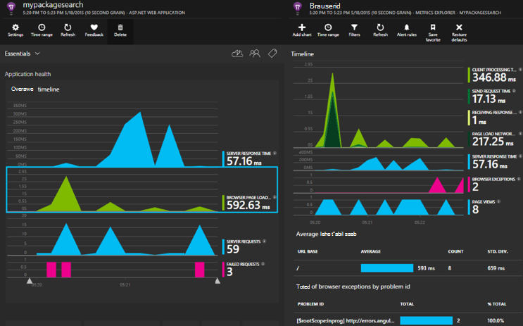

<properties 
    pageTitle="ASP.net-i Core rakenduse ülevaated" 
    description="Veebirakenduste olemasolu, jõudlus ja kasutuse jälgimine." 
    services="application-insights" 
    documentationCenter=".net"
    authors="alancameronwills" 
    manager="douge"/>

<tags 
    ms.service="application-insights" 
    ms.workload="tbd" 
    ms.tgt_pltfrm="ibiza" 
    ms.devlang="na" 
    ms.topic="article" 
    ms.date="08/30/2016" 
    ms.author="awills"/>

# ASP.net-i Core rakenduse ülevaated

[Visual Studio rakenduse ülevaated](app-insights-overview.md) võimaldab teil jälgida oma veebirakenduse olemasolu, jõudlus ja kasutamine. Abil saate looduses jõudlus ja tõhustada rakenduse kohta tagasiside, saate iga arengu elutsükli kursis püsida valikuid kujunduse suunda.

Peate tellimuse [Microsoft](http://azure.com)Azure. Logige sisse Microsofti kontoga, mida peate võib-olla Windowsi, XBox Live või muude Microsofti pilveteenustega. Teie meeskond võib olla ettevõtte tellimuse Azure: paluge omanik teid lisab selle Microsofti kontoga.

## Alustamine

Järgige [kasutusjuhend](https://github.com/Microsoft/ApplicationInsights-aspnetcore/wiki/Getting-Started).

## Rakenduse ülevaated abil

[Microsoft Azure'i portaali](https://portal.azure.com) sisse logida ja liikuge sirvides ressursile loodud rakenduse jälgimiseks.

Eraldi brauseriaknas kasutada rakenduse aega. Näete rakenduse ülevaated diagrammide sisalduvate andmete. (Võimalik, et peate nuppu Värskenda.) On üksnes väike andmete ajal arendate, kuid nende diagrammide tõesti elavamaks kui avaldada oma rakenduse ja on palju kasutajaid. 

Ülevaade lehel kuvatakse jõudluse diagrammide te tõenäoliselt kõige enam huvi pakkuda: server vastuse aeg, laadimise ajal ja loendab nurjunud taotluste arv. Klõpsake mis tahes diagrammi Lisateavet diagrammide ja andmete kuvamiseks.

Vaadete portaalis jagunevad kahte:

* Diagrammid ja tabelid, mõõdikute ja loendab, nt vastuse korda, tõrge määr või teie enda loodud [API](app-insights-api-custom-events-metrics.md)mõõdikute kuvatakse [Mõõdikute Exploreris](app-insights-metrics-explorer.md) . Andmete filtreerimine ja segmendi andmed, kinnisvarahindade saamiseks rakenduse ja selle kasutajad paremini mõista.
* [Otsingu Explorer](app-insights-diagnostic-search.md) on loetletud üksikute sündmuste, näiteks teatud taotlusi, erandid, log jälgi või sündmused, mille olete ise loonud [API](app-insights-api-custom-events-metrics.md). Filtreerimine sündmuste otsimiseks ja uurimiseks seotud sündmused vahel liikumine.
* [Kasutusanalüüsi](app-insights-analytics.md) võimaldab teil oma telemeetria üle SQL-like päringute sooritamine ja on analüüsi- ja võimas.

## Teatised

* Automaatselt saate kindlaks teha teie tõrge määrade Anomaalne muudatuste kohta ja muud mõõdikute [aktiivne diagnostika teatised](app-insights-proactive-diagnostics.md) .
* Veebisaidi pidevalt asukohtadest worldwide testimiseks [kättesaadavus kontrollib](app-insights-monitor-web-app-availability.md) häälestamine ja saada e-kirju, kui mõni test nurjub.
* Häälestada [argumendil teatiste](app-insights-monitor-web-app-availability.md) teadma, kui mõõdikute nagu vastuse korda või erandi määr avage väljaspool piiridesse.

## Lisateavet telemeetria hankimine

* [Lisa telemeetria oma veebilehti](app-insights-javascript.md) kuvari lehe kasutus ja jõudluse.
* [Kuvari sõltuvused](app-insights-dependencies.md) kuvamiseks, kui ülejäänud, SQL-i või muu välised ressursid aeglustavad saate.
* [Kasutage API](app-insights-api-custom-events-metrics.md) saata oma sündmused ja mõõdikute üksikasjalikuma vaate oma rakenduse jõudlus ja kasutamist.
* [Kättesaadavus kontrollib](app-insights-monitor-web-app-availability.md) käivitage rakendus kogu maailmas pidevalt kaudu. 

## Avage allikas

[Lugeda ja osaleda kood](https://github.com/Microsoft/ApplicationInsights-aspnetcore#recent-updates)

