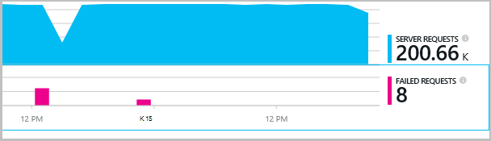

<properties 
    pageTitle="Sõltuvus rakenduse ülevaated jälgimine" 
    description="Kasutus-ja kättesaadavus ja teie asutusesisese või Microsoft Azure'i veebirakenduse rakenduse ülevaated analüüsida." 
    services="application-insights" 
    documentationCenter=".net"
    authors="alancameronwills" 
    manager="douge"/>

<tags 
    ms.service="application-insights" 
    ms.workload="tbd" 
    ms.tgt_pltfrm="ibiza" 
    ms.devlang="na" 
    ms.topic="article" 
    ms.date="10/24/2016" 
    ms.author="awills"/>


# <a name="set-up-application-insights-dependency-tracking"></a>Häälestada rakenduse ülevaated: sõltuvus jälgimine


[AZURE.INCLUDE [app-insights-selector-get-started-dotnet](../../includes/app-insights-selector-get-started-dotnet.md)]


*Sõltuvus* on väline komponent, mida nimetatakse oma rakenduse abil. See on tavaliselt teenust nimega HTTP, või andmebaasi või failisüsteemi abil. Visual Studio rakenduse ülevaated, saate hõlpsalt vaadata, kui kaua oodatakse rakenduse sõltuvused ja kui sageli sõltuvus kõne nurjub.


Välja-ja-karbi sõltuvus kuvari aruannete praegu järgmist tüüpi sõltuvused kõned:

* ASP.NET-I
 * SQL-i andmebaasid
 * ASP.net-i veebi ja WCF-i teenused, mis kasutavad HTTP-põhine seosed
 * Kohaliku või kaugandmebaasiga HTTP kõned
 * Azure'i DocumentDb, tabelist, bloobimälu ja järjekord
* Java
 * Kõned – [JDBC](http://docs.oracle.com/javase/7/docs/technotes/guides/jdbc/) draiveri, nt MySQL-i, SQL Server, PostgreSQL-i või SQLite andmebaasi.
* JavaScripti veebilehtedel – [veebilehe SDK](app-insights-javascript.md) automaatselt sisse Ajaxi kõned sõltuvused nimega.

Saate kirjutada oma SDK kõned jälgida teiste sõltuvused [TrackDependency API](app-insights-api-custom-events-metrics.md#track-dependency)abil.


## <a name="to-set-up-dependency-monitoring"></a>Häälestada sõltuvus jälgimine

Teil on vaja [Microsoft Azure'i](http://azure.com) tellimust.

### <a name="if-your-app-runs-on-your-iis-server"></a>Kui teie rakendus töötab IIS-serveris

Kui teie web app töötab .NET 4.6 või uuem versioon, saate [installida rakenduse ülevaateid SDK](app-insights-asp-net.md) kas oma rakenduse või installida rakendus ülevaateid oleku jälgimine. Te ei pea mõlemad.

Muul juhul installige rakendus ülevaateid oleku jälgimine serveris.

1. Teie IIS web server, administraatori identimisteave Logi sisse.
2. Laadige alla ja käivitage [installer oleku jälgimine](http://go.microsoft.com/fwlink/?LinkId=506648).
4. Installiviisardis, logige sisse Microsoft Azure'i.

    

    *Ühenduse tõrkeid? Vaadake teemat [tõrkeotsing](#troubleshooting).*

5. Valige installitud veebirakenduse või veebisaiti, mida soovite jälgida, siis ressursside, mida soovite vaadata rakenduse ülevaated portaali tulemusi.

    

    Tavaliselt konfigureerimiseks uue ressursi ja [ressursirühm][roles].

    Muul juhul on olemasoleva ressursi kasutamine, kui olete häälestanud juba [web kontrollib] [ availability] saidi või [web kliendi jälgimine][client].

6. Taaskäivitage IIS-i.

    

    Oma veebiteenuse katkestatakse lühikest aega.

6. Pange tähele, et ApplicationInsights.config lisada veebirakenduste, mida soovite jälgida.

    

   On ka mõned muudatused web.config.

#### <a name="want-to-reconfigure-later"></a>Kas soovite (taas) konfigureerida hiljem?

Kui olete viisardi, saate uuesti konfigureerida agent iga kord, kui soovite. Seda saab kasutada ka siis, kui installisite agent, kuid on mõned algsel installimisel probleeme.


### <a name="if-your-app-runs-as-an-azure-web-app"></a>Kui teie rakendus töötab kui Azure Web App

Lisada oma Azure'i veebirakenduse juhtpaneeli laiend rakenduse ülevaated.


### <a name="if-its-an-azure-cloud-services-project"></a>Kui see on Azure cloud services projekt

[Rollide web ja töötaja skriptide lisamine](app-insights-cloudservices.md#dependencies). Või [installida .NET Frameworki 4.6 või uuem versioon](../cloud-services/cloud-services-dotnet-install-dotnet.md).

## <a name="diagnosis"></a>Sõltuvus jõudlusega seotud probleemide diagnoosimise

Taotlused teie server hindamaks avage jõudluse tera ja liikuge kerides allapoole jaotiseni ruudustik taotlusi vaadata:


Üles üks võtab väga kaua aega. Vaatame, kui saame teada, kus on kulunud aeg.

Klõpsake rea isikliku taotluse sündmuste kuvamiseks:


Klõpsake mis tahes pikaajalisi eksemplari sellega põhjalikumaks tutvumiseks.

Liikuge kerides allapoole jaotiseni remote sõltuvus kõnesid seotud taotluse:


See näeb välja nagu kõige rohkem aega kättetoimetamise taotlus kulus kohalikust kataloogiteenusest kõne. 


Valige selle rea lisateabe saamiseks.


Üksikasjad sisaldab piisavalt teavet probleemi diagnoosida.


Erinevate juhul sõltuvus kõnesid on pikk, kuid ajaskaala vaate aktiveerimine, mida me näeme, kus viivituse ilmnes sisemine töötlemise.


## <a name="failures"></a>Tõrked

Kui seal on nurjunud, klõpsake diagrammi.



Klõpsake nuppu taotluse tüüp ja taotluse näiteks otsimine nurjunud kõne kaugjuhtimise sõltuvus kaudu.


## <a name="custom-dependency-tracking"></a>Kohandatud sõltuvus jälgimine

Sõltuvus jälgimise standardmoodul leiab automaatselt välise sõltuvused, nt andmebaasid ja REST API-d. Kuid võiksite mõne lisakomponentide käsitletakse samal viisil. 

Saate kirjutada koodi, mis saadab objektisõltuvusteave, kasutades sama [TrackDependency API](app-insights-api-custom-events-metrics.md#track-dependency) standard moodulid kasutatavat.

Kui koostate koos komplekti inimese teksti ise oma koodi, võib aega kõik kõned sellele, et teada saada, millist panust oma vastuse korda. On kuvatud rakenduse ülevaated sõltuvus diagrammides andmeid, saatke see `TrackDependency`.

```C#

            var startTime = DateTime.UtcNow;
            var timer = System.Diagnostics.Stopwatch.StartNew();
            try
            {
                success = dependency.Call();
            }
            finally
            {
                timer.Stop();
                telemetry.TrackDependency("myDependency", "myCall", startTime, timer.Elapsed, success);
            }
```

Kui soovite välja lülitada standard sõltuvus jälgimise moodul, eemaldada viide DependencyTrackingTelemetryModule [ApplicationInsights.config](app-insights-configuration-with-applicationinsights-config.md).

## <a name="troubleshooting"></a>Tõrkeotsing

*Sõltuvus edu lipu alati kuvatakse true või false.*

* Versioonile SDK uusim versioon. Kui teie .net-i versioon on väiksem kui 4.6, installige [oleku jälgimine](app-insights-monitor-performance-live-website-now.md).

## <a name="next-steps"></a>Järgmised sammud

- [Erandid](app-insights-asp-net-exceptions.md)
- [Lehel ja kasutajale andmed][client]
- [Kättesaadavus](app-insights-monitor-web-app-availability.md)


<!--Link references-->

[api]: app-insights-api-custom-events-metrics.md
[apikey]: app-insights-api-custom-events-metrics.md#ikey
[availability]: app-insights-monitor-web-app-availability.md
[azure]: ../insights-perf-analytics.md
[client]: app-insights-javascript.md
[diagnostic]: app-insights-diagnostic-search.md
[metrics]: app-insights-metrics-explorer.md
[netlogs]: app-insights-asp-net-trace-logs.md
[portal]: http://portal.azure.com/
[qna]: app-insights-troubleshoot-faq.md
[redfield]: app-insights-asp-net-dependencies.md
[roles]: app-insights-resources-roles-access-control.md

 
