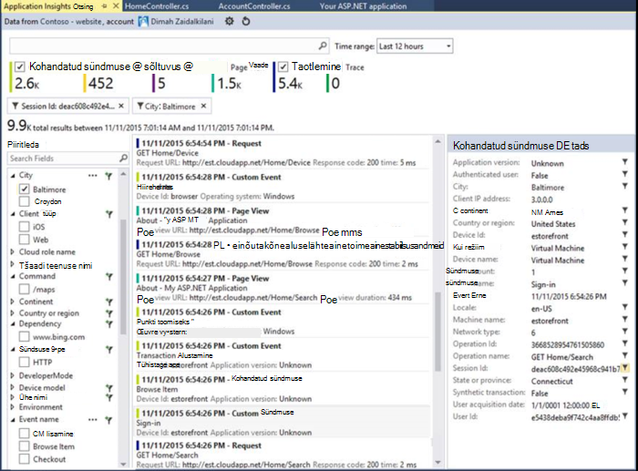
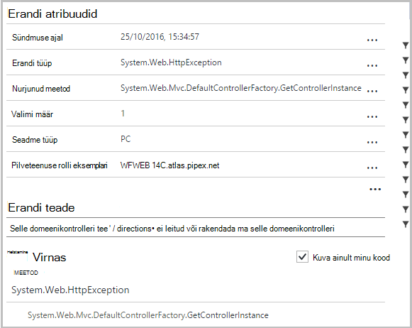
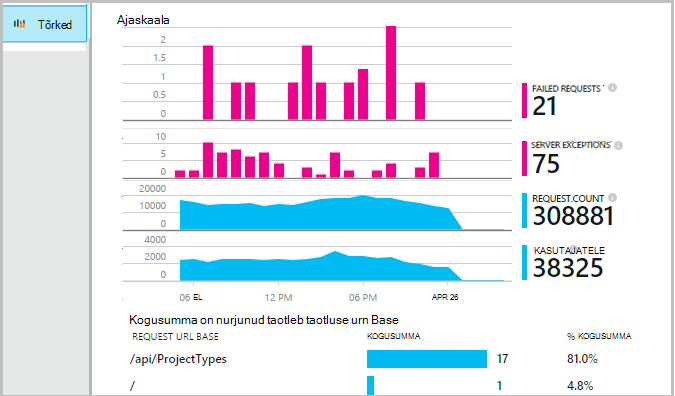
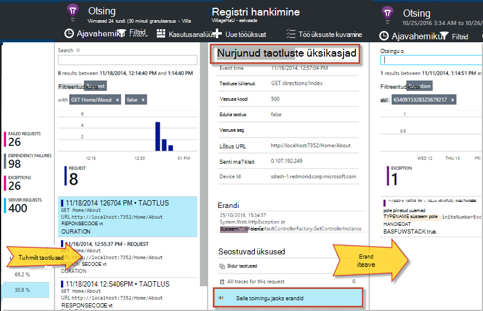
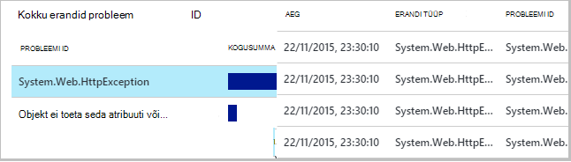
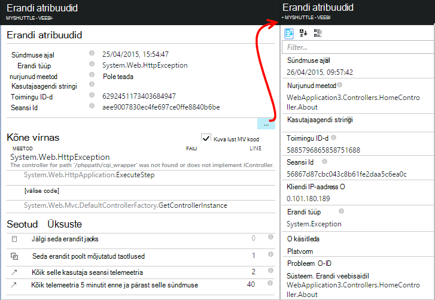
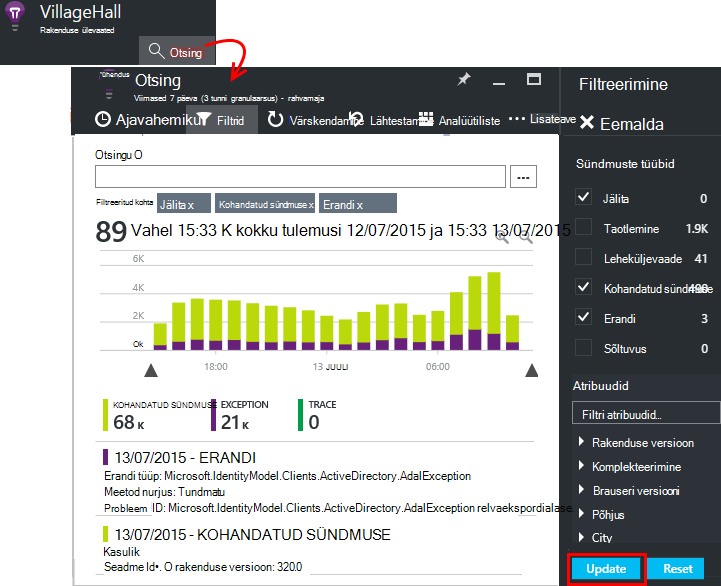
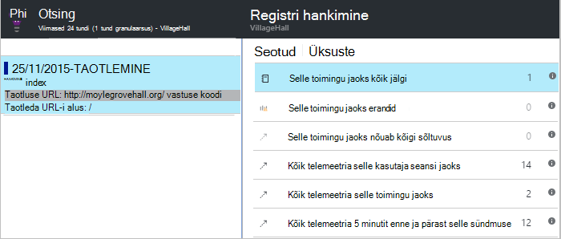

<properties 
    pageTitle="Tõrked ja erandid ASP.net-i rakendustes rakenduse ülevaated diagnoosimine" 
    description="ASP.net-i rakendustest koos taotluse telemeetria erandid jäädvustada." 
    services="application-insights" 
    documentationCenter=".net"
    authors="alancameronwills" 
    manager="douge"/>

<tags 
    ms.service="application-insights" 
    ms.workload="tbd" 
    ms.tgt_pltfrm="ibiza" 
    ms.devlang="na" 
    ms.topic="article" 
    ms.date="10/27/2016" 
    ms.author="awills"/>


# <a name="set-up-application-insights-diagnose-exceptions"></a>Häälestada rakenduse ülevaated: erandid diagnoosimine

[AZURE.INCLUDE [app-insights-selector-get-started-dotnet](../../includes/app-insights-selector-get-started-dotnet.md)]


Rakenduse [Visual Studio rakenduse]ülevaated jälgides[start], saate oleksid nurjunud taotlusi erandid ja muid sündmusi klient ja server, nii, et te saate kiiresti diagnoosida põhjused.

Jälgida rakenduse ASP.net-i, peate [lisama rakenduse ülevaateid SDK] [ greenbrown] rakenduse või [installida oleku jälgimine IIS-i serverisse][redfield], või kui teie rakendus on Azure Web App, lisage [Rakenduse ülevaateid laiendid](app-insights-azure-web-apps.md).

## <a name="diagnosing-exceptions-using-visual-studio"></a>Diagnoosimise erandid Visual Studio abil

Avage rakenduse lahenduse Visual Studios, et aidata silumine.

Käivitage rakendus, serveris või teie arengu arvutisse, kasutades klahvi F5.

Avage rakenduse ülevaateid otsinguakna Visual Studios, ja seda, et kuvada teie rakenduse sündmused. Samal ajal, kui te kasutate silumine, saate seda teha ainult rakenduse ülevaated nupu klõpsamisega.



Pange tähele, et aruande kuvamiseks lihtsalt erandid saate filtreerida. 

*Erandeid pole nähtaval? Vt [jäädvustada erandid](#exceptions).*

Klõpsake selle virnas jälitada igal aruande erand.



Viite rida virnas jälitus, oluline faili avamiseks klõpsake.  

## <a name="diagnosing-failures-using-the-azure-portal"></a>Diagnoosimise tõrkeid Azure'i portaalis

Rakenduse ülevaade rakenduse ülevaated paani tõrkeid kuvatakse erandite diagrammide ja nurjus HTTP päringuid taotluse loetelu URL-id, mis põhjustavad kõige sagedamini ebaõnnestumist.



Klõpsake ühte nurjunud taotluste loendis üksikuid esinemiskordade selle avamiseks. Sealt nuppu kaudu erandid või sellega seotud sõnumijälituse andmed.




**Teise võimalusena** saate alustada erandite loendist soovitud leiate allapoole tera ebaõnnestumist. Säilita klõpsates kuni lõpuks saate üksikuid erandid.




*Erandeid pole nähtaval? Vt [jäädvustada erandid](#exceptions).*

Seal saate vaadata virnas Jälita ja üksikasjalik atribuudid iga erand ja seotud log Jälita või muid sündmusi otsimine.




[Lisateavet diagnostika otsing][diagnostic].


## <a name="dependency-failures"></a>Sõltuvus tõrked

*Sõltuvus* on teenus, mis teie rakendus nõuab tavaliselt REST API-ga või andmebaasi kaudu. [Rakenduse ülevaateid oleku jälgimine] [ redfield] jälgib automaatselt erinevaid tüüpi sõltuvus kõne ajal kõne kestus ja teavitab õnnestumisest või nurjumisest mõõte. 

Sõltuvus andmete saamiseks peate [installima oleku jälgimine] [ redfield] IIS-i serverisse või kui teie rakendus on Azure Web App, kasutage [Rakenduse ülevaateid laiendid](app-insights-azure-web-apps.md). 

Nurjunud kõned sõltuvused on loetletud tõrkeid enne ja leiate ka need seostuvad üksused jaotises andmed ja erandi üksikasjad.

*Sõltuvus tõrgete? See on tore. Kuid veenduge, et kostub sõltuvus andmete, avage jõudluse tera ja sõltuvus kestus diagrammi vaadata.*

 

## <a name="custom-tracing-and-log-data"></a>Kohandatud jälgimine ja logiandmed

Diagnostikaandmete kindla rakenduse saamiseks saate lisada koodi saata oma telemeetria andmeid. See kuvatakse diagnostika otsingu kutse, lehe ja muude automaatselt kogutud andmete kõrval. 

Teil on mitu võimalust:

* Tavaliselt kasutatakse [TrackEvent()](app-insights-api-custom-events-metrics.md#track-event) jälgimise mustreid, kuid saadetakse ka andmed kuvatakse jaotises kohandatud sündmused diagnostika otsing. Sündmuste on nimega ja saate teha stringi atribuudid ja kus saab [filtreerida diagnostika otsingute]arvuline mõõdikute[diagnostic].
* [TrackTrace()](app-insights-api-custom-events-metrics.md#track-trace) võimaldab teil saada rohkem andmeid, nt postituse teavet.
* [TrackException()](#exceptions) saadab virnas jälgi. [Lisateavet leiate teemast erandid](#exceptions).
* Kui kasutate juba logimine framework, nt Log4Net või NLog, saate [need logid jäädvustada] [ netlogs] ja diagnostika Otsing kõrval taotlus ja erand andmete kuvamiseks.

Need sündmused vaatamiseks avage [Otsing][diagnostic], avage Filter ja seejärel valige kohandatud sündmus, Jälita või erand.





> [AZURE.NOTE] Kui teie rakendus loob palju telemeetria, vähendab kohandatava valimite mooduli automaatselt maht, mis saadetakse portaali saatmisega tüüpilised murdosa sündmused. Sündmused, mis on osa sama toimingut on valitud või märkimata rühmana, et seotud sündmused seas saate liikuda. [Lisateavet valimite.](app-insights-sampling.md)

### <a name="how-to-see-request-post-data"></a>Kuidas taotlus postituse andmete kuvamiseks

Andmed ei sisalda andmeid rakenduse postituse kõne suunamiseks. Teatatud on andmeid

* [Installige SDK] [ greenbrown] rakenduse projektis.
* Koodi lisamine oma rakenduse helistada [Microsoft.ApplicationInsights.TrackTrace()][api]. Saada sõnumi parameetri postituse andmed. Seega peaksite proovima saatmine ainult olulised andmed on lubatud maht, on piiratud.
* Kui saate uurida nurjunud taotluste, leida seotud jälgi.  




## <a name="exceptions"></a>Erandid ja seotud Diagnostikaandmete

Esialgu ei kuvata portaalis põhjustada tõrkeid rakenduse erandid. Kuvatakse kõik brauseri erandid (kui kasutate [JavaScripti SDK] [ client] veebilehel). Kuid enamik serveri erandid on vastuolus IIS-i ja teil on natuke nende koodi kirjutamist.

Sa saad:

* **Logige erandid konkreetselt** , sisestades koodi erandi käitleja teatada erandid.
* **Jäädvustada erandid automaatselt** konfigureerida oma ASP.net-i raames. Erinevat tüüpi framework erinevad vajalik.

## <a name="reporting-exceptions-explicitly"></a>Erandid selgesõnaliselt teatamine

Lihtsaim viis on lisada mõne erandi sündmuseohjuri TrackException() kõne.

JavaScripti

    try 
    { ...
    }
    catch (ex)
    {
      appInsights.trackException(ex, "handler loc",
        {Game: currentGame.Name, 
         State: currentGame.State.ToString()});
    }

C#

    var telemetry = new TelemetryClient();
    ...
    try 
    { ...
    }
    catch (Exception ex)
    {
       // Set up some properties:
       var properties = new Dictionary <string, string> 
         {{"Game", currentGame.Name}};

       var measurements = new Dictionary <string, double>
         {{"Users", currentGame.Users.Count}};

       // Send the exception telemetry:
       telemetry.TrackException(ex, properties, measurements);
    }

VB

    Dim telemetry = New TelemetryClient
    ...
    Try
      ...
    Catch ex as Exception
      ' Set up some properties:
      Dim properties = New Dictionary (Of String, String)
      properties.Add("Game", currentGame.Name)

      Dim measurements = New Dictionary (Of String, Double)
      measurements.Add("Users", currentGame.Users.Count)
  
      ' Send the exception telemetry:
      telemetry.TrackException(ex, properties, measurements)
    End Try

Atribuudid ja mõõdud parameetrid on valikuline, kuid on kasulik, [filtreerimine] ja lisamine[ diagnostic] täiendavat teavet. Näiteks, kui teil on rakendus, mis töötab mitu mängu, võib leida erandi aruannete seotud konkreetse mängu. Saate lisada nii palju üksusi, kui soovite iga sõnastikku.

## <a name="browser-exceptions"></a>Brauseri erandid

Enamik brauseri erandid on esitatud.

Kui teie veebilehele sisaldab sisuedastusvõrgud või muude domeenide skripti faile, veenduge, et teie skripti silt on atribuudi ```crossorigin="anonymous"```, ja et server saadab [CORS päised](http://enable-cors.org/). See võimaldab teil saada virnas Jälita- ja üksikasjarida töötlemata JavaScripti erandid järgmiste ressursside kaudu.

## <a name="web-forms"></a>Web vormid

Web vormide, saab HTTP mooduli erandid kogumiseks, kui ei ole konfigureeritud CustomErrors ümbersuunamisi.

Kuid kui teil on aktiivne ümbersuunamised, lisada järgmised read funktsiooni Application_Error Global.asax.cs. (Lisada Global.asax faili, kui teil pole veel üks.)

*C#:*

    void Application_Error(object sender, EventArgs e)
    {
      if (HttpContext.Current.IsCustomErrorEnabled && Server.GetLastError  () != null)
      {
         var ai = new TelemetryClient(); // or re-use an existing instance

         ai.TrackException(Server.GetLastError());
      }
    }


## <a name="mvc"></a>MVC

Kui [CustomErrors](https://msdn.microsoft.com/library/h0hfz6fc.aspx) konfiguratsioon on `Off`, siis erandid on saadaval [HTTP mooduli](https://msdn.microsoft.com/library/ms178468.aspx) kogumiseks. Juhul, kui see on `RemoteOnly` (vaikeväärtus) või `On`, siis erandiks on tühi ja pole saadaval rakenduse ülevaated automaatselt koguda. Saate lahendada mis alistamine [System.Web.Mvc.HandleErrorAttribute klassi](http://msdn.microsoft.com/library/system.web.mvc.handleerrorattribute.aspx)ja rakendamise kaalu ainekursust, nagu on näidatud eri MVC versioonides all ([github allikas](https://github.com/AppInsightsSamples/Mvc2UnhandledExceptions/blob/master/MVC2App/Controllers/AiHandleErrorAttribute.cs)):

    using System;
    using System.Web.Mvc;
    using Microsoft.ApplicationInsights;

    namespace MVC2App.Controllers
    {
      [AttributeUsage(AttributeTargets.Class | AttributeTargets.Method, Inherited = true, AllowMultiple = true)] 
      public class AiHandleErrorAttribute : HandleErrorAttribute
      {
        public override void OnException(ExceptionContext filterContext)
        {
            if (filterContext != null && filterContext.HttpContext != null && filterContext.Exception != null)
            {
                //If customError is Off, then AI HTTPModule will report the exception
                if (filterContext.HttpContext.IsCustomErrorEnabled)
                {   //or reuse instance (recommended!). see note above  
                    var ai = new TelemetryClient();
                    ai.TrackException(filterContext.Exception);
                } 
            }
            base.OnException(filterContext);
        }
      }
    }

#### <a name="mvc-2"></a>MVC 2

Atribuut HandleError asendada oma kontrollerid oma uus atribuut.

    namespace MVC2App.Controllers
    {
       [AiHandleError]
       public class HomeController : Controller
       {
    ...

[Näidis](https://github.com/AppInsightsSamples/Mvc2UnhandledExceptions)

#### <a name="mvc-3"></a>MVC 3

Registreerida `AiHandleErrorAttribute` Global.asax.cs globaalne filtrina:

    public class MyMvcApplication : System.Web.HttpApplication
    {
      public static void RegisterGlobalFilters(GlobalFilterCollection filters)
      {
         filters.Add(new AiHandleErrorAttribute());
      }
     ...

[Näidis](https://github.com/AppInsightsSamples/Mvc3UnhandledExceptionTelemetry)


#### <a name="mvc-4-mvc5"></a>MVC 4, MVC5

Globaalne filtrina FilterConfig.cs AiHandleErrorAttribute registreerimine

    public class FilterConfig
    {
      public static void RegisterGlobalFilters(GlobalFilterCollection filters)
      {
        // Default replaced with the override to track unhandled exceptions
        filters.Add(new AiHandleErrorAttribute());
      }
    }

[Näidis](https://github.com/AppInsightsSamples/Mvc5UnhandledExceptionTelemetry)

## <a name="web-api-1x"></a>Web API 1.x


Alista System.Web.Http.Filters.ExceptionFilterAttribute:

    using System.Web.Http.Filters;
    using Microsoft.ApplicationInsights;

    namespace WebAPI.App_Start
    {
      public class AiExceptionFilterAttribute : ExceptionFilterAttribute
      {
        public override void OnException(HttpActionExecutedContext actionExecutedContext)
        {
            if (actionExecutedContext != null && actionExecutedContext.Exception != null)
            {  //or reuse instance (recommended!). see note above 
                var ai = new TelemetryClient();
                ai.TrackException(actionExecutedContext.Exception);    
            }
            base.OnException(actionExecutedContext);
        }
      }
    }

Võivad teatud kontrollerid kaalu atribuudi lisamine või lisada globaalne filter konfiguratsiooni WebApiConfig klassi: 

    using System.Web.Http;
    using WebApi1.x.App_Start;

    namespace WebApi1.x
    {
      public static class WebApiConfig
      {
        public static void Register(HttpConfiguration config)
        {
            config.Routes.MapHttpRoute(name: "DefaultApi", routeTemplate: "api/{controller}/{id}",
                defaults: new { id = RouteParameter.Optional });
            ...
            config.EnableSystemDiagnosticsTracing();

            // Capture exceptions for Application Insights:
            config.Filters.Add(new AiExceptionFilterAttribute());
        }
      }
    }

[Näidis](https://github.com/AppInsightsSamples/WebApi_1.x_UnhandledExceptions)

On juhtumeid, mis ei oska erandi filtrite arvu. Näiteks:

* Selle domeenikontrolleri ehitajatel visatud erandid. 
* Sõnumi käitlejatelt visati erandid. 
* Erandid käigus marsruutimist. 
* Vastuse sisu sariväljaanne käigus erandid. 

## <a name="web-api-2x"></a>Web API 2.x

IExceptionLogger rakendamise lisamiseks tehke järgmist.

    using System.Web.Http.ExceptionHandling;
    using Microsoft.ApplicationInsights;

    namespace ProductsAppPureWebAPI.App_Start
    {
      public class AiExceptionLogger : ExceptionLogger
      {
        public override void Log(ExceptionLoggerContext context)
        {
            if (context !=null && context.Exception != null)
            {//or reuse instance (recommended!). see note above 
                var ai = new TelemetryClient();
                ai.TrackException(context.Exception);
            }
            base.Log(context);
        }
      }
    }

Lisage see WebApiConfig teenuseid.

    using System.Web.Http;
    using System.Web.Http.ExceptionHandling;
    using ProductsAppPureWebAPI.App_Start;

    namespace WebApi2WithMVC
    {
      public static class WebApiConfig
      {
        public static void Register(HttpConfiguration config)
        {
            // Web API configuration and services

            // Web API routes
            config.MapHttpAttributeRoutes();

            config.Routes.MapHttpRoute(
                name: "DefaultApi",
                routeTemplate: "api/{controller}/{id}",
                defaults: new { id = RouteParameter.Optional }
            );
            config.Services.Add(typeof(IExceptionLogger), new AiExceptionLogger()); 
        }
      }
  }

[Näidis](https://github.com/AppInsightsSamples/WebApi_2.x_UnhandledExceptions)

Kui alternatiive, kas:

2. Ainult ExceptionHandler asendada kohandatud rakendamine IExceptionHandler. Seda nimetatakse ainult siis, kui raames endiselt saab valida, millist vastuse sõnumi saatmiseks (mitte kui ühendus katkestatud näiteks) 
3. Erandi filtrid (nagu on kirjeldatud jaotises Web API 1.x domeenikontrollerid ülaltoodud) – mitte alati nimega.


## <a name="wcf"></a>WCF-I

Klassi, mis ulatub atribuudi ja rakendab IErrorHandler ja IServiceBehavior lisada.

    using System;
    using System.Collections.Generic;
    using System.Linq;
    using System.ServiceModel.Description;
    using System.ServiceModel.Dispatcher;
    using System.Web;
    using Microsoft.ApplicationInsights;

    namespace WcfService4.ErrorHandling
    {
      public class AiLogExceptionAttribute : Attribute, IErrorHandler, IServiceBehavior
      {
        public void AddBindingParameters(ServiceDescription serviceDescription,
            System.ServiceModel.ServiceHostBase serviceHostBase,
            System.Collections.ObjectModel.Collection<ServiceEndpoint> endpoints,
            System.ServiceModel.Channels.BindingParameterCollection bindingParameters)
        {
        }

        public void ApplyDispatchBehavior(ServiceDescription serviceDescription, 
            System.ServiceModel.ServiceHostBase serviceHostBase)
        {
            foreach (ChannelDispatcher disp in serviceHostBase.ChannelDispatchers)
            {
                disp.ErrorHandlers.Add(this);
            }
        }

        public void Validate(ServiceDescription serviceDescription, 
            System.ServiceModel.ServiceHostBase serviceHostBase)
        {
        }

        bool IErrorHandler.HandleError(Exception error)
        {//or reuse instance (recommended!). see note above 
            var ai = new TelemetryClient();

            ai.TrackException(error);
            return false;
        }

        void IErrorHandler.ProvideFault(Exception error, 
            System.ServiceModel.Channels.MessageVersion version, 
            ref System.ServiceModel.Channels.Message fault)
        {
        }
      }
    }

Teenuse rakendusi atribuut lisamiseks tehke järgmist.

    namespace WcfService4
    {
        [AiLogException]
        public class Service1 : IService1 
        { 
         ...

[Näidis](https://github.com/AppInsightsSamples/WCFUnhandledExceptions)

## <a name="exception-performance-counters"></a>Erandi jõudluse hinnale

Kui teil on [installitud oleku jälgimine] [ redfield] serverisse, saate diagrammi erandid määr, mõõdetuna .net-i. See hõlmab nii töödeldud ja töötlemata .NET erandid.

Avage meetermõõdustik Exploreri blade uue diagrammi lisamine ja valige **erandi määr**, loendis jõudluse hinnale. 

.NET Frameworki määr loendamiseks erandid intervall ning jagatakse intervalli pikkus. 

Pange tähele, et see oleks erineb "Erandid" arvu TrackException aruannete rakenduse ülevaated portaali arvutada. Valimite intervallide erinevad ja SDK ei saada TrackException aruannete kõigi suvandite ja ilmnes käsitlematu erandid.

<!--Link references-->

[api]: app-insights-api-custom-events-metrics.md
[client]: app-insights-javascript.md
[diagnostic]: app-insights-diagnostic-search.md
[greenbrown]: app-insights-asp-net.md
[netlogs]: app-insights-asp-net-trace-logs.md
[redfield]: app-insights-monitor-performance-live-website-now.md
[start]: app-insights-overview.md

 
