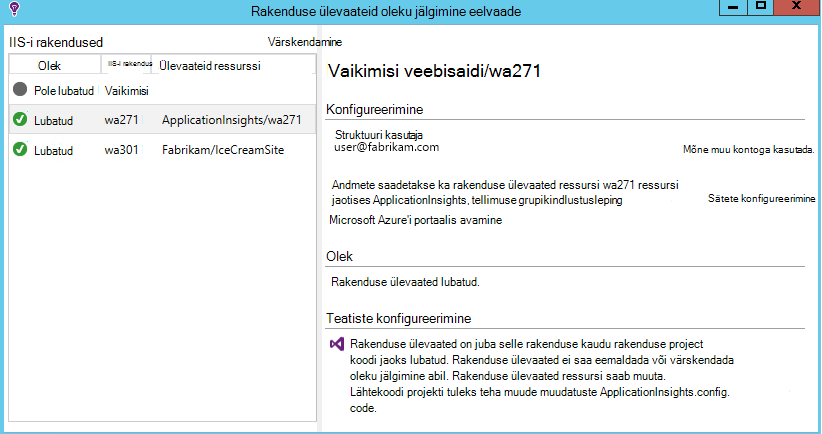
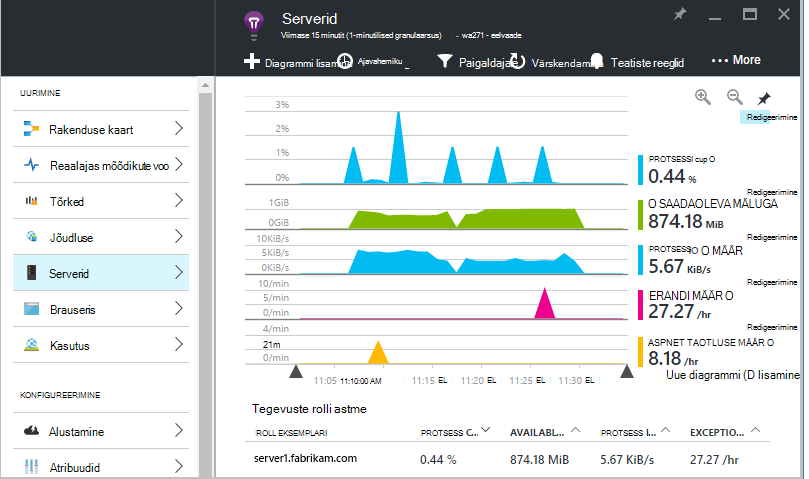
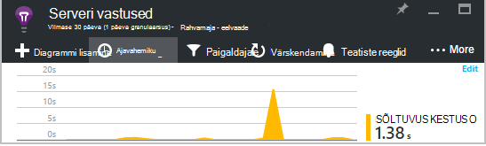
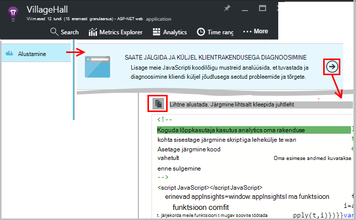
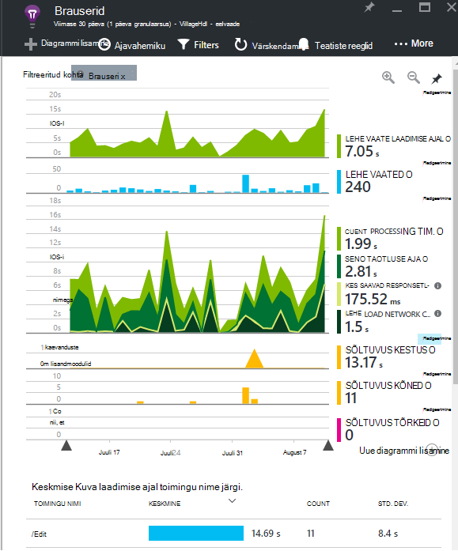
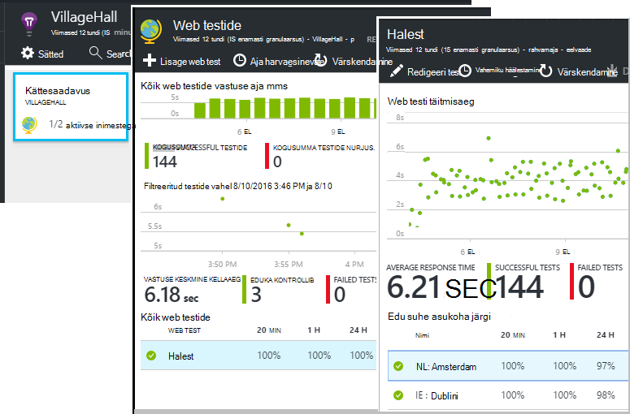
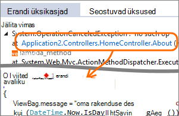
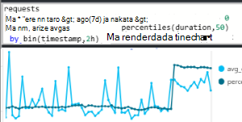
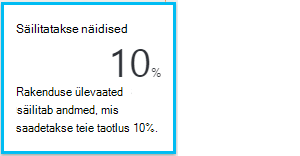

<properties 
    pageTitle="Paremaks rakenduse ülevaated | Microsoft Azure'i" 
    description="Pärast alustamine rakenduse ülevaated siit saate uurida funktsioonide ülevaate." 
    services="application-insights" 
    documentationCenter=".net"
    authors="alancameronwills" 
    manager="douge"/>

<tags 
    ms.service="application-insights" 
    ms.workload="tbd" 
    ms.tgt_pltfrm="ibiza" 
    ms.devlang="na" 
    ms.topic="article" 
    ms.date="10/27/2016" 
    ms.author="awills"/>

# <a name="more-telemetry-from-application-insights"></a>Lisateavet telemeetria rakenduse ülevaated

Kui olete [lisanud oma ASP.net-i koodi rakenduse ülevaated](app-insights-asp-net.md), on mõned asjad, mida teha, et saada rohkem telemeetria. 

## <a name="if-your-app-runs-on-your-iis-server-"></a>Kui teie rakendus töötab IIS-i serverisse...

Kui teie rakendus on majutatud IIS-i serverid juhtelemendis, installige rakenduse ülevaateid oleku jälgimine serverites. Kui see on juba installitud, te ei pea midagi tegema.

1. Iga IIS-i veebiserverisse, logige sisse administraatori identimisteave.
2. Laadige alla ja käivitage [installer oleku jälgimine](http://go.microsoft.com/fwlink/?LinkId=506648).
3. Installiviisardis, logige sisse Microsoft Azure'i.

Te ei pea midagi tegema, kuid te saate kinnitada, et jälgimine on lubatud oma rakenduse.



(Samuti saate oleku jälgimine [käitusajal jälgida](app-insights-monitor-performance-live-website-now.md), isegi siis, kui te ei dokumendi rakenduste Visual Studio.)

### <a name="what-do-you-get"></a>Mida saate hankida?

Kui teie serveri masinad oleku jälgimine on installitud, kuvatakse mõned täiendavad telemeetria:

* Sõltuvus telemeetria (SQL-i ja ülejäänud kõnede tehtud rakenduse) .NET 4.5 rakendused. (.Net-i uuemad versioonid, oleku jälgimine ei ole vaja sõltuvus telemeetria.) 
* Erandi virnas jälgi Kuva rohkem üksikasju.
* Jõudluse hinnale. Rakenduse ülevaated, kuvatakse need hinnale serverid tera. 



Kui soovite vaadata rohkem või vähem hinnale, [on diagrammid redigeerimine](app-insights-metrics-explorer.md). Kui soovite jõudluse näidiku pole saadaval määramine, saate [seda kogutud jõudluse counter mooduli määramine lisada](app-insights-performance-counters.md).

## <a name="if-its-an-azure-web-app-"></a>Kui see on Azure web app...

Kui teie rakendus töötab, kui Azure web app, avage rakendus või VM Azure Juhtpaneel ja avada rakenduse ülevaated tera. 

### <a name="what-do-you-get"></a>Mida saate hankida?

* Erandi virnas jälgi Kuva rohkem üksikasju.
* Sõltuvus telemeetria (SQL-i ja ülejäänud kõnede tehtud rakenduse) .NET 4.5 rakendused. (.Net-i uuemad versioonid, laiendamine ei ole vaja sõltuvus telemeetria.) 



(Saate kasutada ka seda meetodit [lubamine jõudluse kontrollimise käitusajal](app-insights-monitor-performance-live-website-now.md), isegi siis, kui te ei dokumendi rakenduse Visual Studio.)

## <a name="client-side-monitoring"></a>Kliendipoolne jälgimine

Olete installinud Tarkvaraarenduskomplektist, mis saadab koguda andmeid rakenduse serverist (tagasi lõpus). Nüüd saate lisada kliendipoolne jälgimine. See pakub andmete kasutajad, seansid, lehe vaateid, ja mis tahes erandid või jookseb toimuvate brauseris. Saate juurde ka kirjutada oma koodi jälgida, kuidas kasutajad töötamine rakenduse paremale alla üksikasjalikku taset klahvivajutusega ja klõpsab käsku.

Rakenduse ülevaateid JavaScripti koodilõigu lisada iga veebilehe saada telemeetria kliendi brauserites.

1. Azure'i, avage rakenduse ülevaated ressursi oma rakenduse.
2. Avage alustamine kuvari kliendipoolse, ja kopeerige soovitud koodilõigu.
3. Kleepige see nii, et see kuvatakse iga veebilehe - juhataja tavaliselt tuleb teha, kleepimine lehe juhtslaidi paigutus.



Pange tähele, et kood sisaldab instrumentation klahvi, mis tuvastab teie ressurssi.

### <a name="what-do-you-get"></a>Mida saate hankida?

* Saate kirjutada JavaScripti, et saada [kohandatud telemeetria oma veebilehti](app-insights-api-custom-events-metrics.md), näiteks nupp klõpsuga jälgimiseks.
* [Analüüsi](app-insights-analytics.md), andmete `pageViews` ja AJAXI andmete `dependencies`. 
* [Kliendi jõudlus ja kasutusandmete](app-insights-javascript.md) brauserid tera.




[Lisateavet web lehe jälgimine.](app-insights-web-track-usage.md)


## <a name="track-application-version"></a>Jälita rakenduse versioon

Veenduge, et `buildinfo.config` on loodud oma MSBuild protsess. .Csproj failis lisamiseks tehke järgmist.  

```XML

    <PropertyGroup>
      <GenerateBuildInfoConfigFile>true</GenerateBuildInfoConfigFile>    <IncludeServerNameInBuildInfo>true</IncludeServerNameInBuildInfo>
    </PropertyGroup> 
```

Kui see on Koosta teave, lisab rakenduse ülevaated web mooduli **rakenduse versioon** automaatselt iga üksus telemeetria atribuudi. Võimaldab filtreerida versioon, kui [diagnostika](app-insights-diagnostic-search.md) otsinguid või kui [mõõdikute uurimine](app-insights-metrics-explorer.md). 

Pange tähele, et Koosta versiooninumber on loodud vaid MS Build, pole arendaja koostamine Visual Studio.


## <a name="availability-web-tests"></a>Kättesaadavus web testide

Saatke oma veebirakenduse HTTP päringuid intervalliga kaudu kogu maailmas. Oleme teile märku, kui vastus on aeglane või usaldusväärne.

Klõpsake rakenduse ülevaated ressurss oma rakenduse, lisada, redigeerida ja vaadata web testide kättesaadavus paani.

Saate lisada mitu kontrollib töötab mitmes asukohas.



[Lisateave](app-insights-monitor-web-app-availability.md)

## <a name="custom-telemetry-and-logging"></a>Kohandatud telemeetria ja logimine

Rakenduse ülevaated paketid, mida lisasite oma koodi pakkuda API, mis rakenduse kaudu saate helistada.

* [Luua oma sündmused ja mõõdikute](app-insights-api-custom-events-metrics.md), näiteks arv business sündmusi või kuvari jõudlust.
* Log4Net, NLog või System.Diagnostics.Trace [jäädvustada log jälgi](app-insights-asp-net-trace-logs.md) .
* [Filtri muutmiseks või tõsta](app-insights-api-filtering-sampling.md) standard telemeetria, saadetakse teie rakenduse, kirjutades telemeetria protsessorite. 


## <a name="powerful-analysis-and-presentation"></a>Võimsate analüüsiriistade ja esitamine

On palju võimalusi andmete analüüsimine. Kui te olete hiljuti alustamine rakenduse ülevaated, vaadake järgmisi artikleid:

||
|---|---
|[**Diagnostika otsing näiteks andmed**](app-insights-visual-studio.md)<br/>Otsingu ja filtreerimise sündmusi, näiteks taotlusi ning erandid, sõltuvus, log jälgi ja lehe vaated. Visual Studio, minge koodi kaudu virnas jälgi.|
|[**Kokkuvõtlike andmete Exploreri mõõdikud**](app-insights-metrics-explorer.md)<br/>Uurida, filtreerida ja lõigu koondandmete nagu taotlusi, tõrked ja erandid; vastuse korda, laadimise ajal.|
|[**Armatuurlauad**](app-insights-dashboards.md#dashboards)<br/>Mitme ressursid andmeid koondada ja teistega jagada. Suur mitme osa rakenduste ja pidev kuvamiseks meeskonnatöö ruumi.  |
|[**Reaalajas mõõdikute voo**](app-insights-metrics-explorer.md#live-metrics-stream)<br/>Uus ehitada juurutamisel, vaadake neid lähedal reaalajas mõõdikud veendumaks, et kõik toimib ootuspäraselt.|
|[**Kasutusanalüüsi**](app-insights-analytics.md)<br/>See võimas päringukeelt kasutavate vastata keerulistele küsimustele oma rakenduse jõudlus ja kasutuse kohta.|
|[**Automaatne ja käsitsi teatised**](app-insights-alerts.md)<br/>Automaatne teatiste kohandada oma rakenduse tavaline mustrite telemeetria ja päästik, kui seal on midagi väljaspool tavalise muster. Samuti saab teatised määrata teatud tasanditel kohandatud või standardne mõõdikute.|

## <a name="data-management"></a>Andmehaldus

|||
|---|---|
|[**Pidev eksport**](app-insights-export-telemetry.md)<br/>Kopeerige kõik teie telemeetria salvestusruumi nii, et saate seda oma viis analüüsida.|
|**Juurdepääs andmetele API**<br/>Tulen varsti.|
|[**Valimite**](app-insights-sampling.md)<br/>Vähendab andmete määr ja aitab teil oma hinnakirjad taseme piires.|