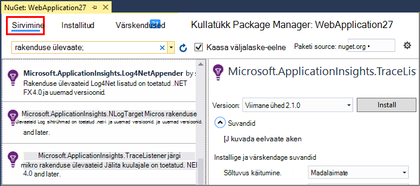

<properties 
    pageTitle=".NET Jälita logide rakenduse ülevaated uurimine" 
    description="Otsige loodud Jälita, NLog või Log4Net logid." 
    services="application-insights" 
    documentationCenter=".net"
    authors="alancameronwills" 
    manager="douge"/>

<tags 
    ms.service="application-insights" 
    ms.workload="tbd" 
    ms.tgt_pltfrm="ibiza" 
    ms.devlang="na" 
    ms.topic="article" 
    ms.date="07/21/2016" 
    ms.author="awills"/>
 
# <a name="explore-net-trace-logs-in-application-insights"></a>.NET Jälita logide rakenduse ülevaated uurimine  

Kui kasutate NLog log4Net või System.Diagnostics.Trace diagnostika jälgida oma ASP.net-i rakenduse, saate määrata oma logid saata [Visual Studio rakenduse ülevaated][start], kus saate uurida ja neid otsida. Oma logid ühendatakse muude telemeetria pärit rakenduse, nii, et saate tuvastada jälgi seostatud teenindamine iga kasutaja taotlus ja oleksid need teiste sündmused ja erandi aruanded.


> [AZURE.NOTE] Kas vajate Logi jäädvustada mooduli? See on kasulikku võrguadapteri 3-osaline logeri jaoks, kuid kui te ei kasuta veel NLog, log4Net või System.Diagnostics.Trace, kaaluge lihtsalt helistamiseks [Rakenduse ülevaateid TrackTrace()](app-insights-api-custom-events-metrics.md#track-trace) otse.


## <a name="install-logging-on-your-app"></a>Installige rakenduse sisse logimine

Installige teie valitud logimine framework projekti. Selle tulemusena peaks kirje app.config või web.config.

Kui kasutate System.Diagnostics.Trace, peate kirje lisamine web.config:

```XML

    <configuration>
     <system.diagnostics>
       <trace autoflush="false" indentsize="4">
         <listeners>
           <add name="myListener" 
             type="System.Diagnostics.TextWriterTraceListener" 
             initializeData="TextWriterOutput.log" />
           <remove name="Default" />
         </listeners>
       </trace>
     </system.diagnostics>
   </configuration>
```

## <a name="configure-application-insights-to-collect-logs"></a>Rakenduse ülevaated kogumiseks logid konfigureerimine

Kui te pole seda veel teinud, et veel **[Rakenduse ülevaated lisamine projekti](app-insights-asp-net.md)** . Näete suvandi Logi koguja kaasata.

Või paremklõpsake Solution Exploreris projekti **Rakenduse ülevaated konfigureerimine** . Valige suvand **konfigureerimine Jälita**kogumi.

*Rakenduse ülevaated menüü või log koguja võimalus?* Proovige [tõrkeotsingu](#troubleshooting).


## <a name="manual-installation"></a>Käsitsi installimine

Kasutage seda meetodit, kui teie projekti tüüp ei toeta rakenduse ülevaated installer (nt Windows töölaua projekti). 

1. Kui kavatsete kasutada log4Net või NLog, installige projektis. 
2. Solution Exploreris projekti paremklõpsake ja valige **Haldamine NuGet-paketid**.
3. Otsing "Rakenduse ülevaated"

    

4. Valige sobiv pakett – üks:
  + Microsoft.ApplicationInsights.TraceListener (jäädvustada System.Diagnostics.Trace kõned)
  + Microsoft.ApplicationInsights.NLogTarget
  + Microsoft.ApplicationInsights.Log4NetAppender

Nugeti pakett vajalikud assemblereid installid ja ka muudab web.config või app.config.

## <a name="insert-diagnostic-log-calls"></a>Diagnostika Logi kõned lisamine

Kui kasutate System.Diagnostics.Trace, oleks tüüpiline kõne:

    System.Diagnostics.Trace.TraceWarning("Slow response - database01");

Kui eelistate log4net või NLog:

    logger.Warn("Slow response - database01");


## <a name="using-the-trace-api-directly"></a>Jälita API otse abil

Saate rakenduse ülevaated Jälita API otse helistada. Logimise adapterit kasutada seda API. 

Näiteks:

    var telemetry = new Microsoft.ApplicationInsights.TelemetryClient();
    telemetry.TrackTrace("Slow response - database01");

TrackTrace eelis on see, et saate panna andmete suhteliselt pikka sõnumit. Näiteks võib kodeerida postituse andmed. 

Lisaks saate lisada oma sõnum raskusaste tase. Ja muude telemeetria, nt saate lisada atribuudi väärtused, aidata filtreerimisel või otsingu jaoks erinevaid jälgi kasutatavad. Näiteks:


    var telemetry = new Microsoft.ApplicationInsights.TelemetryClient();
    telemetry.TrackTrace("Slow database response",
                   SeverityLevel.Warning,
                   new Dictionary<string,string> { {"database", db.ID} });

See võimaldab teil, väljale [Otsi][diagnostic], hõlpsasti filtreerida teatud raskusaste taseme seotud kindla andmebaasi kõik sõnumid.

## <a name="explore-your-logs"></a>Oma logid uurimine

Käivitage oma rakenduse, kas silumine režiimis või juurutada reaalajas.

Klõpsake oma rakenduse ülevaade blade [Rakenduse ülevaated]portaalis[portal], valige [Otsi][diagnostic].


Saate teha näiteks järgmist.

* Log jälgi või teatud omadustega üksuste filtreerimine
* Kindla üksuse üksikasjalikult kontrolli.
* Muude telemeetria seotud sama kasutaja taotluse otsimine (st koos sama OperationId) 
* Salvestada konfiguratsiooni selle lehe lisamine lemmikute hulka

> [AZURE.NOTE] **Valimite.** Kui teie taotlus saadetakse palju andmeid ja kasutate rakenduse ülevaateid SDK ASP.net-i versioon 2.0.0-beta3 või uuem versioon, kohandatava valimite funktsiooni käitamiseks ja saatmine ainult teie telemeetria protsent. [Lugege lisateavet valimite.](app-insights-sampling.md)

## <a name="next-steps"></a>Järgmised sammud

[Tõrked ja erandid ASP.net-i diagnoosimine][exceptions]

[Lisateavet otsingu][diagnostic].


## <a name="troubleshooting"></a>Tõrkeotsing

### <a name="how-do-i-do-this-for-java"></a>Kuidas see Java teha?

Kasutage [Java log adapterit](app-insights-java-trace-logs.md).

### <a name="theres-no-application-insights-option-on-the-project-context-menu"></a>Rakenduse ülevaated võimalust projekti kontekstimenüü

* Märkige ruut selle arengu arvutisse on installitud rakenduse ülevaated tööriistad. Visual Studio menüü Tööriistad, laiendid ja värskendused, otsige tööriistad rakenduste ülevaated. Kui see pole installitud menüüs, avage vahekaart Online ja installida.
* See võib olla rakenduse ülevaated tööriistad ei toeta projekti tüüp. Kasutage [käsitsi installimine](#manual-installation).

### <a name="no-log-adapter-option-in-the-configuration-tool"></a>Log adapterit võimalus konfigureerimine tööriista

* Peate esmalt installima logimine raames.
* Kui kasutate System.Diagnostics.Trace, veenduge, et te [see konfigureeritud `web.config` ](https://msdn.microsoft.com/library/system.diagnostics.eventlogtracelistener.aspx).
* Teil on rakenduse ülevaated tööriistad uusim versioon? Visual Studio **Tööriistad** käsku valige **laiendid ja värskendused**ja avage vahekaart **värskendused** . Kui rakenduse ülevaated tööriistad on olemas, klõpsake seda värskendada.


### <a name="emptykey"></a>Kuvatakse tõrge "Instrumentation võti ei saa olla tühi"

Paistab, et teil on installitud logimine adapterit Nugeti pakett ilma installida rakenduse ülevaated.

Paremklõpsake Solution Exploreris `ApplicationInsights.config` ja klõpsake nuppu **Värskenda rakenduse ülevaated**. Kuvatakse dialoogiboks, mis palub teil sisse logida Azure ja kas loomine rakenduse ülevaated on ressurss, või kasutada mõne olemasoleva. Mida peaks seda parandada.

### <a name="i-can-see-traces-in-diagnostic-search-but-not-the-other-events"></a>Näen jälgi diagnostika otsing, kuid mitte muid sündmusi

Mõnikord kuluda aega sündmuste ja taotlused saada tulemas kaudu.

### <a name="limits"></a>Kui palju andmeid on alles?

Kuni 500 sündmuste sekundis iga rakendusest. Sündmused on alles seitse päeva.

### <a name="im-not-seeing-some-of-the-log-entries-that-i-expect"></a>Ma ei näe mõned Logi kirjed, mis peaks

Kui teie taotlus saadetakse palju andmeid ja kasutate rakenduse ülevaateid SDK ASP.net-i versioon 2.0.0-beta3 või uuem versioon, kohandatava valimite funktsiooni käitamiseks ja saatmine ainult teie telemeetria protsent. [Lugege lisateavet valimite.](app-insights-sampling.md)

## <a name="add"></a>Järgmised sammud

* [Kättesaadavus ja tundlikkuse kontrollib häälestamine][availability]
* [Tõrkeotsing][qna]


<!--Link references-->

[availability]: app-insights-monitor-web-app-availability.md
[diagnostic]: app-insights-diagnostic-search.md
[exceptions]: app-insights-asp-net-exceptions.md
[portal]: https://portal.azure.com/
[qna]: app-insights-troubleshoot-faq.md
[start]: app-insights-overview.md

 
