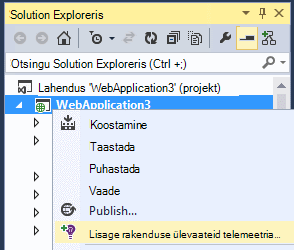
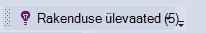
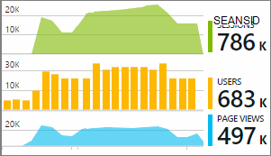

<properties 
    pageTitle="ASP.net-i rakenduse ülevaated veebianalüütika rakenduse häälestamine | Microsoft Azure'i" 
    description="Jõudluse, kättesaadavus ja Kasutusanalüüsi veebisaidi ASP.net-i konfigureerimine majutatud kohapealse või Azure." 
    services="application-insights" 
    documentationCenter=".net"
    authors="NumberByColors" 
    manager="douge"/>

<tags 
    ms.service="application-insights" 
    ms.workload="tbd" 
    ms.tgt_pltfrm="ibiza" 
    ms.devlang="na" 
    ms.topic="get-started-article" 
    ms.date="10/13/2016" 
    ms.author="awills"/>


# <a name="set-up-application-insights-for-aspnet"></a>ASP.net-i rakenduse ülevaated häälestamine

[Visual Studio rakenduse ülevaated](app-insights-overview.md) jälgib reaalajas rakenduse mis aitavad teil [tuvastada ja jõudlusega seotud probleemide ja erandid diagnoosimine](app-insights-detect-triage-diagnose.md)ja [avastamine, kuidas kasutada oma rakenduse](app-insights-overview-usage.md).  See toimib rakendused, mis on majutatud oma kohapealse IIS-i serverid või pilveteenuse VMs, samuti Azure veebirakenduste.


## <a name="before-you-start"></a>Enne alustamist

Sa vajad:

* Visual Studio 2013 update 3 või uuem versioon. Allpool on parem.
* [Microsoft Azure'i](http://azure.com)tellimust. Kui teie meeskond või ettevõte on Azure tellimuse, omanik lisamiseks saate seda oma [Microsofti kontoga](http://live.com). 

Alternatiivne artikleid, et vaadata, kui olete huvitatud on:

* [Instrumenting käitusajal web app](app-insights-monitor-performance-live-website-now.md)
* [Azure pilveteenused](app-insights-cloudservices.md)

## <a name="ide"></a>1. Rakenduse ülevaated SDK lisamine


### <a name="if-its-a-new-project"></a>Kui see on uue projekti...

Veenduge, et rakenduse ülevaated on valitud, kui loote uue projekti Visual Studios. 


### <a name="-or-if-its-an-existing-project"></a>... või kui see on olemasoleva projekti

Paremklõpsake Solution Exploreris projekti ja valige **Lisa rakenduse ülevaateid telemeetria** või **Rakenduse ülevaated konfigureerimine**.



* ASP.net-i projekti? - [Järgige neid juhiseid parandada mõne koodiread](https://github.com/Microsoft/ApplicationInsights-aspnetcore/wiki/Getting-Started#add-application-insights-instrumentation-code-to-startupcs). 


## <a name="run"></a>2 rakenduse käivitamine

Käivitage rakenduse abil klahvi F5 ja proovi: Avage erinevate lehtede loomiseks mõned telemeetria.

Visual Studio, näete arv sündmused, mis on sisse logitud. 



## <a name="3-see-your-telemetry"></a>3. Vaadake oma telemeetria...

### <a name="-in-visual-studio"></a>... rakenduses Visual Studio

Visual Studio rakenduse ülevaated akna avamiseks: klõpsake nuppu rakenduse ülevaated või paremklõpsake Solution Exploreris projekti:


Siin kuvatakse telemeetria loodud rakenduse serveripoolne. Proovige filtrid ja sündmuse täpsemaks vaatamiseks klõpsake nuppu.

[Lisateavet leiate teemast Visual Studio rakenduse ülevaated tööriistade kohta](app-insights-visual-studio.md).

<a name="monitor"></a> 
### <a name="-in-the-portal"></a>portaalis...

Kui valite *Installida SDK ainult,* võite vaadata ka telemeetria rakenduse ülevaated veebiportaali. 

Portaali on diagrammide, analüütiline tööriistad ja armatuurlaudade kui Visual Studio. 


Avage oma rakenduse ülevaated ressursi [Azure portaali](https://portal.azure.com/).


Portaali avab vaate telemeetria rakenduste kohta.

* Esimese telemeetria kuvatakse [Live mõõdikute voo](app-insights-metrics-explorer.md#live-metrics-stream).
* Üksikute sündmused kuvatakse **Otsing** (1). Andmete võib kuluda mõni minut, et kuvada. Klõpsake mõnda sündmust selleks, et näha selle atribuute. 
* Liidetud mõõdikute kuvatakse diagrammid (2). See võib kuluda mõni minut kaks andmete kuvamine siin. Klõpsake mis tahes diagrammi avamiseks tera rohkem üksikasju.

[Lisateavet leiate teemast rakenduse ülevaated Azure portaali kasutamise kohta](app-insights-dashboards.md).

## <a name="4-publish-your-app"></a>4. avaldada oma rakenduse

Avaldada oma rakenduse IIS-i serverisse või Azure. Vaadake [Live mõõdikute voo](app-insights-metrics-explorer.md#live-metrics-stream) veendumaks, et kõik töötab sujuvalt.

Näete oma telemeetria rakenduse ülevaated portaalis, kus saate mõõdikute, otsige oma telemeetria, ning häälestamine [armatuurlaudade](app-insights-dashboards.md)loomise. Samuti saate võimsaid [päringu Kasutusanalüüsi keele](app-insights-analytics.md) kasutus- ja jõudluse analüüs või leida teatud sündmuste. 

Võite ka oma telemeetria [Visual](app-insights-visual-studio.md) Studio tööriistadega nagu diagnostika otsingu ja [trendide](app-insights-visual-studio-trends.md)analüüsimiseks.

> [AZURE.NOTE] Kui teie rakendus saadab piisavalt telemeetria lähenemine [pidurdamise piirangud](app-insights-pricing.md#limits-summary), automaatne [valimite](app-insights-sampling.md) lülitub sisse. Valimite vähendab telemeetria saadetud rakenduste, säilitades ajutised seotud andmeid.


##<a name="land"></a>Mida lisada rakenduse ülevaated teha?

Rakenduse ülevaated, suunatakse teie rakenduse telemeetria rakenduse ülevaated portaali (mis majutab Microsoft Azure):


Nii, et käsk ei kolm üksust:

1. Rakenduse ülevaateid Web SDK Nugeti paketi lisamine projekti. Kuvamiseks Visual Studios, paremklõpsake projekti ja valige Halda NuGet-paketid.
2. Looge [Azure'i](https://portal.azure.com/)portaalis on rakenduse ülevaated ressurss. See on, kus näete oma andmed. See toob *instrumentation võti,* mis tuvastab ressursi.
3. Lisab instrumentation Sisestage `ApplicationInsights.config`, et saata SDK telemeetria portaali.

Kui soovite, mida saate teha järgmist käsitsi [ASP.net-i 4](app-insights-windows-services.md) või [ASP.net-i Core](https://github.com/Microsoft/ApplicationInsights-aspnetcore/wiki/Getting-Started).

### <a name="to-upgrade-to-future-sdk-versions"></a>Võtta kasutusele tulevaste SDK versioonid

[SDK uus versioon](https://github.com/Microsoft/ApplicationInsights-dotnet-server/releases)uuendada, avage uuesti Nugeti package manager ja filtreerida installitud paketid. Valige Microsoft.ApplicationInsights.Web ja täiendamine.

Kui olete teinud kõik kohandused ApplicationInsights.config, salvestada selle koopia enne täiendamine ja hiljem muudatuste ühendamine uue versiooni.

## <a name="add-more-telemetry"></a>Lisage veel telemeetria

### <a name="web-pages-and-single-page-apps"></a>Veebilehtede ja ühe lehe rakendused

1. Veebilehtede [lisamine JavaScripti koodilõigu](app-insights-javascript.md) esile brauseri ja kasutus labad andmetega lehe vaateid, laadimisajaga, brauseri erandid AJAXI kõne jõudluse tagamiseks kohta üles kasutaja ja seansi hulk.
2. [Kohandatud koodi sündmuste](app-insights-api-custom-events-metrics.md) arv-, kellaaja või mõõt kasutajatoimingute.

### <a name="dependencies-exceptions-and-performance-counters"></a>Sõltuvused, erandid ja jõudluse hinnale

[Installige oleku jälgimine](app-insights-monitor-performance-live-website-now.md) iga teie serveri masinad, saada täiendavad telemeetria oma rakenduse kohta. See on, mida saate:

* [Jõudluse hinnale](app-insights-performance-counters.md) - 
CPU, mälu, ketta ja muude seotud rakenduse jõudluse hinnale. 
* [Erandid](app-insights-asp-net-exceptions.md) - üksikasjalikumat telemeetria mõned erandid.
* [Sõltuvused](app-insights-asp-net-dependencies.md) - kõnede REST API-või SQL-i. Siit saate teada, kas aeglane vastuste teel komponentide välise põhjustavad jõudlusprobleemide rakenduse. (Kui teie rakendus töötab .NET 4.6, ei pea oleku jälgimine saada see telemeetria.)

### <a name="diagnostic-code"></a>Diagnostika kood

Kas teil on probleeme? Kui soovite lisada koodi aidata diagnoosida selle rakenduse, on teil mitu võimalust.

* [Jäädvustada log jälgi](app-insights-asp-net-trace-logs.md): juba kasutamisel Log4N, NLog või System.Diagnostics.Trace logige Jälita sündmusi, siis väljund saab saata rakenduse ülevaated, et te saate seda oleksid taotlusi, seda otsida ja analüüsida. 
* [Kohandatud sündmused ja mõõdikute](app-insights-api-custom-events-metrics.md): kasutamine TrackEvent() ja TrackMetric() server või veebilehe koodi.
* [Sildi telemeetria koos täiendavad atribuudid](app-insights-api-filtering-sampling.md#add-properties)

[Otsingu](app-insights-diagnostic-search.md) abil saate otsida ja oleksid teatud sündmuste ja [Analytics](app-insights-analytics.md) võimsam päringute sooritamiseks.

## <a name="alerts"></a>Teatised

Tuleb esmalt teadma, kui teie rakendus on probleeme. (Ärge oodake, kuni teile öelda teie kasutajad!) 

* [Loo web testide](app-insights-monitor-web-app-availability.md) veendumaks, et teie sait on nähtav veebis.
* [Aktiivne diagnostika](app-insights-proactive-diagnostics.md) käivitamine automaatselt (kui teie rakendus on teatud minimaalse liikluse). Te ei pea midagi teha nende häälestamiseks. Nad öelda, kui teie rakendus on nurjunud taotlusi ebatavalised määr.
* [Teatiste seadmine argumendil](app-insights-alerts.md) teid hoiatada, kui mõõdiku ületab läve. Saate seada need kohandatud mõõdikute selle kood oma rakendusse.

Vaikimisi saadetakse teatiste Azure tellimuse omanik. 


## <a name="version-and-release-tracking"></a>Versiooni ja väljalaske jälgimine

### <a name="track-application-version"></a>Jälita rakenduse versioon

Veenduge, et `buildinfo.config` on loodud oma MSBuild protsess. .Csproj failis lisamiseks tehke järgmist.  

```XML

    <PropertyGroup>
      <GenerateBuildInfoConfigFile>true</GenerateBuildInfoConfigFile>    <IncludeServerNameInBuildInfo>true</IncludeServerNameInBuildInfo>
    </PropertyGroup> 
```

Kui see on Koosta teave, lisab rakenduse ülevaated web mooduli **rakenduse versioon** automaatselt iga üksus telemeetria atribuudi. Võimaldab filtreerida versioon, kui [diagnostika](app-insights-diagnostic-search.md) otsinguid või kui [mõõdikute uurimine](app-insights-metrics-explorer.md). 

Pange tähele, et Koosta versiooninumber on loodud vaid MS Build, pole arendaja koostamine Visual Studio.

### <a name="release-annotations"></a>Vabastage marginaalid

Kui kasutate Visual Studio meeskonnatöö teenuseid, saate [hankida mõne markeri marginaali](app-insights-annotations.md) lisatud diagrammide iga kord, kui uue versiooni.


## <a name="next-steps"></a>Järgmised sammud

| | 
|---|---
|**[Töötamine Visual Studio rakenduse ülevaated](app-insights-visual-studio.md)**<br/>Silumine telemeetria diagnostika abil otsida, koodi süvitsi.|
|**[Töötamine rakenduse ülevaated portaal](app-insights-dashboards.md)**<br/>Armatuurlaudade, diagnostika- ja analüütiline tööriistakomplekti, teatiste, rakenduse ja telemeetria kaardil reaalajas sõltuvus eksportida. |
|**[Lisateavet andmete lisamine](app-insights-asp-net-more.md)**<br/>Jälgida kasutus, kättesaadavus, sõltuvused erandid. Integreerida logimine raamistiku jälgi. Kirjutage kohandatud telemeetria. | 


