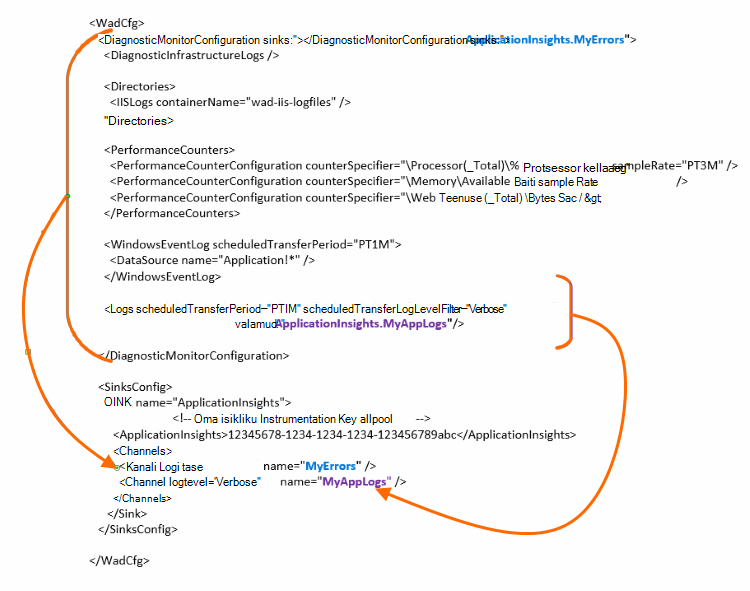

<properties
    pageTitle="Azure'i diagnostikalogid saata rakenduse ülevaated"
    description="Konfigureerida Azure pilveteenustega diagnostikalogid, mis saadetakse rakenduse ülevaated portaali üksikasju."
    services="application-insights"
    documentationCenter=".net"
    authors="sbtron"
    manager="douge"/>

<tags
    ms.service="application-insights"
    ms.workload="tbd"
    ms.tgt_pltfrm="ibiza"
    ms.devlang="na"
    ms.topic="article"
    ms.date="11/17/2015"
    ms.author="awills"/>

# <a name="configure-azure-diagnostic-logging-to-application-insights"></a>Azure'i diagnostikalogimise rakenduse ülevaated konfigureerimine

Kui häälestate pilveteenustega project või Microsoft Azure, [Azure saate luua diagnostika Logi](../vs-azure-tools-diagnostics-for-cloud-services-and-virtual-machines.md)virtuaalse masina. Saate määrata selle rakenduse ülevaated saadetud, nii, et saate selle rakenduse ülevaateid SDK rakenduse saadetud diagnostika- ja kasutusandmete telemeetria koos analüüsida. Azure'i logi sisaldab sündmuste halduse rakenduse näiteks start, Peata, jookseb ning jõudlust hinnale. Logi ka kõnede System.Diagnostics.Trace rakenduse.

Selles artiklis kirjeldatakse diagnostika jäädvustada üksikasjalikult konfigureerimine.

Teil on vaja Azure SDK 2,8 installinud Visual Studio.

## <a name="get-an-application-insights-resource"></a>Saada on rakenduse ülevaated ressurss

Parima kasutuskogemuse, [lisamine rakenduse ülevaateid SDK iga rolli pilveteenustega rakenduse](app-insights-cloudservices.md)või [mis tahes rakendusse käivitate sisse oma VM](app-insights-overview.md). Seejärel saate saata diagnostika andmeid analüüsida ja kuvada sama rakenduse ülevaated ressurss.

Teise võimalusena kui te ei soovi kasutada SDK - näiteks, kui rakendus on juba reaalajas – saate lihtsalt [luua uue rakenduse ülevaated ressursi](app-insights-create-new-resource.md) Azure'i portaalis. **Azure'i diagnostika** valida rakenduse tüüp.


## <a name="send-azure-diagnostics-to-application-insights"></a>Azure'i diagnostika saata rakenduse ülevaated

Kui olete ei saa värskendada oma rakenduse project, siis Visual Studio valige iga rolli, valige selle atribuudid ja vahekaarti konfigureerimine, valige **Saada diagnostika rakenduse ülevaate saamiseks**.

Kui teie rakendus on juba reaalajas, kasutage Visual Studio Server Explorer või pilveteenustega Exploreri atribuutide rakenduse avamiseks. Valige **Saada diagnostika rakenduse ülevaate saamiseks**.

Iga kord küsitakse jaoks loodud rakenduse ülevaated ressursi üksikasjad.

[Lisateavet leiate teemast rakenduse ülevaated pilveteenustega rakenduse häälestamise kohta](app-insights-cloudservices.md).

## <a name="configuring-the-azure-diagnostics-adapter"></a>Azure'i diagnostika adapterit konfigureerimine

Lugege edasi ainult kas soovite rakenduse ülevaated saadetavate Logi osade valimine. Vaikimisi kõik saadetakse, sh: Microsoft Azure sündmusi; jõudluse hinnale; Saate jälitada kõned System.Diagnostics.Trace rakendusest.

Azure'i diagnostika salvestab andmed Azure Storage tabelitele. Siiski saate ka kõik Triibu või rakenduse ülevaated andmete alamhulga konfigureerida "vajub" ja "kanalid" konfiguratsioonist kasutamisel Azure'i diagnostika laiend 1,5 või uuem versioon.

### <a name="configure-application-insights-as-a-sink"></a>Konfigureerida rakenduse ülevaated valamu

Roll atribuutide seadmiseks "Andmeid saata rakenduse ülevaated" kasutamisel lisab Azure'i SDK (2,8 või uuem versioon) on `<SinksConfig>` elemendi avaliku [Azure'i diagnostika konfiguratsioonifail](https://msdn.microsoft.com/library/azure/dn782207.aspx) roll.

`<SinksConfig>`määratleb täiendavad valamu, kus Azure diagnostika andmeid saab saata.  Näide `SinksConfig` näeb välja järgmine:

```xml

    <SinksConfig>
     <Sink name="ApplicationInsights">
      <ApplicationInsights>{Insert InstrumentationKey}</ApplicationInsights>
      <Channels>
        <Channel logLevel="Error" name="MyTopDiagData"  />
        <Channel logLevel="Verbose" name="MyLogData"  />
      </Channels>
     </Sink>
    </SinksConfig>

```

Funktsiooni `ApplicationInsights` element määrab instrumentation klahvi, mis tuvastab rakenduse ülevaated ressurss, millele saadetakse Azure diagnostika andmed. Kui valite ressursi, see lisatakse automaatselt vastavalt selle `APPINSIGHTS_INSTRUMENTATIONKEY` teenuse konfigureerimine. (Kui soovite käsitsi määramine, saada võti ressursi Essentialsi rippmenüü.)

`Channels`määratleda andmed, mis saadetakse valamu. Kanali toimib nagu filter. Funktsiooni `loglevel` atribuut saate määrata Logi tase, mis saadab kanali. On saadaval väärtused: `{Verbose, Information, Warning, Error, Critical}`.

### <a name="send-data-to-the-sink"></a>Andmete saatmine valamu

Saata andmed rakenduse ülevaated valamu, lisades valamud atribuut DiagnosticMonitorConfiguration sõlme all. Valamud elemendi lisamine iga sõlme määrab, et soovite sõlme ja mis tahes sõlme all määratud valamu saatmise kogutud andmete.

Näiteks loodud Azure'i SDK vaikesäte on Azure Diagnostikaandmete saatmiseks:

```xml

    <DiagnosticMonitorConfiguration overallQuotaInMB="4096" sinks="ApplicationInsights">
```

Kui soovite saada ainult Tõrkelogide, kuid on kanali nimega valamu nime järgmistel juhtudel.

```xml

    <DiagnosticMonitorConfiguration overallQuotaInMB="4096" sinks="ApplicationInsights.MyTopDiagdata">
```

Pange tähele, et kirjutit oleme määratletud kanalile, mida me eespool määratletud nimi koos valamu nime.

Kui soovite rakenduse ülevaated Paljusõnaline logid saata ja seejärel lisate valamud atribuudi selle `Logs` sõlm.

```xml

    <Logs scheduledTransferPeriod="PT1M" scheduledTransferLogLevelFilter="Verbose" sinks="ApplicationInsights.MyLogData"/>
```

Saate lisada ka mitme valamud konfiguratsiooni hierarhia erinevatel tasanditel. Sel juhul toimib määratud ülatasemel hierarhia valamu üldise sätte ja ühte määratud üksikute elemendi elemendi toiminguid nagu mõne alistamine selle globaalne säte.

Siin on lõpule viidud näide avaliku konfiguratsioonifail, mis saadab kõik vead rakenduse ülevaated (määratud veebisaidil on `DiagnosticMonitorConfiguration` sõlm) ja lisaks Paljusõnaline taseme logib rakenduse logide (määratud veebisaidil on `Logs` sõlm).

```xml

    <WadCfg>
     <DiagnosticMonitorConfiguration overallQuotaInMB="4096"
       sinks="ApplicationInsights.MyTopDiagData"> <!-- All info below sent to this channel -->
      <DiagnosticInfrastructureLogs />
      <PerformanceCounters>
        <PerformanceCounterConfiguration counterSpecifier="\Processor(_Total)\% Processor Time" sampleRate="PT3M" sinks="ApplicationInsights.MyLogData/>
        <PerformanceCounterConfiguration counterSpecifier="\Memory\Available MBytes" sampleRate="PT3M" />
        <PerformanceCounterConfiguration counterSpecifier="\Web Service(_Total)\Bytes Total/Sec" sampleRate="PT3M" />
      </PerformanceCounters>
      <WindowsEventLog scheduledTransferPeriod="PT1M">
        <DataSource name="Application!*" />
      </WindowsEventLog>
      <Logs scheduledTransferPeriod="PT1M" scheduledTransferLogLevelFilter="Verbose"
            sinks="ApplicationInsights.MyLogData"/>
       <!-- This specific info sent to this channel -->
     </DiagnosticMonitorConfiguration>

     <SinksConfig>
      <Sink name="ApplicationInsights">
        <ApplicationInsights>{Insert InstrumentationKey}</ApplicationInsights>
        <Channels>
          <Channel logLevel="Error" name="MyTopDiagData"  />
          <Channel logLevel="Verbose" name="MyLogData"  />
        </Channels>
      </Sink>
     </SinksConfig>
    </WadCfg>
```



Kehtivad teatud piirangud, millega peaks arvestama selle funktsiooni:

* Kanalite on mõeldud ainult Logi tüüp ja pole jõudluse hinnale töötamine. Kui määrate kanali jõudluse counter element, siis seda ignoreeritakse.
* Kanali Logi tase ei tohi ületada Logi tase mis kogutakse Azure diagnostika. Näide: te ei saa koguda rakenduse tõrked logid elementi ja saatmisel Verbose logid sünkroonimiseks rakenduse ülevaate. Atribuut scheduledTransferLogLevelFilter peab alati kogumise võrdne või rohkem kui logid logid saata valamu üritate.
* Ei saa saata bloobimälu andmeid kogutud Azure diagnostika laiend rakenduse ülevaated. Näiteks midagi määratud kataloogide sõlme all. Krahh puistab tegelik krahh dump endiselt saadetakse Bloobivahemälu salvestusruumi ja rakenduse ülevaated saadetakse ainult krahh dump loodud teatis.

## <a name="related-topics"></a>Seotud teemad

* [Azure'i pilveteenuste rakenduse ülevaated jälgimine](app-insights-cloudservices.md)
* [Azure'i diagnostika saatmiseks rakenduse ülevaated PowerShelli abil](app-insights-powershell-azure-diagnostics.md)
* [Azure'i diagnostika konfiguratsioonifail](https://msdn.microsoft.com/library/azure/dn782207.aspx)
