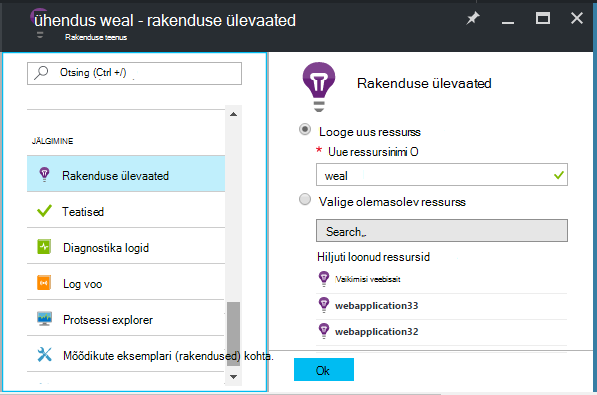
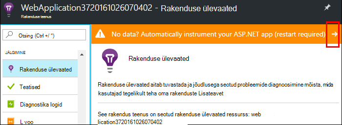
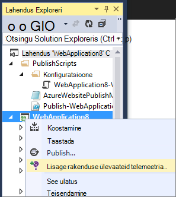
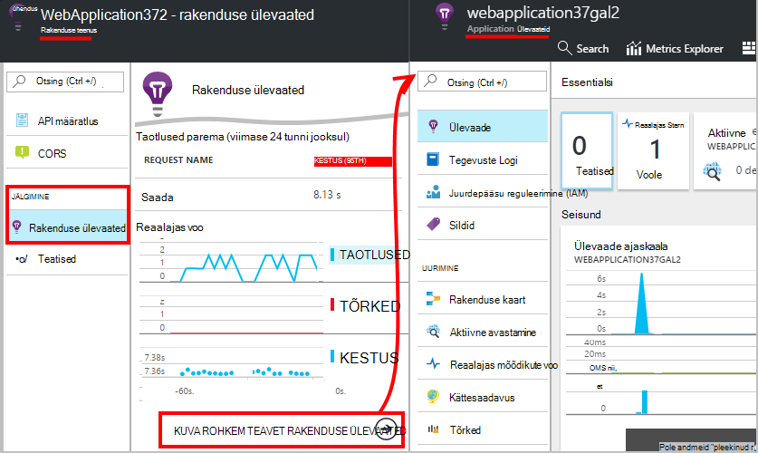
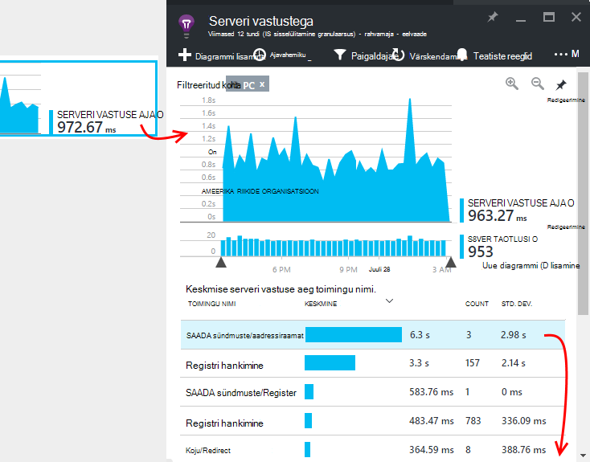
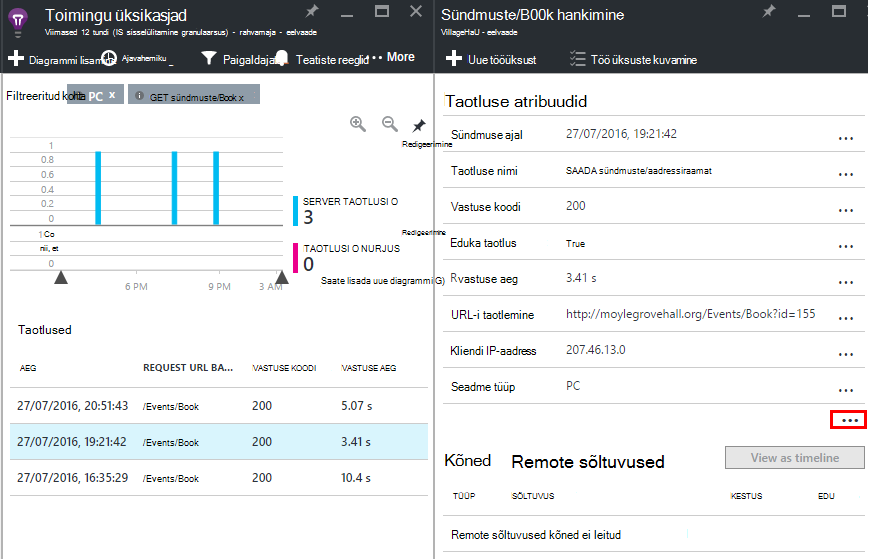

<properties
    pageTitle="Azure'i web appi jõudluse jälgimist | Microsoft Azure'i"
    description="Rakenduse jõudluse Azure veebirakenduste jälgimine. Diagrammi laadi ja vastuse kellaaeg objektisõltuvusteave ja jõudluse teatiste seadmine."
    services="application-insights"
    documentationCenter=".net"
    authors="alancameronwills"
    manager="douge"/>

<tags
    ms.service="azure-portal"
    ms.workload="na"
    ms.tgt_pltfrm="na"
    ms.devlang="na"
    ms.topic="article"
    ms.date="10/24/2016"
    ms.author="awills"/>

# Azure'i web appi jõudluse jälgimist

[Azure'i portaalis](https://portal.azure.com) saate häälestada rakenduse jõudluse jälgimise [Azure veebirakenduste](../app-service-web/app-service-web-overview.md). [Visual Studio rakenduse ülevaated](app-insights-overview.md) vahendite rakenduse kohta oma tegevuse telemeetria saatmiseks rakenduse ülevaated teenuse, kui see on salvestatud ja analüüsida. Seal, saab argumendil diagrammide ja otsinguriistad aidata diagnoosida probleeme, parandada jõudlust ja hinnake kasutus.

## Käitusaeg või koostamise ajal

Saate konfigureerida jälgimise instrumenting rakendus kahel viisil:

* **Käitusaja** – saate valida jälgimise laiend oma veebirakenduse on juba reaalajas jõudlust. Pole vaja taastada või rakenduse uuesti installida. Saate standardsete paketid, mis jälgimine vastuse korda, edukust, erandid, sõltuvused jne. 
 
* **Koostada aeg** - paketi saate installida rakenduse arendatakse. See suvand on mitmekülgsem. Lisaks sama standard pakette, saate kirjutada koodi kohandamine telemeetria või saata oma telemeetria. Konkreetsete tegevuste või kirje sündmuste vastavalt semantika rakenduse domeeni, saate sisse logida. 

## Käivitage aja instrumentation rakenduse ülevaated

Kui teil on juba Azure web appi, saate juba mõne jälgimine: taotlus ja tõrge. Lisada mitu korda vastuse saamiseks rakenduse ülevaated, jälgimine kõned sõltuvused, nutikas tuvastamise ja võimsaid Analytics päringu keel. 

1. **Valige rakenduse ülevaated** Azure juhtpaneeli veebirakenduse jaoks.

    

 * Valige luua uue ressursi, v.a juhul, kui olete häälestanud juba on rakenduse ülevaated ressurss selle rakenduse teise kaudu.

2. Kui arvutisse on installitud rakenduse ülevaated **dokumendi oma veebirakenduse** . 

    

3. **Saate jälgida oma rakendust**.  [Expore andmed](#explore-the-data).

Hiljem saate koostada ja Juurutage uuesti rakenduse ülevaated rakendus, kui soovite.

*Kuidas eemaldada rakenduse ülevaated, või saatmist teise ressurss üle minna?*

* Azure'i, avage web appi juhtelemendi tera ja avage arengu alammenüüd **laiendid**. Rakenduse ülevaated laiend kustutada. Klõpsake jaotises jälgimine, valige rakenduse ülevaated ja luua või valida soovitud ressursi.

## Rakenduse ülevaated rakenduse koostamine

Rakenduse ülevaated saate sisestada üksikasjalikumat telemeetria installida ka SDK oma rakendusse. Saate koguda Jälita logid, [kirjutage kohandatud telemeetria](../application-insights/app-insights-api-custom-events-metrics.md), ja üksikasjalikumad erandi aruandeid.

1. **Visual Studio** (2013 update 2 või uuemad versioonid) rakenduse ülevaateid SDK lisamine projekti.

    

    Kui teil palutakse sisse logida, kasutage identimisteabe Azure'i kontosse.

    Toiming on kaks efektid.

 1. Loob Azure, kuhu salvestatakse, analüüsida ja kuvatakse telemeetria on rakenduse ülevaated ressurss.
 2. Lisab rakenduse ülevaateid Nugeti pakett oma koodi ja konfigureerib seda saata telemeetria Azure ressursi.

2. **Test telemeetria** rakendus töötab arvuti arengu (F5).

3. **Avalda rakenduse** Azure tavapärasel viisil. 

*Kuidas aktiveerida muu rakenduse ülevaated ressursi saatmist?*

* Visual Studio, paremklõpsake projekt, valige **Rakenduse ülevaated > konfigureerimine** ja valige soovitud ressursi. Saate luua uue ressursi suvand. Taastada ja Juurutage uuesti.

## Andmete uurimine

1. Rakenduse ülevaated enne web appi juhtpaneeli, näete Live mõõdikute, kus on kuvatud taotlusi ja tõrkeid teine või kaks neist jäävate. Kui te kasutate uuestipublitseerimist rakenduse - probleemideta saate kohe vaadata on väga kasulik kuvamine.

2. Klõpsake rakenduse ülevaated täielik ressursile.

    
    

    Samuti saate avada seal kas otse Azure ressursi navigeerimine.

2. Klõpsake mis tahes diagrammi täpsemat teavet kaudu.

    

    Saate [kohandada mõõdikute labad](../application-insights/app-insights-metrics-explorer.md).

3. Klõpsake kaudu leiate teemast üksikute sündmused ja nende atribuudid.

    

    Pange tähele selle "..." kõik atribuudid avamiseks linki.

    Saate [kohandada otsingud](../application-insights/app-insights-diagnostic-search.md).

Võimsamate otsingud üle oma telemeetria, kasutage [Analytics päringu keel](../application-insights/app-insights-analytics-tour.md).

## Järgmised sammud

* [Luba Azure'i diagnostika](app-insights-azure-diagnostics.md) rakenduse ülevaated saata.
* [Kuvari teenuse seisund mõõdikute](../monitoring-and-diagnostics/insights-how-to-customize-monitoring.md) veendumaks, et teie teenus on saadaval ja reageeri.
* Iga kord, kui funktsionaalseid sündmuste [teatiste vastuvõtmine](../monitoring-and-diagnostics/insights-receive-alert-notifications.md) või mõõdikute risti läve.
* [Rakenduse ülevaated JavaScripti rakenduste ja veebilehtede](app-insights-web-track-usage.md) abil saate kliendi telemeetria veebilehe brauserite.
* [Kättesaadavus web testide häälestada](app-insights-monitor-web-app-availability.md) teatisi, kui teie sait on alla.
