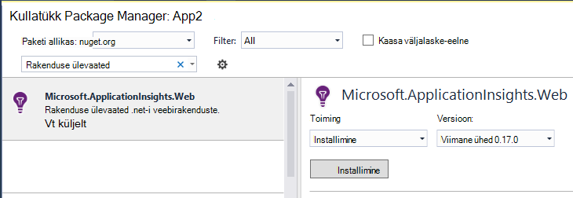
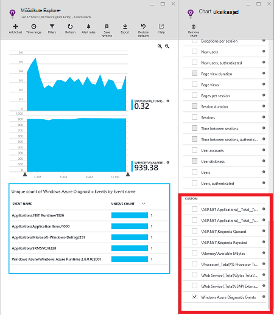
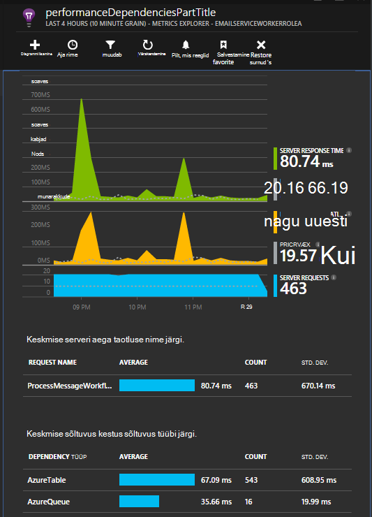
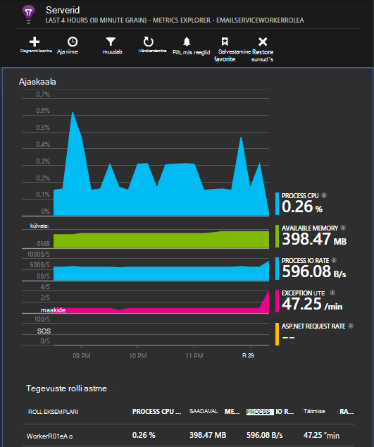

<properties
   pageTitle="Rakenduse ülevaated Azure pilveteenused"
   description="Jälgida oma veebi ja töötaja rollid tõhusalt koos rakenduse ülevaated"
   services="application-insights"
   documentationCenter=""
   authors="soubhagyadash"
   manager="douge"
   editor="alancameronwills"/>

<tags
   ms.service="application-insights"
   ms.devlang="na"
   ms.tgt_pltfrm="ibiza"
   ms.topic="article"
   ms.workload="tbd"
   ms.date="03/02/2016"
   ms.author="sdash"/>

# <a name="application-insights-for-azure-cloud-services"></a>Rakenduse ülevaated Azure pilveteenused


*Rakenduse ülevaated on eelvaade*

[Microsoft Azure'i pilveteenuste rakendused](https://azure.microsoft.com/services/cloud-services/) saab jälgida [Visual Studio rakenduse ülevaated] [ start] olemasolu, jõudluse, tõrgete ja kasutamine. Abil saate looduses jõudlus ja tõhustada rakenduse kohta tagasiside, saate iga arengu elutsükli kursis püsida valikuid kujunduse suunda.


Peate tellimuse [Microsoft](http://azure.com)Azure. Logige sisse Microsofti kontoga, mida peate võib-olla Windowsi, XBox Live või muude Microsofti pilveteenustega. 


#### <a name="sample-application-instrumented-with-application-insights"></a>Valimi rakendus kinnitatakse rakenduse ülevaated

Heitke pilk [valimi rakenduse](https://github.com/Microsoft/ApplicationInsights-Home/tree/master/Samples/AzureEmailService) mis rakenduse ülevaated lisatakse kaks töötaja rollid majutatud Azure pilveteenusesse. 

Järgnevalt kirjeldatakse, kuidas kohandada oma pilvepõhise teenuse project samal viisil.

## <a name="create-an-application-insights-resource-for-each-role"></a>Looge iga rolli on rakenduse ülevaated ressurss

On rakenduse ülevaated ressurss on, kus teie koguda andmeid analüüsida ja kuvada.  

1.  [Azure'i portaalis][portal], saate luua uue rakenduse ülevaated ressursi. Rakenduse tüüp, valida ASP.net-i rakendus. 

    

2.  Võtta koopia Instrumentation võti. Peate selle varsti SDK konfigureerimiseks.

    


Tavaliselt on [parem luua iga veebi ja töötaja rolli andmeid eraldi ressurss](app-insights-separate-resources.md). 

Teise võimalusena saate võib kõikide rollide andmeid saata ainult üks ressurss, kuid määrata [vaikimisi atribuudi] [ apidefaults] nii, et saate filtreerida või rühmitada iga rolli tulemusi.

## <a name="sdk"></a>Installige SDK iga Projectis


1. Visual Studio, redigeerida cloud rakenduse projekti NuGet-paketid.

    


2. Web rollid, lisage [Rakenduse ülevaated Web](http://www.nuget.org/packages/Microsoft.ApplicationInsights.Web) Nugeti pakett. Selle versiooni SDK moodulid, mis lisada näiteks Rolliteabe Serveri konteksti. Töötaja rollid, kasutage [Rakenduste ülevaateid Windows serverid](https://www.nuget.org/packages/Microsoft.ApplicationInsights.WindowsServer/).

    


3. Konfigureerige SDK rakenduse ülevaated ressursi andmeid saata.

    Otsingukonfiguratsiooni säte nimega instrumentation võtme seadmiseks faili `ServiceConfiguration.Cloud.cscfg`. ([Proovi kood](https://github.com/Microsoft/ApplicationInsights-Home/blob/master/Samples/AzureEmailService/AzureEmailService/ServiceConfiguration.Cloud.cscfg)).
 
    ```XML
     <Role name="WorkerRoleA"> 
      <Setting name="APPINSIGHTS_INSTRUMENTATIONKEY" value="YOUR IKEY" /> 
     </Role>
    ```
 
    Sobiva käivitus funktsioonis instrumentation võtme seadmiseks konfiguratsioon sätte kaudu:

    ```C#
     TelemetryConfiguration.Active.InstrumentationKey = RoleEnvironment.GetConfigurationSettingValue("APPINSIGHTS_INSTRUMENTATIONKEY");
    ```

    Pange tähele, sama nimi `APPINSIGHTS_INSTRUMENTATIONKEY` konfiguratsioon sätte kasutab Azure diagnostika teatamine. 


    Tehke seda iga rolli oma rakenduse. Vt näited:
 
 * [Web roll](https://github.com/Microsoft/ApplicationInsights-Home/blob/master/Samples/AzureEmailService/MvcWebRole/Global.asax.cs#L27)
 * [Töötaja roll](https://github.com/Microsoft/ApplicationInsights-Home/blob/master/Samples/AzureEmailService/WorkerRoleA/WorkerRoleA.cs#L232)
 * [Veebilehtede jaoks](https://github.com/Microsoft/ApplicationInsights-Home/blob/master/Samples/AzureEmailService/MvcWebRole/Views/Shared/_Layout.cshtml#L13)   

4. Määrake ApplicationInsights.config faili kopeerida alati väljundi kataloog. 

    (.Config faili, kuvatakse sõnumid, mis palub teil paigutamiseks instrumentation võti seal. Pilve rakendused on parem määraks .cscfg failist. See tagab roll õigesti tuvastatakse portaalis.)


#### <a name="run-and-publish-the-app"></a>Käivitamine ja rakenduse avaldamine

Käivitage rakendus ja Azure sisse logida. Avage rakenduse ülevaated ressursse, mis on loodud ja kuvatakse üksikuid andmepunkte kuvataks [otsingus](app-insights-diagnostic-search.md), ja koondandmete [Meetermõõdustik](app-insights-metrics-explorer.md)Exploreris. 

Lisage veel telemeetria – lugege allpool - ja avaldage rakenduse reaalajas diagnostika- ja kasutusandmete tagasisidet. 


#### <a name="no-data"></a>Pole andmeid?

* Avage [Otsing] [ diagnostic] paani üksikute sündmuste kuvamiseks.
* Kasutage rakendust, avades erinevate lehtede, et see tekitab mõned telemeetria.
* Oodake paar minutit ja klõpsake nuppu Värskenda.
* Lugege teemat [tõrkeotsing][qna].


## <a name="more-telemetry"></a>Lisateavet telemeetria

Järgmistes jaotistes näitab, kuidas saada täiendavad telemeetria rakenduse eri aspekte.


## <a name="track-requests-from-worker-roles"></a>Jälita päringutele töötaja rollid

Web rollid, taotlusi mooduli automaatselt kogub teavet HTTP päringuid. Artiklist leiate näiteid, kuidas saate alistada vaikekäitumise saidikogumi [valimi MVCWebRole](https://github.com/Microsoft/ApplicationInsights-Home/tree/master/Samples/AzureEmailService/MvcWebRole) . 

Saate hõivata kõned töötaja rolli täitmise jälgimise neid samamoodi nagu HTTP päringuid. Klõpsake rakenduse ülevaated, meetmed taotluse telemeetria tüüp üksuse nimega serveri pool töö, mida saate ajastatud ja sõltumatult õnnestub või ei. Teie enda taotlusi jälitamiseks töötaja rolli koodi võite sisestada ajal HTTP päringuid tunnid ja minutid automaatselt SDK.

Kahe valimi töötaja rolli seadistatakse aruande taotlusi vaadata: [WorkerRoleA](https://github.com/Microsoft/ApplicationInsights-Home/tree/master/Samples/AzureEmailService/WorkerRoleA) ja [WorkerRoleB](https://github.com/Microsoft/ApplicationInsights-Home/tree/master/Samples/AzureEmailService/WorkerRoleB)

## <a name="azure-diagnostics"></a>Azure'i diagnostika

[Azure'i diagnostika](../vs-azure-tools-diagnostics-for-cloud-services-and-virtual-machines.md) andmed sisaldavad rolli haldus sündmused ja jõudluse hinnale logid. Saate määrata rakenduse ülevaated saadetakse need, et saaksite neid vaadata koos teiste oma telemeetria hõlpsam probleemide.

Azure'i diagnostika on eriti kasulik, kui rollist nurjus ootamatult või ei käivitu.

1. Roll (mitte projekti!) oma atribuudid avamiseks paremklõpsake ja valige **Luba diagnostika**, **saata diagnostika rakenduse ülevaate saamiseks**.

    

    **Või kui teie rakendus on juba avaldatud ja töötab**, avage Server Explorer või Cloud Explorer, paremklõpsake rakenduse ja sama suvand.

3.  Valige oma muude telemeetria sama rakenduse ülevaated ressurss.

    Kui soovite, saate eri ressursi muu teenuse konfiguratsioone (pilve, kohalik) aitab hoida arengu andmete reaalajas muutuvate andmete eraldi.

3. Soovi korral võite [jätta mõned Azure diagnostika](app-insights-azure-diagnostics.md) soovitud rakenduse ülevaated edastada. Vaikimisi on kõik.

### <a name="view-azure-diagnostic-events"></a>Azure'i diagnostika sündmuste vaatamine

Kust leida diagnostika:

* Kohandatud mõõdikute kuvatakse jõudluse hinnale. 
* Windowsi sündmuselogide on kujutatud jälgi ja kohandatud sündmused.
* Rakenduse logide, ETW logid ja mis tahes diagnostika taristu logid kuvatakse jälgi.

Jõudluse hinnale ja loendab sündmuste vaatamiseks avage [Mõõdikute Explorer](app-insights-metrics-explorer.md) ja uue diagrammi lisamine.




[Otsingu](app-insights-diagnostic-search.md) abil saate otsida erinevate Jälita logid saata Azure'i diagnostika. Näiteks kui oleksite unhanded erand rolli, mis põhjustas roll krahh ja prügikasti, et teabe näitaks üles rakenduses rakenduse kanali, Windowsi sündmuselogi. Saate vaadata Windowsi sündmuselogi tõrge ja täielik virnas Jälita saamiseks erand, mis võimaldab teil otsida probleemi põhjuseks otsingufunktsiooni.


## <a name="app-diagnostics"></a>Rakenduse diagnostika

Azure'i diagnostika sisaldab automaatselt Logi kirjed, mis teie app loob System.Diagnostics.Trace abil. 

Kui kasutate juba Log4N või NLog programmidega, saate ka [jäädvustada oma jälgi Logi], kuid[netlogs].

[Kohandatud sündmused ja mõõdikute] [ api] kliendi või serveri või mõlemad, lisateavet rakenduse jõudlus ja kasutuse kohta.

## <a name="dependencies"></a>Sõltuvused

Rakenduse ülevaateid SDK saate teatada kõnesid, mis teeb rakenduse välise sõltuvused nagu REST API-de ja SQL-i serverid. See võimaldab teil näha, kas teatud sõltuvus põhjustab aeglane vastuste või tõrkeid.

Kui teie rakendus kasutab .NET Frameworki 4.6 või uuem versioon, te ei pea midagi tegema. 

Muul juhul saate häälestada [Rakenduse ülevaateid Agent](app-insights-monitor-performance-live-website-now.md) tuntud ka kui "oleku jälgimine" web/töötaja roll.

Teie web/töötaja rollid rakenduse ülevaateid Agent kasutamiseks tehke järgmist.

* Lisage [AppInsightsAgent](https://github.com/Microsoft/ApplicationInsights-Home/tree/master/Samples/AzureEmailService/WorkerRoleA/AppInsightsAgent) kausta ja kahe faili see web/töötaja rolli projektide. Kindlasti nende koostamine atribuutide seadmine nii, et alati kopeeritakse need väljundi kataloogi. Need failid installida agent.
* Tööülesande käivitamine lisada CSDEF faili nagu näidatud [siin](https://github.com/Microsoft/ApplicationInsights-Home/tree/master/Samples/AzureEmailService/AzureEmailService/ServiceDefinition.csdef#L18).
* Märkus: *Töötaja rollide* jaoks on vaja kolme keskkonna muutujate nagu näidatud [siin](https://github.com/Microsoft/ApplicationInsights-Home/tree/master/Samples/AzureEmailService/AzureEmailService/ServiceDefinition.csdef#L44). See ei ole vaja web rollid.

### <a name="dependency-reports"></a>Sõltuvus aruanded

Siin on näide sellest, mida näete rakenduse ülevaated portaali.

* Rikkaliku diagnostika automaatselt seotud taotlusi ja sõltuvused:

    

* Jõudluse web roll, sõltuvus teavet:

    

* Siin on pilt taotlused ja objektisõltuvusteave töötaja rolli:

    

## <a name="exceptions"></a>Erandid

Lisateavet selle kohta, kuidas saate eri veebitüübid rakenduse töötlemata erandid kogumine teemast [Rakenduse ülevaated erandid jälgimine](app-insights-asp-net-exceptions.md) .

Valimi web rollil on MVC5 ja veebi-API 2 kontrollerid. 2 töötlemata erandid on jäädvustatud järgmist:

* [AiHandleErrorAttribute](https://github.com/Microsoft/ApplicationInsights-Home/blob/master/Samples/AzureEmailService/MvcWebRole/Telemetry/AiHandleErrorAttribute.cs) häälestamine [siin](https://github.com/Microsoft/ApplicationInsights-Home/blob/master/Samples/AzureEmailService/MvcWebRole/App_Start/FilterConfig.cs#L12) MVC5 kontrollerid
* [AiWebApiExceptionLogger](https://github.com/Microsoft/ApplicationInsights-Home/blob/master/Samples/AzureEmailService/MvcWebRole/Telemetry/AiWebApiExceptionLogger.cs) häälestamine [siin](https://github.com/Microsoft/ApplicationInsights-Home/blob/master/Samples/AzureEmailService/MvcWebRole/App_Start/WebApiConfig.cs#L25) Web API 2 kontrollerid

Töötaja rollid, on kaks võimalust jälgida erandid.

* TrackException(ex)
* Kui olete rakenduse ülevaated Jälita kuulajale Nugeti pakett lisanud, saate System.Diagnostics.Trace logige erandid. [Koodi näide.](https://github.com/Microsoft/ApplicationInsights-Home/blob/master/Samples/AzureEmailService/WorkerRoleA/WorkerRoleA.cs#L107)

## <a name="performance-counters"></a>Jõudluse hinnale

Järgmised hinnale kogutakse vaikimisi:

    * \Process(??APP_WIN32_PROC??)\% protsessori aeg
    * \Memory\Available baiti
    * \.NET CLR-i Exceptions(??APP_CLR_PROC??)\# Exceps visati sekundis.
    * \Process (?. APP_WIN32_PROC?) \Private baiti
    * \Process (?. APP_WIN32_PROC?) \IO andmete baiti sekundis
    * \Processor(_Total)\% protsessori aeg

Lisaks järgmist ka kogutakse web rolle:

    * \ASP.net rakenduste (?. APP_W3SVC_PROC?) \Requests/SEC    
    * \ASP.net rakenduste (?. APP_W3SVC_PROC?) \Request täitmisaeg
    * \ASP.net rakenduste (?. APP_W3SVC_PROC?) Taotluse järjekorda \Requests

Saate määrata täiendavaid kohandatud või muude Windowsi jõudlus hinnale, nagu näidatud [siin](https://github.com/Microsoft/ApplicationInsights-Home/blob/master/Samples/AzureEmailService/WorkerRoleA/ApplicationInsights.config#L14)

  

## <a name="correlated-telemetry-for-worker-roles"></a>Seotud telemeetria töötaja rollid

See on rikkaliku diagnostika kogemus, kui saate vaadata, millist viinud nurjunud või kõrge latentsus taotluse. Web rollid, SDK automaatselt häälestab seotud telemeetria seost. Töötaja rollid, saate määrata levinud Operation.Id kontekstis atribuut on telemeetria selleks kohandatud telemeetria initializer. See võimaldab teil näha, kas latentsus/tõrge probleeme tekkis sõltuvus või oma koodi ülevaade! 

Siin on kuidas:

* Määrake korrelatsiooni ID-d on CallContext sisse nagu näidatud [siin](https://github.com/Microsoft/ApplicationInsights-Home/blob/master/Samples/AzureEmailService/WorkerRoleA/WorkerRoleA.cs#L36). Sel juhul kasutame taotlemine ID korrelatsiooni ID
* Saate lisada kohandatud TelemetryInitializer rakendamist, mis on Operation.Id määramine correlationId, kohal. Järgmisel joonisel näha: [ItemCorrelationTelemetryInitializer](https://github.com/Microsoft/ApplicationInsights-Home/blob/master/Samples/AzureEmailService/WorkerRoleA/Telemetry/ItemCorrelationTelemetryInitializer.cs#L13)
* Saate lisada kohandatud telemeetria initializer. Kas sa seda faili ApplicationInsights.config või koodi nagu näidatud [siin](https://github.com/Microsoft/ApplicationInsights-Home/blob/master/Samples/AzureEmailService/WorkerRoleA/WorkerRoleA.cs#L233)

See on õige! Portaali kogemus juba võrguühendusega aidata näete kogu sellega seotud telemeetria lühiülevaade:


## <a name="client-telemetry"></a>Kliendi telemeetria

[Lisada JavaScripti SDK veebilehtede] [ client] Brauseripõhine telemeetria, näiteks lehe view loeb, lehtede laadimisajaga skripti erandid ja teile kirjutada oma lehe skriptide kohandatud telemeetria.

## <a name="availability-tests"></a>Kättesaadavus kontrollib

[Häälestamine web testide] [ availability] veenduge, et teie taotlus jääb reaalajas ja reageeri abil.


## <a name="example"></a>Näide

[Näiteks](https://github.com/Microsoft/ApplicationInsights-Home/tree/master/Samples/AzureEmailService) jälgib teenus, mis on web rolli ja kahe töötaja rollid.

## <a name="exception-method-not-found-on-running-in-azure-cloud-services"></a>Erandi "meetod ei leitud" klõpsake Azure pilveteenustega töötab?

Kas koostate .NET 4.6? Azure'i pilveteenustega rolliga 4.6 automaatselt ei toetata. Enne käivitamist rakenduse [installimine 4.6 iga rolli kohta](../cloud-services/cloud-services-dotnet-install-dotnet.md) .

## <a name="related-topics"></a>Seotud teemad

* [Azure'i diagnostika saata rakenduse ülevaated konfigureerimine](app-insights-azure-diagnostics.md)
* [Azure'i diagnostika saatmiseks rakenduse ülevaated PowerShelli abil](app-insights-powershell-azure-diagnostics.md)


[api]: app-insights-api-custom-events-metrics.md
[apidefaults]: app-insights-api-custom-events-metrics.md#default-properties
[apidynamicikey]: app-insights-separate-resources.md#dynamic-ikey
[availability]: app-insights-monitor-web-app-availability.md
[azure]: app-insights-azure.md
[client]: app-insights-javascript.md
[diagnostic]: app-insights-diagnostic-search.md
[netlogs]: app-insights-asp-net-trace-logs.md
[portal]: http://portal.azure.com/
[qna]: app-insights-troubleshoot-faq.md
[redfield]: app-insights-monitor-performance-live-website-now.md
[start]: app-insights-overview.md 
