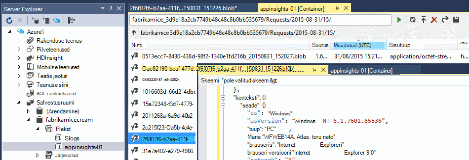
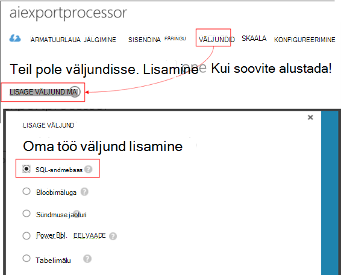

<properties 
    pageTitle="Juhend: eksportimine telemeetria SQL-andmebaasi rakenduse ülevaated" 
    description="Pidevalt rakenduse ülevaated andmete eksportimine SQL-i abil voo Analytics." 
    services="application-insights" 
    documentationCenter=""
    authors="noamben" 
    manager="douge"/>

<tags 
    ms.service="application-insights" 
    ms.workload="tbd" 
    ms.tgt_pltfrm="ibiza" 
    ms.devlang="na" 
    ms.topic="article" 
    ms.date="03/06/2015" 
    ms.author="awills"/>
 
# <a name="walkthrough-export-to-sql-from-application-insights-using-stream-analytics"></a>Juhend: SQL-i eksportimine rakenduse ülevaated voo Analytics abil

Selles artiklis kirjeldatakse, kuidas teisaldada telemeetria andmete [Visual Studio rakenduse ülevaated] [ start] SQL Azure'i andmebaasi, kasutades [Pidev eksportimine] [ export] ja [Azure voo analüütika](https://azure.microsoft.com/services/stream-analytics/). 

Pidev ekspordi liigub telemeetria andmete Azure Storage JSON-vormingus. Vaatame sõeluda JSON objektide abil Azure'i voo Analytics ja andmebaasi tabelisse ridade loomine.

(Üldisemalt pidev eksportimine on viis teha oma rakenduste saata rakenduse ülevaated telemeetria analüüs. Teil võib kohandada selle koodi valimi eksporditud telemeetria, nt andmete liitmise ja muude toimingute tegemiseks.)

Alustuseks kirjeldame eeldusel, et teil on juba rakendus, mida soovite jälgida.


Selles näites me kasutame lehe andmete kuvamine, kuid sama muster saate hõlpsasti pikendada muud tüüpi andmetega, nt kohandatud sündmused ja erandid. 


## <a name="add-application-insights-to-your-application"></a>Rakenduse lisamiseks rakenduse ülevaated


Alustamiseks:

1. Saate [häälestada rakenduse ülevaated veebilehtede jaoks](app-insights-javascript.md). 

    (Selles näites me keskenduda töötlemine kliendi brauserid andmete lehe vaatamiseks, kuid võite ka seadistada rakenduse ülevaated serveripoolne [Java](app-insights-java-get-started.md) või [ASP.net-i](app-insights-asp-net.md) rakenduse ja protsessi taotlus, sõltuvus ja muud serveri telemeetria.)


5. Rakenduse avaldamine ja vaadake oma rakenduse ülevaated ressursi telemeetria andmeid.


## <a name="create-storage-in-azure"></a>Azure'i salvestusruumi loomine

Pidev ekspordi tulemused alati Azure Storage konto andmeid nii, et peate esmalt looma talletamist.

1. Teie tellimus [Azure portaali]salvestusruumi konto loomine[portal].

    

2. Ümbris loomine

    

3. Kopeerige salvestusruumi kiirklahv

    Peate selle kiiresti häälestada voo analytics teenuse sisendi.

    

## <a name="start-continuous-export-to-azure-storage"></a>Azure'i salvestusruumi pidev ekspordi käivitamine

1. Azure portaali, otsige üles rakenduse jaoks loodud rakenduse ülevaated ressurss.

    

2. Saate luua pidev ekspordi.

    


    Valige varem loodud salvestusruumi konto.

    
    
    Sündmuste tüübid, mida soovite näha seadmiseks tehke järgmist.

    


3. Lubage koguda andmeid. Istuda ja andke rakenduse kasutamiseks aega. Telemeetria tulevad ja te näete, statistilised diagrammid [argumendil](app-insights-metrics-explorer.md) Exploreris ja üksikute sündmuste [diagnostika otsing](app-insights-diagnostic-search.md). 

    Ja ka salvestusruumi ekspordib andmed. 

4. Kontrolli selle eksporditud andmeid, kas portaalis – valige **Sirvi**, valige oma salvestusruumi konto ja seejärel **ümbriste** - või Visual Studio. Visual Studio, valige **vaatamine / Cloud Explorer**, ja avage Azure'i / salvestusruumi. (Kui teil pole menüüvalikuid, on vaja installida Azure SDK: avage dialoogiboks uue projekti ja avage Visual C# / Cloud / saada Microsoft Azure'i SDK .net-i jaoks.)

    

    Kirjutage tee nimi, mis on saadud rakenduse nimi ja seadmeid võti ühisosa. 

Sündmuste Bloobivahemälu JSON-vormingus failide kirjutada. Iga fail võib sisaldada ühe või mitme sündmused. Nii soovime sündmuse andmete lugemine ja filtreerida soovime väljad. On igasuguseid asju, mida me ei andmeid, kuid meie plaan on juba täna kasutada voo Analytics andmete teisaldamine SQL-andmebaasi. Mida teeb lihtsaks käivitamiseks palju huvitav päringuid.

## <a name="create-an-azure-sql-database"></a>SQL Azure'i andmebaasi loomine

Taas alates tellimuse [Azure'i]portaalis[portal], andmebaasi loomine (ja uus server, v.a juhul, kui teil on juba üks) mis teil tuleb andmete kirjutamiseks.


Veenduge, et andmebaasi server lubab juurdepääsu Azure.


## <a name="create-a-table-in-azure-sql-db"></a>Tabeli loomine Azure SQL-i DB

Andmebaasiga ühenduse loomiseks oma eelistatud haldustööriist koos eelmises jaotises loodud. Ülevaate, me kasutame [SQL Server Management Tools](https://msdn.microsoft.com/ms174173.aspx) (SSMS).


Saate luua uue päringu ja käivitada T-SQL.

```SQL

CREATE TABLE [dbo].[PageViewsTable](
    [pageName] [nvarchar](max) NOT NULL,
    [viewCount] [int] NOT NULL,
    [url] [nvarchar](max) NULL,
    [urlDataPort] [int] NULL,
    [urlDataprotocol] [nvarchar](50) NULL,
    [urlDataHost] [nvarchar](50) NULL,
    [urlDataBase] [nvarchar](50) NULL,
    [urlDataHashTag] [nvarchar](max) NULL,
    [eventTime] [datetime] NOT NULL,
    [isSynthetic] [nvarchar](50) NULL,
    [deviceId] [nvarchar](50) NULL,
    [deviceType] [nvarchar](50) NULL,
    [os] [nvarchar](50) NULL,
    [osVersion] [nvarchar](50) NULL,
    [locale] [nvarchar](50) NULL,
    [userAgent] [nvarchar](max) NULL,
    [browser] [nvarchar](50) NULL,
    [browserVersion] [nvarchar](50) NULL,
    [screenResolution] [nvarchar](50) NULL,
    [sessionId] [nvarchar](max) NULL,
    [sessionIsFirst] [nvarchar](50) NULL,
    [clientIp] [nvarchar](50) NULL,
    [continent] [nvarchar](50) NULL,
    [country] [nvarchar](50) NULL,
    [province] [nvarchar](50) NULL,
    [city] [nvarchar](50) NULL
)

CREATE CLUSTERED INDEX [pvTblIdx] ON [dbo].[PageViewsTable]
(
    [eventTime] ASC
)WITH (PAD_INDEX = OFF, STATISTICS_NORECOMPUTE = OFF, SORT_IN_TEMPDB = OFF, DROP_EXISTING = OFF, ONLINE = OFF, ALLOW_ROW_LOCKS = ON, ALLOW_PAGE_LOCKS = ON)

```


Selles näites me kasutame andmete lehe vaated. Olemasolevate andmete kuvamiseks kontrollida oma JSON väljundi ja lugege teemat [mudeli andmete eksportimine](app-insights-export-data-model.md).

## <a name="create-an-azure-stream-analytics-instance"></a>Azure'i voo Analytics eksemplari loomine

[Klassikaline Azure portaali](https://manage.windowsazure.com/), valige Azure voo Analytics teenuse ja looge uus voo Analytics töö:


Kui luuakse uus töökoht, laiendage oma üksikasjad:


#### <a name="set-blob-location"></a>Bloobimälu asukoha määramine

Selle tegemiseks oma pidev eksportimine bloobimälu sisend seadmiseks tehke järgmist.


Nüüd peate Accessi primaarvõtme salvestusruumi konto, mis eespool märgitud. Määrake see salvestusruumi konto võti.


#### <a name="set-path-prefix-pattern"></a>Mustri määramine tee eesliite 


Ärge unustage määratud kuupäeva vormingus **YYYY-MM-DD** (koos **kriipsud**).

Tee eesliite mustri saate määrata, kuidas voo Analytics leiab Sisestuskeel failide talletamist. Peate määrama selle vastavad kuidas pidev eksportimine talletatakse andmeid. Määraks umbes järgmine:

    webapplication27_12345678123412341234123456789abcdef0/PageViews/{date}/{time}

Selles näites:

* `webapplication27`on rakenduse ülevaated ressurss, **Kõik väiketähtedes**nimi. 
* `1234...`on instrumentation võti selle rakenduse ülevaated ressursi **abil eemaldada kriipsud**. 
* `PageViews`on andmete analüüsimiseks soovime tüüpi. Saadaval tüübid sõltuvad seate pidev eksportimine filter. Eksporditud andmete kuvamiseks saadaval tüüpi uurida ja vaadake [mudeli andmete eksportimine](app-insights-export-data-model.md).
* `/{date}/{time}`mustri kirjutatakse sõna-sõnalt.

Nime ja oma rakenduse ülevaated ressursi iKey saamiseks avage Essentialsi ülevaade lehel või avage sätted.

#### <a name="finish-initial-setup"></a>Valmis Alghäälestus

Kinnitage sariväljaanne vorming:


Sulgege viisard ja oodake, kuni häälestamise lõpuleviimiseks.

>[AZURE.TIP] Valimi funktsiooni abil saate kontrollida, kas sisend tee õigesti seatud. Kui see ei õnnestu: Veenduge, et valisite valimi ajavahemiku jaoks laos on andmed. Sisestuskeel definitsiooni redigeerimine ja märkige ruut seate salvestusruumi konto, tee eesliite ja kuupäev vormingus õigesti.

## <a name="set-query"></a>Päringu seadmine

Avage jaotis päringu:


Asendage vaikepäringut abil:

```SQL

    SELECT flat.ArrayValue.name as pageName
    , flat.ArrayValue.count as viewCount
    , flat.ArrayValue.url as url
    , flat.ArrayValue.urlData.port as urlDataPort
    , flat.ArrayValue.urlData.protocol as urlDataprotocol
    , flat.ArrayValue.urlData.host as urlDataHost
    , flat.ArrayValue.urlData.base as urlDataBase
    , flat.ArrayValue.urlData.hashTag as urlDataHashTag
      ,A.context.data.eventTime as eventTime
      ,A.context.data.isSynthetic as isSynthetic
      ,A.context.device.id as deviceId
      ,A.context.device.type as deviceType
      ,A.context.device.os as os
      ,A.context.device.osVersion as osVersion
      ,A.context.device.locale as locale
      ,A.context.device.userAgent as userAgent
      ,A.context.device.browser as browser
      ,A.context.device.browserVersion as browserVersion
      ,A.context.device.screenResolution.value as screenResolution
      ,A.context.session.id as sessionId
      ,A.context.session.isFirst as sessionIsFirst
      ,A.context.location.clientip as clientIp
      ,A.context.location.continent as continent
      ,A.context.location.country as country
      ,A.context.location.province as province
      ,A.context.location.city as city
    INTO
      AIOutput
    FROM AIinput A
    CROSS APPLY GetElements(A.[view]) as flat


```

Märkate, et esimene mõned atribuudid on teatud lehe andmete kuvamine. Muud tüüpi telemeetria eksport on erinevad atribuudid. Vaadake selle [üksikasjalikud andmed mudeli viide atribuudi tüüpi ja väärtuste.](app-insights-export-data-model.md)

## <a name="set-up-output-to-database"></a>Andmebaasi väljundi häälestamine

Valige SQL-i väljund.



Määrake SQL-andmebaasi.


Sulgege viisard ja oodake, kuni teade, et väljund on seadistatud.

## <a name="start-processing"></a>Käivitage töötlemine

Toiminguriba alustada tööd:


Saate valida, kas andmed alates nüüd või alustada varasemate andmete töötlemise alustamiseks. See on kasulik, kui teil on juba mõnda aega töötab pidev eksportida.


Mõne minuti pärast uuesti SQL Server Management tööriistad ja vaadake vastupidises andmed. Näiteks kasutada päringu umbes järgmine:

    SELECT TOP 100 *
    FROM [dbo].[PageViewsTable]


## <a name="related-articles"></a>Seotud artiklid

* [SQL-i abil töötaja roll eksportimine](app-insights-code-sample-export-telemetry-sql-database.md)
* [Eksportimine PowerBI voo Analytics abil](app-insights-export-power-bi.md)
* [Üksikasjalike andmete modelleerimise viite tüüpi atribuuti ja väärtused.](app-insights-export-data-model.md)
* [Pidev ekspordi rakenduse ülevaated](app-insights-export-telemetry.md)
* [Rakenduse ülevaated](https://azure.microsoft.com/services/application-insights/)

<!--Link references-->

[diagnostic]: app-insights-diagnostic-search.md
[export]: app-insights-export-telemetry.md
[metrics]: app-insights-metrics-explorer.md
[portal]: http://portal.azure.com/
[start]: app-insights-overview.md

 