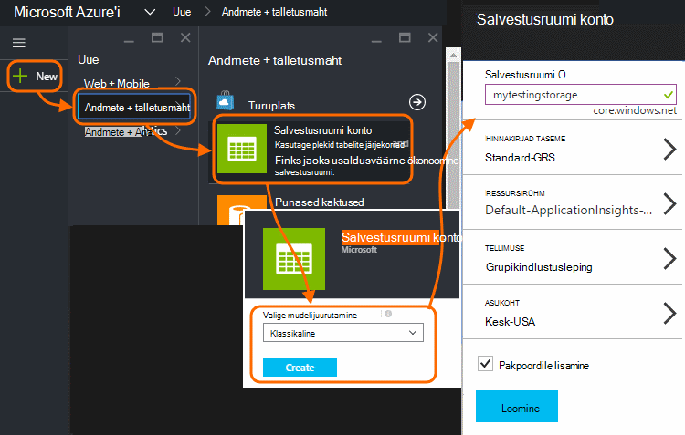

<properties 
    pageTitle="Proovi kood: rakenduse ülevaated eksporditud andmeid sõeluda" 
    description="Koodi oma analüüsi telemeetria rakenduse ülevaated pidev ekspordi funktsiooni abil. SQL-i andmed salvestada." 
    services="application-insights" 
    documentationCenter=""
    authors="mazharmicrosoft" 
    manager="douge"/>

<tags 
    ms.service="application-insights" 
    ms.workload="tbd" 
    ms.tgt_pltfrm="ibiza" 
    ms.devlang="na" 
    ms.topic="article" 
    ms.date="01/05/2016" 
    ms.author="awills"/>
 
# Proovi kood: rakenduse ülevaated eksporditud andmeid sõeluda

Selles artiklis kirjeldatakse JSON andmeid eksporditud rakenduse ülevaated, tehke järgmist. Näiteks meil kuvatakse telemeetria andmete teisaldamiseks [Visual Studio rakenduse] ülevaated, koodi kirjutamine[ start] SQL Azure'i andmebaasi, kasutades [Pidev eksportimine][export]. (Võite saavutada selle [voo Analytics abil](app-insights-code-sample-export-sql-stream-analytics.md), kuid meie eesmärk siin on mõned koodi kuvamiseks). 

Pidev ekspordi liigub oma telemeetria Azure Storage JSON-vormingus nii, et mõned koodi sõeluda JSON objektide ja luua andmebaasi tabelisse ridade kirjutada.

Üldisemalt on pidev eksportida, kuidas seda teha oma rakenduste saata rakenduse ülevaated telemeetria analüüs. Võib kohandada selle koodi valimi eksporditud telemeetria koos muude toimingute tegemiseks.

Alustuseks kirjeldame eeldusel, et teil on juba rakendus, mida soovite jälgida.

## Rakenduse ülevaated SDK lisamine

Jälgida oma rakenduse, saate [lisada ka rakenduse ülevaateid SDK] [ start] rakenduse. On erinevate SDK-d ja helper tööriistad erinevate platvormide, interaktiivset ja keeled. Saate jälgida veebilehtede, Java või ASP.net-i web serveris ja mobiilsideseadmete jaoks mitut liiki. Kõik SDK-d saata telemeetria [Rakenduse ülevaated portaali][portal], kus saate kasutada meie võimsate analüüsiriistade ja diagnostikatööriistu ja andmete eksportimine salvestusruumi.

Alustamiseks:

1. Saada [konto Microsoft Azure](https://azure.microsoft.com/pricing/).
2. [Azure'i portaalis][portal], saate lisada uue ressursi rakenduse ülevaated oma rakenduse:

    

    (Oma rakenduse tüüp ja tellimus võib olla erinevad.)
3. Avage Kiirkäivituse, kuidas häälestada oma rakenduse tüüp SDK leidmiseks.

    

    Kui loendis pole teie rakenduse tüüp, Heitke pilk [Alustamine] [ start] lehe.

4. Selles näites me ei jälgimine web appi, nii saame kasutada Azure tööriistad Visual Studio SDK installimiseks. Me öelda meie rakenduse ülevaated ressursi nimi:

    

## Azure'i salvestusruumi loomine

Rakenduse ülevaated andmed on alati eksportida Azure Storage konto JSON-vormingus. Selle salvestusruumi on, et oma kood ei loe andmed.

1. Teie tellimus [Azure portaali]"classic" salvestusruumi konto loomine[portal].

    

2. Ümbris loomine

    

## Azure'i salvestusruumi pidev ekspordi käivitamine

1. Azure portaali, otsige üles rakenduse jaoks loodud rakenduse ülevaated ressurss.

    

2. Saate luua pidev ekspordi.

    

    Valige varem loodud salvestusruumi konto.

    
    
    Sündmuste tüübid, mida soovite näha seadmiseks tehke järgmist.

    

3. Lubage koguda andmeid. Istuda ja andke rakenduse kasutamiseks aega. Telemeetria tulevad ja te näete, statistilised diagrammid [argumendil](app-insights-metrics-explorer.md) Exploreris ja üksikute sündmuste [diagnostika otsing](app-insights-diagnostic-search.md). 

    Ja ka salvestusruumi ekspordib andmed. 

4. Kontrolli eksporditud andmeid. Visual Studio, valige **vaatamine / Cloud Explorer**, ja avage Azure'i / salvestusruumi. (Kui teil pole menüüvalikuid, on vaja installida Azure SDK: avage dialoogiboks uue projekti ja avage Visual C# / Cloud / saada Microsoft Azure'i SDK .net-i jaoks.)

    

    Kirjutage tee nimi, mis on saadud rakenduse nimi ja seadmeid võti ühisosa. 

Sündmuste Bloobivahemälu JSON-vormingus failide kirjutada. Iga fail võib sisaldada ühe või mitme sündmused. Nii soovime sündmuse andmete lugemine ja filtreerida soovime väljad. On igasuguseid asju, mida me ei andmeid, kuid meie plaan täna on mõned andmete teisaldamine SQL-andmebaasi koodi kirjutamist. Mida teeb lihtsaks käivitamiseks palju huvitav päringuid.

## SQL Azure'i andmebaasi loomine

Selle näite puhul me kirjutada, koodi push andmed andmebaasi.

Taas alates tellimuse [Azure'i]portaalis[portal], andmebaasi loomine (ja uus server, v.a juhul, kui teil on juba üks) mis teil tuleb andmete kirjutamiseks.

Veenduge, et andmebaasi server lubab juurdepääsu Azure.

## Töötaja roll loomine 

Nüüd lõpuks saame sõeluda JSON eksporditud plekid on [mõned koodi](https://sesitai.codeplex.com/) kirjutamine ja andmebaasi kirjete loomine. Kuna ekspordi poe andmebaas on nii Azure, saame käivitate kood Azure töötaja rolli.

Järgmine kood ekstraktib automaatselt, mis tahes atribuudid on selle JSON. Atribuutide kirjeldust vt teemast [andmemudel eksportida](app-insights-export-data-model.md).

#### Töötaja rolli projekti loomine

Visual Studio töötaja rolli uue projekti loomiseks tehke järgmist.

#### Salvestusruumi kontoga ühenduse loomiseks

Azure, ühendusstringi toomine salvestusruumi konto:

Visual Studio töötaja rolli sätete konfigureerimine salvestusruumi konto ühendusstringi:

#### Paketid

Solution Exploreris paremklõpsake töötaja rolli projekti ja valige Halda NuGet-paketid.
Otsige ja installige need paketid. 

 * EntityFramework 6.1.2 või hiljem - kasutame see luua DB tabeli skeemi pealt, JSON, klõpsake soovitud bloobimälu sisu põhjal.
 * JsonFx - kasutamse seda lamedamad JSON ja C# klassi atribuutide.

Selle tööriista abil saate luua C# klassi vähendamine ühe JSON dokumenti. Selle jaoks tuleb teha mõned väikesed muudatused, nt lamedamad JSON massiivi sisse ühe C# atribuudi Lülita ühe veeru DB tabelis (end. urlData_port) 

 * [JSON C# klassi generaator](http://jsonclassgenerator.codeplex.com/)

## Kood 

Saate panna selle koodi `WorkerRole.cs`.

#### Import

    using Microsoft.WindowsAzure.Storage;

    using Microsoft.WindowsAzure.Storage.Blob;

#### Salvestusruumi ühendusstringi toomiseks

    private static string GetConnectionString()
    {
      return Microsoft.WindowsAzure.CloudConfigurationManager.GetSetting("StorageConnectionString");
    }

#### Käivitage töötaja intervalliga

Asendage olemasolevad Käivita meetodit ja valige eelistatud intervalli. Kuna ekspordi funktsioon lõpetab ühe JSON objekti tunnis peaks olema vähemalt üks tund.

    public override void Run()
    {
      Trace.TraceInformation("WorkerRole1 is running");

      while (true)
      {
        Trace.WriteLine("Sleeping", "Information");

        Thread.Sleep(86400000); //86400000=24 hours //1 hour=3600000
                
        Trace.WriteLine("Awake", "Information");

        ImportBlobtoDB();
      }
    }

#### Kui tabeli rida iga JSON objekti lisamine

    public void ImportBlobtoDB()
    {
      try
      {
        CloudStorageAccount account = CloudStorageAccount.Parse(GetConnectionString());

        var blobClient = account.CreateCloudBlobClient();
        var container = blobClient.GetContainerReference(FilterContainer);

        foreach (CloudBlobDirectory directory in container.ListBlobs())//Parent directory
        {
          foreach (CloudBlobDirectory subDirectory in directory.ListBlobs())//PageViewPerformance
          {
            foreach (CloudBlobDirectory dir in subDirectory.ListBlobs())//2015-01-31
            {
              foreach (CloudBlobDirectory subdir in dir.ListBlobs())//22
              {
                foreach (IListBlobItem item in subdir.ListBlobs())//3IAwm6u3-0.blob
                {
                  itemname = item.Uri.ToString();
                  ParseEachBlob(container, item);
                  AuditBlob(container, directory, subDirectory, dir, subdir, item);
                } //item loop
              } //subdir loop
            } //dir loop
          } //subDirectory loop
        } //directory loop
      }
      catch (Exception ex)
      {
        //handle exception
      }
    }

#### Sõeluda iga bloobimälu

    private void ParseEachBlob(CloudBlobContainer container, IListBlobItem item)
    {
      try
      {
        var blob = container.GetBlockBlobReference(item.Parent.Prefix + item.Uri.Segments.Last());
    
        string json;
    
        using (var memoryStream = new MemoryStream())
        {
          blob.DownloadToStream(memoryStream);
          json = System.Text.Encoding.UTF8.GetString(memoryStream.ToArray());
    
          IEnumerable<string> entities = json.Split('\n').Where(s => !string.IsNullOrWhiteSpace(s));
    
          recCount = entities.Count();
          failureCount = 0; //resetting failure count
    
          foreach (var entity in entities)
          {
            var reader = new JsonFx.Json.JsonReader();
            dynamic output = reader.Read(entity);
    
            Dictionary<string, object> dict = new Dictionary<string, object>();
    
            GenerateDictionary((System.Dynamic.ExpandoObject)output, dict, "");
    
            switch (FilterType)
            {
              case "PageViewPerformance":
    
              if (dict.ContainsKey("clientPerformance"))
                {
                  GenerateDictionary(((System.Dynamic.ExpandoObject[])dict["clientPerformance"])[0], dict, "");
                }
    
              if (dict.ContainsKey("context_custom_dimensions"))
              {
                if (dict["context_custom_dimensions"].GetType() == typeof(System.Dynamic.ExpandoObject[]))
                {
                  GenerateDictionary(((System.Dynamic.ExpandoObject[])dict["context_custom_dimensions"])[0], dict, "");
                }
              }
    
            PageViewPerformance objPageViewPerformance = (PageViewPerformance)GetObject(dict);
    
            try
            {
              using (var db = new TelemetryContext())
              {
                db.PageViewPerformanceContext.Add(objPageViewPerformance);
                db.SaveChanges();
              }
            }
            catch (Exception ex)
            {
              failureCount++;
            }
            break;
    
            default:
            break;
          }
        }
      }
    }
    catch (Exception ex)
    {
      //handle exception 
    }
    }

#### Iga dokumendi JSON sõnastiku ettevalmistamine

    private void GenerateDictionary(System.Dynamic.ExpandoObject output, Dictionary<string, object> dict, string parent)
        {
            try
            {
                foreach (var v in output)
                {
                    string key = parent + v.Key;
                    object o = v.Value;

                    if (o.GetType() == typeof(System.Dynamic.ExpandoObject))
                    {
                        GenerateDictionary((System.Dynamic.ExpandoObject)o, dict, key + "_");
                    }
                    else
                    {
                        if (!dict.ContainsKey(key))
                        {
                            dict.Add(key, o);
                        }
                    }
                }
            }
            catch (Exception ex)
            {
            //handle exception 
            }
        }

#### Oma hääle JSON dokumendis üheks C# klassi telemeetria objekti atribuudid

     public object GetObject(IDictionary<string, object> d)
        {
            PropertyInfo[] props = null;
            object res = null;

            try
            {
                switch (FilterType)
                {
                    case "PageViewPerformance":

                        props = typeof(PageViewPerformance).GetProperties();
                        res = Activator.CreateInstance<PageViewPerformance>();
                        break;

                    default:
                        break;
                }

                for (int i = 0; i < props.Length; i++)
                {
                    if (props[i].CanWrite && d.ContainsKey(props[i].Name))
                    {
                        props[i].SetValue(res, d[props[i].Name], null);
                    }
                }
            }
            catch (Exception ex)
            {
            //handle exception 
            }

            return res;
        }

#### JSON dokument välja loodud PageViewPerformance klassifail

    public class PageViewPerformance
    {
        [DatabaseGenerated(DatabaseGeneratedOption.Identity)]
        public Guid Id { get; set; }

        public string url { get; set; }

        public int urlData_port { get; set; }

        public string urlData_protocol { get; set; }

        public string urlData_host { get; set; }

        public string urlData_base { get; set; }

        public string urlData_hashTag { get; set; }

        public double total_value { get; set; }

        public double networkConnection_value { get; set; }

        public double sendRequest_value { get; set; }

        public double receiveRequest_value { get; set; }

        public double clientProcess_value { get; set; }

        public string name { get; set; }

        public string internal_data_id { get; set; }

        public string internal_data_documentVersion { get; set; }

        public DateTime? context_data_eventTime { get; set; }

        public string context_device_id { get; set; }

        public string context_device_type { get; set; }

        public string context_device_os { get; set; }

        public string context_device_osVersion { get; set; }

        public string context_device_locale { get; set; }

        public string context_device_userAgent { get; set; }

        public string context_device_browser { get; set; }

        public string context_device_browserVersion { get; set; }

        public string context_device_screenResolution_value { get; set; }

        public string context_user_anonId { get; set; }

        public string context_user_anonAcquisitionDate { get; set; }

        public string context_user_authAcquisitionDate { get; set; }

        public string context_user_accountAcquisitionDate { get; set; }

        public string context_session_id { get; set; }

        public bool context_session_isFirst { get; set; }

        public string context_operation_id { get; set; }

        public double context_location_point_lat { get; set; }

        public double context_location_point_lon { get; set; }

        public string context_location_clientip { get; set; }

        public string context_location_continent { get; set; }

        public string context_location_country { get; set; }

        public string context_location_province { get; set; }

        public string context_location_city { get; set; }
    }

#### SQL-i suhtluse, üksuse raames DBcontext

    public class TelemetryContext : DbContext
    {
        public DbSet<PageViewPerformance> PageViewPerformanceContext { get; set; }
        public TelemetryContext()
            : base("name=TelemetryContext")
        {
        }
    }

Lisage DB ühendusstringi nimega `TelemetryContext` sisse `app.config`.

## Skeemifailid (ainult teave)

See on tabel, mis loob kuvamise skeem.

> [AZURE.NOTE] Teil pole selle skripti käivitamiseks. Klõpsake soovitud JSON atribuute määratleda tabelis veerud.

    CREATE TABLE [dbo].[PageViewPerformances](
    [Id] [uniqueidentifier] NOT NULL,
    [url] [nvarchar](max) NULL,
    [urlData_port] [int] NOT NULL,
    [urlData_protocol] [nvarchar](max) NULL,
    [urlData_host] [nvarchar](max) NULL,
    [urlData_base] [nvarchar](max) NULL,
    [urlData_hashTag] [nvarchar](max) NULL,
    [total_value] [float] NOT NULL,
    [networkConnection_value] [float] NOT NULL,
    [sendRequest_value] [float] NOT NULL,
    [receiveRequest_value] [float] NOT NULL,
    [clientProcess_value] [float] NOT NULL,
    [name] [nvarchar](max) NULL,
    [User] [nvarchar](max) NULL,
    [internal_data_id] [nvarchar](max) NULL,
    [internal_data_documentVersion] [nvarchar](max) NULL,
    [context_data_eventTime] [datetime] NULL,
    [context_device_id] [nvarchar](max) NULL,
    [context_device_type] [nvarchar](max) NULL,
    [context_device_os] [nvarchar](max) NULL,
    [context_device_osVersion] [nvarchar](max) NULL,
    [context_device_locale] [nvarchar](max) NULL,
    [context_device_userAgent] [nvarchar](max) NULL,
    [context_device_browser] [nvarchar](max) NULL,
    [context_device_browserVersion] [nvarchar](max) NULL,
    [context_device_screenResolution_value] [nvarchar](max) NULL,
    [context_user_anonId] [nvarchar](max) NULL,
    [context_user_anonAcquisitionDate] [nvarchar](max) NULL,
    [context_user_authAcquisitionDate] [nvarchar](max) NULL,
    [context_user_accountAcquisitionDate] [nvarchar](max) NULL,
    [context_session_id] [nvarchar](max) NULL,
    [context_session_isFirst] [bit] NOT NULL,
    [context_operation_id] [nvarchar](max) NULL,
    [context_location_point_lat] [float] NOT NULL,
    [context_location_point_lon] [float] NOT NULL,
    [context_location_clientip] [nvarchar](max) NULL,
    [context_location_continent] [nvarchar](max) NULL,
    [context_location_country] [nvarchar](max) NULL,
    [context_location_province] [nvarchar](max) NULL,
    [context_location_city] [nvarchar](max) NULL,
    CONSTRAINT [PK_dbo.PageViewPerformances] PRIMARY KEY CLUSTERED 
    (
     [Id] ASC
    )WITH (PAD_INDEX = OFF, STATISTICS_NORECOMPUTE = OFF, IGNORE_DUP_KEY = OFF, ALLOW_ROW_LOCKS = ON, ALLOW_PAGE_LOCKS = ON) ON [PRIMARY]
    ) ON [PRIMARY] TEXTIMAGE_ON [PRIMARY]

    GO

    ALTER TABLE [dbo].[PageViewPerformances] ADD  DEFAULT (newsequentialid()) FOR [Id]
    GO

Näha näiteks toimingus, [allalaadimine](https://sesitai.codeplex.com/) täieliku töötamise kood, muutke soovitud `app.config` sätted ja Azure töötaja rolli avaldada.

## Seotud artiklid

* [SQL-i abil töötaja roll eksportimine](app-insights-code-sample-export-telemetry-sql-database.md)
* [Pidev ekspordi rakenduse ülevaated](app-insights-export-telemetry.md)
* [Rakenduse ülevaated](https://azure.microsoft.com/services/application-insights/)
* [Mudeli andmete eksportimine](app-insights-export-data-model.md)
* [Lisateavet näidiseid ja juhendavad tutvustused](app-insights-code-samples.md)

<!--Link references-->

[diagnostic]: app-insights-diagnostic-search.md
[export]: app-insights-export-telemetry.md
[metrics]: app-insights-metrics-explorer.md
[portal]: http://portal.azure.com/
[start]: app-insights-overview.md

 
