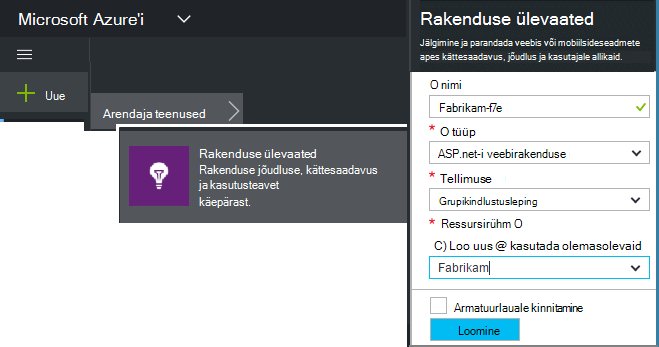
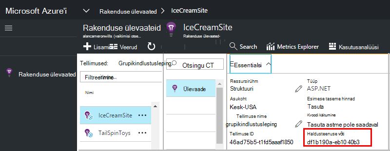

<properties 
    pageTitle="Saate luua uue rakenduse ülevaated ressursi | Microsoft Azure'i" 
    description="Saate häälestada rakenduse ülevaated jälgimine reaalajas uus rakendus. Veebipõhise moodust." 
    services="application-insights" 
    documentationCenter=""
    authors="alancameronwills" 
    manager="douge"/>

<tags 
    ms.service="application-insights" 
    ms.workload="tbd" 
    ms.tgt_pltfrm="ibiza" 
    ms.devlang="na" 
    ms.topic="article" 
    ms.date="08/26/2016" 
    ms.author="awills"/>

# Looge on rakenduse ülevaated ressurss

Visual Studio rakenduse ülevaated kuvatakse andmeid rakenduse Microsoft Azure'i *Ressursi*. Luua uue ressursi on seega [häälestamise rakenduse ülevaated jälgida uue rakenduse]osa[start]. Paljudel juhtudel seda saab teha automaatselt IDE ja mis on toodud soovitatav viis, kus on saadaval. Kuid mõnel juhul loote ressursi käsitsi.

Pärast seda, kui olete loonud ressurss, saate selle instrumentation võtit ja SDK rakenduse konfigureerimiseks kasutada. See saadab telemeetria ressurss.

## Microsoft Azure registreerumine

Kui teil pole [Microsofti konto, kuvatakse üks kohe](http://live.com). (Kui kasutate teenuseid, nagu Outlook.com, OneDrive, Windows Phone või XBox Live, teil juba on Microsofti kontoga.)

Peate [Microsoft Azure'i](http://azure.com)tellimust. Kui teie meeskond või ettevõte on Azure tellimuse omanik saate lisada, kasutades oma Windows Live ID-ga.

Samuti võite luua uus tellimus. Tasuta konto saate proovida kõike Azure. Pärast prooviperioodi lõppemist, võib juhtuda pensionitingimustega tellimuse korral, kui teile ei esitata tasuta teenuste. 

Kui olete saanud juurdepääsu tellimus, login [http://portal.azure.com](https://portal.azure.com), et rakenduse ülevaated ja kasutada Live ID login.

## Looge on rakenduse ülevaated ressurss
  

Lisage [portal.azure.com](https://portal.azure.com)on rakenduse ülevaated ressurss:

* **Rakenduse tüüp** mõjutab ülevaade tera ja [argumendil]Exploreris saadaval atribuudid kuvatakse[metrics]. Kui te ei näe oma tüüpi rakendus, valige ASP.net-i.
* **Ressursirühm** on mugavam atribuutide haldamiseks, nt juurdepääsu reguleerimine. Kui olete juba loonud muud Azure ressursid, saate panna selle uue ressursi sama rühma.
* **Tellimus** on teie makse konto Azure.
* On **koht** , kus teie andmeid säilitatakse. Praegu ei saa muuta.
* **Lisa startboard** paneb kiire-juurdepääsu oma ressursi paani Azure'i avalehel. Soovitatav.

Rakenduse loomisel avab uue tera. See on, kus kuvatakse jõudlus ja kasutusandmete rakenduse kohta. 

Saada selle tagasi järgmine kord sisselogimist Azure, otsige teie rakendus kiirosade alustada paani start tahvlile (avakuva). Või klõpsake selle otsimiseks nuppu Sirvi.

## Kopeerige instrumentation võti

Haldusteenuse võti tuvastab teie loodud ressursi. Peate selle SDK anda.

## SDK rakenduse installimine

Installige rakendus ülevaateid SDK rakenduse. Selles etapis tuleb sõltub teie rakenduse tüüp. 

Haldusteenuse klahvi abil saate konfigureerida [Tarkvaraarenduskomplektist, mis installitakse teie taotlus][start].

SDK sisaldab standard moodulid, mis saadavad telemeetria ilma koodi kirjutamiseks. Kasutaja toimingute jälgimiseks või probleemide [kasutada API] täpsemalt[ api] saata oma telemeetria.

## Vt telemeetria andmed

Sulgege Lühijuhend tera oma rakenduse blade Azure portaali naasmiseks.

Klõpsake otsingu paani kuvamiseks [Diagnostika otsing][diagnostic], kus kuvatakse esimese sündmused. 

Kui te ootate rohkem andmeid, klõpsake nuppu Värskenda mõne sekundi pärast.

## Ressursi automaatne loomine

Saate luua automaatselt ressursi [PowerShelli skripti](app-insights-powershell-script-create-resource.md) kirjutada.

## Järgmised sammud

* [Armatuurlaua loomine](app-insights-dashboards.md)
* [Diagnostika otsing](app-insights-diagnostic-search.md)
* [Mõõdikute uurimine](app-insights-metrics-explorer.md)
* [Päringute Kasutusanalüüsi kirjutamine](app-insights-analytics.md)

<!--Link references-->

[api]: app-insights-api-custom-events-metrics.md
[diagnostic]: app-insights-diagnostic-search.md
[metrics]: app-insights-metrics-explorer.md
[start]: app-insights-overview.md

 