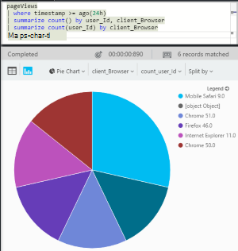

<properties
    pageTitle="Armatuurlaudade ja navigeerimise rakenduse ülevaated portaalis | Microsoft Azure'i"
    description="Võtme APM diagrammide ja päringud vaadete loomine."
    services="application-insights"
    documentationCenter=""
    authors="alancameronwills"
    manager="douge"/>

<tags
    ms.service="application-insights"
    ms.workload="tbd"
    ms.tgt_pltfrm="ibiza"
    ms.devlang="multiple"
    ms.topic="article" 
    ms.date="10/18/2016"
    ms.author="awills"/>

# Navigeerimis- ja armatuurlaudade rakenduse ülevaated portaalis

Olete [häälestamine rakenduse ülevaated projekt edeneb](app-insights-overview.md), kuvatakse projekti rakenduse ülevaated ressursi [Azure portaali](https://portal.azure.com)telemeetria andmeid oma rakenduse jõudlus ja kasutuse kohta.

## Otsige üles oma telemeetria

[Azure'i portaali](https://portal.azure.com) sisse logida ja liikuge oma rakenduse loodud rakenduse ülevaated ressurss.

Ülevaade tera (lehelt) oma rakenduse kuvatakse võtme diagnostika mõõdikute rakenduse kokkuvõte ja muude funktsioonide portaali lüüsi on.

Saate kohandada mõnda muud diagrammid ja armatuurlaua avakuvale. Nii saate tuua koos võtme diagrammide erinevate rakenduste kaudu.

## Armatuurlauad

Näete, kui olete sisse loginud, [Microsoft Azure'i portaalis](https://portal.azure.com) esmalt on armatuurlaua. Siin saate tuua koos diagrammid, mis on kõige olulisem teile üle kõik oma Azure ressursse, sh telemeetria [Visual Studio rakenduse](app-insights-overview.md)ülevaated.
 

1. **Navigeeri teatud ressursse** rakenduse rakenduse ülevaated näiteks: vasakpoolses kasutada.
2. **Tagasi praeguse armatuurlaua**või teiste tehtud vaadete vahetamine: kasutada vasakus ülaservas olevat rippmenüüd.
3. **Armatuurlaudade vahetamine**: armatuurlaua pealkirja rippmenüüst menüü kasutamine
4. **Loomine, redigeerimine ja ja ühiskasutusse andmine armatuurlaudade** armatuurlaua tööriistaribal.
5. **Armatuurlaua redigeerimine**: kursorit paani ja seejärel kasutage oma ülaribal teisaldamine, kohandamine või selle eemaldada.

## Lisamine armatuurlauale

Kui vaatate tera või kogum, diagrammid, mis on eriti huvitav, saate selle koopia armatuurlaud kinnitada. Näete seda järgmine kord, kui pöördute sinna.

1. PIN-koodi diagrammi armatuurlaud. Diagrammi koopia kuvatakse armatuurlaual.
2. Kogu tera armatuurlaud kinnitamine – kuvatakse see armatuurlaual paan, mida saate klõpsata kaudu.
3. Klõpsake vasakus ülanurgas tagasi praeguse armatuurlaud. Seejärel saate rippmenüüst menüü Praegune vaade tagastamiseks.

Pange tähele, et diagrammide rühmitatakse paanid: paan võib sisaldada rohkem kui ühe diagrammi. Saate kinnitada kogu paani armatuurlaud.

### Mis tahes päringu Kasutusanalüüsi kinnitamine

Samuti saate [PIN-koodi Analytics](app-insights-analytics-using.md#pin-to-dashboard) diagrammide [ühiskasutusega](#share-dashboards-with-your-team) armatuurlauale. Võimaldab lisada diagramme, mis tahes suvalise päringu standard mõõdikute kõrval. (Pole see funktsioon tasu.)

## Paani armatuurlaual reguleerimine

Kui paan on armatuurlaual, saate reguleerida.

1. Diagrammi lisamine paani. 
2. Määrake meetermõõdustik, rühma poolt mõõde ja diagrammi laad (tabel, graafik).
3. Lohistage üle diagrammi suurendamiseks; Klõpsake nuppu Võta tagasi lähtestamine kuuline ajavahemik; Määrake filtri atribuudid diagrammid paani.
4. Määrake paani tiitel.

Kaudu argumendil Exploreri labad kinnitatud paanid on kaudu mõne ülevaade blade kinnitatud paanid redigeerimise rohkem valikuid.

Algne paani kinnitatud ei mõjuta teie muudatused.

## Armatuurlaudade vaheldumisi aktiveerimine

Saate salvestada rohkem kui üks armatuurlaua ja nende vahel liikumine. Kui kinnitate tera või diagrammi, on need lisatakse praeguse armatuurlaud.

Näiteks võib teil ühe armatuurlaua meeskonnatöö ruumi, ja teine arengu täisekraanil kuvamiseks.

Armatuurlaual tera kuvatakse paan: klõpsake seda tera avamiseks. Diagrammi tiražeerib diagrammi selle algsesse asukohta.

## Ühiskasutusse andmine armatuurlaudade

Kui olete loonud armatuurlaua, saate seda teistega jagada.

Teavet [rollid ja juurdepääsu reguleerimine](app-insights-resources-roles-access-control.md).

## Rakenduse navigeerimine

Ülevaade tera on lüüsi rakenduse kohta lisateabe saamiseks.

* **Diagrammi- või paani** – klõpsake mis tahes paani või kuvamiseks rohkem üksikasju, mis kuvatakse diagramm.

### Ülevaade blade nupud

* [**Mõõdikute Explorer**](app-insights-metrics-explorer.md) - jõudlus ja kasutus Diagrammide loomine.
* [**Otsingu**](app-insights-diagnostic-search.md) - uurida teatud eksemplarid sündmusi, näiteks taotlusi erandid või logige jälgi.
* [**Analüüsi**](app-insights-analytics.md) - võimsaid päringute oma telemeetria üle.
* **Ajavahemiku** - reguleerimine vahemik, mis on kuvatud kõik diagrammid, enne.
* **Kustutamine** – Kustuta see rakendus rakenduse ülevaated ressurss. Teil peaks ka rakenduse ülevaated pakettide eemaldamine oma rakenduse koodi või redigeerimine [instrumentation klahvi](app-insights-create-new-resource.md#copy-the-instrumentation-key) rakenduse suunamiseks telemeetria rakenduse ülevaated muu ressursiga.

### Essentialsi menüü

* [Haldusteenuse klahv](app-insights-create-new-resource.md#copy-the-instrumentation-key) - tuvastab rakenduse ressurss. 
* Hinnad - muuta funktsioonid saadaval ja määramine maht suurtähelukk.

### Rakenduse navigeerimisriba

* **Ülevaade** - tagasi tera app ülevaade.
* **Tegevuste Logi** - teatiste ja Azure haldus sündmused.
* [**Juurdepääsu reguleerimine**](app-insights-resources-roles-access-control.md) - meeskonna liikmed ja teised juurdepääsu anda.
* [**Siltide**](../resource-group-using-tags.md) - Kasuta silte, et rühmitada rakenduse teistega.

UURIMINE

* [**Rakenduse MAPI**](app-insights-app-map.md) - aktiivse kaardi komponentide rakenduse, kus on kuvatud saadud sõltuvus teave.
* [**Aktiivne diagnostika**](app-insights-proactive-diagnostics.md) - keskmiseks hiljutiste jõudluse teatised.
* [**Live voo**](app-insights-metrics-explorer.md#live-stream) - fikseeritud kogumi lähedal kiirsõnumivestluses mõõdikute, kasulik, kui uus ehitada juurutamine või silumine.
* [**Kättesaadavus / Web testide**](app-insights-monitor-web-app-availability.md) -tavaline päringuid saata oma veebirakenduse kaudu soovitud world.* ümber 
* [**Tõrkeid, esitus**](app-insights-web-monitor-performance.md) - erandid, tõrge hindade ja vastuse korda rakenduse taotluste ja taotluste rakenduste [sõltuvused](app-insights-asp-net-dependencies.md).
* [**Jõudluse**](app-insights-web-monitor-performance.md) - aega, sõltuvus vastuse korda. 
* [Serverid](app-insights-web-monitor-performance.md) - jõudluse hinnale. Saadaval juhul, kui [installida oleku jälgimine](app-insights-monitor-performance-live-website-now.md).

* **Brauseri** - leheküljevaade ja AJAXI jõudlus. Saadaval, kui teie [dokumendi veebilehtede](app-insights-javascript.md).
* **Kasutus** - lehe vaate ning kasutaja seansi loendab. Saadaval, kui teie [dokumendi veebilehtede](app-insights-javascript.md).

KONFIGUREERIMINE

* **Alustamine** – Tekstisisese õpetuse.
* **Atribuutide** - instrumentation võti, tellimuse ja ressursi ID-d.
* [Teatiste](app-insights-alerts.md) - argumendil teatiste konfigureerimine.
* [Pidev ekspordi](app-insights-export-telemetry.md) - konfigureerimine telemeetria Azure mäluruumi ekspordiks.
* [Jõudluse testimine](app-insights-monitor-web-app-availability.md#performance-tests) - häälestada sünteetiliste laadi veebisaidil.
* [Kvoodi ja hinnad](app-insights-pricing.md) ja [manustamisest valimite](app-insights-sampling.md).
* **Juurdepääs API** - loomine [vabastage marginaalid](app-insights-annotations.md) ja andmete Accessi API.
* [**Üksuste töö**](app-insights-diagnostic-search.md#create-work-item) - ühenduse töö jälgimine süsteemi nii, et saate luua vead telemeetria kontrollimise ajal.

SÄTTED

* [**Lukud**](..\resource-group-lock-resources.md) - lukustada Azure ressursid
* [**Automaatika script**](app-insights-powershell.md) - eksportida Azure ressursi määratlus nii, et saate seda kasutada mallina luua uusi ressursse.

TUGI

* **Tugiteenuse taotluse** - nõuab tasuliseks tellimuseks. Vt ka [abi saamine](app-insights-get-dev-support.md).

## Mis saab edasi?

||
|---|---
|[Mõõdikute explorer](app-insights-metrics-explorer.md) Filtri ja lõigu mõõdikud|
|[Diagnostika otsing](app-insights-diagnostic-search.md) Otsida ja kontrollida sündmuste seotud sündmused, ning luua vead |
|[Kasutusanalüüsi](app-insights-analytics.md) Võimas päringukeel| 

