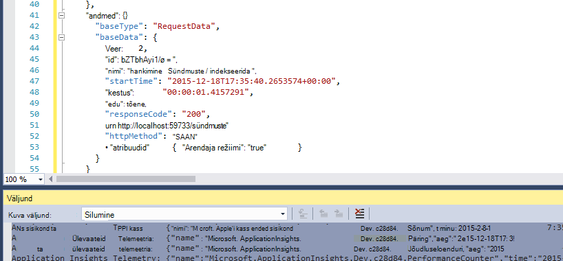
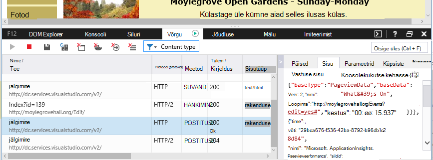

<properties 
    pageTitle="Andmete säilitamise ja talletusruumi rakenduse ülevaated" 
    description="Säilitus- ja privaatsuse poliitika lause" 
    services="application-insights" 
    documentationCenter=""
    authors="alancameronwills" 
    manager="douge"/>

<tags 
    ms.service="application-insights" 
    ms.workload="tbd" 
    ms.tgt_pltfrm="ibiza" 
    ms.devlang="na" 
    ms.topic="article" 
    ms.date="05/17/2016" 
    ms.author="awills"/>

# Säilitus- ja talletusruumi rakenduse ülevaated andmete kogumine 

*Rakenduse ülevaated on eelvaade.*

Kui installite [Visual Studio rakenduse ülevaated] [ start] SDK rakenduse, saadetakse telemeetria oma rakenduse kohta pilveteenusesse. Loomulikult vastutav arendajate soovite teada täpselt saadetavate andmete, mis juhtub andmed ja kuidas saan üle. Eelkõige saanud tundliku loomuga andmeid saata, kus on salvestatud, ja kuidas turvaline on? 

Esmalt lühike vastus.

* Standardse telemeetria moodulid, mis otsa "väljale" tõenäoliselt teenuse tundliku loomuga andmeid saata. Telemeetria on seotud laadi, jõudlus ja kasutus mõõdikute, erandi aruandeid ja muud Diagnostikaandmete. Kasutajate andmed näha diagnostika aruanded on URL-id; kuid rakenduse igal juhul ei tohiks tundliku loomuga andmed panema lihttekstina URL-is.
* Saate kirjutada koodi, mis saadab täiendavad kohandatud telemeetria teid aidata diagnostika- ja jälgimisega seotud kasutamine. (See laiendatavus on suurepärane funktsioon rakenduse ülevaated.) Oleks võimalik, kogemata, kirjutada selle koodi nii, et see sisaldaks isikliku ja tundliku loomuga andmeid. Kui teie rakendus töötab selliseid andmeid, peaks keeruka läbivaatus protsesside rakendamine kõik kirjutamise kood.
* Arendamise ja rakenduse testimise ajal on lihtne kontrolli, mis saadetakse SDK. Andmed kuvatakse silumine väljundi Windowsi IDE ja brauseris. 
* Andmete toimub [Microsoft Azure'i](http://azure.com) serverid USA-s. (Kuid rakenduse saab käivitada igal pool). Azure'i on [keerukas turvalisus töötleb ja vastab laia vastavusstandardeid](https://azure.microsoft.com/support/trust-center/). Ainult teie ja teie määratud meeskond on juurdepääs teie andmetele. Microsofti töötajate saate on piiratud juurdepääs sellele ainult teatud piiratud juhtudel oma teadmisi. See on krüptitud teel, kuigi pole rakenduses serverid.

Selles artiklis ülejäänud toetuvad paremini nende vastused. See on loodud olema kompaktsed, nii, et saate kuvada selle kolleegidega, kes pole teie kohe meeskonnas.

## Mis on rakenduse ülevaated?

[Visual Studio rakenduse ülevaated] [ start] on teenus, mida Microsoft, mis aitab teil parandada ja kasutatavuse reaalajas rakenduse. See jälgib kogu aeg see töötab nii testimise käigus ka pärast seda, kui olete avaldatud või juurutada selle rakenduse. Rakenduse ülevaated loob diagrammid ja tabelid, mis näitab teile, näiteks, millal päeva saate enamik kasutajaid, kuidas reageeri rakendus töötab, ja kuidas see kätte välisteenused, et see sõltub. Kui jookseb, tõrkeid või jõudlusega seotud probleemide, saate otsida telemeetria andmed diagnoosida põhjustada üksikasjalikult läbi. Ja teenuse saadab teile e-kirju, kui on muudatused kättesaadavuse ja jõudluse rakenduse.

See funktsioon saamiseks installimist ka rakenduse ülevaateid SDK rakenduse, kes saab selle koodi osa. Kui teie rakendus töötab, SDK jälgib oma tegevuse ja saadab telemeetria rakenduse ülevaated teenuse. See on majutatud [Microsoft Azure'i](http://azure.com)pilveteenus. (Kuid rakenduse ülevaated toimib kõik rakendused, mitte ainult need, mis on majutatud Azure).

Rakenduse ülevaated teenuse talletab ja analüüsib telemeetria. Analüüsi või otsingu kaudu salvestatud telemeetria vaatamiseks Azure'i kontosse sisse logida ja avage rakenduse ülevaated ressursi rakenduse. Te saate ka jagada juurdepääsu andmetele teiste liikmetega teie meeskond või määratud Azure tellijad.

Teil võib olla andmed eksportida rakenduse ülevaated teenuse, näiteks andmebaasi või välise tööriistad. Iga tööriista pakkuda spetsiaalne parool, mille saate hankida teenuse. Vajadusel saate tühistada võti. 

Rakenduse ülevaateid SDK-d on saadaval mitmesuguseid rakenduse tüüpi: web services majutada oma J2EE või ASP.net-i serveris või Azure; Web kliendid - st koodi käitamise veebilehele; töölaua ja rakenduste ja teenuste; nagu Windows Phone, iOS-i ja Androidi seadmes rakendused. Need kõik telemeetria saata sama teenuse.

## Milliseid andmeid see koguda?

### Mille poolest erineb andmed kogutakse?

On kolme andmeallikad.

* Tarkvaraarenduskomplektist, mis teil integreerida rakenduse [arengu](app-insights-asp-net.md) või [käitusajal](app-insights-monitor-performance-live-website-now.md). On erinevates tüüpi erinevate SDK-d. Olemas on ka ka [veebilehtedel Tarkvaraarenduskomplektist](app-insights-javascript.md), mis laaditakse-lõppkasutaja brauseris lehe koos.

 * Iga SDK on [moodulid](app-insights-configuration-with-applicationinsights-config.md), mis eri tüüpi telemeetria kogumiseks arv.
 * Kui installite SDK arendatakse, saate saata oma telemeetria standard moodulid oma API. Selle kohandatud telemeetria saate kaasata kõik andmed, mida soovite saata.
* Mõned web serverid, on ka agentide, mille kõrval rakenduse käivitamine ja saatke telemeetria CPU, mälu ja võrgu hõivatuse kohta. Näiteks Azure VMs, keskmise suurusega majutajate ja [J2EE serverites](app-insights-java-agent.md) võib olla selliste osalejate.
* [Kättesaadavus](app-insights-monitor-web-app-availability.md) on protsesside käivitamine Microsoft päringuid saata oma veebirakenduse intervalliga. Rakenduse ülevaated teenuse saadetakse tulemused.

### Milliseid andmeid kogutakse?

Peamised kategooriad on:

* [Web server telemeetria](app-insights-asp-net.md) - HTTP päringuid.  URI, kuluv taotlus, vastuse koodi, kliendi IP-aadress. Seansi ID-d.
* [Veebilehtede](app-insights-javascript.md) - lehe, kasutaja ja seansi loendab. Laadimise ajal. Erandid. Ajaxi kõned.
* Jõudluse hinnale - mälu, CPU, IO, võrgu inimesele.
* Kliendi ja serveri kontekst – OS lokaadi, seadme tüüp, brauseri, eraldusvõimega ekraan.
* [Erandid](app-insights-asp-net-exceptions.md) ja jookseb - **virnas puistab**, koostada id, CPU tüüp. 
* [Sõltuvused](app-insights-asp-net-dependencies.md) – kõned välisteenused AJAXI ülejäänud, SQL-i, nt. Tekstistringi URI või ühendus, kestus, edu, käsk.
* [Kättesaadavus kontrollib](app-insights-monitor-web-app-availability.md) - testi ja juhiseid, vastused kestus.
* [Logide jälgida](app-insights-search-diagnostic-logs.md) ja [kohandatud telemeetria](app-insights-api-custom-events-metrics.md) - **midagi, mida te oma logid või telemeetria kood**.

[Rohkem üksikasju](#data-sent-by-application-insights).

## Kuidas kontrollida, mis on kogutud?

Kui arendate rakenduse Visual Studios, käivitage rakendus silumine režiimis (F5). Telemeetria kuvatakse väljundi aknas. Sealt saate kopeerida ja vormingusuvand JSON lihtne kontrollimiseks. 

Diagnostika aknas on ka loetavamaks vaade.

Veebilehtede, avage oma brauseri silumine aken.

### Saate kirjutada koodi filtreerimiseks telemeetria enne saatmist?

See oleks võimalik, kirjutades [telemeetria protsessor lisandmoodul](app-insights-api-filtering-sampling.md).

## Kui kaua andmeid hoitakse? 

Toorandmetega points (st üksused, mida saab kontrollida diagnostika otsingus) hoitakse 7 päevaks. Kui teil on vaja pikem kui andmeid hoida, saate salvestusruumi konto kopeerimiseks [pidev ekspordi](app-insights-export-telemetry.md) .

Kokkuvõtlike andmete (loendab, keskmiste ja muid statistilisi andmeid, mida näete meetermõõdustik Exploreris) säilivad veebisaidil tera 1 minuti jooksul 30 päeva, ja 1 tund või 1 päeva (olenevalt tüübist) vähemalt 90 päeva.

## Kes pääseb andmeid?

Andmed on teile nähtav ja, kui teil on ettevõtte konto teie meeskonna liikmed. 

See saab eksportida nii teie kui teie meeskonna liikmed ja saanud kopeerida muudesse asukohtadesse ja teistele inimestele edasi.

#### Mida teha Microsofti rakendus saadab rakenduse ülevaated teabega

Microsoft kasutab andmeid ainult teile selle teenuse pakkumiseks.

## Kui andmeid hoitakse? 

* USA-s. 

#### Saate seda talletada kuskil mujal, näiteks Euroopa? 

* Praegu ei. 

#### Kas see tähendab, et rakendus peab olema majutatud USA-s?

* Ei. Rakenduse saab käitada, mis tahes oma kohapealse hosts või pilveteenuses.

## Kui turvaline on minu andmed?  

Rakenduse ülevaated on Azure'i teenus eelvaates. Kuigi me töötame kaitsmise kohta kirjeldatud [Azure'i turvalisus, privaatsus ja vastavus lühiülevaade](http://go.microsoft.com/fwlink/?linkid=392408)põhimõtted andmete eelvaade.

Andmed on salvestatud Microsoft Azure serverites. Azure'i portaalis kontode puhul konto piiranguid on kirjeldatud [Azure'i turvalisus, privaatsus ja vastavus dokumendi](http://go.microsoft.com/fwlink/?linkid=392408). Visual Studio meeskonnatöö teenuste portaalis kontode puhul kehtib [Visual Studio meeskonnatöö teenuste andmekaitse](http://download.microsoft.com/download/8/E/E/8EE6A61C-44C2-4F81-B870-A267F1DF978C/MicrosoftVisualStudioOnlineDataProtection.pdf) dokument. 

Microsofti töötajad teie andmetele juurdepääs on piiratud. Me juurde oma õigustega andmete ja kui on vaja oma rakenduse ülevaated kasutada. 

Andmete kokkuvõtte üle meie klientide rakenduste (nt andmete määra ja keskmise suurusega jälgi) kasutatakse rakenduse ülevaated parandamiseks.

#### Kellegi teise telemeetria võivad takistada minu rakenduse ülevaated andmeid?

Nad võivad saata täiendavad telemeetria kontole instrumentation võti, mida võib leida veebilehtede koodi abil. Piisavalt täiendavate andmetega oma mõõdikute oleks õigesti Tähista oma rakenduse jõudlus ja kasutamist.

Kui jagate koodi muud projektide, pidage meeles, oma instrumentation võtit eemaldada.

## Andmed on krüptitud? 

Pole praegu serverid sees.

Kõik andmed on krüptitud hiirekursori andmekeskuste vahel.

#### Andmed on krüptitud teel minu rakendusest rakenduse ülevaated serveriga?

Jah, kasutage https andmeid saata portaali peaaegu kõik SDK-d, sh web serverid, seadmed ja HTTPS veebilehtede. Erandiks on saadetud lihtsat HTTP veebilehtede andmed. 

## Isiku tuvastamist võimaldav teave

#### Isiku tuvastamist võimaldav teave (PII) võidakse saata rakenduse ülevaated? 

Jah, on võimalik. 

Kui üldised juhised:

* Enamik standard telemeetria (ehk teisisõnu öeldes telemeetria saadetud ilma koodi kirjutamata) ei sisalda konkreetsete PII. Siiski oleks võimalik üldsüsteemis sündmuste kollektsioonist isikute tuvastamiseks.
* Erandi ja jälgida sõnumid võivad sisaldada PII
* Kohandatud telemeetria - kõnede, nt TrackEvent, mis kirjutate koodi kasutades API või log jälgi - võivad sisaldada mis tahes andmete valite.

Selle dokumendi lõpus tabel sisaldab kogutud andmete üksikasjalikud kirjeldused.

#### Ma olen vastutab vastavad seaduste ja määruste seoses PII?

Jah. See on teie kohustusi tagamaks, et kogumine ja kasutamine andmete õigusaktid ja Microsoft Online Services tingimustel.

Klientide peaks teavitama õigesti rakenduse abil kogutud andmete ja andmete kasutamise kohta.

#### Kas minu kasutajad on rakenduse ülevaated välja lülitada?

Mitte otse. Me ei anna vahetamise, mis kasutab teie kasutajad rakenduse ülevaated välja lülitada.

Siiski saate rakendada oma rakenduse sellise funktsiooni. Kõik SDK-d kaasata API-säte, mis lülitab telemeetria saidikogumi. 

#### Minu rakenduste on tahtmatult tundliku teabe kogumine. Saate rakenduse ülevaated nühkima andmed nii, et see ei säilitata?

Rakenduse ülevaated filtreerida või kustutada. Peaksite õigesti andmeid hallata ja vältida, saates neid andmeid rakenduse ülevaated.

## Andmete saadetud rakenduse ülevaated

SDK-d on erinevad platvormid ja seal on on mitu osa, mille saate installida. (Viidata [Alustamine rakenduse ülevaated -][start].) Iga komponendi saadab erinevaid andmeid.

#### Tunnid erinevates stsenaariumides saadetud andmete

Toimingu  | Andmete tunnid kogunud (vt järgmine tabel)
---|---
[.NET web projekti rakenduse ülevaateid SDK lisamine][greenbrown] | Serverikonteksti Tuletatud Täiuslik hinnale Taotlused **Erandid** Seansi kasutajatele
[IIS-i installimine oleku jälgimine][redfield]|Sõltuvused Serverikonteksti Tuletatud Täiuslik hinnale
[Java web app rakenduse ülevaateid SDK lisamine][java]|Serverikonteksti Tuletatud Taotlemine Seansi kasutajatele
[JavaScripti SDK lisamine veebilehele][client]|ClientContext  Tuletatud Lehe ClientPerf Ajaxi
[Määratlege vaikeatribuudid][apiproperties]|Kõik sündmused, standard- ja kohandatud **Atribuudid**
[Kõne TrackMetric][api]|Arvväärtused **Atribuudid**
[Kõne Jälita *][api]|Sündmuse nimi **Atribuudid**
[Kõne TrackException][api]|**Erandid** Pinu tõmmis **Atribuudid**
SDK ei saa koguda andmeid. Näiteks:   -täiuslik hinnale ei pääse juurde  -erand telemeetria initializer | SDK diagnostika
 

[SDK-d muude platvormide]jaoks[platforms], saavad dokumente vaadata.

#### Kogutud andmete tunnid

Kogutud andmete klassi | (Pole täielik loend) 
---|---
**Atribuudid**|**Mis tahes andmete - määrab teie kood**
DeviceContext |ID-d, IP, lokaadi, seadme mudelist, võrku, võrgu tüüp, OEM nimi, eraldusvõimega ekraan rolli eksemplari, rolli nimi, seadme tüüp
ClientContext |OS lokaadi, keel, võrku, akna eraldusvõime
Seansi | seansi id
Serverikonteksti |Arvuti nimi, lokaadi, OS seade, kasutaja seansi, kasutaja kontekstis, juhtimiseks 
Tuletatud |Geo asukoha IP-aadress, ajatempli, Opsüsteemi, brauseri kaudu
Mõõdikud | Argumendil nime ja väärtuse
Sündmused | Sündmuse nimi ja väärtus
Kuvamisega | URL-i ja lehe nimi või Kuva nimi
Kliendi täiuslik | URL-i või lehe nime, brauseri laadimise ajal
Ajaxi | HTTP kõnede serveri veebilehelt
Taotlused |URL-i, kestus, vastuse koodi
Sõltuvused|Tüüp (SQL-i, HTTP,...), ühendusstringi või URI sünkroonimine/asünkroonse, kestus, edu, SQL-lause (koos oleku jälgimine)
**Erandid** | Tüüp, **sõnumi**, kõne virnadena, allikas fail ja rea number, jutulõnga id
Jookseb kokku | Protsessi id, ema protsessi id, krahh sõnumilõime id; rakenduse paik, id, koostamine;  erandi tüüp, aadress, põhjus; muudetud sümbolid registrid, kahendarvu algus- ja aadressid, kahendarvu nime ja teed, cpu tüüp
Jälita | **Sõnumi** ja raskusaste tase
Täiuslik hinnale | Protsessor aeg, saadaoleva mäluga, taotluse määr, erandi määr, protsessi privaatne baiti, IO määr, taotluse kestus järjekorra pikkus taotlemine
Kättesaadavus | Web testi vastuse koodi, iga katse samm, testi nimi, ajatempel, edu, aega, testi kestus
SDK diagnostika | Jälita sõnumit või erandi 

Saate teha [mõned andmete redigeerimiseks ApplicationInsights.config väljalülitamine][config]

## Tiitrid

See toode sisaldab GeoLite2 andmete loodud MaxMind [http://www.maxmind.com](http://www.maxmind.com)saadaval.

## Videod

#### Sissejuhatus

> [AZURE.VIDEO application-insights-introduction]

#### Alustamine

> [AZURE.VIDEO getting-started-with-application-insights]

<!--Link references-->

[api]: app-insights-api-custom-events-metrics.md
[apiproperties]: app-insights-api-custom-events-metrics.md#properties
[client]: app-insights-javascript.md
[config]: app-insights-configuration-with-applicationinsights-config.md
[greenbrown]: app-insights-asp-net.md
[java]: app-insights-java-get-started.md
[platforms]: app-insights-platforms.md
[pricing]: http://azure.microsoft.com/pricing/details/application-insights/
[redfield]: app-insights-monitor-performance-live-website-now.md
[start]: app-insights-overview.md

 