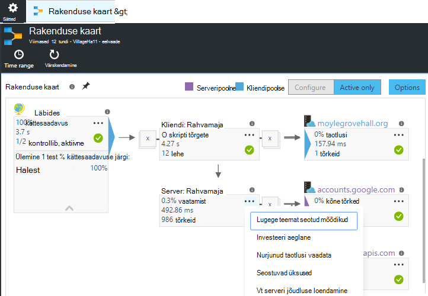
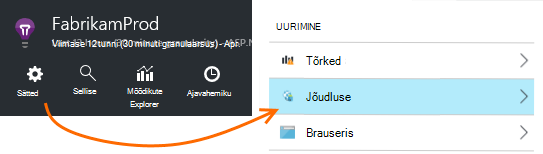
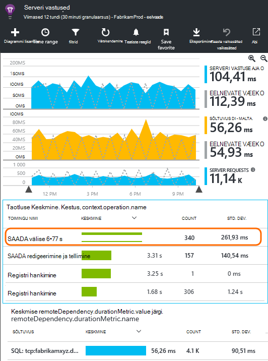
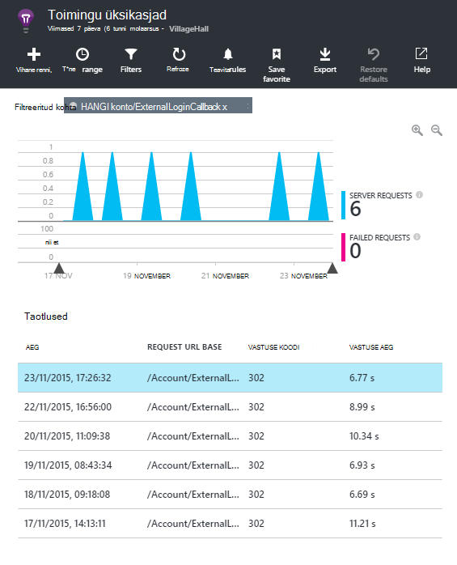
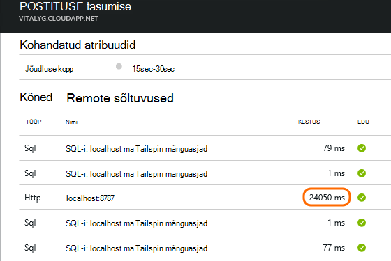
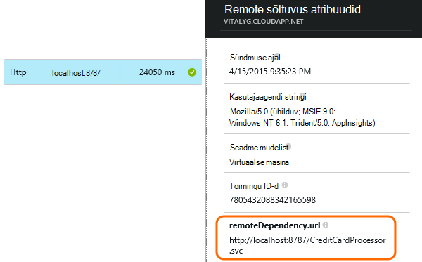
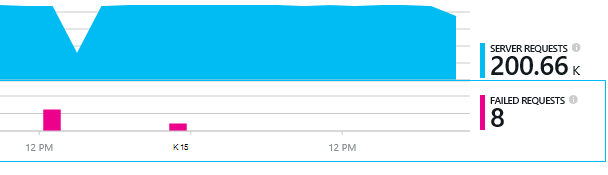
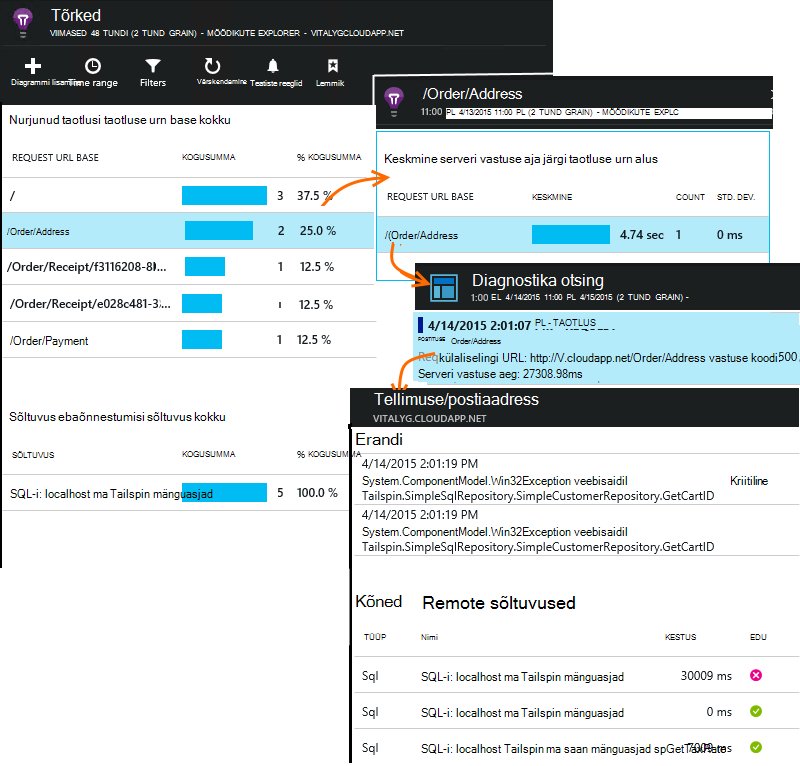

<properties 
    pageTitle="Diagnoosimise probleeme rakenduse ülevaated sõltuvused" 
    description="Tõrgete ja põhjustatud sõltuvused aeglase otsimine" 
    services="application-insights" 
    documentationCenter=""
    authors="alancameronwills" 
    manager="douge"/>

<tags 
    ms.service="application-insights" 
    ms.workload="tbd" 
    ms.tgt_pltfrm="ibiza" 
    ms.devlang="na" 
    ms.topic="article" 
    ms.date="05/12/2016" 
    ms.author="awills"/>
 
# <a name="diagnosing-issues-with-dependencies-in-application-insights"></a>Diagnoosimise probleeme rakenduse ülevaated sõltuvused


*Sõltuvus* on väline komponent, mida nimetatakse oma rakenduse abil. See on tavaliselt teenust nimega HTTP, või andmebaasi või failisüsteemi abil. Või oma veebilehele skripti, võib olla kõnest AJAXI tagasi serveriga. Visual Studio rakenduse ülevaated, saate hõlpsalt vaadata, kui kaua oodatakse rakenduse sõltuvused ja kui sageli sõltuvus kõne nurjub.

## <a name="where-you-can-use-it"></a>Kus saate seda kasutada

Välja kasti sõltuvus on praegu saadaval:

* ASP.net-i web rakendused ja teenused töötavad IIS-i serveris või Azure
* [Java veebirakenduste](app-insights-java-agent.md)
* [Veebilehed](https://azure.microsoft.com/blog/ajax-collection-in-application-insights/)

Muud tüüpi seade rakendused, nt saate jälgida oma [TrackDependency API](app-insights-api-custom-events-metrics.md#track-dependency)abil kirjutada.

Välja-ja-karbi sõltuvus kuvari aruannete praegu järgmist tüüpi sõltuvused kõned:

* ASP.NET-I
 * SQL-i andmebaasid
 * ASP.net-i veebi ja WCF-i teenused, mis kasutavad HTTP-põhine seosed
 * Kohaliku või kaugandmebaasiga HTTP kõned
 * Azure'i DocumentDb, tabelist, bloobimälu ja järjekord
* Java
 * Kõned – [JDBC](http://docs.oracle.com/javase/7/docs/technotes/guides/jdbc/) draiveri, nt MySQL-i, SQL Server, PostgreSQL-i või SQLite andmebaasi.
* Veebilehed
 * [AJAXI kõned](app-insights-javascript.md)

Klõpsake uuesti võiks kirjutada oma SDK kõned jälgida teiste sõltuvustega.

## <a name="to-set-up-dependency-monitoring"></a>Häälestada sõltuvus jälgimine

Installige vastav agent hosti server.

Platvorm | Installimine
---|---
IIS-i Server | Kas [oleku jälgimine serverisse installida](app-insights-monitor-performance-live-website-now.md) või [uuendada oma rakenduse .NET framework 4.6 või uuem versioon](http://go.microsoft.com/fwlink/?LinkId=528259) ja installige [Rakendus ülevaateid SDK](app-insights-asp-net.md) rakenduse.
Azure'i Web App | [Rakenduse ülevaateid laiend](app-insights-azure-web-apps.md)
Java veebiserver | [Java veebirakenduste](app-insights-java-agent.md)
Veebilehed | [JavaScripti jälgimine](app-insights-javascript.md) (Pole täiendavad setup Lisaks web lehe jälgimine)
Azure'i pilveteenuses |  [Kasutage käivitus tööülesande](app-insights-cloudservices.md#dependencies) või [installida .NET framework 4.6 +](../cloud-services/cloud-services-dotnet-install-dotnet.md)  

Oleku jälgimine IIS-i serverid ei pea te taastada allika projekti rakenduse ülevaateid SDK. 

## <a name="application-map"></a>Rakenduse kaart

Rakenduse kaardi toimib visuaalse abi avastamine sõltuvused rakenduse komponendid. 



Lahtrid: saate liikuda oluline sõltuvus ja muud diagrammid.

Väike [x] alampuud ahendamiseks klõpsake.

PIN-koodi kaardi [armatuurlaud](app-insights-dashboards.md), kus saab töökorras.

[Lisateavet leiate teemast](app-insights-app-map.md).

## <a name="diagnosis"></a>Diagnoosimise sõltuvus jõudlusprobleemide veebiserver

Hindamiseks taotluste teie server:



Liikuge kerides allapoole jaotiseni ruudustik taotlusi vaadata:



Üles üks võtab väga kaua aega. Vaatame, kui saame teada, kus on kulunud aeg.

Klõpsake rea isikliku taotluse sündmuste kuvamiseks:




Klõpsake mis tahes pikaajalisi eksemplari sellega põhjalikumaks tutvumiseks.

> [AZURE.NOTE] Liikuge kerides allapoole natuke valida näiteks. Latentsus tulemas võib tähendab, et andmeid ülemise eksemplarid on lõpetamata.

Liikuge kerides allapoole jaotiseni remote sõltuvus kõnesid seotud taotluse:



See näeb välja nagu kõige rohkem aega kättetoimetamise taotlus kulus kohalikust kataloogiteenusest kõne. 

Valige selle rea lisateabe saamiseks.




Üksikasjad sisaldab piisavalt teavet probleemi diagnoosida.


## <a name="failures"></a>Tõrked

Kui seal on nurjunud, klõpsake diagrammi.



Klõpsake nuppu taotluse tüüp ja taotluse näiteks otsimine nurjunud kõne kaugjuhtimise sõltuvus kaudu.





## <a name="custom-dependency-tracking"></a>Kohandatud sõltuvus jälgimine

Sõltuvus jälgimise standardmoodul leiab automaatselt välise sõltuvused, nt andmebaasid ja REST API-d. Kuid võiksite mõne lisakomponentide käsitletakse samal viisil. 

Saate kirjutada koodi, mis saadab objektisõltuvusteave, kasutades sama [TrackDependency API](app-insights-api-custom-events-metrics.md#track-dependency) standard moodulid kasutatavat.

Kui koostate koos komplekti inimese teksti ise oma koodi, võib aega kõik kõned sellele, et teada saada, millist panust oma vastuse korda. On kuvatud rakenduse ülevaated sõltuvus diagrammides andmeid, saatke see `TrackDependency`.

```C#

            var success = false;
            var startTime = DateTime.UtcNow;
            var timer = System.Diagnostics.Stopwatch.StartNew();
            try
            {
                success = dependency.Call();
            }
            finally
            {
                timer.Stop();
                telemetry.TrackDependency("myDependency", "myCall", startTime, timer.Elapsed, success);
            }
```

Kui soovite välja lülitada standard sõltuvus jälgimise moodul, eemaldada viide DependencyTrackingTelemetryModule [ApplicationInsights.config](app-insights-configuration-with-applicationinsights-config.md).


## <a name="ajax"></a>Ajaxi

Lugege teemat [veebilehtede](app-insights-javascript.md).


 