<properties
    pageTitle="Tuvastada, kaudu alusel järjestada, diagnoosimine"
    description="Analüüsida jookseb ja tuvastada ja diagnoosida jõudlusprobleemide rakenduste"
    authors="alancameronwills"
    services="application-insights"
    documentationCenter=""
    manager="douge"/>

<tags
    ms.service="application-insights"
    ms.workload="tbd"
    ms.tgt_pltfrm="ibiza"
    ms.devlang="na"
    ms.topic="article" 
    ms.date="11/06/2015"
    ms.author="awills"/>

# Tuvastada, kaudu alusel järjestada ja rakenduse ülevaated diagnoosimine

*Rakenduse ülevaated on eelvaade.*

Saate teada, kuidas oma rakenduse täidab rakendus ülevaateid aitab ja kasutamist, kui see on reaalajas. Ja kui ilmneb probleeme, seda saate teada seda, aitab teil hinnata mõju ja aitab teil põhjuse kohta.

Siin on konto meeskond, mis töötab välja veebirakenduste:

* *"Paar päeva tagasi, saame juurutatud"mõnevõrra"kiirparandus. Me ei tööta laialdane testi läbimine, kuid ootamatud muutuvad saanud kahjuks liidetakse last, mis põhjustavad vastuolu esi- ja tagakülje lõpetatakse. Kohe serveri erandid paisus meie teatise töötas ja me olid teadlikud olukord. Mõne klõpsu kaugusel rakenduse ülevaated portaalis, meil on piisavalt teavet erandi callstacks piiritlemiseks probleemi. Kohe tagasi pöörata- ja piiratud kahju. Rakenduse ülevaated on tehtud selles osas on devops tsükkel väga lihtne ja kasutatavaks."*

Vaatame, kuidas on tüüpilised web arendusmeeskonnale kasutab rakenduse ülevaated jõudluse jälgimist. Me täitke meeskonna Fabrikam panga, mis töötab välja Interneti-panga süsteemi (OBS).

Meeskond töötab pikkust järgmiselt:

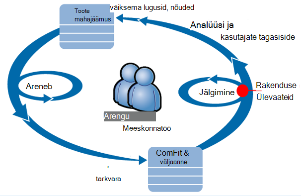

Nõuded siseneda nende arengu mahajäämus (tööülesannete loend). Lühidalt töötavad need sprints, millel on sageli töötamise tarkvara – tavaliselt parandusi ja laiendid olemasoleva rakendusega kujul. Reaalajas rakendust värskendatakse uute funktsioonidega. Kuigi see on reaalajas, meeskond jälgib selle jõudlus ja rakenduse ülevaated abi kasutuse. Analüüsi kanalid uuesti sisse oma arengu mahajäämus.

Meeskond kasutab rakenduse ülevaated reaalajas veebirakenduse hoolikalt jälgida:
* Jõudlus. Soovivad, et aru saada, kuidas vastuse korda erinevad sõltuvalt taotluse arv; Kui palju CPU, võrku, ketta ja muud ressursid on kasutusel; ja kus pudelikaelad.
* Ebaõnnestumist. Kui leidub erandid või taotlusi, nurjus või kui jõudluse vastuolus läheb väljaspool oma mugav vahemikku, meeskonnal leida kiiresti nii, et nad saavad võtta toimingu.
* Kasutus. Iga kord, kui avaldatakse uusi funktsioone, meeskond soovite teada, mil määral seda kasutatakse ja kas kasutajatel on mis tahes probleeme.

Vaatame keskenduda tsükli tagasiside osa:

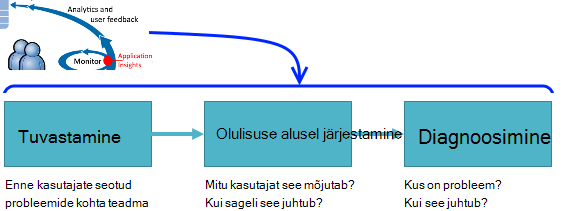

## Tuvasta kehva kättesaadavus

Marcela Markova on vanem arendaja OBS meeskond ja võtab müügivihjete jälgimine Online'i jõudluse. Ta häälestab mitu [web testide][availability]:

* Ühe-URL-i test peamine sihtleht selle rakenduse http://fabrikambank.com/onlinebanking/. Ta määrab HTTP kood 200 ja teksti "Tere tulemast!". Kui see test nurjub, on oluliselt viga võrgu serverid või võib-olla juurutamise probleemi. (Või keegi on muutnud Tere! sõnumi lehel ilma turvalist lastes.)

* Mõnda täpsemat mitme etapi test, mis logib ja saab arvelduskonto loetelu, kontroll mõne olulisi üksikasju igale leheküljele. Selle testi kinnitab töötamise kontod andmebaasi link. Ta kasutab väljamõeldud tellijaid: mõned neist säilitatakse katsetamiseks.

Häälestamine katsed Marcela on kindel, et meeskond kiiresti teada mis tahes katkestuste.  

Tõrkeid ilmub punane punkti diagrammil web test:

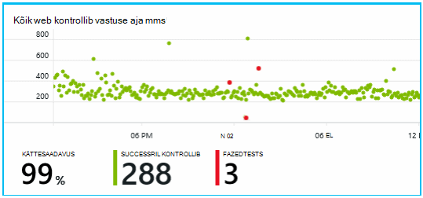

Kuid veelgi olulisem, saadetakse teatis mis tahes kohta on arendusmeeskonnale. Sel viisil nad sellest teada enne peaaegu kõik kliendid.

## Kuvari jõudluse mõõdikud

Rakenduse ülevaated lehel ülevaade on diagramm, mis kuvatakse [võtme mõõdikute]erinevaid[perf].

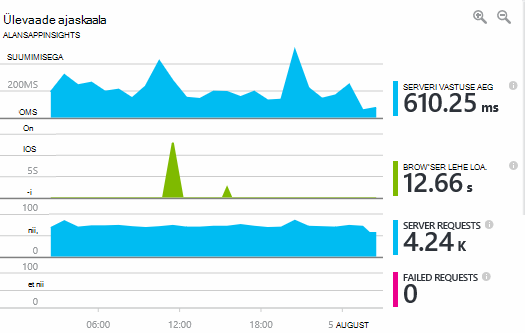

Brauseri laadimise ajal on tuletatud telemeetria saadetud veebilehtede. Serveri vastuse aeg, server taotluse arvu ja nurjunud taotluste arvu on kõik mõõdetud veebiserver ning saata rakenduse ülevaated seal.

Marcela on veidi seotud veebisaidil serveri vastuse graafik, mis näitab keskmiselt vahel, kui server saab HTTP-päring kasutaja brauseris, ja kui see tagastab soovitud vastuse. See pole ebatavalised vaadata selle diagrammi variatsioon laadi süsteemi muutudes. Kuid sel juhul näib olevat väikest tõusu arvu taotlusi, ja suur korrelatsiooni tõusu vastuse kellaaja. Mis võib viidata operatsioonisüsteem lihtsalt veebisaidil oma piirid. 

Ta avab serverid diagrammid.

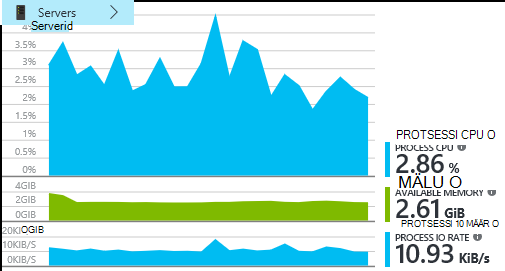

Tundub, et olla ressursi piirang, pole märk ehk serveri vastuse diagrammide punnid on juhus.

## Teatised

Siiski ta soovite hoida silma kulunud aja. Kui toimuvad liiga suur, ta soovib kohe sellest teada.

Nii, et ta on [teatiste]määrab[metrics], vastuse aegu, mis on suurem kui tavaline. See annab tema kindel, et ta tea seda, kui vastus on aeglane.

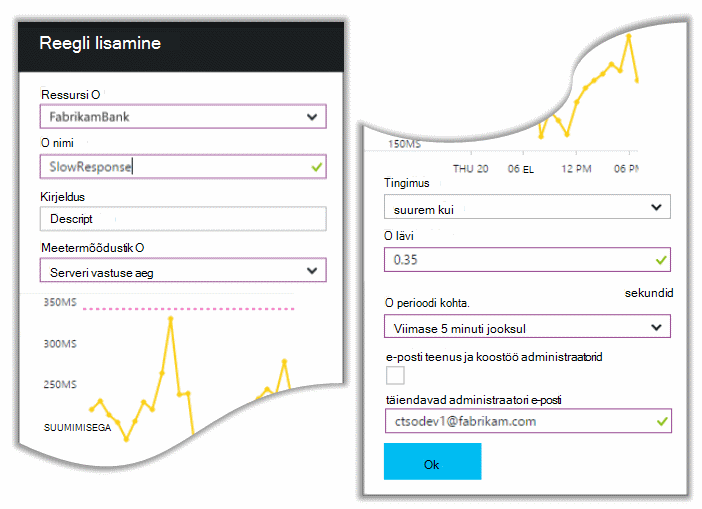

Teatiste saate seada mitmesuguseid muid mõõdikute. Näiteks saate e-kirju, kui erandi count kõrge või saadaoleva mäluga läheb madal, või kui on tipp klientide päringutele.

## Aktiivne diagnostika teatised

Järgmisest päevast, teate e-posti saabuvad rakenduse ülevaated. Aga kui ta avab, leiab ta ei ole vastuse aja teatise ta seadmine. Selle asemel see ütleb talle on nurjunud taotlusi - st taotlusi, mis on tagastatud tõrge koodide 500 või rohkem järsku tõusu.

On nurjunud taotlused, kuhu kasutajad näinud tõrge – tavaliselt jälgimise kood on erand. Võib-olla need kuvatakse teade "Kahjuks me ei saanud uuendada oma andmed hetkel" räägivad või veebisaidil absoluutne piinlikud kõige, pinu tõmmis kasutaja kuval on veebiserver veebisaidilt.

See teatis on üllatusena, kuna ta vaevama, viimast nurjunud taotluste arv oli julgustavalt madal. Väike arv ebaõnnestumisi on hõivatud serveri oodata. 

Samuti on veidi üllatusena tema kuna ei olnud konfigureerimine teemasse. Rakenduse ülevaated on aktiivne diagnostika tegelikult automaatselt. Automaatselt korrigeerida või mitte teie minirakendus tavaline tõrge mustri ja "saab kasutada" tõrkeid kindla lehe või suure koormuse või seotud muude mõõdikute. See annab häiresignaali, ainult siis, kui tõus kohal oodata tegemist.

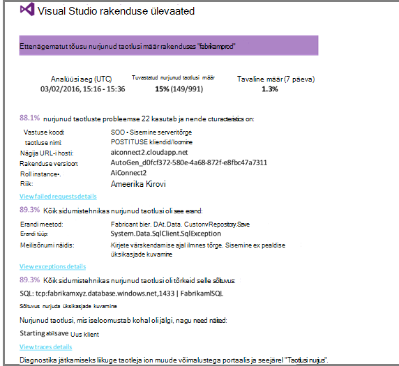

See on väga kasulik e-posti. See ei lihtsalt anna; see liiga palju olulisuse alusel järjestamine ja diagnostika.

See näitab, mitu kliendid mõjutab, ja millist veebilehtede või toimingud. Marcela saate otsustada, kas ta peab kogu meeskond töötab selle fire süvitsi minna, või kas seda võib eirata kuni järgmise nädala.

E-posti ka näitab, et teatud erandi ilmnenud ja - isegi rohkem huvitavad – selle seostatakse nurjunud kõnesid teatud andmebaasi. See selgitab, miks viga ilmus isegi juhul, kui Marcela's meeskond on juurutatud värskendusi viimati. 

Ta ping andmebaasi rühma juhataja. Jah, nad välja kiirparandus pool tunnis; ja Vabandust, võib-olla võis mõnevõrra skeemi muutmine...

Nii probleem on võimalus on kinnitatud, isegi enne logid uurimiseks ja selle tekkinud 15 minuti jooksul. Siiski Marcela klõpsab link peaks avama rakenduse ülevaated. See avaneb otse nurjunud taotluste ja ta saab näha nurjunud andmebaasi sõltuvus kõnede seotud loendi sisse helistada. 

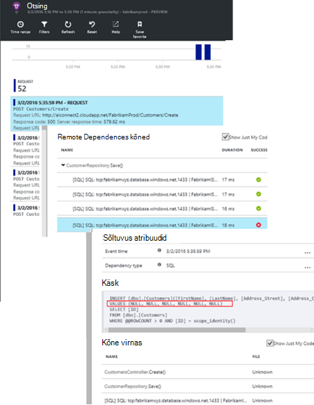

## Erandid tuvastamine

Natuke häälestamise [erandid](app-insights-asp-net-exceptions.md) on teatada rakenduse ülevaated automaatselt. Ta saab hõivatud ka konkreetselt lisades kõned [TrackException()](app-insights-api-custom-events-metrics.md#track-exception) kood:  

    var telemetry = new TelemetryClient();
    ...
    try
    { ...
    }
    catch (Exception ex)
    {
       // Set up some properties:
       var properties = new Dictionary <string, string>
         {{"Game", currentGame.Name}};

       var measurements = new Dictionary <string, double>
         {{"Users", currentGame.Users.Count}};

       // Send the exception telemetry:
       telemetry.TrackException(ex, properties, measurements);
    }

Fabrikam panga meeskonnatöö on muutunud alati saatmine telemeetria klõpsake erandi, kui on mõni selge taastamine.  

Tegelikult oma strateegia on isegi laiem: nad saadavad telemeetria iga kord, kui klient on pettunud, mida nad soovivad teha, kas see vastab erandi kood või mitte. Näiteks kui väline pankadevahelistes edastamine süsteemi tagastab "ei saa lõpule viia selle tehingu" sõnumi funktsionaalseid põhjusel (ei olnud klient), seejärel need jälgida sündmusega.

    var successCode = AttemptTransfer(transferAmount, ...);
    if (successCode < 0)
    {
       var properties = new Dictionary <string, string>
            {{ "Code", returnCode, ... }};
       var measurements = new Dictionary <string, double>
         {{"Value", transferAmount}};
       telemetry.TrackEvent("transfer failed", properties, measurements);
    }

TrackException saab aru erandid, kuna see saadab koopia virnas; TrackEvent kasutatakse muid sündmusi. Saate lisada mis tahes atribuudid, mis võib olla kasulik diagnoosimise.

[Diagnostika otsingu] kuvataks erandid ja sündmuste[ diagnostic] tera. Saate minna nende täiendavate atribuutide vaatamiseks ja virnastada jälgi.

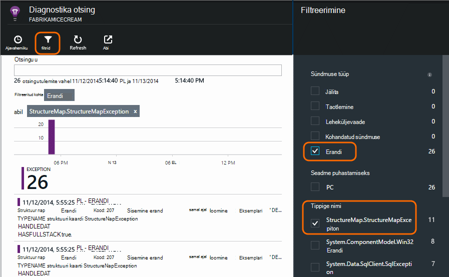

## Kasutaja tegevuse jälgimine

Kui vastus on pidevalt hea ja on mõned erandid, arendaja meeskonnatöö saate mõtlema, kuidas parandada kasutajate kogemusi ja kuidas soovitud eesmärkide rohkem kasutajaid.

Näiteks tavakasutaja reisi veebilehele on selge Müügilehter: paljud kliendid vaadata määrade eri tüüpi laenu; mõned neist täitke vorm ülakomade; ja need, kes saavad pakkumise mõne minna ja võtta laenu.

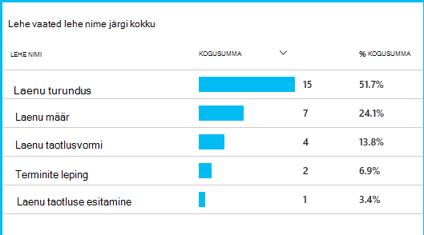

Leides, kus suurim arv kliendid kukutage, saate töötada ettevõtet, kuidas saada lisateavet kasutajate allosas olevat Müügilehter. Mõnel juhul võib olla kasutaja tõrge kasutusvõimalusi (Kasutuskogemuse) – näiteks nupu "järgmine" on raske leida või juhiseid pole selge. Veel tõenäoliselt on märkimisväärselt suurem business põhjust drop-üksikasjad: ehk laenu on liiga suur.

Mingil põhjusel, aitab andmete meeskonna töö välja, mida kasutajad teevad. Veel jälitus kõned saab lisada rohkem üksikasju välja töötada. TrackEvent() saab loendada iga kasutaja toimingud üksikasjad, üksikute nupp klõpsu abil olulised saavutused näiteks ära laenu maksta.

Meeskonna saada kasutatakse oleks kasutaja tegevuse kohta teavet. Tänapäeval iga kord, kui nad kujundus uus funktsioon, töötavad need teada, kuidas nad saavad oma kasutuse kohta tagasiside. Need kujundamine jälitus kõned funktsiooni algusest. Nad kasutavad funktsiooni parandamiseks iga arengutsükli tagasiside.

## Aktiivne jälgimine  

Marcela ei lihtsalt istuda ootab teatised. Varsti pärast iga positsioonide ta võtab pilk [vastuse korda] [ perf] – nii üldine joonis ja parema taotlusi, samuti erand loendab tabelis.  

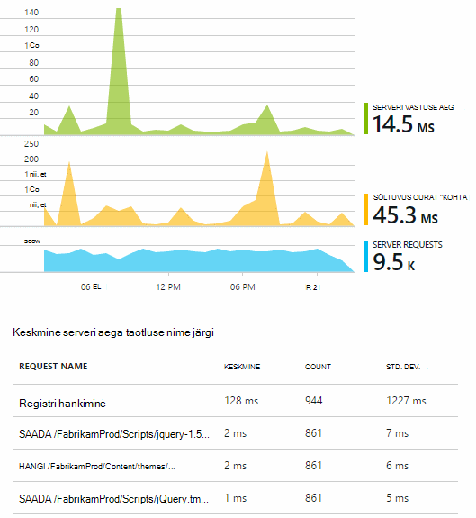

Ta saab hinnata iga juurutamise jõudluse mõju tavaliselt võrdlus Viimane iga nädal. Kui ootamatu halvenenud, ta tekitab mis oluline arendajad.

## Olulisuse alusel järjestamine

Olulisuse alusel järjestamine - raskusaste ja probleemi ulatust hindamise - on esimene samm pärast tuvastamise. Peaks me helistada läbi meeskonna keskööst? Või saate selle jääda kuni järgmise mugav vahe on mahajäämus? On mõned tootenumbri olulisuse alusel järjestamine küsimustele.

Kui palju see juhtub? Diagrammide ülevaade enne anda mõne perspektiivi probleem. Näiteks Fabrikam rakenduse loodud neli web testi teatiste ühe öösel. Vaadates diagrammi hommikul, meeskond ei näe loodud tõepoolest mõned punane punkti oleksid endiselt enamik testide roheline. Süveneda just üheks kättesaadavus diagrammi, oli selge, et kõik need ajutisi probleeme olid ühe testi asukohast. See oli ilmselt võrgu probleemi, mis mõjutavad ainult üks ning tõenäoliselt soovite tühjendage ise.  

Seevastu dramaatiliste ja ühed tõusu erandi loendab või vastuse korda graafik on ilmselt midagi paanikat.

On kasulik olulisuse alusel järjestamine taktika, proovige seda ise. Kui teil tekib probleem, teate, et see on tõeline.

Milline osa kasutajate mõjutab? Töötlemata vastuse saamiseks ebaõnnestumise määr jagatakse seansside arv.

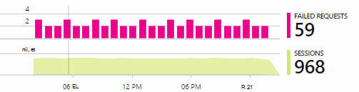

Võrrelge puhul aeglane vastust, parema vasta kutsed iga lehekülje kasutus sagedus tabeli.

Kui oluline on blokeeritud stsenaarium? Kui see on teatud kasutaja Loo blokeerivad otstarbekas probleem, ei ole oluline palju? Kui kliendid ei saa maksma oma arveid, see on raske; kui nad ei saa muuta oma Kuva värvi eelistusi, võib-olla see võib oodata. Sündmuse või erandi üksikasjad või lehe aeglase isikut ütleb teile, kus kliendid on probleeme.

## Diagnoosimine

Diagnostika pole päris sama silumine. Enne alustamist jälgimise kaudu koodi, peate töötlemata idee, miks, kus ja millal probleem esineb.

**Kui see juhtub?** Ajalooliste vaate esitatud sündmus ja mõõdiku diagrammide lihtne efektid vastavus võimalikud põhjused. Kui vastuse kellaaja või erandi määr on vahelduva peaks, vaadake taotluse arv: kui see peaks samal ajal, siis see näeb välja nagu ressursi probleem. Kas vajate mitme Protsessori või mälu määrata? Või on see sõltuvus, mida ei saa hallata laadi?

**See on meile?**  Kui teil on äkki langeb täitmisel kindlat tüüpi kutse – näiteks kui klient soovib lauset konto -, siis on võimalik, võib see olla välise, mitte veebirakenduses. Mõõdikute Exploreris valige sõltuvus ebaõnnestumiste määra ja sõltuvus kestus hinnad ja võrrelda oma ajalugu üle viimase mõne tunni või päeva saate tuvastatud probleem. Kui seal on tõestusmeetodid muudatusi, siis välise võib süüdistada.  

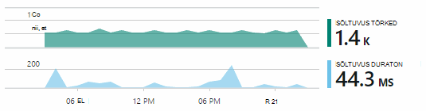

Mõned probleemid, aeglane sõltuvus on geograafiline asukoht probleeme. Fabrikam panga kasutab Azure'i virtuaalmasinates ja avastanud, et nad oli tahtmatult asub nende veebiserver ja konto server riigis. Dramaatiliste täiustamise tõi migreerimine üks neist.

**Mida me teha?** Kui probleem ei kuvata olema sõltuvus ja ei olnud alati seal, seda tõenäoliselt põhjustab hiljutise muudatusega. Ajaloolise perspektiivi esitatud meetermõõdustik ja sündmuse diagrammide hõlbustab vastavus juurutuste ootamatu muudatused. Mis on tuvastades probleemi otsimine.

**Mis toimub?** Mõned probleemid esinevad harva ja võib olla keeruline, et välja selgitada testida ühenduseta. Kõik meil on jäädvustada viga, kui see juhtub live proovida. Saate kontrollida virnas puistab erandi aruannetes. Lisaks saate jälgimine helistada, kirjutada oma lemmik logimine framework või TrackTrace() või TrackEvent().  

Fabrikam oli vahelduva probleem, kontode edastamine, kuid ainult teatud konto andmetüüpidega. Paremini mõista, mis juhtub, nad lisatud TrackTrace() kõnede kood, manustamise kontotüüp atribuudi iga kõne põhilistest punktidest. Mis on lihtne lihtsalt nende jälgi diagnostika otsingus välja filtreerida. Need ka lisatud parameetrite väärtused atribuudid ja mõõdud kutsete jälgimiseks.

## Sellega

Kui olete diagnoosida probleemi, saate plaani seda parandada. Võib-olla peate hiljutise muudatusega tagasi pöörata või võib-olla saate lihtsalt minna ja paranda. Kui parandustööriist on töö lõpetanud, rakenduse ülevaated ütleb teile, kas teie õnnestus.  

Fabrikam panga arendusmeeskonnale võtta struktureerituma lähenemine jõudluse mõõtmisel kui varem enne kasutada rakenduse ülevaated.

* Need määrata teatud mõõdud jõudluse eesmärgid lehe rakenduse ülevaated ülevaade.

* Need kujundamine jõudluse mõõdud rakendusse algusest, nt mõõdikud kasutaja edenemise kaudu "lehtritesse."  

## Kasutus

Saate teada, mida kasutajad teha rakenduse saab kasutada ka rakenduse ülevaated. Kui see töötab sujuvalt, meeskond soovite teada, millised funktsioonid on kõige populaarsemad, mis kasutajatele meeldib või on raskusi ja kui sageli nad tulevad tagasi. Mis aitab neil tähtsuse eelseisvate tööülesannete. Ja ta saab plaan mõõta edu iga funktsiooni elutsüklit osana. [Lugege lisateavet][usage].

## Rakenduste

Nii, et see, kuidas ühe meeskonnatöö kasutada rakenduse ülevaated, mitte ainult üksikute probleemide lahendamiseks, kuid nende arengu elutsükli parandamiseks. Ma loodame, et see on andnud teile ideid selle kohta, kuidas rakenduse ülevaated aitavad teil parandada oma rakendustes.

## Video

[AZURE.VIDEO performance-monitoring-application-insights]

<!--Link references-->

[api]: app-insights-api-custom-events-metrics.md
[availability]: app-insights-monitor-web-app-availability.md
[diagnostic]: app-insights-diagnostic-search.md
[metrics]: app-insights-metrics-explorer.md
[perf]: app-insights-web-monitor-performance.md
[usage]: app-insights-web-track-usage.md
 
