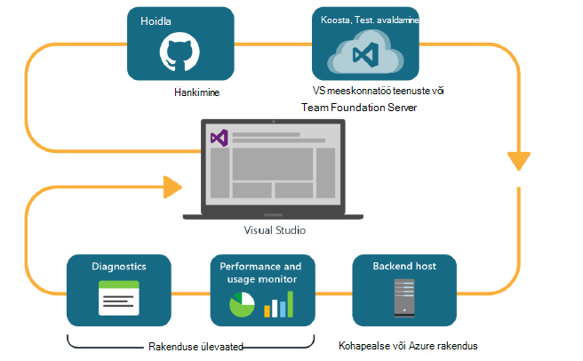
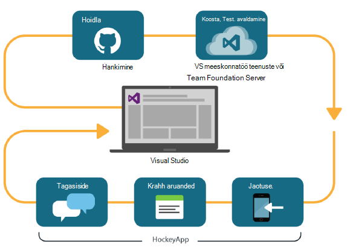

<properties
    pageTitle="Arendaja Analytics"
    description="Visual Studio, rakenduse ülevaated ja HockeyApp DevOps"
    authors="alancameronwills"
    services="application-insights"
    documentationCenter=""
    manager="douge"/>

<tags
    ms.service="application-insights"
    ms.workload="tbd"
    ms.tgt_pltfrm="ibiza"
    ms.devlang="na"
    ms.topic="article" 
    ms.date="05/18/2016"
    ms.author="awills"/>

# Arendaja Analytics rakenduse ülevaated ja HockeyApp

*Rakenduse ülevaated on eelvaade.*

Paljude projektide töötama kiire [DevOps](https://en.wikipedia.org/wiki/DevOps) tsükkel. Need koostamine ja levitamine nende rakenduste, saada tagasisidet kohta, kuidas see toimib ja mida kasutajad seda teha ja kavandamine täpsemaks arengu tsüklit teadmisi abil. 

Kasutus- ja jõudluse jälgimist, on oluline on telemeetria reaalajas rakendusest, aga ka kasutajad ise tagasiside. 

Paljud süsteemid on ehitatud mitme komponendid: veebiteenuse, kirjutamata protsessorite või andmete ja klienttarkvara kasutaja brauseris või rakendus telefoni või muud seadet. Telemeetria kaudu nende erinevate osade on kokku.

Mõned väljalasete on piiratud normaaljaotust määratud testijad; Meil on ka korras flighting (uued funktsioonid on piiratud sihtrühmade katsed) ja A | B testimine (paralleelselt katsed alternatiivne UI).

Jaotuse haldamine ja integreerimine jälgimine üle mitme kliendi ja serveri komponendid pole triviaalne ülesanne. See protsess on oluline osa rakenduse arhitektuur: me ei saa luua nii selline ilma on iteratiivne arengutsükli ja hea jälgimise tööriistad.

Selles artiklis vaatame kuidas devOps tsükli jälgimisega seotud aspektide sobivus teiste osade protsess. 

Kui soovite vaadata kindla näide, on [ka huvitav juhtumianalüüsi](http://aka.ms/mydrivingdocs) , mis on mitme kliendi ja serveri komponendid.

## DevOps tsükkeldiagramm

Visual Studio ja arendaja Analytics tööriistad pakkuda hästi integreeritud devOps kogemus. Siin on näiteks tavaline tsükkeldiagramm veebirakenduse (mis võiks olla Java, Node.js või ASP.net-i):

* Arendaja hoidlasse kood kontrollib või ühendab peamine haru. Hoidla on Git Siinsel illustratsioonil kujutatud üksustest, kuid see võib olla sama [Team Foundation versiooni kontrollimine](https://www.visualstudio.com/docs/tfvc/overview).
* Muudatuste käivitamine koostamine ja ühiku test. [Visual Studio meeskonnatöö teenustes](https://www.visualstudio.com/docs/vsts-tfs-overview)või oma kohapealse töölauafunktsioonid Team Foundation Server võib olla teenuse koostamine. 
* Eduka koostamine ja ühiku test saate [käivitada mõni automaatse juurutamise](https://www.visualstudio.com/docs/release/author-release-definition/more-release-definition). Rakenduse veebi saab oma veebiserverisse või Microsoft Azure'i. 
* [Rakenduse ülevaated](app-insights-overview.md), nii serveris ja [Kliendi brauseritest](app-insights-javascript.md)saadetakse telemeetria reaalajas rakendusest. Seal saate analüüsida rakendus ja kasutus mustrite jõudlus. Võimas [otsinguriistad](app-insights-analytics.md) abi te diagnoosimine probleemidest. [Teatiste](app-insights-alerts.md) veenduge, et kohe, kui see tekib probleem kohta teada. 
* Teie järgmise arengutsükli teatatakse teie analüüsimise ja reaalajas telemeetria.

### Seadme ja töölauarakendused

Seadme ja töölauarakenduste, tsükli jaotuse osa on pisut erinev, kuna me ei ainult ühe või kahe serveri üleslaadimine. Selle asemel saate eduka koostamine ja ühiku test [päästik üleslaadimine HockeyApp](https://support.hockeyapp.net/kb/third-party-bug-trackers-services-and-webhooks/how-to-use-hockeyapp-with-visual-studio-team-services-vsts-or-team-foundation-server-tfs). HockeyApp kontrollib jaotuse teie meeskond testi kasutajad (või avalikkusele, kui eelistate). 

HockeyApp kogub ka jõudlus ja vormide kasutamine andmete:

* Sõna-sõnalt kasutaja tagasiside pildid
* Krahh aruanded
* Kohandatud telemeetria kodeeritud saate.

Veel kord devOps tsükkel on lõpetatud, kui teete oma tulevase lepingute saadud tagasiside põhjal.

## Arendaja Analytics seadistamine

Iga osa rakenduse - mobiili või web või töölaua - juhised kehtivad põhimõtteliselt sama. Mitmesuguseid rakenduse Visual Studio automaatselt teostab mõnda järgmist.

1. Saate lisada oma rakenduse vastav SDK. Seadme rakendusi, siis on HockeyApp ja veebiteenuste jaoks rakenduse ülevaated. Iga on erinevad platvormid variante. (See on ka kasutada kas SDK töölauarakenduste, kuigi soovitame HockeyApp.)
2. Registreerige oma rakenduse rakenduse ülevaated või HockeyApp portaali, olenevalt sellest, mida kasutasite SDK. See on, kus kuvatakse analytics reaalajas rakenduste. Saate instrumentation klahv või ID, mis konfigureeritakse oma rakendusse, nii et SDK teab, kuhu selle telemeetria saata.
3. Lisage kohandatud koodi (soovi korral) sisselogimine, sündmuste või mõõdikute, aitavad diagnostika või jõudluse ega kasutus analüüsimiseks. On palju jälgimise sisseehitatud, seega ei pea te seda oma esimese tsükli.
3. Seadme rakenduste:
 * Laadige HockeyApp silumine koostamine. Seal saate selle meeskonnatöö katsetuskasutaja levitada. Kui laadite üles edaspidised koostab, teavitatakse meeskond.
 * Kui häälestate oma pidev koostamise teenuse, väljaanne mõiste, mis kasutab lisandmooduli etappi üleslaadimiseks HockeyApp loomine

### Analüüsi- ja ekspordi puhul HockeyApp telemeetria

Saate uurida HockeyApp kohandatud ja logige telemeetria rakenduse ülevaated analüüsi- ja pidev eksportimine funktsioonide häälestamine [silla](app-insights-hockeyapp-bridge-app.md)abil.

## Järgmised sammud
 
Siit leiate üksikasjalikud juhised erinevat tüüpi rakendus:

* [ASP.net-i veebirakenduse](app-insights-asp-net.md) 
* [Java web app](app-insights-java-get-started.md)
* [Node.js web app](https://github.com/Microsoft/ApplicationInsights-node.js)
* [iOS-i rakendus](https://support.hockeyapp.net/kb/client-integration-ios-mac-os-x-tvos/hockeyapp-for-ios)
* [Mac OS X rakendus](https://support.hockeyapp.net/kb/client-integration-ios-mac-os-x-tvos/hockeyapp-for-mac-os-x)
* [Androidi](https://support.hockeyapp.net/kb/client-integration-android/hockeyapp-for-android-sdk)
* [Universaalne Windowsi rakenduse](https://support.hockeyapp.net/kb/client-integration-windows-and-windows-phone/how-to-create-an-app-for-uwp)
* [Windows Phone 8 ja 8.1 rakendus](https://support.hockeyapp.net/kb/client-integration-windows-and-windows-phone/hockeyapp-for-windows-phone-silverlight-apps-80-and-81)
* [Windowsi esitlus Foundationi rakenduse](https://support.hockeyapp.net/kb/client-integration-windows-and-windows-phone/hockeyapp-for-windows-wpf-apps)

