<properties 
    pageTitle="Diagnostika otsingu abil | Microsoft Azure'i" 
    description="Otsing ja üksikuid sündmusi, taotlusi, filtreerimine ja logige jälgi." 
    services="application-insights" 
    documentationCenter=""
    authors="alancameronwills" 
    manager="douge"/>

<tags 
    ms.service="application-insights" 
    ms.workload="tbd" 
    ms.tgt_pltfrm="ibiza" 
    ms.devlang="na" 
    ms.topic="article" 
    ms.date="06/09/2016" 
    ms.author="awills"/>
 
# Rakenduse ülevaated diagnostika otsingu kasutamine

Diagnostika otsing on [Rakenduse ülevaated] [ start] saate otsida ja analüüsida üksikute telemeetria üksused, nt lehe vaated, erandid või web taotlused. Ja saate vaadata log jälgi ja sündmusi, mida teil on kodeeritud.

## Kui näete diagnostika otsing?

### Azure'i portaalis

Saate avada diagnostika otsingu otseselt.

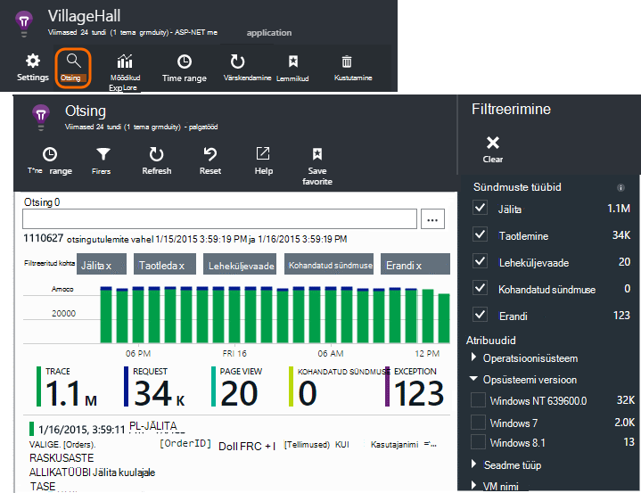

Avaneb ka mõned diagrammid ja ruudustiku üksuste klõpsamisel. Sel juhul filtrites eelnevalt seatud keskenduda valitud üksuse tüüp. 

Kui teie taotlus on veebiteenuse, kuvatakse ülevaade tera helitugevuse taotluste diagrammile. Klõpsake seda ja saate üksikasjalikumat diagrammile koos näitab, mitu taotlusi on tehtud iga URL-i kirje. Klõpsake ükskõik millisele reale ja saate üksikuid taotluste selle URL-i.

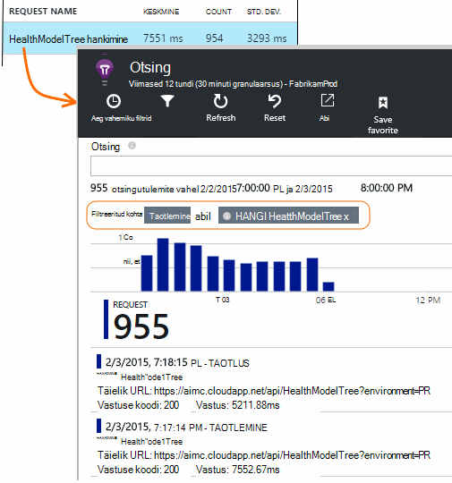

Diagnostika otsingu põhiosa on loend telemeetria üksuste - server nõuab, lehel vaateid, kohandatud sündmused, mis teil on kodeeritud ja jne. Loendi ülaosas on kokkuvõte skeem, mis näitab loendab sündmuste aja jooksul.

Sündmuste tavaliselt ilmu diagnostika otsingu enne, kui need kuvatakse argumendil Exploreris. Kuigi tera värskendab ise intervalliga, kui võite klõpsata nuppu Värskenda ootate teatud sündmuse jaoks.

### Visual Studio

Avage aken otsing Visual Studios.

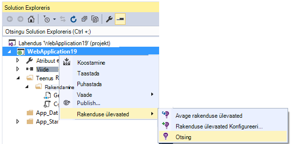

Aknas Otsing on samad funktsioonid, mis veebiportaali.

## Valimite

Kui teie rakendus loob palju telemeetria (ja kasutate ASP.net-i SDK versioon 2.0.0-beta3 või uuem versioon), kohandatava valimite mooduli vähendab automaatselt maht, mis saadetakse portaali saatmisega tüüpilised murdosa sündmused. Siiski sündmused, mis on seotud sama kutse valitud või märkimata rühmana, et seotud sündmused seas saate liikuda. 

[Vaadake, kuidas valimite](app-insights-sampling.md).

## Üksikute üksuste uurimine

Valige mis tahes telemeetria üksus võtmeväljade kuvamiseks ja seostuvad üksused. Kui soovite näha kõiki välju, klõpsake nuppu "...". 

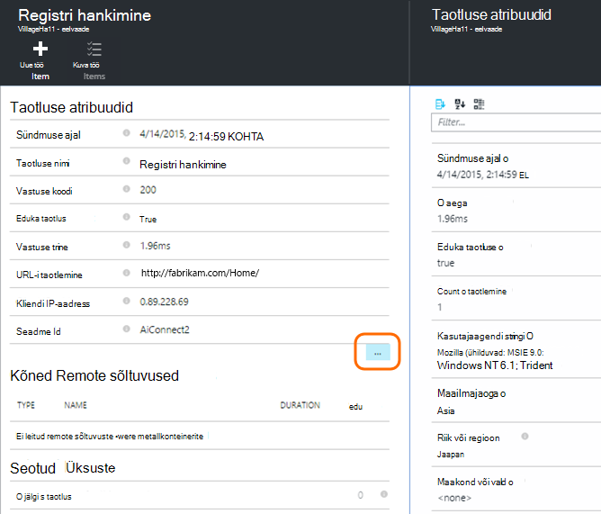

Kõigi väljade otsimiseks saate kasutada lihtsat stringide (ilma metamärkide). Saadaolevad väljad sõltuvad telemeetria tüüp.

## Töö üksuse loomine

Mis tahes telemeetria üksusest üksikasjadega saate luua Visual Studio meeskonnatöö teenuste viga. 

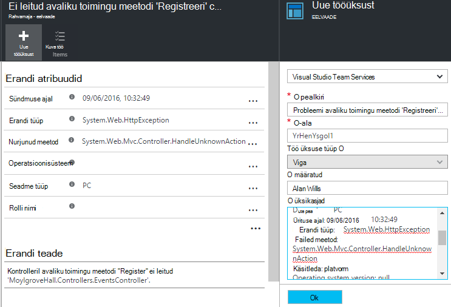

Esimest korda selle tegemiseks, palutakse lingi oma meeskonnatöö teenuste konto ja projekti konfigureerimine.

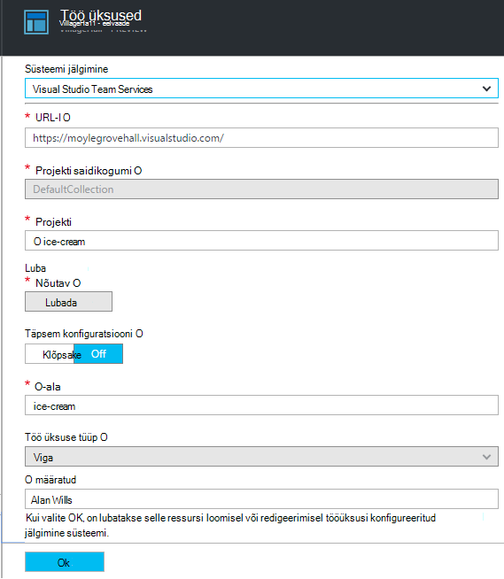

(Samuti saate konfiguratsiooni tera sätted > tööüksusi.)

## Filtreerimine sündmuste tüübid

Avage filtri tera ja valige sündmuste tüübid, mida soovite näha. (Kui hiljem, mida soovite taastada filtrid, kellega te avasite tera, klõpsake nuppu Lähtesta.)

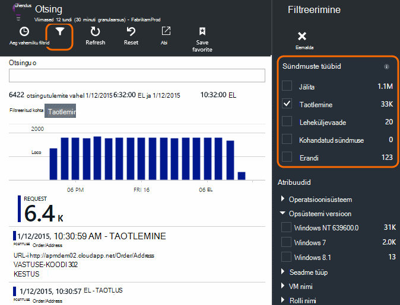

Sündmuse tüübid on:

* **Jälita** - diagnostikalogid, sh TrackTrace, log4Net, NLog ja System.Diagnostic.Trace kõned.
* **Taotleda** - HTTP päringuid, mis on saadud serveri rakenduse, lehtede, skriptide, pildid, laadi faile ja andmeid. Need sündmused kasutatakse koosolekukutsete ja kutsele vastamise ülevaade Diagrammide loomine.
* Lehe view aruannete loomiseks kasutatud **Leheküljevaade** – telemeetria web kliendi poolt saadetud. 
* **Kohandatud sündmuse** – kui lisasite kõned TrackEvent() Selleks, et [jälgida kasutust][track], saate neid otsida siin.
* **Erandi** - server ja need, mis TrackException() abil logite sisse tabamatu erandid.

## Atribuudi väärtuste filtreerimine

Saate filtreerida sündmuste kohta oma atribuute. Saadaolevad atribuudid sõltuvad teie valitud sündmuste tüübid. 

Näiteks valige välja taotlusi kindla vastuse koodi.

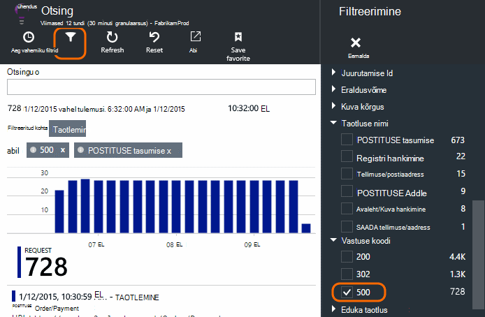

Ei sisalda väärtusi, teatud atribuudi valimise on sama mõju, valides kõik väärtused; See aktiveerib selle atribuudi filtreerimine välja.

### Otsingu piiritlemine

Pange tähele, et loendab paremas servas filtri väärtused kuvada mitu juhud seal on filtreeritud praeguse määramine. 

Selles näites on selgeks, mis on `Reports/Employees` taotleda 500 tõrgete enamik tulemusi:

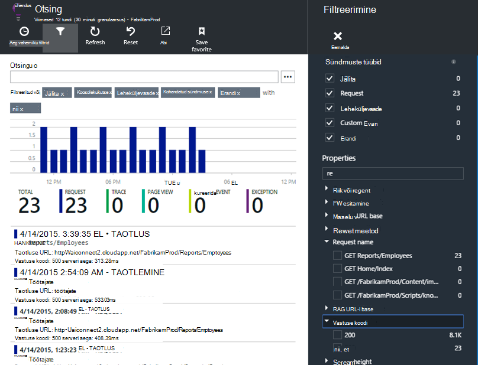

Samuti kui soovite vt ka muid sündmusi, mis olid juhtub sel ajal, märkige ruut **kaasa sündmuste määratlemata atribuutidega**.

## Robot ja web test liikluse eemaldamine

Filtri **reaal- või sünteetilisest liikluse** ja märkige ruut **Real**.

Samuti saate filtreerida **Allikas sünteetiliste liiklust**.

## Üksikute sündmuste uurimine

Lisada, et taotluse nime filtri seadmine ja seejärel saab kontrollida üksikute esinemiskordade sündmusega.

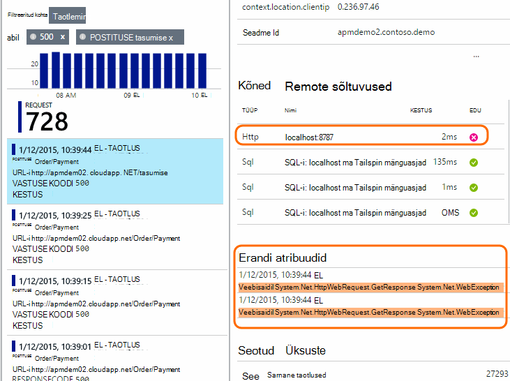

Taotluse sündmuste, Kuva üksikasjad ilmnes taotluse töötlemise erandid.

Klõpsake erandi näha selle üksikasjad, sh virnas jälitus.

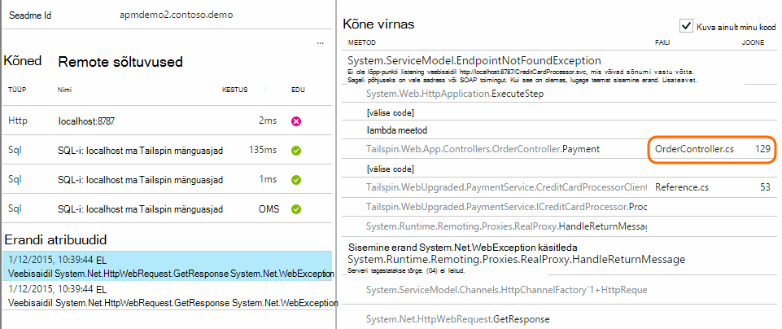

## Sündmuste sama atribuudiga otsimine

Kõigi üksuste sama väärtusega atribuut leidmiseks tehke järgmist.

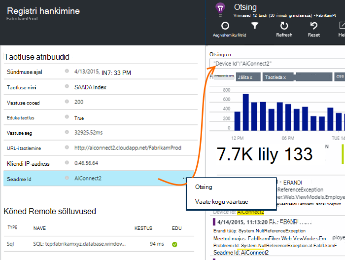

## Argumendil väärtuse järgi otsimine

Saada kutsed vastuse pidevalt > 5s.  Korda on esindatud puugid: 10 000 puugid = 1ms.

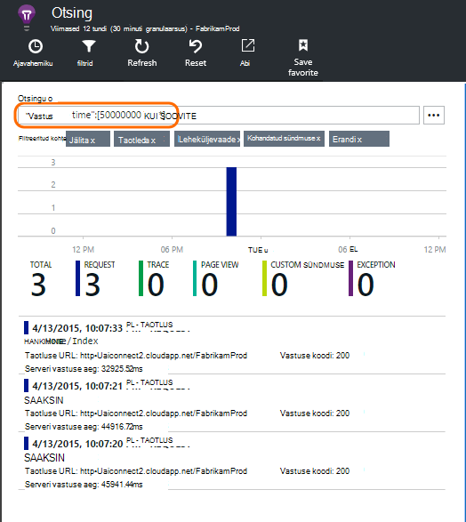

## Andmete otsimine

Saate otsida terminite ühtki atribuudi väärtust. See on eriti kasulik, kui olete loonud [kohandatud sündmused] [ track] atribuudi väärtustega. 

Võite aja vahemiku otsingud lühemaks vahemikus on kiirem. 

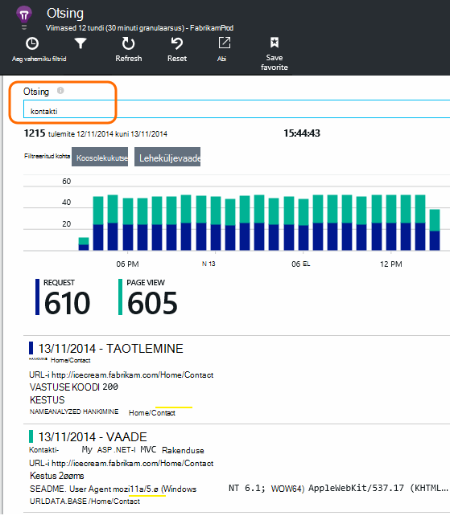

Otsige termineid, mitte kasutatavat võrdluslaadi. Termineid on tähtedest ja numbritest koosnev stringid, sealhulgas mõned kirjavahemärgid nagu "." ja "_". Näiteks:

Termini|*on suurem kui*|kuid need ei vasta
---|---|---
HomeController.About|kohta Avaleht|h\*kohta Avaleht\*
IsLocal|kohaliku on \*kohaliku|saared\* islocal i\*l\*
Uue viivitus|w d|uue viivitus n\* ja d\*

Siit leiate otsingu avaldiste abil saate:

Valimi päring | Efekti 
---|---
aeglane|Otsige üles kõik sündmused, mille väljad sisaldavad termin kuupäevavahemikku "aeglane"
andmebaasi?|Vastab database01, databaseAB... ? pole lubatud otsingutermin alguses.
andmebaasi * |Vastab andmebaasi, database01, databaseNNNN  * pole lubatud otsingutermin alguses
Apple'i ja banaan|Otsige sündmused, mis sisaldavad nii. Kasutage kapitali "ja" ei "ja".
Apple'i OR banaan Apple'i banaan|Otsige sündmusi, mis sisaldavad kas termin. Kasutage "Või" ei "või". < /br/ > lühike vorm.
Apple ei banaan õuna-banaan|Otsige sündmused, mis sisaldavad ühe termin, kuid mitte teiste. Lühike vorm.
rakenduse * ja banaan-(grape pear)|Loogika tehtemärgid ja kahvel.
"Meetermõõdustik": 0 kuni 500 "Meetermõõdustik": 500 * | Otsige sündmused, mis sisaldavad nimega mõõtühikute väärtus vahemikus.

## Otsingu salvestamine

Kui olete määranud kõik filtrid, mida soovite, saate salvestada selle otsingu lisamine lemmikute hulka. Kui töötate organisatsioonikonto, saate valida, kas selle ühiskasutusse teised meeskonna liikmed.

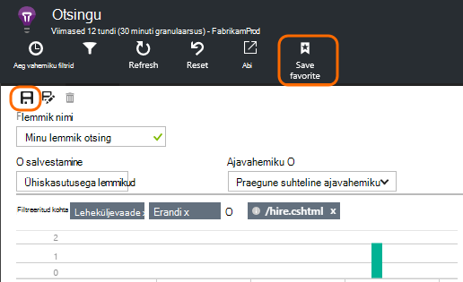

Otsingu uuesti, **minge ülevaade tera** näha ja avage lemmikud:

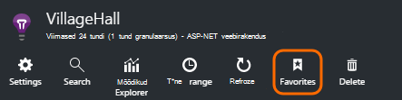

Kui salvestasite koos suhteline ajavahemiku, uuesti avada tera on värskeimad andmed. Kui salvestasite koos absoluutne ajavahemiku, näete samad andmed iga kord.

## Saada lisateavet telemeetria rakenduse ülevaated

Lisaks out-of-box telemeetria rakenduse ülevaateid SDK saadetud, saate teha järgmist.

* Jäädvustada jälgi Logi oma lemmik logimine [.NET] raamistiku[ netlogs] või [Java][javalogs]. See tähendab, et saate otsida jälitusandmete log ja need oleksid lehe vaateid, erandid ja muid sündmusi. 
* [Koodi kirjutamine] [ track] saata kohandatud sündmused, lehe vaadete ja erandid. 

[Siit saate teada, kuidas saata logid ja kohandatud telemeetria rakenduse ülevaated][trace].

## K & v

### Kui palju andmeid on alles?

Kuni 500 sündmuste sekundis iga rakendusest. Sündmused on alles seitse päeva.

### Kuidas vaadata postituse andmete minu server kutsed?

Me ei Logi postituse andmed automaatselt, kuid saate kasutada [TrackTrace või Logi kõned][trace]. Viige postituse andmed sõnumi parameeter. Ei saa filtreerida sõnumi saate atribuudid, kuid mahupiirangu on pikem.

## Järgmised sammud

* [Logide ja kohandatud telemeetria saata rakenduse ülevaated][trace]
* [Kättesaadavus ja tundlikkuse kontrollib häälestamine][availability]
* [Tõrkeotsing][qna]

<!--Link references-->

[availability]: app-insights-monitor-web-app-availability.md
[javalogs]: app-insights-java-trace-logs.md
[netlogs]: app-insights-asp-net-trace-logs.md
[qna]: app-insights-troubleshoot-faq.md
[start]: app-insights-overview.md
[trace]: app-insights-search-diagnostic-logs.md
[track]: app-insights-api-custom-events-metrics.md

 