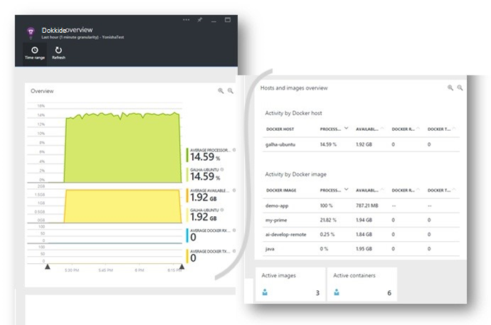
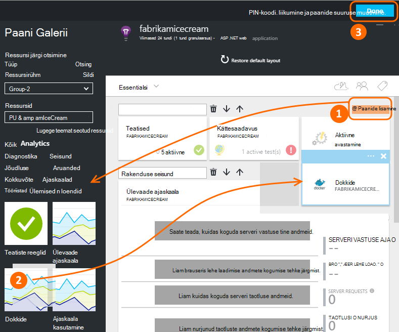
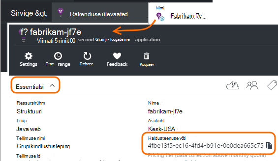
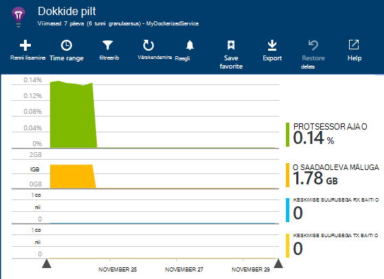
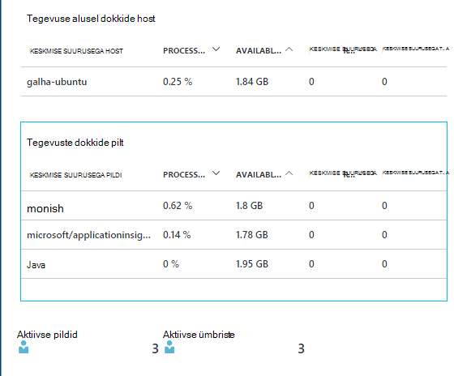
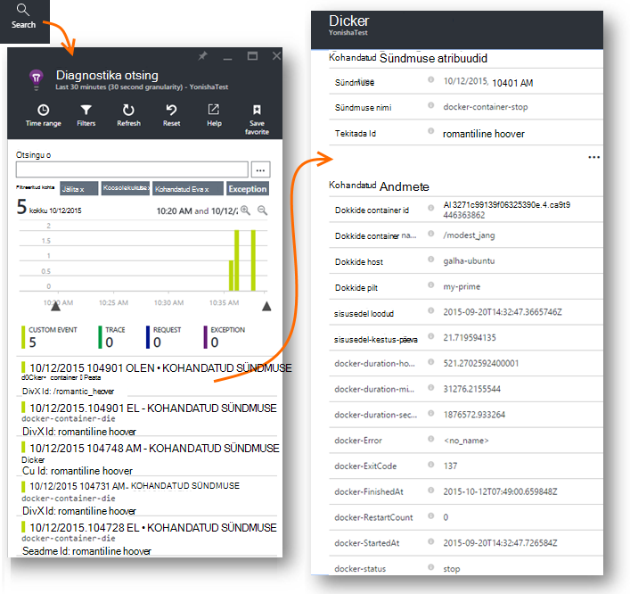
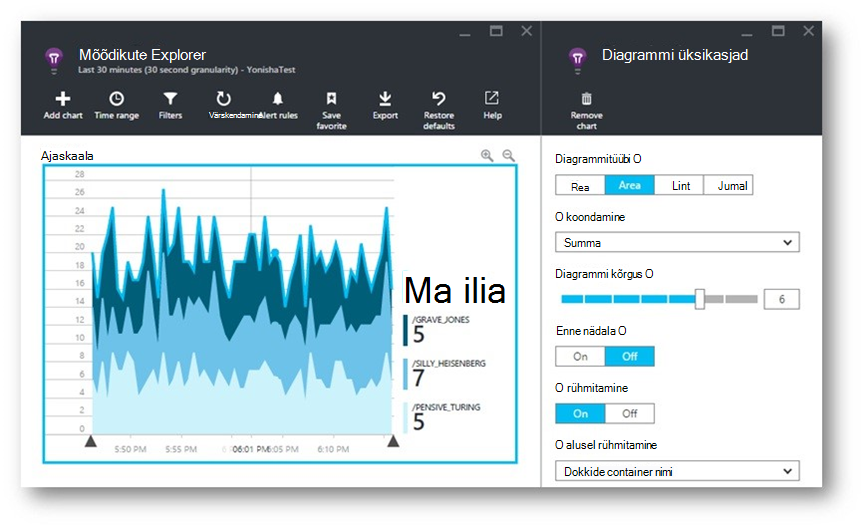
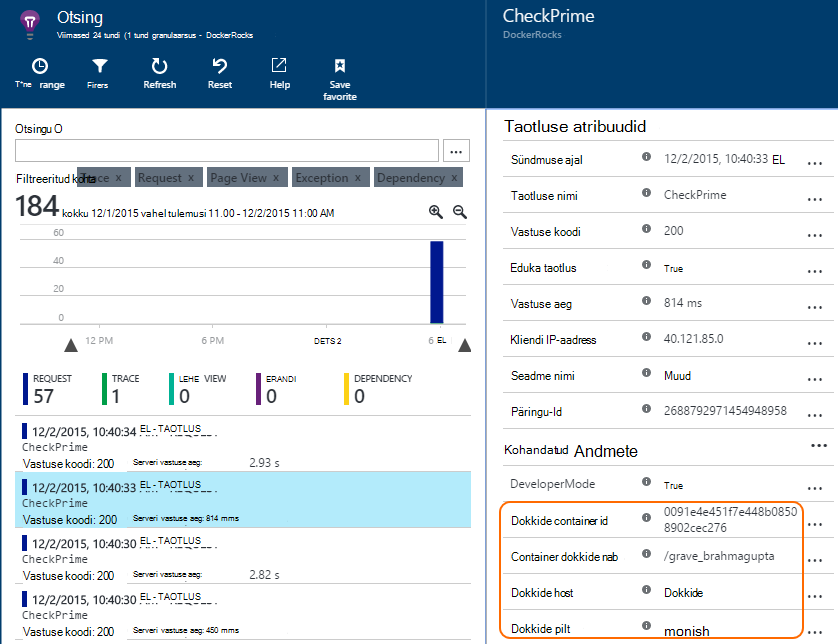
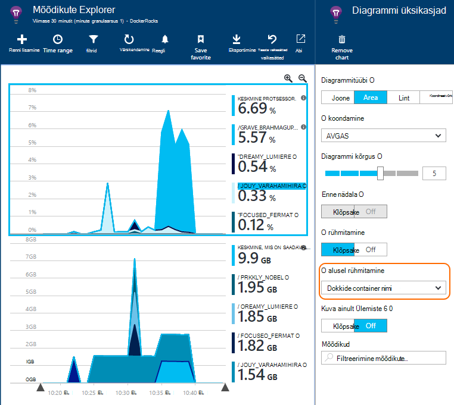

<properties 
    pageTitle="Rakenduse ülevaated keskmise suurusega rakenduste jälgimine" 
    description="Keskmise suurusega täiuslik hinnale ja sündmusi erandid saab kuvada rakenduse ülevaated, koos telemeetria konteinerite rakenduste kaudu." 
    services="application-insights" 
    documentationCenter=""
    authors="alancameronwills" 
    manager="douge"/>

<tags 
    ms.service="application-insights" 
    ms.workload="tbd" 
    ms.tgt_pltfrm="ibiza" 
    ms.devlang="na" 
    ms.topic="article" 
    ms.date="12/01/2015" 
    ms.author="awills"/>
 
# <a name="monitor-docker-applications-in-application-insights"></a>Rakenduse ülevaated keskmise suurusega rakenduste jälgimine

Elutsükli sündmuste ja jõudluse hinnale [keskmise suurusega](https://www.docker.com/) ümbriste kaudu saate kaardistatud rakenduse ülevaated kohta. Installige [Rakenduse ülevaated](app-insights-overview.md) pildi lisamine oma hosti ümbris paanide ja jõudluse hinnale kuvatakse selle hosti kui ka muid kujutisi.

Keskmise suurusega ja levitage rakenduste kerge ümbriste koos kõigi sõltuvused. Need käivitate mis tahes hosti arvutis, kus töötab keskmise suurusega Engine.

[Rakenduse ülevaated pilt](https://hub.docker.com/r/microsoft/applicationinsights/) oma keskmise suurusega hosti käivitamisel kuvatakse järgmisi eeliseid.

* Elutsükli telemeetria kohta kõik ümbriste, kus töötab Host - alustada, peatada jne.
* Kõik ümbriste jõudluseloendurid. CPU, mälu, võrgu kasutamine ja muud.
* Kui [rakenduse ülevaateid SDK installitud](app-insights-java-live.md) rakendused on ümbriste töötab, kõikide nende rakenduste telemeetria on tuvastamise container ja host masina täiendavad atribuudid. Nii näiteks, kui teil on rohkem kui üks host töötab rakenduse eksemplari, saate hõlpsalt juurde oma rakenduse telemeetria host järgi filtreerida.




## <a name="set-up-your-application-insights-resource"></a>Oma rakenduse ülevaated ressursi häälestamine

1. [Microsoft Azure'i portaali](https://azure.com) sisse logida ja avage rakenduse ülevaated ressursi oma rakenduse; või [looge uus](app-insights-create-new-resource.md). 

    *Millist ressursi kasutada?* Kui kellegi teise poolt välja töötatud rakendused, mida kasutate oma hosti, siis peate luua [uue rakenduse ülevaated ressursi](app-insights-create-new-resource.md). See on, kus vaadata ja analüüsida telemeetria. (Valige "Muu" Rakenduse tüübi.)

    Kuid kui olete arendaja rakendused, siis loodame, äsja [lisatud rakenduse ülevaateid SDK](app-insights-java-live.md) igale. Kui need on kõik tõesti komponendid ühe ärirakendusele, siis võivad kõik need telemeetria saatmiseks üks ressurss konfigureerimine ja saate seda sama ressursi abil keskmise suurusega elutsükkel ja jõudluse andmeid kuvada. 

    Kolmas stsenaarium on teil tekkinud enamik apps, et kasutate oma telemeetria kuvamiseks eraldi ressursid. Sel juhul ilmselt samuti saate luua eraldi ressursi andmete keskmise suurusega. 

2.  Keskmise suurusega paani lisa: valige **Paan lisage**, lohistage paani keskmise suurusega galeriist ja seejärel klõpsake nuppu **valmis**. 

    


3. Klõpsake ripploendis **Essentialsi** ja kopeerige Instrumentation võti. Saate kasutada seda öelda SDK, kust selle telemeetria saata.


    

Käepärast selle brauseriaknas, kui te saate naasta selle kiiresti vaadata oma telemeetria.


## <a name="run-the-application-insights-monitor-on-your-host"></a>Käivitage oma hosti rakenduse ülevaated kuvari
 
Nüüd, kui teil on kuskil telemeetria kuvamiseks, saate häälestada konteinerite rakenduse, et koguda ja saatke see.

1.  Ühenduse loomine oma keskmise suurusega hosti. 
2.  Redigeerida instrumentation võtme sisse selle käsu ja seejärel käivitage see:
 
    ```

    docker run -v /var/run/docker.sock:/docker.sock -d microsoft/applicationinsights ikey=000000-1111-2222-3333-444444444
    ```

Ainult üks rakenduse ülevaated pilt on vaja keskmise suurusega hosti kohta. Kui teie taotlus on juurutatud mitme keskmise suurusega hosts, seejärel korrake iga hosti käsku.

## <a name="update-your-app"></a>Rakenduse värskendamine

Kui teie taotlus on kinnitatakse [Rakenduse ülevaateid SDK Java](app-insights-java-get-started.md), lisage järgmine rida oma projekti ApplicationInsights.xml faili alla soovitud `<TelemetryInitializers>` elementi:

```xml

    <Add type="com.microsoft.applicationinsights.extensibility.initializer.docker.DockerContextInitializer"/> 
```

Keskmise suurusega teavet, nt container ja host id lisatakse iga saadetud rakenduste telemeetria üksus.

## <a name="view-your-telemetry"></a>Saate vaadata oma telemeetria

Minge tagasi oma rakenduse ülevaated ressursi Azure'i portaalis.

Klõpsake paani keskmise suurusega.

Varsti näete andmete saabuvad keskmise suurusega rakendus, eriti siis, kui teil on muud ümbriste töötab teie keskmise suurusega mootori.


Siin on mõned vaated, võite saada.

### <a name="perf-counters-by-host-activity-by-image"></a>Täiuslik väidab vastu host tegevuse pilt








Klõpsake mis tahes hosti või pildi nime üksikasju.


Vaate kohandamiseks klõpsake mis tahes diagrammi ruudustiku pealkiri, või kasutage diagrammi lisada. 

[Lisateavet leiate teemast mõõdikute Explorer](app-insights-metrics-explorer.md).

### <a name="docker-container-events"></a>Keskmise suurusega container sündmused




Uurige üksikuid sündmusi, klõpsake nuppu [Otsi](app-insights-diagnostic-search.md). Otsingu ja filtreerimise sündmused, mida soovite leida. Klõpsake mõnda sündmust täpsemat teavet.
 
### <a name="exceptions-by-container-name"></a>Erandid container nime järgi
 



### <a name="docker-context-added-to-app-telemetry"></a>Keskmise suurusega kontekstis rakenduse telemeetria loendisse

Taotlege telemeetria saadetud rakendus kinnitatakse AI Tarkvaraarenduskomplektist, rikastatud keskmise suurusega kontekstis.



Protsessor aja ja saadaoleva mäluga jõudluse hinnale, rikastatud ja rühmitatud keskmise suurusega container nime järgi.





## <a name="q--a"></a>K & v

*Mida tähendab rakenduse ülevaated mulle mida ma ei saa alla keskmise suurusega?*

* Üksikasjalik jaotus jõudluse hinnale container ja pilt.
* Integreerige ühe armatuurlaua container ja rakenduse andmeid.
* Täpsemaks analüüsimiseks andmebaasi, Power BI või muude armatuurlaua [telemeetria eksportida](app-insights-export-telemetry.md) .

*Kuidas saan ennast rakendusest telemeetria?*

* Installige rakenduse ülevaated SDK rakendus. Siit saate teada, kuidas jaoks: [Java veebirakenduste](app-insights-java-get-started.md), [Windows web apps](app-insights-asp-net.md).
