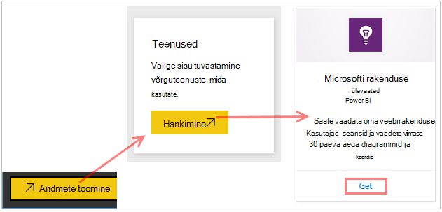
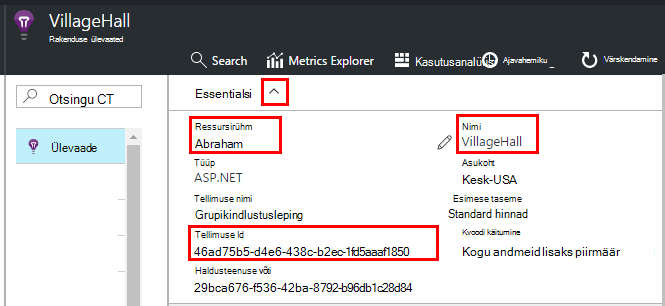
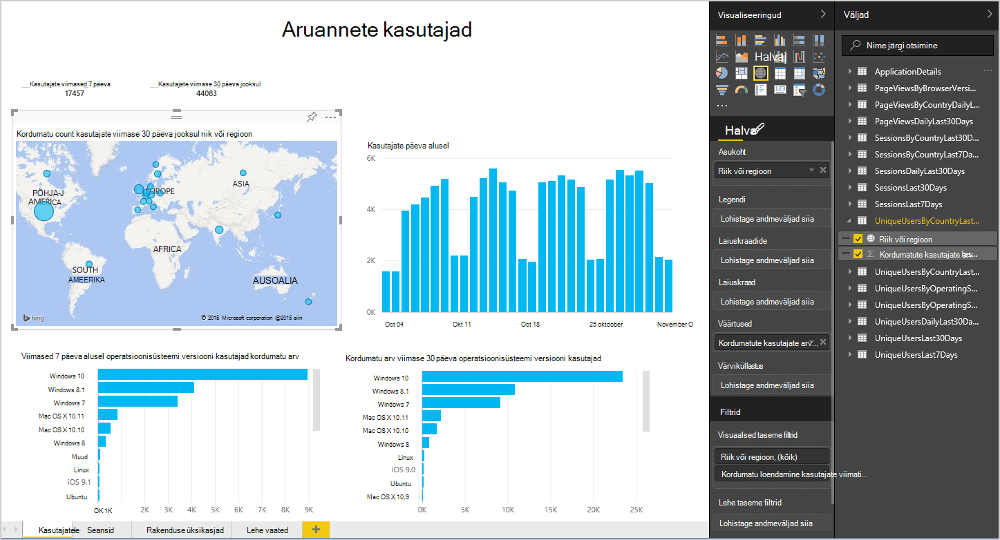
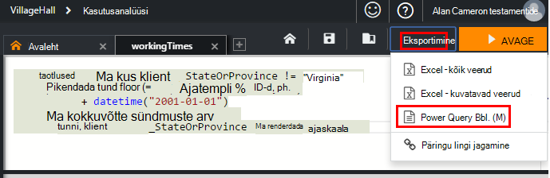
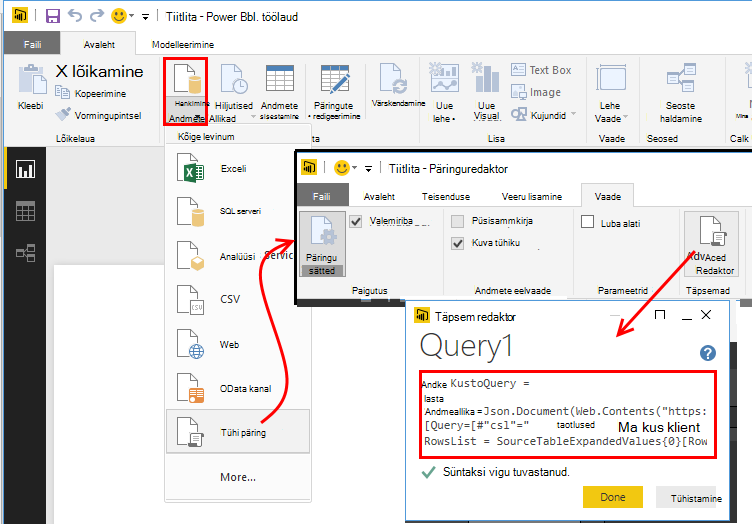
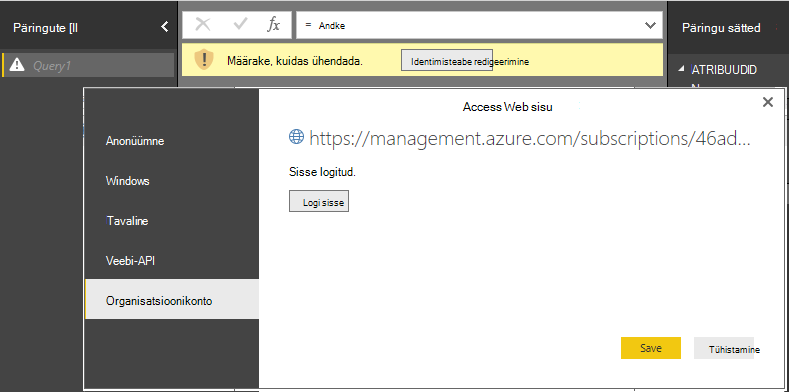
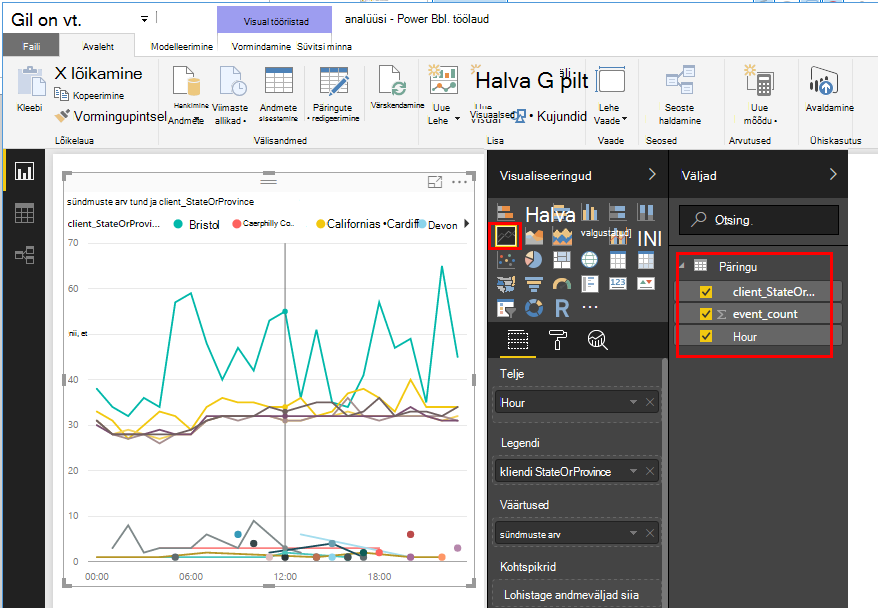
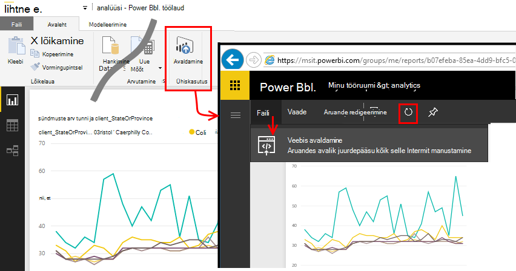

<properties 
    pageTitle="Power BI rakenduse ülevaated eksportimine | Microsoft Azure'i" 
    description="Päringute Kasutusanalüüsi saab kuvada Power BI." 
    services="application-insights" 
    documentationCenter=""
    authors="noamben" 
    manager="douge"/>

<tags 
    ms.service="application-insights" 
    ms.workload="tbd" 
    ms.tgt_pltfrm="ibiza" 
    ms.devlang="na" 
    ms.topic="article" 
    ms.date="10/18/2016" 
    ms.author="awills"/>

# Kanali Power BI rakenduse ülevaated

[Power BI](http://www.powerbi.com/) on komplekti business analüütilisi tööriistu, mis aitavad teil andmeid analüüsida ja tulemuste jagamiseks. RTF-vormingus armatuurlauad on saadaval igas seadmes. Saate ühendada mitmest allikast, sh Analytics päringud [Visual Studio rakenduse](app-insights-overview.md)ülevaated andmed.

On kolme soovitatavate Power BI rakenduse ülevaated andmed eksportida. Saate neid kasutada koos või eraldi.

* [**Power BI adapterit**](#power-pi-adapter) - häälestamine lõpule jõudnud, telemeetria armatuurlaua rakenduse kaudu. Eelmääratletud kogumi, diagrammid, kuid saate lisada oma päringuid muudest allikatest.
* [**Päringute Kasutusanalüüsi ekspordi**](#export-analytics-queries) - kirjutada mis tahes päringu abil Analytics soovite ja eksportimine Power BI. Muud andmed koos armatuurlaual saate paigutada selle päringu.
* [**Pidev ekspordi ja voo Analytics**](app-insights-export-stream-analytics.md) – see hõlmab rohkem töö häälestamiseks. See on kasulik, kui soovite säilitada oma andmete pika aja. Muul juhul on soovitatav muid viise.

## Power BI adapterit

See meetod loob lõpule jõudnud, telemeetria armatuurlaua. Eelmääratletud algse andmehulga, kuid saate selle lisada rohkem andmeid.

### Funktsiooni adapterit hankimine

1. Logige sisse [Power BI](https://app.powerbi.com/).
2. **Andmete toomine**, **teenustega**, **Rakenduse ülevaated** avamine

    

3. Sisestage oma rakenduse ülevaated ressursi üksikasju.

    

4. Oodake paar minutit kaks andmete importimist.

    

Saate redigeerida armatuurlaua, kombineerides rakenduse ülevaated diagrammide neile muudest allikatest ja Analytics päringud. On visualiseeringu Galerii, kus saate lisateavet diagrammide ja iga diagrammil on soovitud parameetrid saate määrata.

Pärast algse importida, armatuurlaud ja aruannete jätkuvalt värskendada iga päev. Saate määrata värskendamise ajakava andmekomplekti kohta.

## Päringute Kasutusanalüüsi eksportimine

Selle protsessi võimaldab teil kirjutada mis tahes Analytics päring, mis teile meeldib, ja seejärel eksportida mis Power BI armatuurlaua. (Saate lisada soovitud adapterit loodud armatuurlaud.)

### Üks kord: Power BI Desktopi installimine

Importimine rakenduse ülevaated päringu, kasutage Power BI töölauaversiooni. Kuid seejärel avaldate selle veebis või oma Power BI pilveteenuse tööruumi. 

Installige [Power BI Desktopi](https://powerbi.microsoft.com/en-us/desktop/).

### Ekspordi Analytics päring

1. [Avatud Analytics ja kirjutage oma päringu](app-insights-analytics-tour.md).
2. Testige ja kitsendada, kuni olete tulemusega rahul.
3. Valige menüüs **ekspordi** **Power BI (M)**. Salvestage tekstifail.

    
4. Power BI Desktopi valige **Saada andmed tühi päring** ja **seejärel päringuredaktoris, märkige **Täpsem Päringuredaktor**** .

    Dokumendi kirjutuskaitstuks eksporditud M keele üheks Täpsem Päringuredaktor.

    

5. Peate Power BI Azure'i juurdepääsu lubamiseks mandaati. Kasutage 'organisatsioonikonto' oma Microsofti kontoga sisse logima.

    

6. Valige visualiseering päringut ja x-telje, y-telge ja tükeldada mõõtme väljad.

    

7. Aruande avaldamine Power BI pilveteenuse tööruumi. Sealt saate embed muude veebilehtede sünkroonitud versioon.

    
 
8. Värskendada aruande käsitsi intervalliga või häälestada ajastatud värskendamise lehe suvandid.

## Valimite kohta

Kui teie rakendus saadab palju andmeid, kohandatava valimite funktsiooni käitamiseks ja saada ainult teie telemeetria protsent. Sama kehtib ka siis, kui teil on käsitsi valimite SDK või manustamisest. [Lugege lisateavet valimite.](app-insights-sampling.md)
 

## Järgmised sammud

* [Power BI – siit saate teada,](http://www.powerbi.com/learning/)
* [Kasutusanalüüsi õpetus](app-insights-analytics-tour.md)
