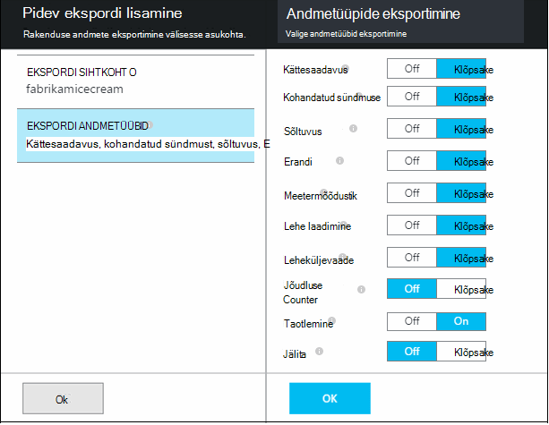

<properties 
    pageTitle="Kasutage voo Analytics rakenduse ülevaated eksporditud andmete töötlemiseks | Microsoft Azure'i" 
    description="Voo analüüsi pidevalt saate muuta, filtreerimine ja andmete eksportimise rakenduse ülevaated." 
    services="application-insights" 
    documentationCenter=""
    authors="noamben" 
    manager="douge"/>

<tags 
    ms.service="application-insights" 
    ms.workload="tbd" 
    ms.tgt_pltfrm="ibiza" 
    ms.devlang="na" 
    ms.topic="article" 
    ms.date="10/18/2016" 
    ms.author="awills"/>

# <a name="use-stream-analytics-to-process-exported-data-from-application-insights"></a>Kasutage voo Analytics rakenduse ülevaated eksporditud andmete töötlemiseks

[Azure'i voo Analytics](https://azure.microsoft.com/services/stream-analytics/) on optimaalne tööriista andmed [eksportida rakenduse ülevaated](app-insights-export-telemetry.md)töötlemiseks. Voo Analytics saavad tuua andmeid erinevatest allikatest. See transformatsioon ja andmete filtreerimine ja seejärel marsruutida mitmesuguseid valamud.

Selles näites loome adapterit, mis võtab andmed rakenduse ülevaated, nimetab ja töötleb mõnda välja ja torud selle Power BI.

> [AZURE.WARNING] On palju parem ja lihtsam on [soovitatav võimalust kuvada Power BI rakenduse ülevaated andmeid](app-insights-export-power-bi.md). Siin kujutatud tee on lihtsalt näide selgitavad, kuidas eksporditud andmete töötlemiseks.


## <a name="create-storage-in-azure"></a>Azure'i salvestusruumi loomine

Pidev ekspordi tulemused alati Azure Storage konto andmeid nii, et peate esmalt looma talletamist.

1.  "Classic" salvestusruumi konto teie tellimus [Azure portaali](https://portal.azure.com)loomine.

    

2. Ümbris loomine

    

3. Kopeerige salvestusruumi kiirklahv

    Peate selle kiiresti häälestada voo analytics teenuse sisendi.

    

## <a name="start-continuous-export-to-azure-storage"></a>Azure'i salvestusruumi pidev ekspordi käivitamine

[Pidev eksportimine](app-insights-export-telemetry.md) teisaldab andmed rakenduse teadmisi Azure salvestusruumi.

1. Azure portaali, otsige üles rakenduse jaoks loodud rakenduse ülevaated ressurss.

    

2. Saate luua pidev ekspordi.

    


    Valige varem loodud salvestusruumi konto.

    
    
    Sündmuste tüübid, mida soovite näha seadmiseks tehke järgmist.

    

3. Lubage koguda andmeid. Istuda ja andke rakenduse kasutamiseks aega. Telemeetria tulevad ja te näete, statistilised diagrammid [argumendil](app-insights-metrics-explorer.md) Exploreris ja üksikute sündmuste [diagnostika otsing](app-insights-diagnostic-search.md). 

    Ja ka salvestusruumi ekspordib andmed. 

4. Kontrolli eksporditud andmeid. Visual Studio, valige **vaatamine / Cloud Explorer**, ja avage Azure'i / salvestusruumi. (Kui teil pole menüüvalikuid, on vaja installida Azure SDK: avage dialoogiboks uue projekti ja avage Visual C# / Cloud / saada Microsoft Azure'i SDK .net-i jaoks.)

    

    Kirjutage tee nimi, mis on saadud rakenduse nimi ja seadmeid võti ühisosa. 

Sündmuste Bloobivahemälu JSON-vormingus failide kirjutada. Iga fail võib sisaldada ühe või mitme sündmused. Nii soovime sündmuse andmete lugemine ja filtreerida soovime väljad. On igasuguseid asju, mida me ei andmeid, kuid meie plaan on juba täna kasutada voo Analytics andmete Power BI toru.

## <a name="create-an-azure-stream-analytics-instance"></a>Azure'i voo Analytics eksemplari loomine

[Klassikaline Azure portaali](https://manage.windowsazure.com/), valige Azure voo Analytics teenuse ja looge uus voo Analytics töö:


Kui luuakse uus töökoht, laiendage oma üksikasjad:


### <a name="set-blob-location"></a>Bloobimälu asukoha määramine

Selle tegemiseks oma pidev eksportimine bloobimälu sisend seadmiseks tehke järgmist.


Nüüd peate Accessi primaarvõtme salvestusruumi konto, mis eespool märgitud. Määrake see salvestusruumi konto võti.


### <a name="set-path-prefix-pattern"></a>Mustri määramine tee eesliite 


**Ärge unustage määratud kuupäeva vormingus YYYY-MM-DD (koos kriipsud).**

Tee eesliite mustri saate määrata, kui voo Analytics leiab Sisestuskeel failide talletamist. Peate määrama selle vastavad kuidas pidev eksportimine talletatakse andmeid. Määraks umbes järgmine:

    webapplication27_12345678123412341234123456789abcdef0/PageViews/{date}/{time}

Selles näites:

* `webapplication27`on rakenduse ülevaated ressursi **kõigi väiketähtedes**nimi.
* `1234...`on rakenduse ülevaated ressursi, **jättes kriipsud**instrumentation võti. 
* `PageViews`on tüüpi andmeid, mida soovite analüüsida. Saadaval tüübid sõltuvad seate pidev eksportimine filter. Eksporditud andmete kuvamiseks saadaval tüüpi uurida ja vaadake [mudeli andmete eksportimine](app-insights-export-data-model.md).
* `/{date}/{time}`mustri kirjutatakse sõna-sõnalt.

> [AZURE.NOTE] Kontrolli veendumaks, et te õige tee salvestusruumi.

### <a name="finish-initial-setup"></a>Valmis Alghäälestus

Kinnitage sariväljaanne vorming:


Sulgege viisard ja Oodake häälestamise lõpuleviimiseks.

> [AZURE.TIP] Valimi käsu abil saate alla laadida mõned andmed. Jätke see proovi silumine päringu abil.

## <a name="set-the-output"></a>Määrake väljund

Nüüd valige oma töö ja määrata väljundi.


Sisestage oma **töö- või koolikontoga** voo Analytics oma Power BI ressursi juurdepääsu lubada. Seejärel looge väljund ja target Power BI andmekomplekti ja tabeli nimi.


## <a name="set-the-query"></a>Päringu seadmine

Päringu reguleerib sisend väljund tõlge.


Kasutage funktsiooni Test kontrollimaks, et saate õige väljund. Sellele näidisandmed, mida tegite sisendina lehe kaudu. 

### <a name="query-to-display-counts-of-events"></a>Päringu kuvamiseks loendab sündmused

Kleepige see päring:

```SQL

    SELECT
      flat.ArrayValue.name,
      count(*)
    INTO
      [pbi-output]
    FROM
      [export-input] A
    OUTER APPLY GetElements(A.[event]) as flat
    GROUP BY TumblingWindow(minute, 1), flat.ArrayValue.name
```

* ekspordi-sisend on meil andis sisestusmeetodi voo pseudonüüm
* PBI-väljund on meil määratletud väljundi pseudonüüm
* Kasutame [väline rakendada GetElements](https://msdn.microsoft.com/library/azure/dn706229.aspx) , kuna sündmuse nimi on pesastatud JSON arrray. Seejärel valige huvitavat sündmuse nimi koos aja jooksul nimega eksemplaride arvu. Klausel [Group By](https://msdn.microsoft.com/library/azure/dn835023.aspx) rühmitab elementide ajaperioodide 1 minuti jooksul.


### <a name="query-to-display-metric-values"></a>Päringu argumendil väärtuste kuvamiseks


```SQL

    SELECT
      A.context.data.eventtime,
      avg(CASE WHEN flat.arrayvalue.myMetric.value IS NULL THEN 0 ELSE  flat.arrayvalue.myMetric.value END) as myValue
    INTO
      [pbi-output]
    FROM
      [export-input] A
    OUTER APPLY GetElements(A.context.custom.metrics) as flat
    GROUP BY TumblingWindow(minute, 1), A.context.data.eventtime

``` 

* Selle päringu õppused üheks mõõdikute telemeetria sündmuse aeg ja argumendil väärtus. Argumendil väärtused massiivi sees me kasutame GetElements väline rakendada mustreid ridade eraldamiseks. "myMetric" on sel juhul mõõdiku nimi. 

### <a name="query-to-include-values-of-dimension-properties"></a>Päringu hõlmata dimensiooni atribuute

```SQL

    WITH flat AS (
    SELECT
      MySource.context.data.eventTime as eventTime,
      InstanceId = MyDimension.ArrayValue.InstanceId.value,
      BusinessUnitId = MyDimension.ArrayValue.BusinessUnitId.value
    FROM MySource
    OUTER APPLY GetArrayElements(MySource.context.custom.dimensions) MyDimension
    )
    SELECT
     eventTime,
     InstanceId,
     BusinessUnitId
    INTO AIOutput
    FROM flat

```

* See päring sisaldab dimensiooni atribuute ilma kindla mõõde on fikseeritud index mõõtme massiivis sõltuvalt.

## <a name="run-the-job"></a>Töö

Saate valida varem kaudu töö alustamiseks kuupäeva. 


Oodake, kuni töö töötab.

## <a name="see-results-in-power-bi"></a>Power BI tulemuste vaatamiseks

> [AZURE.WARNING] On palju parem ja lihtsam on [soovitatav võimalust kuvada Power BI rakenduse ülevaated andmeid](app-insights-export-power-bi.md). Siin kujutatud tee on lihtsalt näide selgitavad, kuidas eksporditud andmete töötlemiseks.

Avage Power BI töö või kooli kontot ja valige andmekomplekti ja tabel, mis on määratletud väljundina voo Analytics töö.


Nüüd saate selle andmehulga aruannetes ja armatuurlaudadel [Power](https://powerbi.microsoft.com)bi.


## <a name="no-data"></a>Pole andmeid?

* Kontrollige, et [kuupäevavormingu](#set-path-prefix-pattern) õigesti YYYY-MM-DD (koos kriipsud).


## <a name="video"></a>Video

Noam Ben Zeev näitab, kuidas eksporditud abil voo Analytics andmete töötlemiseks.

> [AZURE.VIDEO export-to-power-bi-from-application-insights]

## <a name="next-steps"></a>Järgmised sammud

* [Pidev eksport](app-insights-export-telemetry.md)
* [Üksikasjalike andmete modelleerimise viide atribuudi tüüpi ja väärtused.](app-insights-export-data-model.md)
* [Rakenduse ülevaated](app-insights-overview.md)
* [Lisateavet näidiseid ja juhendavad tutvustused](app-insights-code-samples.md)
 
