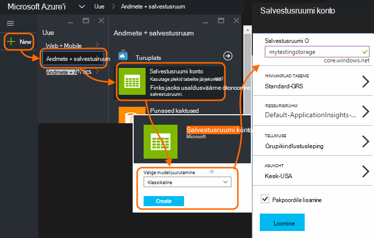
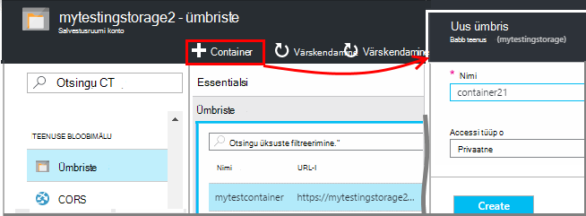
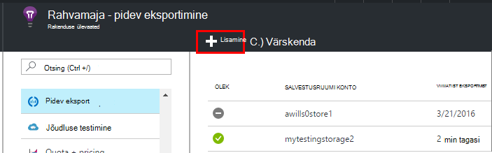
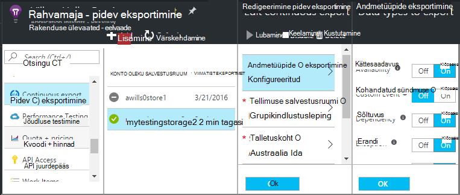
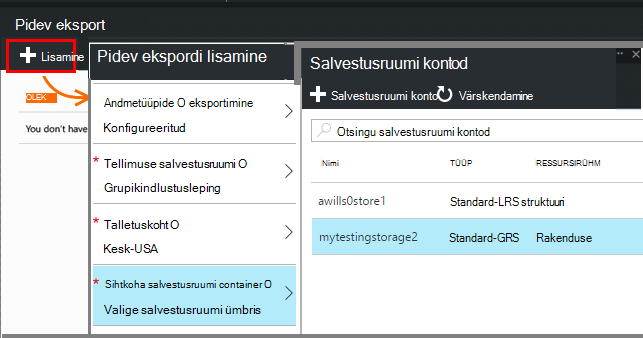
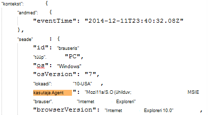
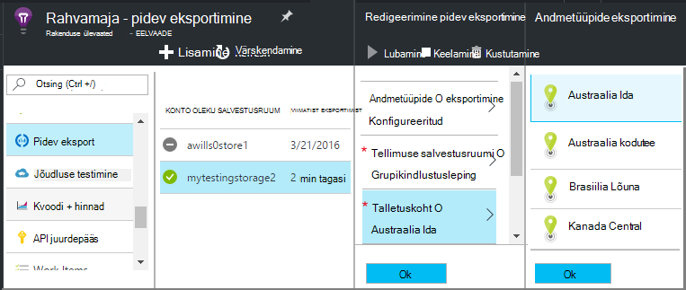

<properties 
    pageTitle="Pidev eksportimine telemeetria rakenduse ülevaated | Microsoft Azure'i" 
    description="Diagnostika- ja kasutusandmete andmete eksportimine Microsoft Azure salvestusruumi ja laadige see seal." 
    services="application-insights" 
    documentationCenter=""
    authors="alancameronwills" 
    manager="douge"/>

<tags 
    ms.service="application-insights" 
    ms.workload="tbd" 
    ms.tgt_pltfrm="ibiza" 
    ms.devlang="na" 
    ms.topic="article" 
    ms.date="10/18/2016" 
    ms.author="awills"/>
 
# Telemeetria eksportimine rakenduse ülevaated

Kas soovite säilitada oma telemeetria rohkem kui standard säilitusperiood? Või eriotstarbeline kuidagi töödelda? Pidev ekspordi see sobib. Näete rakenduse ülevaated portaalis sündmuste saab eksportida salvestusruumi Microsoft Azure JSON-vormingus. Seal saate oma andmete allalaadimine ja kirjutada, mida iganes tõrkekood on vaja seda protsessi.  

Pidev ekspordi on saadaval tasuta prooviversiooni lõppedes ja [Standard- ja Premium paketid](https://azure.microsoft.com/pricing/details/application-insights/).

Pidev ekspordi häälestamiseks on mõned alternatiivid, võiksite kaaluda.

* [The eksport nuppu](app-insights-metrics-explorer.md#export-to-excel) ülaosas mõõdikute või otsingu tera võimaldab edastamine tabelid ja diagrammid Exceli arvutustabeliks. 
* [Kasutusanalüüsi](app-insights-analytics.md) pakub võimsaid päringukeele telemeetria ja ka ekspordi tulemused.
* Kui otsite [Power BI andmete analüüsimine](http://blogs.msdn.com/b/powerbi/archive/2015/11/04/explore-your-application-insights-data-with-power-bi.aspx), saate seda teha kasutamata pidev eksportida.

## Salvestusruumi konto loomine

Kui te pole veel "classic" salvestusruumi konto, luua kohe.

1. Salvestusruumi konto teie tellimus [Azure portaali](https://portal.azure.com)loomine.

    

2. Looge ümbris.

    

## Pidev eksportimine häälestamine

Avage oma rakenduste ülevaade rakenduse ülevaated portaalis labale pidev eksportimine: 

Pidev ekspordi lisada, ja valige tüüpi sündmusi, mida soovite eksportida.

Valige või looge [Azure storage konto](../storage/storage-introduction.md) , kuhu soovite salvestada andmed:

Kui olete loonud oma ekspordi, see algab minna. (Ainult saate andmeid saabub pärast loomist ekspordi.) 

Ei saa olla umbes üks tund enne andmed kuvatakse soovitud bloobimälu viivitusega.

Kui soovite hiljem muuta tüüpi sündmusi, redigeerige ekspordi:

Voo peatamiseks klõpsake nuppu Keela. Kui klõpsate nuppu Luba uuesti, uuesti voo uute andmetega. Te ei saa andmeid, mis saabusid portaalis ajal ekspordi keelamist.

Voo peatamiseks jäädavalt kustutada ekspordi. Seda tehes ei kustutata andmete salvestusruumi.

#### Ei saa lisada ega muuta ekspordi?

* Lisamiseks või muutmiseks ekspordi, peate omanik, kaasautor või rakenduse ülevaateid kaasautor pääsuõigused. [Lisateavet rollide][roles].

## Millised sündmused saate hankida?

Eksporditud andmeid on töötlemata telemeetria, saame rakenduse, kuid me lisada asukoht andmeid, mida me arvutada kliendi IP-aadress. 

Andmed, mis on hüljatud [proovide](app-insights-sampling.md) pole kaasatud eksporditud andmeid.

Muude Arvutatud mõõdikute ei sisalda. Näiteks me ei ekspordi Keskmine CPU kasutamine, kuid me eksportida töötlemata telemeetria, millest on arvutatud keskmine.

Andmed sisaldavad ka, [kättesaadavus web testide](app-insights-monitor-web-app-availability.md) seadistamist. 

> [AZURE.NOTE] **Valimite.** Kui rakenduse saadetakse palju andmeid ja kasutate rakenduse ülevaateid SDK ASP.net-i versioon 2.0.0-beta3 või uuem versioon, kohandatava valimite funktsioonide käitamiseks ning saatmine ainult teie telemeetria protsent. [Lugege lisateavet valimite.](app-insights-sampling.md)

## Andmete uurimine

Otse portaalis talletamist saab kontrollida. Klõpsake nuppu **Sirvi**, valige oma konto salvestusruumi ja avage **ümbriste**.

Kontrolli Azure storage Visual Studios, avage **Vaade**, **Cloud Explorer**. (Kui teil pole selle menüükäsu, on vaja installida Azure SDK: avage dialoogiboks **Uue projekti** , laiendage Visual C# / Cloud ja valige **Saada Microsoft Azure'i SDK .net-i jaoks**.)

Kui avate oma bloobimälu salvestada, kuvatakse teile bloobimälu failide kogum, mille maht. Iga faili URI saadud oma rakenduse ülevaated ressursinimi, haldusteenuse klahvi, telemeetria tüüp/kuupäev/kellaaeg. (Ressursi nimi on väiketähtedega ja haldusteenuse võti jätab kriipsud.)

Kuupäeva ja kellaaja on UTC ja kui telemeetria on talletatud poes - pole aega tekkis. Nii kui kood allalaadimiseks andmete kirjutamiseks selle teisaldada lineaarses kaudu andmeid.

Siin on tee kujul:

    $"{applicationName}_{instrumentationKey}/{type}/{blobDeliveryTimeUtc:yyyy-MM-dd}/{ blobDeliveryTimeUtc:HH}/{blobId}_{blobCreationTimeUtc:yyyyMMdd_HHmmss}.blob"
  
Kui 

-   `blobCreationTimeUtc`on kellaaeg bloobimälu sisse sisemise lavastus salvestusruumi
-   `blobDeliveryTimeUtc`kui ekspordi sihtkoht salvestusruumi kopeeritakse bloobimälu korda

## Andmete vormindamine

* Iga bloobimälu on tekstifail, mis sisaldab mitme "\n'-separated read. See sisaldab telemeetria, töödeldud aja jooksul umbes pool minutit.
* Iga rea tähistab telemeetria andmepunkti, nt koosolekukutse või lehe vaate.
* Igal real on vormindamata JSON dokument. Kui soovite istuda ja seda vahtima, avage see Visual Studio ja valige Redigeeri täpsemalt vormingus faili:

Aja kestused on puugid, kus 10 000 puugid = 1ms. Näiteks need väärtused kuvada 1ms päringu saatmiseks brauserist 3ms saama ja 1.8s töödelda brauseris lehe kellaaeg:

    "sendRequest": {"value": 10000.0},
    "receiveRequest": {"value": 30000.0},
    "clientProcess": {"value": 17970000.0}

[Üksikasjalike andmete modelleerimise viite tüüpi atribuuti ja väärtused.](app-insights-export-data-model.md)

## Andmete töötlemiseks

Väike skaalal kirjutamise mõned koodi tõmmake andmete, lugege selle arvutustabelisse jne. Näiteks:

    private IEnumerable<T> DeserializeMany<T>(string folderName)
    {
      var files = Directory.EnumerateFiles(folderName, "*.blob", SearchOption.AllDirectories);
      foreach (var file in files)
      {
         using (var fileReader = File.OpenText(file))
         {
            string fileContent = fileReader.ReadToEnd();
            IEnumerable<string> entities = fileContent.Split('\n').Where(s => !string.IsNullOrWhiteSpace(s));
            foreach (var entity in entities)
            {
                yield return JsonConvert.DeserializeObject<T>(entity);
            }
         }
      }
    }

Suurem proovi kood, lugege teemat [abil töötaja roll][exportasa].

## Vana andmete kustutamine
Palun pidage meeles, et hallata oma salvestusruumi ja vana andmete kustutamist, kui vaja. 

## Kui te taastada salvestusruumi võtme...

Salvestusruumi klahvi muutmisel ei tööta enam pidev ekspordi. Kuvatakse teade Azure'i kontosse. 

Pidev eksportimine tera avada ja redigeerida oma ekspordi. Ekspordi sihtkoht redigeerida, kuid jäta valitud sama talletamist. Kinnitamiseks klõpsake nuppu OK.

Pidev ekspordi uuesti.

## Näidised eksportimine

* [SQL-i abil töötaja roll eksportimine][exportcode]
* [SQL-i abil voo Analytics eksportimine][exportasa]
* [Voo Analytics valimi 2](app-insights-export-stream-analytics.md)

Kohta suuremat skaalasid, kaaluge [Hdinsightiga](https://azure.microsoft.com/services/hdinsight/) - Hadoopi kogumite pilveteenuses. Hdinsightiga pakub mitmesuguseid haldamine ja suur andmete analüüsimine.

## K & v

* *Kuid tahan on diagrammi ühekordse alla laadida.*  
 
    Jah, saate seda teha. Tera ülaosas nuppu [Ekspordi andmed](app-insights-metrics-explorer.md#export-to-excel).

* *Ekspordi häälestada, kuid pole andmeid minu poest.*

    Kas rakenduse ülevaated saite mis tahes telemeetria rakenduse Kuna häälestamist ekspordi? Saate ainult uute andmete.

* *Olen proovinud häälestamine ekspordi, kuid juurdepääs puudub juurdepääs*

    Kui konto on teie asutuses, peate olema rühma omanikud või osaliste liige.

* *Saate saab eksportida otse oma kohapealse poe?* 

    Ei, kahjuks. Meie ekspordi engine praegu töötab ainult Azure storage sel ajal.  

* *Kas teil panna oma poes andmehulga piirmäära?* 

    Ei. Meil kuvatakse jätkake vajutamist andmete ekspordi kustutamiseni. Me saate peatada, kui me tabas bloobimälu väline limiidid, kuid see on päris suur. See on teil määrata, kui palju salvestusruumi te kasutate.  

* *Kui palju plekid peaks talletamist näha?*

 * Andmetüüp iga valitud eksportida, luuakse uus bloobimälu iga minut (kui andmed on saadaval). 
 * Lisaks veebiaadresside rakendusi, täiendavad partition üksused on eraldatud. Sel juhul loob iga üksuse lisamine bloobimälu iga minut.

* *I võti uuesti minu mäluruumi või muuta ümbrisest nime ja nüüd ei tööta ekspordi.*

    Ekspordi redigeerimine ja avage ekspordi sihtkoht tera. Jätke valitud nagu enne sama talletamist ja kinnitamiseks klõpsake nuppu OK. Ekspordi uuesti. Kui see oli viimase mõne päeva jooksul, ei kaota te andmeid.

* *Saate eksportida saab Viige hiirekursor?*

    Jah. Klõpsake nuppu Keela.

## Koodinäiteid

* [Sõeluda eksporditud JSON töötaja roll abil][exportcode]
* [Voo Analytics näidis](app-insights-export-stream-analytics.md)
* [SQL-i abil voo Analytics eksportimine][exportasa]

* [Üksikasjalike andmete modelleerimise viite tüüpi atribuuti ja väärtused.](app-insights-export-data-model.md)

<!--Link references-->

[exportcode]: app-insights-code-sample-export-telemetry-sql-database.md
[exportasa]: app-insights-code-sample-export-sql-stream-analytics.md
[roles]: app-insights-resources-roles-access-control.md

 
