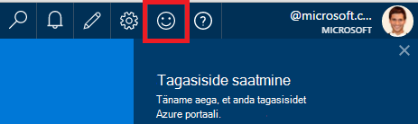
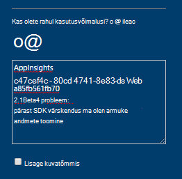
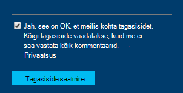

<properties 
    pageTitle="Kuidas saada tehnilise toe rakenduse ülevaated arendusmeeskonnale | Microsoft Azure'i" 
    description="Kui teil on puhul, mis nõuab teisiti tugi: rakenduse ülevaated arendusmeeskonnale, on see, kuidas saate esitada toe üksikasju." 
    services="application-insights" 
    documentationCenter=""
    authors="alexbulankou" 
    manager="douge"/>
 
<tags 
    ms.service="application-insights" 
    ms.workload="tbd" 
    ms.tgt_pltfrm="ibiza" 
    ms.devlang="na" 
    ms.topic="article" 
    ms.date="06/01/2016" 
    ms.author="albulank"/>
    
# <a name="how-to-get-technical-support-from-application-insights-development-team"></a>Tehniline tugi: rakenduse ülevaated arendusmeeskonnale hankimine
    
Kui teil on [Visual Studio rakenduse ülevaated](app-insights-overview.md)tehniline küsimus, siis siit leiate abi saamine:

## <a name="1-check-the-documents"></a>1. saate dokumente

* Puuduvad andmed? Märkige: [valimite](app-insights-sampling.md), [kui ka pidurdamise](app-insights-pricing.md).
* Tõrkeotsing: [ASP.net-i](app-insights-troubleshoot-faq.md) | [Java](app-insights-java-troubleshoot.md)

## <a name="2-search-the-forums"></a>2 Otsi

* [MSDN-i Foorum](https://social.msdn.microsoft.com/Forums/vstudio/home?forum=ApplicationInsights)
* [StackOverflow](http://stackoverflow.com/questions/tagged/ms-application-insights)

## <a name="3-azure-support-plan"></a>3. azure tugiteenuste lepingut?

On olukordades, kus soovite uurida teatud kaasuse arendajad. 

Kui teil on [leping Microsoft Azure tugi](https://azure.microsoft.com/support/plans/) saate [avada tugi Piletite](https://portal.azure.com/?#blade/Microsoft_Azure_Support/HelpAndSupportBlade).

## <a name="4-contact-the-application-insights-team"></a>4. Rakenduse ülevaated meeskonna poole.

Kui teil pole toe kavandamine, meie arendusmeeskonnale on parim tuge pakkuda rakenduse ülevaated klientidele, nagu me ettevalmistamine vaheetapi üldiselt kättesaadav. Tutvustame **uue tugiteenuse võimalus**: Saate kirjeldada kaasuse meile tagasiside vormi Azure'i portaalis esitades ja arendaja on rakenduse ülevaated meeskonnatöö kontakti teid tagasi probleemi lahendamiseks.


1. Klõpsake [Rakenduse ülevaated portaali](https://portal.azure.com)aadressil paremas ülanurgas olevat naerunägu:  

       

2. Väljale kommentaar veenduge, et määrata **AppInsights** esimene rida ja seejärel järgmine teave:   

    ```

    AppInsights   
    ikey: <instrumentation key>   
    sdk: <SDK that you are using, including name and version>  
    issue: <please describe the problem you are having>

    ```   

       

3. Märkige ruut "Jah, see on teile ok". 

      

Rakenduse ülevaated meeskond insener saavad teiega varsti. Kui anname selle teenuse parim peegeldav alus, pole ametlik SLA võivad olla antud sel hetkel.


