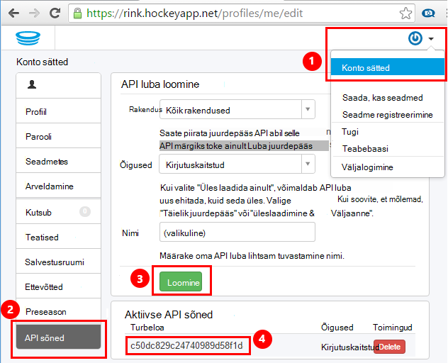
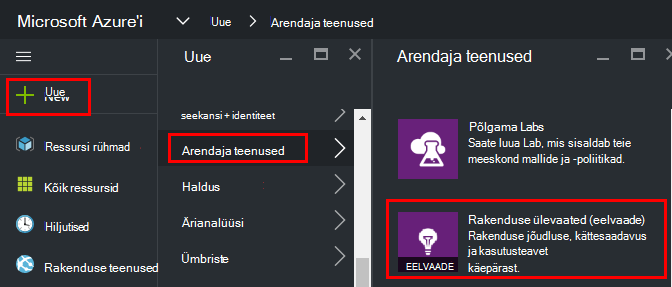
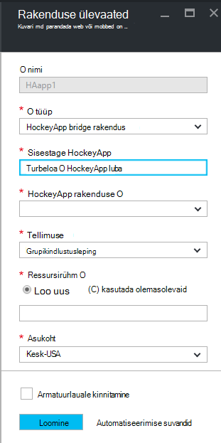
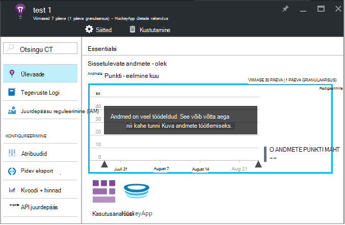
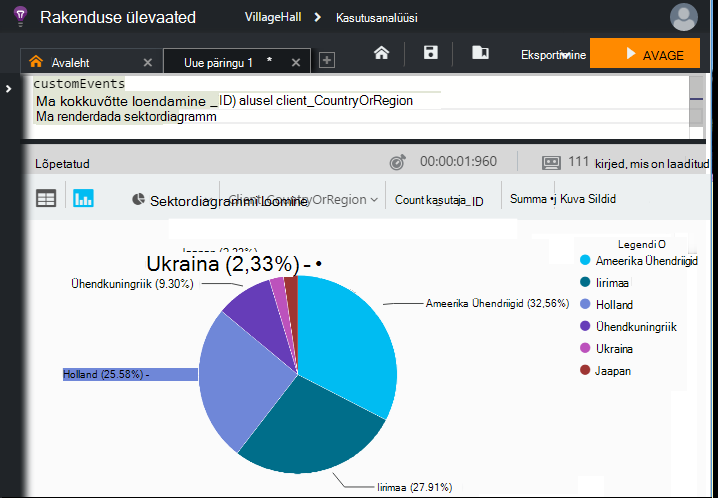

<properties 
    pageTitle="Rakenduse ülevaated HockeyApp andmete uurimine | Microsoft Azure'i" 
    description="Kasutus- ja Azure rakenduse rakenduse ülevaated jõudluse analüüs." 
    services="application-insights" 
    documentationCenter="windows"
    authors="alancameronwills" 
    manager="douge"/>

<tags 
    ms.service="application-insights" 
    ms.workload="tbd" 
    ms.tgt_pltfrm="ibiza" 
    ms.devlang="na" 
    ms.topic="article" 
    ms.date="08/25/2016" 
    ms.author="awills"/>

#  Rakenduse ülevaated HockeyApp andmete uurimine

[HockeyApp](https://azure.microsoft.com/services/hockeyapp/) on soovitatav platvormi reaalajas töölaua- ja rakenduste jälgimine. HockeyApp, saate saata kohandatud ja jälgida telemeetria jälgida kasutamine ja aidata diagnoosida (lisaks krahh andmete toomine). Selle voo telemeetria, saate kasutataks [Visual Studio rakenduse ülevaated](app-insights-overview.md)võimsaid [Analytics](app-insights-analytics.md) funktsiooniga. Lisaks saate [eksportida kohandatud ja telemeetria jälgi](app-insights-export-telemetry.md). Nende funktsioonide häälestamist sild, mis edastab rakenduse ülevaated HockeyApp andmed.

## HockeyApp Bridge rakendus

HockeyApp Bridge rakendus on core funktsioon, mis lubab teil juurde pääseda rakenduse ülevaated HockeyApp andmete soovitud Analyticsi kaudu ja pidev ekspordi funktsioone. Pärast loomist HockeyApp Bridge rakenduse HockeyApp kogutud andmete pääseb need funktsioonid. Vaatame, kuidas üks nende Bridge rakenduste häälestamine.

Avage HockeyApp, [API sõned](https://rink.hockeyapp.net/manage/auth_tokens)konto sätted. Saate luua uue loa või olemasoleva uuesti kasutada. Funktsiooni miinimumõigused nõutav on "kirjutuskaitstud". Võtta koopia API Turbeloa.

Avage Microsoft Azure portaali ja [luua on rakenduse ülevaated ressurss](app-insights-create-new-resource.md). Määrata rakenduse tüüp "HockeyApp bridge rakendus".

Te ei pea määramiseks nimi – see automaatselt määratud HockeyApp nimi.

HockeyApp bridge väljad kuvatakse. 

Sisestage HockeyApp luba eespool märgitud. See toiming kuvab kõigi HockeyApp rakenduste rippmenüü "HockeyApp rakendus". Valige see, mida soovite kasutada, ja täitke ülejäänud väljad. 

Avage uue ressursi. 

Pange tähele, et andmed võtab aega, et hakkaksid.

See on õige! Selles rakenduses HockeyApp varustatud mõõteriistadega tegemiseks kogutud andmeid on nüüd ka rakenduse ülevaated analüüsi- ja pidev eksportimine funktsioonid saadaval.

Lühidalt vaatame kõik need funktsioonid, mis on nüüd saadaval.

## Kasutusanalüüsi

Analytics on võimas erakorralist päringute andmeid, mis võimaldab teil diagnoosimine ja analüüsida oma telemeetria ja kiiresti avastada põhjuseid ja mustrid.

* [Lisateavet Analyticsi](app-insights-analytics-tour.md)
* [Tutvustuse video](https://channel9.msdn.com/events/Build/2016/T666)
* [Täiustatud mõisted video](https://channel9.msdn.com/Events/Build/2016/P591)

## Pidev eksport

Pidev ekspordi võimaldab teil oma andmed eksportida mõne Azure'i bloobimälu ümbrises. See on väga kasulik, kui teil on vaja rohkem kui säilitusperiood, mida praegu pakutakse rakenduse ülevaated andmed säilitada. Saate andmed püsiksid bloobimälu, töötlemiseks see SQL-andmebaasi või lao lahenduse eelistatud andmeid.

[Lisateavet pidev eksportimine](app-insights-export-telemetry.md)

## Järgmised sammud

* [Analytics andmete rakendamine](app-insights-analytics-tour.md)

