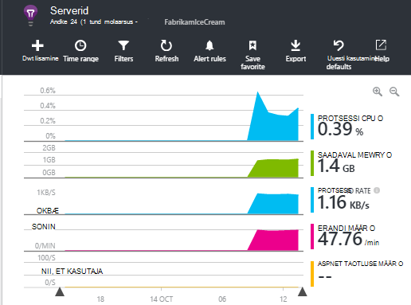

<properties 
    pageTitle="Kuidas teha ma... Rakenduse ülevaated | Microsoft Azure'i" 
    description="Klõpsake rakenduse ülevaated KKK." 
    services="application-insights" 
    documentationCenter=""
    authors="alancameronwills" 
    manager="douge"/>

<tags 
    ms.service="application-insights" 
    ms.workload="tbd" 
    ms.tgt_pltfrm="ibiza" 
    ms.devlang="na" 
    ms.topic="article" 
    ms.date="02/05/2016" 
    ms.author="awills"/>

# <a name="how-do-i--in-application-insights"></a>Kuidas... rakenduses rakenduse ülevaated?

## <a name="get-an-email-when-"></a>Saada e-posti kui...

### <a name="email-if-my-site-goes-down"></a>E-posti, kui minu saidi läheb alla

Määrake soovitud [kättesaadavus web testida](app-insights-monitor-web-app-availability.md).

### <a name="email-if-my-site-is-overloaded"></a>E-posti, kui minu sait on üle koormatud

[Teatise](app-insights-alerts.md) määramine **serveri vastuse**kellaaja. Vahemikus 1 – 2 sekundit piirmäära peaks töötama.


Rakenduse, võidakse kuvada ka märke ning tagastades tõrge koode. Teatise määramine **nurjunud taotluste**kohta.

Kui soovite teatise **serveri**erandite määramine, peate tegema selleks, et näha andmete [mõned täiendavad häälestus](app-insights-asp-net-exceptions.md) .

### <a name="email-on-exceptions"></a>E-posti erandite

1. [Erandi jälgimise häälestamine](app-insights-asp-net-exceptions.md)
2. Erandi count meetermõõdustik [Teatise seadistamine](app-insights-alerts.md)


### <a name="email-on-an-event-in-my-app"></a>E-posti rakendus sündmuse kohta

Oletame, et soovite saada e-posti teatud sündmuse ilmnemisel. Rakenduse ülevaated ei paku seda võimalust otse, kuid seda saab [saata teatise, kui mõõdiku ületab läve](app-insights-alerts.md). 

Teatiste saate seada [kohandatud mõõdikute](app-insights-api-custom-events-metrics.md#track-metric), kuigi pole kohandatud sündmused. Kirjutage mõned koodi suurendamiseks mõõdiku sündmuse ilmnemisel:

    telemetry.TrackMetric("Alarm", 10);

või:

    var measurements = new Dictionary<string,double>();
    measurements ["Alarm"] = 10;
    telemetry.TrackEvent("status", null, measurements);

Kuna teatiste on kaks olekut, on teil saata madal väärtus, kui teie arvates teatise on lõpetada.

    telemetry.TrackMetric("Alarm", 0.5);

Diagrammi loomine [argumendil Exploreri](app-insights-metrics-explorer.md) alarmi kuvamiseks:


Nüüd teatise tule kui mõõdiku läheb mid väärtus ülaltoodud lühiajaliselt määramine:


Minimaalne aja määramine 

Saate e-kirju nii kui mõõdiku läheb üles ja alla.

Mõned punktid kaaluda:

* Teatise on kahe riigi ("teade" ja "terve"). Riigi hinnatakse ainult siis, kui mõõdiku on saanud.
* Meilisõnum saadetakse ainult siis, kui olek muutub. See on põhjus, miks te saata nii kõrge ja madala väärtusega mõõdikute. 
* Hinnata teatise, keskmise võetakse saadud väärtused eelnev aja jooksul. See juhtub iga kord, kui mõõdiku on saanud, et meilisõnumite saatmist sagedamini kui seate perioodi.
* Kuna e-kirju saadetakse nii "teade" ja "terve", võiksite kaaluda uuesti mõtlema oma ühekordseks sündmuse kahe riigi tingimusena. Näiteks "töö valmis" sündmuse asemel on "töö on pooleli" tingimusele, kust e-kirju alguses ja lõpus tööd.

### <a name="set-up-alerts-automatically"></a>Häälestage teatised automaatselt

[PowerShelli abil saate luua uue teatised](app-insights-alerts.md#set-alerts-by-using-powershell)

## <a name="use-powershell-to-manage-application-insights"></a>PowerShelli abil saate hallata rakenduse ülevaated

* [Looge uus ressursid](app-insights-powershell-script-create-resource.md)
* [Uue teatiste loomine](app-insights-alerts.md#set-alerts-by-using-powershell)

## <a name="application-versions-and-stamps"></a>Rakenduste versioonid ja templite

### <a name="separate-the-results-from-dev-test-and-prod"></a>Arendaja, testimine ja tootekataloogi tulemused eraldamiseks

* Erinevate environmnents, häälestage erinevate ikeys
* Erinevate templite (arendaja, testida, joogid) telemeetria koos erinevad atribuudiväärtused sildistamine

[Lisateave](app-insights-separate-resources.md)
 

### <a name="filter-on-build-number"></a>Filtreerida järgu number

Kui avaldate oma rakenduse uus versioon, peaksite saama eri järgud telemeetria eraldamiseks.

Rakenduse versioon saate atribuudi nii, et saate filtreerida [Otsingu](app-insights-diagnostic-search.md) ja [argumendil Exploreri](app-insights-metrics-explorer.md) tulemused. 


Seal on mitu erinevad meetodid, seades atribuuti rakenduse versioon.

* Otse seadmiseks tehke järgmist.

    `telemetryClient.Context.Component.Version = typeof(MyProject.MyClass).Assembly.GetName().Version;`

* [Telemeetria initializer](app-insights-api-custom-events-metrics.md#telemetry-initializers) TelemetryClient läbivalt kogu süsteemne seadistamise murdmiseks sellel real.

* [ASP.NET-I] Seadmine versiooni `BuildInfo.config`. Web moodul valivad Version BuildLabel sõlme. Selle faili kaasamine projekti ja pidage meeles, et atribuudi Kopeeri alati Solution Exploreris.

    ```XML

    <?xml version="1.0" encoding="utf-8"?>
    <DeploymentEvent xmlns:xsi="http://www.w3.org/2001/XMLSchema-instance" xmlns:xsd="http://www.w3.org/2001/XMLSchema" xmlns="http://schemas.microsoft.com/VisualStudio/DeploymentEvent/2013/06">
      <ProjectName>AppVersionExpt</ProjectName>
      <Build type="MSBuild">
        <MSBuild>
          <BuildLabel kind="label">1.0.0.2</BuildLabel>
        </MSBuild>
      </Build>
    </DeploymentEvent>

    ```
* [ASP.NET-I] Saate luua BuildInfo.config automaatselt MSBuild. Selleks, lisage mõned read oma .csproj faili.

    ```XML

    <PropertyGroup>
      <GenerateBuildInfoConfigFile>true</GenerateBuildInfoConfigFile>    <IncludeServerNameInBuildInfo>true</IncludeServerNameInBuildInfo>
    </PropertyGroup> 
    ```

    See loob fail nimega *yourProjectName*. BuildInfo.config. Avalda protsessi nimetab seda BuildInfo.config.

    Koosta sildi sisu kohatäite (AutoGen_), kui koostate Visual Studio abil. Kuid kui ehitatud MSBuild, see lisatakse õige versiooninumber.

    Soovite lubada MSBuild luua versioonide numbrid, määrake versioon nagu `1.0.*` AssemblyReference.cs sisse

## <a name="monitor-backend-servers-and-desktop-apps"></a>Taustväärtus serverid ja töölauarakenduste jälgimine

[Kasutage mooduli Windows Server SDK](app-insights-windows-desktop.md).


## <a name="visualize-data"></a>Andmete visualiseerimine

#### <a name="dashboard-with-metrics-from-multiple-apps"></a>Armatuurlaud, kus mõõdikute mitme rakenduste kaudu

* [Meetermõõdustik Exploreri](app-insights-metrics-explorer.md)diagrammi kohandamine ja salvestamine lemmik. Kinnitage see Azure armatuurlaud.


#### <a name="dashboard-with-data-from-other-sources-and-application-insights"></a>Armatuurlaud, kus andmed muudest allikatest ja rakenduse ülevaated

* [Power BI telemeetria eksportida](app-insights-export-power-bi.md). 

Või

* Kasutage SharePointi armatuurlauale SharePointi veebiosades andmete kuvamine. [Pidev ekspordi ja voo Analytics SQL-i eksportimine](app-insights-code-sample-export-sql-stream-analytics.md).  Kontrollige andmebaasi PowerView abil ja loomine SharePointi veebiosa PowerView.


<a name="search-specific-users"></a>
### <a name="filter-out-anonymous-or-authenticated-users"></a>Anonüümne või autenditud kasutaja välja filtreerimine

Kui teie kasutajad sisse logida, saate häälestada [autenditud kasutaja ID-d](app-insights-api-custom-events-metrics.md#authenticated-users). (See ei juhtu automaatselt.) 

Seejärel saate teha järgmist.

* Otsige teatud kasutaja ID-d


* Filtri mõõdikute anonüümse või autenditud kasutajad


## <a name="modify-property-names-or-values"></a>Atribuutide nimesid või väärtuste muutmine

[Filtri](app-insights-api-filtering-sampling.md#filtering)loomine. See laseb teil muuta või filtreerimiseks telemeetria enne saatmist rakenduste rakenduse ülevaated.

## <a name="list-specific-users-and-their-usage"></a>Teatud kasutajate loend ja nende kasutamine

Kui soovite vaid [kindlatele kasutajatele otsimine](#search-specific-users), saate [autenditud kasutaja ID-d](app-insights-api-custom-events-metrics.md#authenticated-users).

Kui soovite, et kasutajad andmeid, mis lehti nagu neid vaadata või sageduse logides, on teil kaks võimalust:

* [Sea autenditud kasutaja ID-d](app-insights-api-custom-events-metrics.md#authenticated-users), [andmebaasi eksportida](app-insights-code-sample-export-sql-stream-analytics.md) ja kasutada sobiva tööriistad olemas kasutaja andmete analüüsimiseks.
* Kui teil on ainult väheste kasutajate, saata kohandatud sündmused või mõõdikute, kasutades huvipakkuvaid andmeid argumendil väärtus või sündmuse nimi ja atribuudi väärtuseks kasutaja ID-d. Lehe vaated analüüsimiseks asendada standard JavaScripti trackPageView kõne. Serveripoolne telemeetria analüüsimiseks kasutada kasutaja ID-d lisamiseks kõik serveri telemeetria telemeetria initializer. Seejärel saate filtri ja lõigu mõõdikute ja otsingute kasutaja ID-d.


## <a name="reduce-traffic-from-my-app-to-application-insights"></a>Rakendus minu liikluse vähendamiseks rakenduse ülevaated

* Keela [ApplicationInsights.config](app-insights-configuration-with-applicationinsights-config.md), mis tahes moodulid te ei vaja, nt jõudluse counter koguja.
* Kasutage [valimite ja filtreerimise](app-insights-api-filtering-sampling.md) SDK.
* Veebilehtede, Ajaxi kõnede arv teatatud leht iga vaate jaoks. Klõpsake skripti koodilõigu pärast `instrumentationKey:...` , lisada: `,maxAjaxCallsPerView:3` (või sobiv arv).
* Kui kasutate [TrackMetric](app-insights-api-custom-events-metrics.md#track-metric), arvutage liitmise ja vana argumendil väärtusi enne saatmist tulemi. On TrackMetric(), mis sisaldab selle ülekoormuse.


Lisateave [hinnad ja piirmäärasid](app-insights-pricing.md).

## <a name="disable-telemetry"></a>Telemeetria keelamine

**Dünaamiliselt peatada ja käivitada** kogumine ja edastamine telemeetria server järgmist.

```

    using  Microsoft.ApplicationInsights.Extensibility;

    TelemetryConfiguration.Active.DisableTelemetry = true;
```


**Keelata valitud standard kollektsiooni** – näiteks jõudluse hinnale, HTTP päringuid või sõltuvused - kustutamine või kommentaaride välja [ApplicationInsights.config](app-insights-api-custom-events-metrics.md)oluline read. Kui soovite saata TrackRequest andmete võiks seda, näiteks teha.


## <a name="view-system-performance-counters"></a>Vaate süsteemi jõudluse hinnale

Saate kuvada mõõdikute Exploreri mõõdikud on kogumi süsteemi jõudluse hinnale. On eelmääratletud tera **serverid** , mis kuvab mitu neist pealkirjaga.



### <a name="if-you-see-no-performance-counter-data"></a>Kui te ei näe pole jõudluse andmete

* **IIS-i server** oma arvutisse või VM. [Installige oleku jälgimine](app-insights-monitor-performance-live-website-now.md). 
* **Azure'i veebisaidi** – me ei toeta jõudluse hinnale veel. On mitu mõõdikute saate standard osana Azure veebisaidi Juhtpaneel.
* **UNIX serveri** - [collectd installimine](app-insights-java-collectd.md)

### <a name="to-display-more-performance-counters"></a>Lisateavet jõudluse hinnale kuvamiseks

* Esmalt [uue diagrammi lisamine](app-insights-metrics-explorer.md) ja vaadake, kas näidiku Basic seatakse mis pakume.
* Kui ei, siis [on vastuolus määramine kogutud jõudluse counter mooduli lisamine](app-insights-performance-counters.md).


