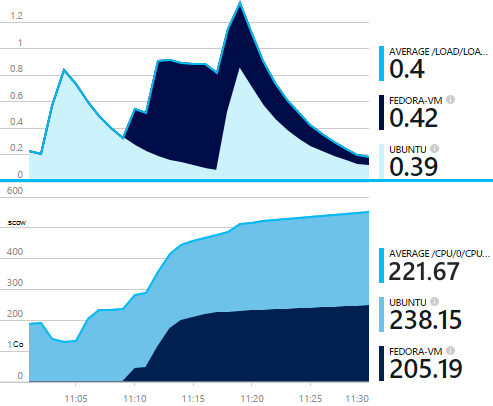
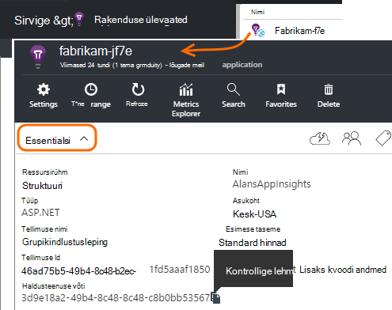
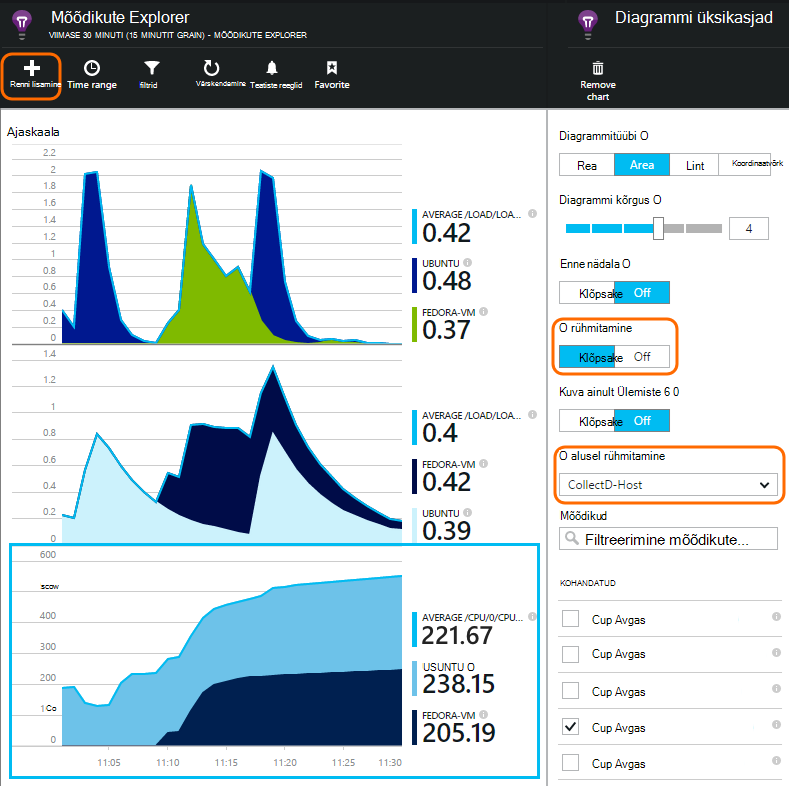

<properties 
    pageTitle="collectd: täiuslik statistika Java UNIX rakenduses rakenduse ülevaated" 
    description="Laiendatud rakenduse ülevaated koos lisandmooduli CollectD veebisaidi Java jälgimine" 
    services="application-insights" 
    documentationCenter="java"
    authors="alancameronwills" 
    manager="douge"/>

<tags 
    ms.service="application-insights" 
    ms.workload="tbd" 
    ms.tgt_pltfrm="ibiza" 
    ms.devlang="na" 
    ms.topic="article" 
    ms.date="08/24/2016" 
    ms.author="awills"/>
 
# <a name="collectd-unix-performance-metrics-in-application-insights"></a>collectd: Unix jõudluse mõõdikute rakenduses rakenduse ülevaated

*Rakenduse ülevaated on eelvaade.*

Unix süsteemi jõudluse mõõdikute rakenduses [Rakenduse ülevaated](app-insights-overview.md)uurida, installige [collectd](http://collectd.org/), koos selle rakenduse ülevaated lisandmooduli. See lahendus avatud lähtekoodi kogutakse erinevaid süsteem ja võrgu statistika.

Tavaliselt kasutatakse collectd kui teil on juba [varustatud mõõteriistadega tegemiseks Java veebiteenuse rakenduse ülevaated][java]. See pakub rohkem andmeid, mis aitavad teil parandada oma rakenduse või diagnoosida probleeme. 



## <a name="get-your-instrumentation-key"></a>Võtme haldusteenuse

[Microsoft Azure'i portaali](https://portal.azure.com), avage [Rakenduse ülevaated](app-insights-overview.md) ressursi, kus soovite andmeid kuvada. (Või [luua uue ressursi](app-insights-create-new-resource.md).)

Võtta instrumentation võti, mis tuvastab ressursi koopia.




## <a name="install-collectd-and-the-plug-in"></a>Collectd ja lisandmooduli installimine

Unix serveri masinad:

1. Installige [collectd](http://collectd.org/) versioon 5.4.0 või uuem versioon.
2. Laadige alla [Rakenduse ülevaated collectd kirjutaja lisandmoodul](https://aka.ms/aijavasdk). Pange tähele versiooninumber.
3. Kopeerige soovitud lisandmooduli JAR üheks `/usr/share/collectd/java`.
3. Redigeeri `/etc/collectd/collectd.conf`:
 * Veenduge, et [Java lisandmoodul](https://collectd.org/wiki/index.php/Plugin:Java) on lubatud.
 * Värskendage JVMArg jaoks soovitud java.class.path, lisada järgmised JAR. Versiooninumbri vasta allalaaditud värskendamiseks tehke järgmist.
  * `/usr/share/collectd/java/applicationinsights-collectd-1.0.5.jar`
 * Lisage see koodilõigu, Instrumentation võtme oma ressursi abil.

```

     LoadPlugin "com.microsoft.applicationinsights.collectd.ApplicationInsightsWriter"
     <Plugin ApplicationInsightsWriter>
        InstrumentationKey "Your key"
     </Plugin>
```

Siin on osa konfiguratsiooni näidisfaili:

    ...
    # collectd plugins
    LoadPlugin cpu
    LoadPlugin disk
    LoadPlugin load
    ...

    # Enable Java Plugin
    LoadPlugin "java"

    # Configure Java Plugin
    <Plugin "java">
      JVMArg "-verbose:jni"
      JVMArg "-Djava.class.path=/usr/share/collectd/java/applicationinsights-collectd-1.0.5.jar:/usr/share/collectd/java/collectd-api.jar"

      # Enabling Application Insights plugin
      LoadPlugin "com.microsoft.applicationinsights.collectd.ApplicationInsightsWriter"
                
      # Configuring Application Insights plugin
      <Plugin ApplicationInsightsWriter>
        InstrumentationKey "12345678-1234-1234-1234-123456781234"
      </Plugin>

      # Other plugin configurations ...
      ...
    </Plugin>
.   ...

Konfigureerige muud [collectd lisandmoodulid](https://collectd.org/wiki/index.php/Table_of_Plugins), mis saab koguda erinevaid andmeid erinevatest allikatest.

Taaskäivitage collectd vastavalt selle [käsitsi](https://collectd.org/wiki/index.php/First_steps).

## <a name="view-the-data-in-application-insights"></a>Andmete kuvamine rakenduse ülevaated

Oma rakenduse ülevaated ressurss, avage [mõõdikute Explorer ja diagrammide lisamine][metrics], valides soovitud kohandatud kategooria mõõdikud.



Vaikimisi on koondatud mõõdikud kõik host arvutites, millest kogutud mõõdikud. Diagrammi üksikasjad tera mõõdikute kohta host, vaatamiseks sisselülitamine rühmitamise ja seejärel valige CollectD-Host alusel.


## <a name="to-exclude-upload-of-specific-statistics"></a>Üleslaadimine statistika koostamist välistamine

Vaikimisi rakenduse ülevaated lisandmoodul saadab kõik andmed kogutud kõik lubatud collectd lugeda lisandmoodulid. 

Jätta teatud lisandmoodulid või andmeallikate andmed:

* Otsingukonfiguratsiooni faili redigeerida. 
* Klõpsake `<Plugin ApplicationInsightsWriter>`, lisada direktiiv read umbes järgmine:

Direktiivi | Efekti
---|---
`Exclude disk` | Kõik andmed kogutud välja soovitud `disk` lisandmoodul
`Exclude disk:read,write` | Välistamine nimega allikad `read` ja `write` kaudu soovitud `disk` lisandmoodul.

Koos on newline eraldi suuniseid.


## <a name="problems"></a>Probleeme?

*Ma ei näe andmete portaalis*

* Avage [Otsing] [ diagnostic] kuvamiseks, kui töötlemata sündmused on saabunud. Mõnikord on need kauem mõõdikute Exploreris kuvada.
* Peate [tulemüüri erandid väljamineva andmete määramine](app-insights-ip-addresses.md)
* Lubage lisandmoodul rakenduse ülevaated jälitamine. Lisage see joon `<Plugin ApplicationInsightsWriter>`:
 *  `SDKLogger true`
* Avage terminal ja käivitada collectd Paljusõnaline režiimis, see on teatamine probleemidest kuvamiseks:
 * `sudo collectd -f`


<!--Link references-->

[api]: app-insights-api-custom-events-metrics.md
[apiexceptions]: app-insights-api-custom-events-metrics.md#track-exception
[availability]: app-insights-monitor-web-app-availability.md
[diagnostic]: app-insights-diagnostic-search.md
[eclipse]: app-insights-java-eclipse.md
[java]: app-insights-java-get-started.md
[javalogs]: app-insights-java-trace-logs.md
[metrics]: app-insights-metrics-explorer.md
[usage]: app-insights-web-track-usage.md

 
