<properties 
    pageTitle="Alustamine rakenduse arusaamiseks Java Eclipse" 
    description="Eclipse lisandmooduli abil saate lisada jõudlus ja kasutuse jälgimise veebisaidile Java rakenduse ülevaated" 
    services="application-insights" 
    documentationCenter="java"
    authors="alancameronwills" 
    manager="douge"/>

<tags 
    ms.service="application-insights" 
    ms.workload="tbd" 
    ms.tgt_pltfrm="ibiza" 
    ms.devlang="na" 
    ms.topic="article" 
    ms.date="03/02/2016" 
    ms.author="awills"/>
 
# Alustamine rakenduse arusaamiseks Java Eclipse

Nii, et saate analüüsida kasutus- ja jõudluse saadab rakenduse ülevaateid SDK telemeetria Java veebi rakendus. Nii, et saate välja kasti telemeetria pluss API, mille abil saate kohandatud telemeetria kirjutamiseks, installib rakenduse ülevaated lisandmooduli Eclipse SDK projektis.   

## Eeltingimused

Selle lisandmooduli toimib praegu Maven projekte ja dünaamiline Web projekte Eclipse. ([Muud tüüpi Java projekti lisamine rakenduse ülevaated][java].)

Peate.

* Oracle'i JRE 1,6 või uuem versioon
* [Microsoft Azure'i](https://azure.microsoft.com/)tellimust. (Võib alustatakse [tasuta prooviversioon](https://azure.microsoft.com/pricing/free-trial/).)
* [Java EE arendajatele eclipse IDE](http://www.eclipse.org/downloads/), Indigo või uuem versioon.
* Windows 7 või uuem versioon või Windows Server 2008 või uuem versioon

## SDK installimine Eclipse (üks kord)

Tuleb teha seda üks kord masina kohta. Selles etapis tuleb installib tööriistakomplekt, mida saab seejärel lisada SDK iga dünaamiline Project Web.

1. Eclipse, klõpsake nuppu Spikker, tarkvara installimine.

    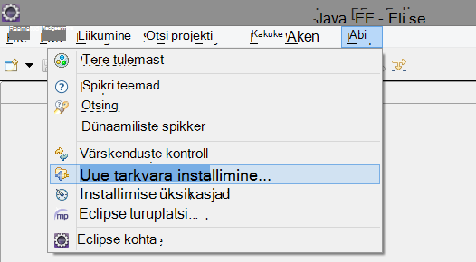

2. SDK on http://dl.windowsazure.com/eclipse jaotises Azure'i tööriistakomplekt. 
3. Tühjendage märkeruut, **pöörduge värskenduse kõigil saitidel...**

    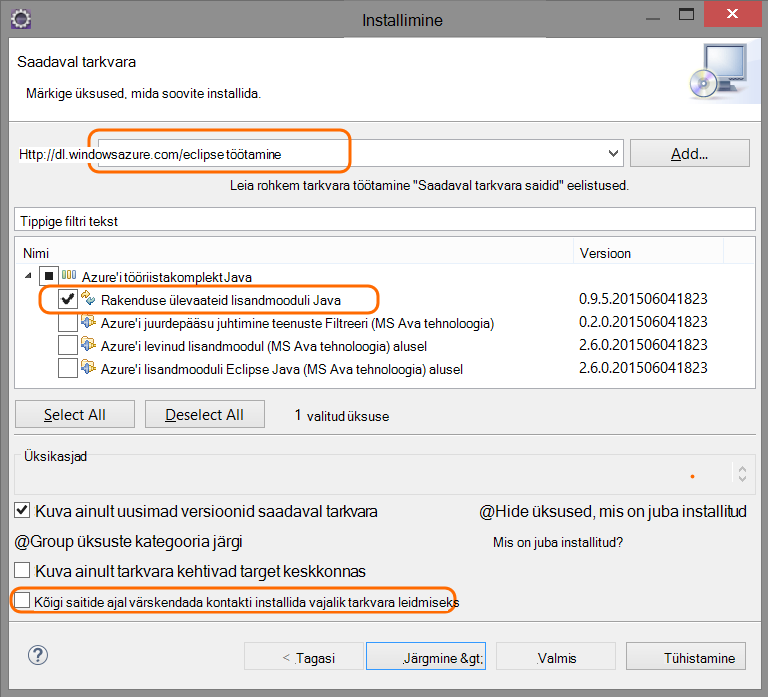

Iga Java projekti ülejäänud juhised.

## Azure on rakenduse ülevaated ressurss loomine

1. [Azure'i portaali](https://portal.azure.com)sisse logida.
2. Saate luua uue rakenduse ülevaated ressursi.  

    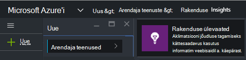  
3. Java veebirakenduse tüübi määramine.  

    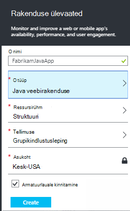  
4. Otsige instrumentation võti uue ressursi. Peate kleepige see oma Koodiprojekt varsti.  

    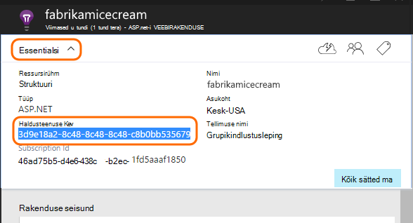  

## Rakenduse ülevaated lisamine projekti

1. Lisage rakenduse ülevaated kontekstimenüüst Java web projekti.

    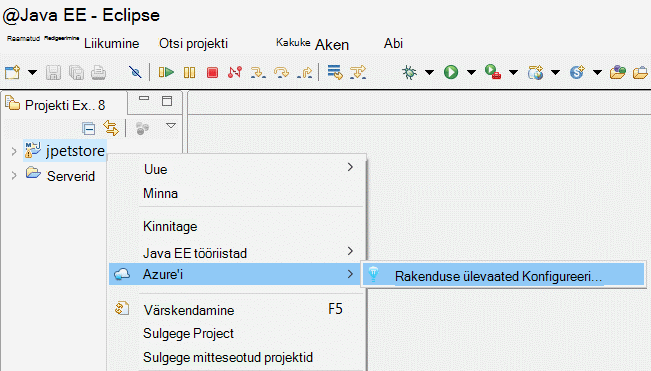

2. Kleepige instrumentation klahvi, mis teil Azure portaalist.

    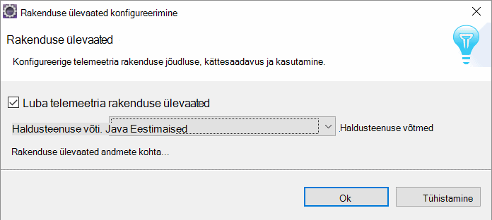

Võti saadetakse koos iga üksus telemeetria ja ütleb rakenduse ülevaated oma ressursside kuvamiseks.

## Käivitage rakendus ja vaadake mõõdikud

Rakenduse käivitada.

Naaske oma rakenduse ülevaated ressursi Microsoft Azure.

HTTP andmeid kuvatakse ülevaade enne. (Kui see pole olemas, oodake paar minutit ja seejärel klõpsake nuppu Värskenda.)

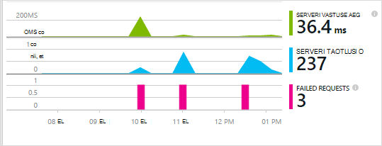
 

Klõpsake mis tahes diagrammi üksikasjalikumat mõõdikute kuvamiseks. 

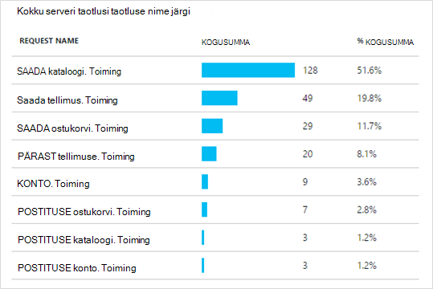

[Lugege lisateavet mõõdikute.][metrics]

 

Ja taotluse atribuutide kuvamisel kuvatakse telemeetria sündmusi, näiteks taotlusi ja erandid seotud.
 
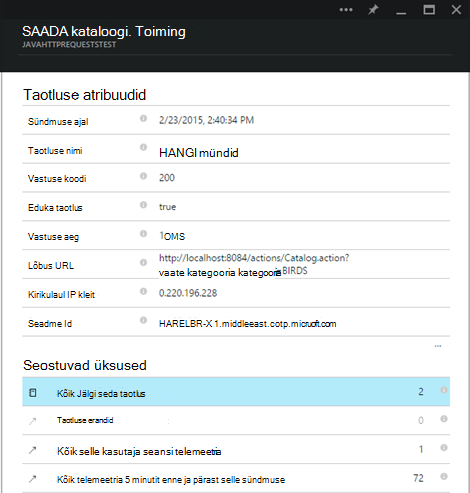

## Kliendipoolne telemeetria

Keelest Kiirjuhend nuppu Too kood jälgida oma veebilehtede: 

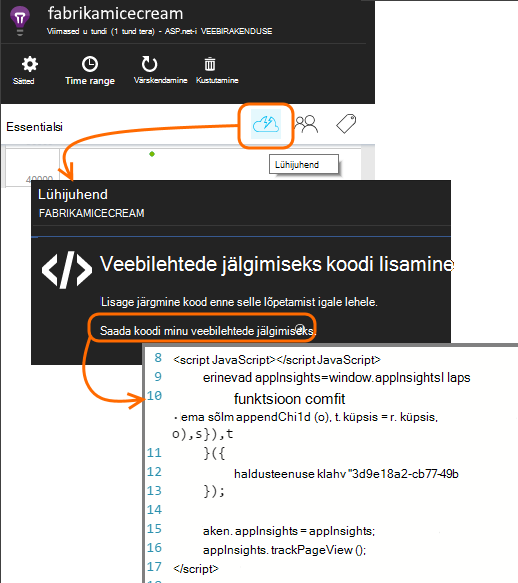

HTML-vormingus failide juhataja koodilõigu lisada.

#### Kliendipoolne andmete kuvamine

Teie värskendatud veebilehti avada ja kasutada neid. Oodake paar minutit kahe, siis rakenduse ülevaated tagasi ja avage kasutus tera. (Keelest ülevaade liikuge kerides allapoole ja klõpsake linki kasutamine.)

Lehe kasutaja, vaade ja seansi mõõdikute kuvatakse enne kasutus:

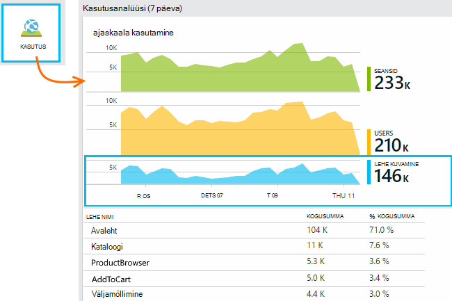

[Lugege lisateavet kliendipoolne telemeetria häälestamise kohta.][usage]

## Rakenduse avaldamine

Nüüd avaldada oma rakenduse server, anda, et inimesed kasutavad, ja vaadake telemeetria kuvataks portaalis.

* Veenduge, et teie tulemüür lubab rakenduse telemeetria saatmiseks järgmised pordid.

 * DC.Services.VisualStudio.com:443
 * DC.Services.VisualStudio.com:80
 * F5.Services.VisualStudio.com:443
 * F5.Services.VisualStudio.com:80

* Installige Windows serverites.

 * [Microsoft Visual C++ Redistributable](http://www.microsoft.com/download/details.aspx?id=40784)

    (See võimaldab jõudluse hinnale.)

## Erandid ja taotluse tõrked

Töötlemata erandid kogutakse automaatselt:

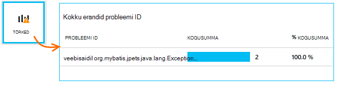

Andmete kogumine teiste erandite, on teil kaks võimalust:

* [Kõned TrackException koodi lisamine](app-insights-api-custom-events-metrics.md#track-exception). 
* [Installige Java Agent serverisse](app-insights-java-agent.md). Saate määrata meetodid, mida soovite vaadata.

## Kuvari meetodi kutsed ja välise sõltuvused

Logige [installida Java Agent](app-insights-java-agent.md) määratud sisemise meetodite ja kõnede kaudu JDBC ajastuse andmetega.

## Jõudluse hinnale

Teie ülevaade tera, liikuge kerides allapoole ja klõpsake paanil **serverid** . Näete mitmesuguseid jõudluse hinnale.

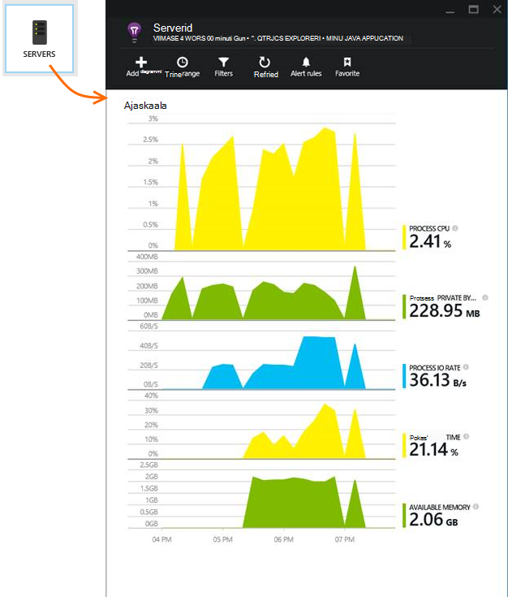

### Jõudluse counter saidikogumi kohandamine

Saidikogumi hinnale jõudlust standard kogumi keelamiseks lisada juurkausta sõlme ApplicationInsights.xml faili all järgmine kood:

    <PerformanceCounters>
       <UseBuiltIn>False</UseBuiltIn>
    </PerformanceCounters>

### Täiendavad jõudluse hinnale kogumine

Saate määrata täiendavaid jõudluse hinnale koguda.

#### JMX hinnale (esitatud Java virtuaalse masina)

    <PerformanceCounters>
      <Jmx>
        <Add objectName="java.lang:type=ClassLoading" attribute="TotalLoadedClassCount" displayName="Loaded Class Count"/>
        <Add objectName="java.lang:type=Memory" attribute="HeapMemoryUsage.used" displayName="Heap Memory Usage-used" type="composite"/>
      </Jmx>
    </PerformanceCounters>

*   `displayName`– Rakenduse ülevaated portaalis kuvatav nimi.
*   `objectName`– JMX objekti nimi.
*   `attribute`– Atribuudi toomiseks JMX objekti nimi
*   `type`(valikuline) - atribuut JMX objekti tüüp:
 *  Vaikimisi: lihtne tüüp, nt int või pikk.
 *  `composite`: on täiuslik andmete on kujul "Attribute.Data"
 *  `tabular`: on täiuslik andmete on tabelirea vormingus

#### Windowsi jõudlus hinnale

Iga [Windowsi Jõudluseloenduri](https://msdn.microsoft.com/library/windows/desktop/aa373083.aspx) on kategooria liige (samal viisil, et väli on klassi liige). Kategooriate võib olla üld-, või saate on nummerdatud või nimega eksemplarid.

    <PerformanceCounters>
      <Windows>
        <Add displayName="Process User Time" categoryName="Process" counterName="%User Time" instanceName="__SELF__" />
        <Add displayName="Bytes Printed per Second" categoryName="Print Queue" counterName="Bytes Printed/sec" instanceName="Fax" />
      </Windows>
    </PerformanceCounters>

*   displayName – rakenduse ülevaated portaalis kuvatav nimi.
*   KatregooriaID – Jõudluseloenduri kategooria (jõudluse objekt) mis see Jõudluseloenduri on seostatud.
*   counterName – jõudluse näidiku nimi.
*   instanceName – jõudluse counter kategooria eksemplari või tühja stringi (""), kui kategooria sisaldab ühte eksemplari. Kui KatregooriaID protsess ja jõudluse näidiku soovite koguda on praeguse töötab protsessi kohta, kus teie rakendus töötab, määrata `"__SELF__"`.

Oma jõudluse hinnale nähtavaid nimega kohandatud mõõdikute [Mõõdikute]Exploreris[metrics].

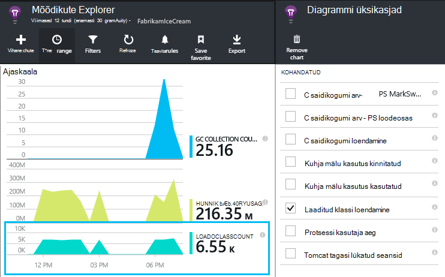

### UNIX jõudluse hinnale

* [Collectd koos rakenduse ülevaated lisandmooduli installimine](app-insights-java-collectd.md) mitmesuguseid süsteem ja võrgu andmete toomiseks.

## Kättesaadavus web testide

Rakenduse ülevaated testida veebisaidi intervalliga, kontrollige, kas see on ja ka vasta. [Häälestada][availability], liikuge kerides jaotisse klõpsake kättesaadavus.

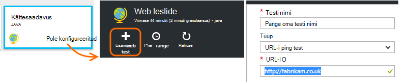

Saate diagramme vastuse korda pluss meiliteatised, kui teie saidi läheb alla.

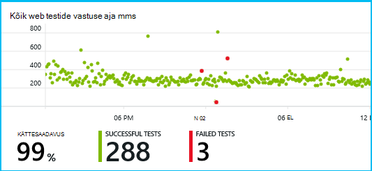

[Lugege lisateavet kättesaadavus web kontrollib.][availability] 

## Diagnostikalogid

Kui kasutate Logback või Log4J (v1.2 või v2.0) jälgida, saate määrata oma Jälita logid saata automaatselt rakenduse ülevaated, kus saate uurida ja neid otsida.

[Lisateavet diagnostikalogid][javalogs]

## Kohandatud telemeetria 

Teie Java veebirakenduse, et teada saada, mida kasutajad teevad selle või probleemide lisada mõne koodiread. 

Saate lisada koodi veebilehe JavaScripti ja Serveripoolsed Java.

[Lisateavet kohandatud telemeetria][track]

## Järgmised sammud

#### Tuvastada ja diagnoosida probleemid

* [Lisage web kliendi telemeetria] [ usage] saada jõudluse telemeetria web klient.
* [Häälestamine web testide] [ availability] veenduge, et teie taotlus jääb reaalajas ja reageeri abil.
* [Sündmuste ja logid otsimine] [ diagnostic] probleemide.
* [Jäädvustada Log4J või Logback jälgi][javalogs]

#### Jälgida kasutust

* [Lisage web kliendi telemeetria] [ usage] kuvari lehe vaated ja tavakasutaja mõõdikute.
* [Kohandatud sündmused ja mõõdikute] [ track] kohta, kuidas rakenduse kasutatakse nii klient ja server.

<!--Link references-->

[availability]: app-insights-monitor-web-app-availability.md
[diagnostic]: app-insights-diagnostic-search.md
[java]: app-insights-java-get-started.md
[javalogs]: app-insights-java-trace-logs.md
[metrics]: app-insights-metrics-explorer.md
[track]: app-insights-api-custom-events-metrics.md
[usage]: app-insights-web-track-usage.md

 