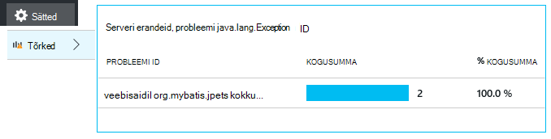

<properties
    pageTitle="Java rakenduse veebianalüütika rakenduse ülevaated | Microsoft Azure'i"
    description="Jälgida jõudlus ja rakenduse ülevaated veebisaidi Java kasutamist. "
    services="application-insights"
    documentationCenter="java"
    authors="alancameronwills"
    manager="douge"/>

<tags
    ms.service="application-insights"
    ms.workload="tbd"
    ms.tgt_pltfrm="ibiza"
    ms.devlang="na"
    ms.topic="get-started-article"
    ms.date="08/17/2016"
    ms.author="awills"/>

# Alustamine rakenduse ülevaated Java web Projectis

*Rakenduse ülevaated on eelvaade.*

[AZURE.INCLUDE [app-insights-selector-get-started](../../includes/app-insights-selector-get-started.md)]

[Rakenduse ülevaated](https://azure.microsoft.com/services/application-insights/) on laiendatav Kasutusanalüüsi teenus, mis aitab teil mõista jõudlus ja reaalajas rakenduse kasutamist. Selle abil [tuvastada ja jõudlusega seotud probleemide ja erandid diagnoosimine](app-insights-detect-triage-diagnose.md)ja [koodi kirjutamine] [ api] jälgimiseks, mida kasutajad oma rakendusega teha.

Rakenduse ülevaated toetab Java rakenduste Linux, Unix või Windowsi opsüsteemi.

Sa vajad:

* Oracle'i JRE 1,6 või uuem versioon või Suulu JRE 1,6 või uuem versioon
* [Microsoft Azure'i](https://azure.microsoft.com/)tellimust. (Võib alustatakse [tasuta prooviversioon](https://azure.microsoft.com/pricing/free-trial/).)

*Kui teil on web appi, mis on juba reaalajas, mida võib toimige alternatiivne lisada [SDK käitusajal veebiserverisse sisse](app-insights-java-live.md). Selle asemel vältida taastamine koodi, kuid te ei saa suvand kasutaja tegevuste jälgimiseks koodi kirjutamiseks.*

## 1. saate kasutada ka rakenduse ülevaated instrumentation võtit

1. [Microsoft Azure'i portaali](https://portal.azure.com)sisse logida.
2. Saate luua rakenduse ülevaated on ressurss. Java veebirakenduse tüübi määramine.

    
4. Otsige instrumentation võti uue ressursi. Peate selle klahvi vahetult koodi projekti kleepida.

    

## 2 rakendus ülevaateid SDK Java lisamine projekti

*Valige sobiv viis oma projekti.*

#### Kui kasutate Eclipse Maven või dünaamiliste Web projekti loomiseks...

Kasutage [Rakenduse ülevaateid SDK Java lisandmooduli][eclipse].

#### Kui kasutate Maven...

Kui projekti juba häälestanud kasutamiseks Maven koostamine, ühendada pom.xml faili järgmine kood.

Värskendage projekti sõltuvused saada kahendfaile alla laadida.

    <repositories>
       <repository>
          <id>central</id>
          <name>Central</name>
          <url>http://repo1.maven.org/maven2</url>
       </repository>
    </repositories>

    <dependencies>
      <dependency>
        <groupId>com.microsoft.azure</groupId>
        <artifactId>applicationinsights-web</artifactId>
        <!-- or applicationinsights-core for bare API -->
        <version>[1.0,)</version>
      </dependency>
    </dependencies>

* *Koosta või kontrollsumma valideerimise tõrked?* Proovige kasutada konkreetse versiooni, nt: `<version>1.0.n</version>`. Leiate [SDK vabastage märkmete](https://github.com/Microsoft/ApplicationInsights-Java#release-notes) või meie [Maven esemeid](http://search.maven.org/#search%7Cga%7C1%7Capplicationinsights)uusim versioon.
* *Uus SDK värskendamiseks on vaja?* Värskendage oma projekti sõltuvused.

#### Kui kasutate Gradle...

Kui projekti juba häälestanud kasutamiseks Gradle koostamine, ühendada build.gradle faili järgmine kood.

Seejärel värskendada projekti sõltuvused saada kahendfaile alla laadida.

    repositories {
      mavenCentral()
    }

    dependencies {
      compile group: 'com.microsoft.azure', name: 'applicationinsights-web', version: '1.+'
      // or applicationinsights-core for bare API
    }

* *Koostamine või kontrollsumma valideerimise tõrked? Proovige kasutada konkreetse versiooni, nt:* `version:'1.0.n'`. *Uusima versiooni leiate [SDK vabastage märkmed](https://github.com/Microsoft/ApplicationInsights-Java#release-notes).*
* *Uus SDK värskendamine*
 * Värskendage oma projekti sõltuvused.

#### Muul juhul...

Käsitsi lisada SDK.

1. Laadige alla [Rakenduse ülevaated SDK Java](https://aka.ms/aijavasdk).
2. Väljavõte kahendfaile zip-fail ja nende lisamine projekti.

### Küsimused...

* *Mis on seos on `-core` ja `-web` komponendid zip?*

 * `applicationinsights-core`annab teile tühjal API. Alati peate selle osa.
 * `applicationinsights-web`annab teile mõõdikud jälitada HTTP taotluse loendab ja vastuse korda. Jätate selle osa, kui te ei soovi seda automaatselt kogutud telemeetria. Näiteks, kui soovite kirjutada oma.

* *SDK värskendamiseks, kui me avaldada muudatused*
 * Laadige uusimad [Rakenduse ülevaateid SDK Java](https://aka.ms/qqkaq6) ja asendage vanad.
 * Muudatused on kirjeldatud [SDK vabastage märkmed](https://github.com/Microsoft/ApplicationInsights-Java#release-notes).

## 3. Rakenduse ülevaated XML-faili lisamine

ApplicationInsights.xml lisamine projekti ressursid kaust või veenduge, lisatakse need oma projekti juurutamise tunni tee. Kopeerige see järgmine XML-i.

Asendada instrumentation klahvi, mis teil Azure portaalist.

    <?xml version="1.0" encoding="utf-8"?>
    <ApplicationInsights xmlns="http://schemas.microsoft.com/ApplicationInsights/2013/Settings" schemaVersion="2014-05-30">

      <!-- The key from the portal: -->

      <InstrumentationKey>** Your instrumentation key **</InstrumentationKey>

      <!-- HTTP request component (not required for bare API) -->

      <TelemetryModules>
        <Add type="com.microsoft.applicationinsights.web.extensibility.modules.WebRequestTrackingTelemetryModule"/>
        <Add type="com.microsoft.applicationinsights.web.extensibility.modules.WebSessionTrackingTelemetryModule"/>
        <Add type="com.microsoft.applicationinsights.web.extensibility.modules.WebUserTrackingTelemetryModule"/>
      </TelemetryModules>

      <!-- Events correlation (not required for bare API) -->
      <!-- These initializers add context data to each event -->

      <TelemetryInitializers>
        <Add   type="com.microsoft.applicationinsights.web.extensibility.initializers.WebOperationIdTelemetryInitializer"/>
        <Add type="com.microsoft.applicationinsights.web.extensibility.initializers.WebOperationNameTelemetryInitializer"/>
        <Add type="com.microsoft.applicationinsights.web.extensibility.initializers.WebSessionTelemetryInitializer"/>
        <Add type="com.microsoft.applicationinsights.web.extensibility.initializers.WebUserTelemetryInitializer"/>
        <Add type="com.microsoft.applicationinsights.web.extensibility.initializers.WebUserAgentTelemetryInitializer"/>

      </TelemetryInitializers>
    </ApplicationInsights>

* Haldusteenuse võti saadetakse koos iga üksus telemeetria ja ütleb rakenduse ülevaated oma ressursside kuvamiseks.
* HTTP-päring komponent pole kohustuslik. Telemeetria taotlusi ja vastuse korda kohta saadetakse automaatselt portaali.
* Sündmuste korrelatsioonikordaja on lisaks HTTP taotluse komponent. Seda määrab identifikaatori iga taotluse saadud serverisse ja lisab selle identifikaator atribuudi iga üksus telemeetria atribuudi 'Operation.Id'. See võimaldab teil oleksid telemeetria, mis on seotud iga taotluse [diagnostika]otsingus filtri seadmisega[diagnostic].
* Rakenduse ülevaated võti saab edasi dünaamiliselt süsteemi atribuudi Azure portaali (-DAPPLICATION_INSIGHTS_IKEY = your_ikey). Kui ühtegi atribuuti määratletud, kontrollib Azure'i rakenduse sätetes muutuja (APPLICATION_INSIGHTS_IKEY). Kui nii atribuudid on määramata, kasutatakse vaikimisi InstrumentationKey ApplicationInsights.xml. Järjestusel aitab hallata eri InstrumentationKeys viibite dünaamiliselt.

### Lisavõimalused instrumentation võtme seadmiseks

Rakenduse ülevaateid SDK otsib võti selles järjestuses:

1. Süsteemi atribuudi:-DAPPLICATION_INSIGHTS_IKEY = your_ikey
2. Keskkonna muutuja: APPLICATION_INSIGHTS_IKEY
3. Konfiguratsioonifail: ApplicationInsights.xml

Saate ka [määraks kood](app-insights-api-custom-events-metrics.md#ikey):

    telemetryClient.InstrumentationKey = "...";

## 4. mõne HTTP filtri lisamine

Viimases etapis konfiguratsioon võimaldab HTTP taotluse komponent iga veebipäringu sisse logida. (Pole vaja, kui soovite lihtsalt tühjal API.)

Leidke ja avage fail, web.xml projektis ja ühendamine järgmine kood web appi sõlme, kus teie rakendus filtrid on konfigureeritud.

Täpsemate tulemuste saamiseks peaks filtri vastendatud enne kõik filtrid.

    <filter>
      <filter-name>ApplicationInsightsWebFilter</filter-name>
      <filter-class>
        com.microsoft.applicationinsights.web.internal.WebRequestTrackingFilter
      </filter-class>
    </filter>
    <filter-mapping>
       <filter-name>ApplicationInsightsWebFilter</filter-name>
       <url-pattern>/*</url-pattern>
    </filter-mapping>

#### Kui kasutate Kevad Web MVC 3,1 või uuem versioon

Järgmisi elemente lisada rakenduse ülevaated paketi redigeerimiseks tehke järgmist.

    <context:component-scan base-package=" com.springapp.mvc, com.microsoft.applicationinsights.web.spring"/>

    <mvc:interceptors>
        <mvc:interceptor>
            <mvc:mapping path="/**"/>
            <bean class="com.microsoft.applicationinsights.web.spring.RequestNameHandlerInterceptorAdapter" />
        </mvc:interceptor>
    </mvc:interceptors>

#### Kui kasutate ujukile 2

Prussi konfiguratsioonifail (tavaliselt nimega struts.xml või jäigastusvardaid-default.xml) selle üksuse lisamiseks tehke järgmist.

     <interceptors>
       <interceptor name="ApplicationInsightsRequestNameInterceptor" class="com.microsoft.applicationinsights.web.struts.RequestNameInterceptor" />
     </interceptors>
     <default-interceptor-ref name="ApplicationInsightsRequestNameInterceptor" />

(Kui teil on määratletud vaikimisi virnas telefonide, interceptor saab lihtsalt lisada selle virnas.)

## 5 rakenduse käivitada

Kas käivitamist silumine arengu arvutis või avaldada oma serveris.

## 6. oma telemeetria kuvamine rakenduse ülevaated

Naaske oma rakenduse ülevaated ressursi [Microsoft Azure'i](https://portal.azure.com)portaalis.

HTTP andmeid kuvatakse ülevaade enne. (Kui see pole olemas, oodake paar minutit ja seejärel klõpsake nuppu Värskenda.)

[Lugege lisateavet mõõdikute.][metrics]

Klõpsake mis tahes diagrammi üksikasjalikumat liidetud mõõdikute kuvamiseks.

> Rakenduse ülevaated eeldab HTTP päringuid MVC rakenduste vorming on: `VERB controller/action`. Näiteks `GET Home/Product/f9anuh81`, `GET Home/Product/2dffwrf5` ja `GET Home/Product/sdf96vws` rühmitatakse `GET Home/Product`. See rühmitus võimaldab mõtestatud liitmised, näiteks arv taotlusi ja keskmine täitmisaeg taotlused.

### Näiteks andmed 

Klõpsake kindla taotluse tüüp kuvamiseks üksikud eksemplarid. 

Kahte tüüpi andmete kuvatakse rakenduse ülevaated: koondandmete, salvestatud ja kuvatakse vigadena keskmiste ja loendab summade; ja näiteks andmete - üksikute aruannete HTTP taotlusi, erandid, lehe vaated või kohandatud sündmused.

Taotluse atribuutide kuvamisel saate vaadata näiteks taotlusi ja erandid seotud telemeetria sündmused.

### Analytics: Võimas päringukeel

Kuidas koguda rohkem andmeid, võite käivitada päringute nii andmete liitmine ja leida üksikud eksemplarid. [Analytics]() on võimas mõlemad mõistmine ja kasutamine ja ajutised.

## 7. serveris oma rakenduse installimine

Nüüd avaldada oma rakenduse server, anda, et inimesed kasutavad, ja vaadake telemeetria kuvataks portaalis.

* Veenduge, et teie tulemüür lubab rakenduse telemeetria saatmiseks järgmised pordid.

 * DC.Services.VisualStudio.com:443
 * F5.Services.VisualStudio.com:443

* Installige Windows serverites.

 * [Microsoft Visual C++ Redistributable](http://www.microsoft.com/download/details.aspx?id=40784)

    (See komponent võimaldab jõudluse hinnale.)

## Erandid ja taotluse tõrked

Töötlemata erandid kogutakse automaatselt:

Andmete kogumine teiste erandite, on teil kaks võimalust:

* [Lisa kõned trackException() koodi][apiexceptions]. 
* [Installige Java Agent serverisse](app-insights-java-agent.md). Saate määrata meetodid, mida soovite vaadata.

## Kuvari meetodi kutsed ja välise sõltuvused

Logige [installida Java Agent](app-insights-java-agent.md) määratud sisemise meetodite ja kõnede kaudu JDBC ajastuse andmetega.

## Jõudluse hinnale

Avage **sätted** **serverite**jõudluse hinnale vahemiku kuvamiseks.

### Jõudluse counter saidikogumi kohandamine

Saidikogumi hinnale jõudlust standard kogumi keelamiseks lisada juurkausta sõlme ApplicationInsights.xml faili all järgmine kood:

    <PerformanceCounters>
       <UseBuiltIn>False</UseBuiltIn>
    </PerformanceCounters>

### Täiendavad jõudluse hinnale kogumine

Saate määrata täiendavaid jõudluse hinnale koguda.

#### JMX hinnale (esitatud Java virtuaalse masina)

    <PerformanceCounters>
      <Jmx>
        <Add objectName="java.lang:type=ClassLoading" attribute="TotalLoadedClassCount" displayName="Loaded Class Count"/>
        <Add objectName="java.lang:type=Memory" attribute="HeapMemoryUsage.used" displayName="Heap Memory Usage-used" type="composite"/>
      </Jmx>
    </PerformanceCounters>

*   `displayName`– Rakenduse ülevaated portaalis kuvatav nimi.
*   `objectName`– JMX objekti nimi.
*   `attribute`– Atribuudi toomiseks JMX objekti nimi
*   `type`(valikuline) - atribuut JMX objekti tüüp:
 *  Vaikimisi: lihtne tüüp, nt int ja vana.
 *  `composite`: on täiuslik andmete on kujul "Attribute.Data"
 *  `tabular`: on täiuslik andmete on tabelirea vormingus

#### Windowsi jõudlus hinnale

Iga [Windowsi Jõudluseloenduri](https://msdn.microsoft.com/library/windows/desktop/aa373083.aspx) on kategooria liige (samal viisil, et väli on klassi liige). Kategooriate võib olla üld-, või saate on nummerdatud või nimega eksemplarid.

    <PerformanceCounters>
      <Windows>
        <Add displayName="Process User Time" categoryName="Process" counterName="%User Time" instanceName="__SELF__" />
        <Add displayName="Bytes Printed per Second" categoryName="Print Queue" counterName="Bytes Printed/sec" instanceName="Fax" />
      </Windows>
    </PerformanceCounters>

*   displayName – rakenduse ülevaated portaalis kuvatav nimi.
*   KatregooriaID – Jõudluseloenduri kategooria (jõudluse objekt) mis see Jõudluseloenduri on seostatud.
*   counterName – jõudluse näidiku nimi.
*   instanceName – jõudluse counter kategooria eksemplari või tühja stringi (""), kui kategooria sisaldab ühte eksemplari. Kui KatregooriaID protsess ja jõudluse näidiku soovite koguda on praeguse töötab protsessi kohta, kus teie rakendus töötab, määrata `"__SELF__"`.

Oma jõudluse hinnale nähtavaid nimega kohandatud mõõdikute [Mõõdikute]Exploreris[metrics].

### UNIX jõudluse hinnale

* [Collectd koos rakenduse ülevaated lisandmooduli installimine](app-insights-java-collectd.md) mitmesuguseid süsteem ja võrgu andmete toomiseks.

## Kasutaja- ja seansi andmete hankimine

OK, saadate telemeetria oma veebiserver. Nüüd rakenduse 360-kraadise ülevaate saamiseks saate lisada rohkem jälgimine:

* [Veebilehtede lisamine telemeetria] [ usage] kuvari lehe vaated ja kasutajale mõõdikute.
* [Häälestamine web testide] [ availability] veenduge, et teie taotlus jääb reaalajas ja reageeri abil.

## Jäädvustada log jälgi

Saate rakenduse ülevaated Diferentseeritumalt logid Log4J, Logback või muu logimine raamistiku. Te saate oleksid HTTP päringuid ja muude telemeetria logid. [Siit saate teada, kuidas][javalogs].

## Saatke oma telemeetria

Nüüd, kui olete installinud SDK, saate saata oma telemeetria API.

* [Kohandatud sündmused ja mõõdikute] [ api] teavet, mida kasutajad oma rakendusega teha.
* [Sündmuste ja logid otsimine] [ diagnostic] probleemide.

## Kättesaadavus web testide

Rakenduse ülevaated testida veebisaidi intervalliga, kontrollige, kas see on ja ka vasta. [Häälestada][availability], klõpsake nuppu Web testide.

Saate diagramme vastuse korda pluss meiliteatised, kui teie saidi läheb alla.

[Lugege lisateavet kättesaadavus web kontrollib.][availability] 

## Teil on küsimusi? Probleeme?

[Java tõrkeotsing](app-insights-java-troubleshoot.md)

## Järgmised sammud

Lisateavet leiate teemast [Java Arenduskeskus](/develop/java/).

<!--Link references-->

[api]: app-insights-api-custom-events-metrics.md
[apiexceptions]: app-insights-api-custom-events-metrics.md#track-exception
[availability]: app-insights-monitor-web-app-availability.md
[diagnostic]: app-insights-diagnostic-search.md
[eclipse]: app-insights-java-eclipse.md
[javalogs]: app-insights-java-trace-logs.md
[metrics]: app-insights-metrics-explorer.md
[usage]: app-insights-web-track-usage.md
