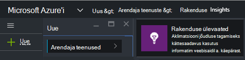
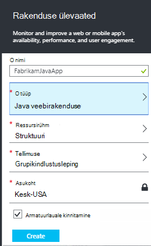
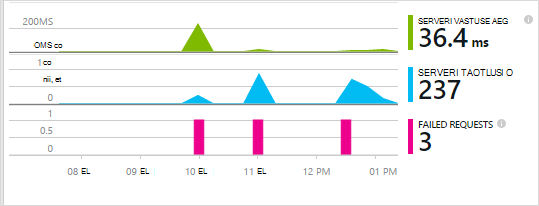
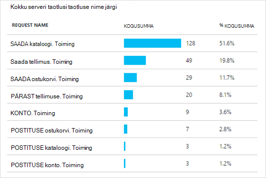
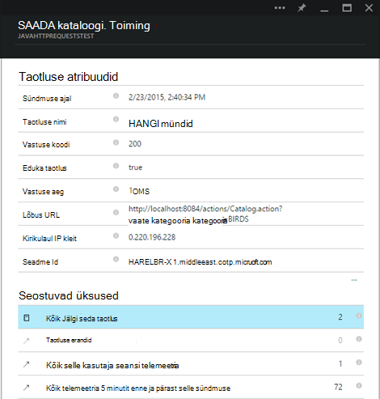

<properties 
    pageTitle="Rakenduse ülevaated Java web apps, mis on juba live" 
    description="Käivitage veebirakendus, mis töötab juba oma serveri jälgimine" 
    services="application-insights" 
    documentationCenter="java"
    authors="alancameronwills" 
    manager="douge"/>

<tags 
    ms.service="application-insights" 
    ms.workload="tbd" 
    ms.tgt_pltfrm="ibiza" 
    ms.devlang="na" 
    ms.topic="article" 
    ms.date="08/24/2016" 
    ms.author="awills"/>
 
# Rakenduse ülevaated Java web apps, mis on juba live

*Rakenduse ülevaated on eelvaade.*

Kui teil on veebirakendus, mis töötab juba J2EE serverisse, saate alustada jälgimise [Rakenduse](app-insights-overview.md) ülevaated kood muudatuste tegemiseks või projekti Kompileeri vajamata. Selle suvandi abil saate teavet HTTP päringuid saata oma serveri, töötlemata erandid ja jõudluse hinnale.

Peate [Microsoft Azure'i](https://azure.com)tellimust.

> [AZURE.NOTE] Sellel lehel protseduur lisab SDK oma veebirakenduse käitusajal. See käitusaja instrumentation on kasulik, kui te ei soovi värskendada või taastada oma lähtekoodi. Kuid kui võimalik, soovitame teil [lisada SDK lähtekoodi](app-insights-java-get-started.md) asemel. Mis annab teile rohkem võimalusi, näiteks koodi kasutaja tegevuste jälgimiseks.

## 1. saate kasutada ka rakenduse ülevaated instrumentation võtit

1. [Microsoft Azure'i portaali](https://portal.azure.com) sisselogimine
2. Saate luua uue rakenduse ülevaated ressursi

    
3. Java veebirakenduse tüübi määramine.

    
4. Otsige instrumentation võti uue ressursi. Peate selle klahvi vahetult koodi projekti kleepida.

    

## 2 SDK allalaadimine

1. Laadige alla [Rakenduse ülevaated SDK Java](https://aka.ms/aijavasdk). 
2. Teie serveris SDK, millest oma projekti kahendfaile laaditakse kataloogi sisu ekstraktimiseks. Kui kasutate Tomcat, tavaliselt oleks see kataloog`webapps\<your_app_name>\WEB-INF\lib`

## 3. Rakenduse ülevaated XML-faili lisamine

Looge kaust, kuhu lisasite SDK ApplicationInsights.xml. Pange sinna järgmine XML-i.

Asendada instrumentation klahvi, mis teil Azure portaalist.

    <?xml version="1.0" encoding="utf-8"?>
    <ApplicationInsights xmlns="http://schemas.microsoft.com/ApplicationInsights/2013/Settings" schemaVersion="2014-05-30">

      <!-- The key from the portal: -->

      <InstrumentationKey>** Your instrumentation key **</InstrumentationKey>

      <!-- HTTP request component (not required for bare API) -->

      <TelemetryModules>
        <Add type="com.microsoft.applicationinsights.web.extensibility.modules.WebRequestTrackingTelemetryModule"/>
        <Add type="com.microsoft.applicationinsights.web.extensibility.modules.WebSessionTrackingTelemetryModule"/>
        <Add type="com.microsoft.applicationinsights.web.extensibility.modules.WebUserTrackingTelemetryModule"/>
      </TelemetryModules>

      <!-- Events correlation (not required for bare API) -->
      <!-- These initializers add context data to each event -->

      <TelemetryInitializers>
        <Add   type="com.microsoft.applicationinsights.web.extensibility.initializers.WebOperationIdTelemetryInitializer"/>
        <Add type="com.microsoft.applicationinsights.web.extensibility.initializers.WebOperationNameTelemetryInitializer"/>
        <Add type="com.microsoft.applicationinsights.web.extensibility.initializers.WebSessionTelemetryInitializer"/>
        <Add type="com.microsoft.applicationinsights.web.extensibility.initializers.WebUserTelemetryInitializer"/>
        <Add type="com.microsoft.applicationinsights.web.extensibility.initializers.WebUserAgentTelemetryInitializer"/>

      </TelemetryInitializers>
    </ApplicationInsights>

* Haldusteenuse võti saadetakse koos iga üksus telemeetria ja ütleb rakenduse ülevaated oma ressursside kuvamiseks.
* HTTP-päring komponent pole kohustuslik. Telemeetria taotlusi ja vastuse korda kohta saadetakse automaatselt portaali.
* Sündmuste korrelatsioonikordaja on lisaks HTTP taotluse komponent. Seda määrab identifikaatori iga taotluse saadud serverisse ja lisab selle identifikaator atribuudi iga üksus telemeetria atribuudi 'Operation.Id'. See võimaldab teil oleksid telemeetria, mis on seotud iga taotluse [diagnostika](app-insights-diagnostic-search.md)otsingus filtri seadmisega.

## 4. mõne HTTP filtri lisamine

Leidke ja avage fail, web.xml projektis ja ühendamine järgmist koodilõik koodi jaotises web appi sõlm, kus teie rakendus filtrid on konfigureeritud.

Täpsemate tulemuste saamiseks peaks filtri vastendatud enne kõik filtrid.

    <filter>
      <filter-name>ApplicationInsightsWebFilter</filter-name>
      <filter-class>
        com.microsoft.applicationinsights.web.internal.WebRequestTrackingFilter
      </filter-class>
    </filter>
    <filter-mapping>
       <filter-name>ApplicationInsightsWebFilter</filter-name>
       <url-pattern>/*</url-pattern>
    </filter-mapping>

## 5. kontrolli tulemüüri erandid

Võib juhtuda [seadmine erandid Väljamineva meili saatmine](app-insights-ip-addresses.md).

## 6. taaskäivitage oma veebirakenduse

## 7. oma telemeetria kuvamine rakenduse ülevaated

Naaske oma rakenduse ülevaated ressursi [Microsoft Azure'i](https://portal.azure.com)portaalis.

Telemeetria kohta HTTP-päringud kuvatakse ülevaade enne. (Kui see pole olemas, oodake paar minutit ja seejärel klõpsake nuppu Värskenda.)

 

Klõpsake mis tahes diagrammi üksikasjalikumat mõõdikute kuvamiseks. 

 

Ja taotluse atribuutide kuvamisel kuvatakse telemeetria sündmusi, näiteks taotlusi ja erandid seotud.
 

[Lugege lisateavet mõõdikute.](app-insights-metrics-explorer.md)

## Järgmised sammud

* [Lisa telemeetria oma veebilehti](app-insights-web-track-usage.md) kuvari lehe vaated ja kasutajale mõõdikute.
* [Web testide häälestamine](app-insights-monitor-web-app-availability.md) veenduge, et teie taotlus jääb reaalajas ja reageeri.
* [Jäädvustada log jälgi](app-insights-java-trace-logs.md)
* [Otsi sündmuste ja logid](app-insights-diagnostic-search.md) probleemide.

 
