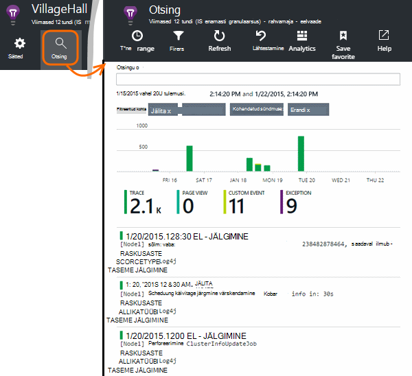

<properties 
    pageTitle="Java Jälita logib rakenduse ülevaated uurimine" 
    description="Klõpsake rakenduse ülevaated otsingu Log4J või Logback jälgi" 
    services="application-insights" 
    documentationCenter="java"
    authors="alancameronwills" 
    manager="douge"/>

<tags 
    ms.service="application-insights" 
    ms.workload="tbd" 
    ms.tgt_pltfrm="ibiza" 
    ms.devlang="na" 
    ms.topic="article" 
    ms.date="07/12/2016" 
    ms.author="awills"/>

# Java Jälita logib rakenduse ülevaated uurimine

Kui kasutate Logback või Log4J (v1.2 või v2.0) jälgida, saate määrata oma Jälita logid saata automaatselt rakenduse ülevaated, kus saate uurida ja neid otsida.

Installige [Rakendus ülevaateid SDK Java][java], kui te pole seda juba teinud.

## Logimise teekide lisamine projekti

*Valige sobiv viis oma projekti.*

#### Kui kasutate Maven...

Kui projekti juba häälestanud kasutamiseks Maven koostamine, ühendada ühte järgmised pikad koodi pom.xml faili.

Värskendage projekti sõltuvusi, saada kahendfaile alla laadida.

*Logback*

    <dependencies>
       <dependency>
          <groupId>com.microsoft.azure</groupId>
          <artifactId>applicationinsights-logging-logback</artifactId>
          <version>[1.0,)</version>
       </dependency>
    </dependencies>

*Log4J v2.0*

    <dependencies>
       <dependency>
          <groupId>com.microsoft.azure</groupId>
          <artifactId>applicationinsights-logging-log4j2</artifactId>
          <version>[1.0,)</version>
       </dependency>
    </dependencies>

*Log4J v1.2*

    <dependencies>
       <dependency>
          <groupId>com.microsoft.azure</groupId>
          <artifactId>applicationinsights-logging-log4j1_2</artifactId>
          <version>[1.0,)</version>
       </dependency>
    </dependencies>

#### Kui kasutate Gradle...

Kui projekti juba häälestanud kasutamiseks Gradle koostamine, lisamine ühte järgmistest ridade soovitud `dependencies` build.gradle failis rühmitamine:

Värskendage projekti sõltuvusi, saada kahendfaile alla laadida.

**Logback**

    compile group: 'com.microsoft.azure', name: 'applicationinsights-logging-logback', version: '1.0.+'

**Log4J v2.0**

    compile group: 'com.microsoft.azure', name: 'applicationinsights-logging-log4j2', version: '1.0.+'

**Log4J v1.2**

    compile group: 'com.microsoft.azure', name: 'applicationinsights-logging-log4j1_2', version: '1.0.+'

#### Muul juhul...

Laadige alla ja ekstraktimiseks vastav appender ja seejärel vastavat teeki lisada projekti:

Puuraidur | Laadi alla | Teegis
----|----|----
Logback|[SDK Logback appender abil](https://aka.ms/xt62a4)|applicationinsights-logimine-logback
Log4J v2.0|[SDK Log4J v2 appender abil](https://aka.ms/qypznq)|applicationinsights-logimine-log4j2 
Log4j v1.2|[SDK Log4J v1.2 appender abil](https://aka.ms/ky9cbo)|applicationinsights-logimine-log4j1_2 

## Funktsiooni appender lisamine oma logimine raames

Alusta jälgi, ühendamine oluline koodilõik koodi konfiguratsioonifail Log4J või Logback: 

*Logback*

    <appender name="aiAppender" 
      class="com.microsoft.applicationinsights.logback.ApplicationInsightsAppender">
    </appender>
    <root level="trace">
      <appender-ref ref="aiAppender" />
    </root>

*Log4J v2.0*

    <Configuration packages="com.microsoft.applicationinsights.Log4j">
      <Appenders>
        <ApplicationInsightsAppender name="aiAppender" />
      </Appenders>
      <Loggers>
        <Root level="trace">
          <AppenderRef ref="aiAppender"/>
        </Root>
      </Loggers>
    </Configuration>

*Log4J v1.2*

    <appender name="aiAppender" 
         class="com.microsoft.applicationinsights.log4j.v1_2.ApplicationInsightsAppender">
    </appender>
    <root>
      <priority value ="trace" />
      <appender-ref ref="aiAppender" />
    </root>

Rakenduse ülevaated appenders saab viidata mis tahes konfigureeritud puuraidur ja ei pruugi olla juurkausta puuraidur (nagu on näidatud ülaltoodud koodinäiteid).

## Tutvumine rakenduse ülevaated portaalis jälitusandmete

Nüüd, kui olete konfigureerinud jälgi saatmiseks rakenduse ülevaated projekti, saate vaadata ja otsida neid jälgi rakenduse ülevaated portaalis [Otsing] [ diagnostic] tera.

## Järgmised sammud

[Diagnostika otsing][diagnostic]

<!--Link references-->

[diagnostic]: app-insights-diagnostic-search.md
[java]: app-insights-java-get-started.md

 
