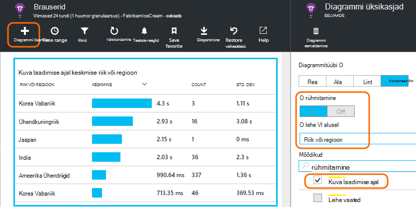

<properties
    pageTitle="Rakenduse ülevaated JavaScripti veebirakendusi | Microsoft Azure'i"
    description="Lehe vaatamine ja seansi loendab web kliendi andmete hankimine ja jälgida mustreid. JavaScripti veebilehtede erandid ja jõudlusega seotud probleemide tuvastamine."
    services="application-insights"
    documentationCenter=""
    authors="alancameronwills"
    manager="douge"/>

<tags
    ms.service="application-insights"
    ms.workload="tbd"
    ms.tgt_pltfrm="ibiza"
    ms.devlang="na"
    ms.topic="get-started-article"
    ms.date="08/15/2016"
    ms.author="awills"/>

# Rakenduse ülevaated veebilehtedel

[AZURE.INCLUDE [app-insights-selector-get-started-dotnet](../../includes/app-insights-selector-get-started-dotnet.md)]

Lisateave jõudlus ja oma veebilehele või rakenduse kasutamist. Kui lisate Visual Studio rakenduse ülevaated lehe skripti, saate ajastuste lehe laadimise ja AJAXI, loeb ja brauseri erandid, AJAXI tõrkeid, kasutajate ja seansi loendab üksikasjad. Kõik need saab segmenditud lehe, kliendi OS brauseri versiooni, geo asukohta ja muud mõõtmed. Saate tõrke loendab teatiste seadmine või lehe laadimise aeglane.

Saate rakenduse ülevaated veebilehtede - sa lihtsalt lisada JavaScripti lühike tükk. Kui teie veebiteenus pole [Java](app-insights-java-get-started.md) või [ASP.net-i](app-insights-asp-net.md), saate integreerida telemeetria kaudu oma serveri ja kliendid.

Teil on vaja [Microsoft Azure'i](https://azure.com)tellimust. Kui teie meeskond on ettevõtte tellimuse, paluge oma Microsofti Account lisamiseks omanik. On tasuta hinnakirjad taseme, arendamise ja väikesemahuliste kasutamine ei maksa midagi.

## Häälestamine rakenduse ülevaated teie veebilehele

Esmalt peate rakenduse ülevaated veebilehtede lisamine Teil võib juba teinud. Kui valisite rakenduse ülevaated lisamiseks oma veebirakenduse uue projekti dialoogiboksi Visual Studios, lisati seejärel skripti. Sel juhul ei pea seda enam teha.

Muul juhul tuleb kõigepealt lisada koodilõik kood oma veebilehtede järgmiselt.

### Avage rakenduse ülevaated on ressurss

Rakenduse ülevaated ressurss on, kus kuvatakse andmeid oma lehele jõudlus ja kasutuse kohta. 

[Azure'i portaali](https://portal.azure.com)sisse logida.

Kui te juba häälestanud serveripoolne rakenduse jälgimine, on teil juba ressursi.

Kui teil ei ole üks, looge see:

*Teil on veel küsimusi?* [Lisateavet ressursi loomise kohta](app-insights-create-new-resource.md).

### SDK skripti lisada oma rakenduse või veebilehed

Kiirkäivituse, saada veebilehtedel skripti:

Skripti lisada ainult enne selle `</head>` sildi iga lehekülje, mida soovite jälgida. Kui teie veebisait on juhtlehte, saab luua skripti seal. Näiteks:

* ASP.net-i MVC Projectis te pange see`View\Shared\_Layout.cshtml`
* Avage SharePointi saidil, klõpsake juhtpaneeli [saidi sätted / juhtleht](app-insights-sharepoint.md).

Skripti sisaldab instrumentation võtit, mis suunab teie rakenduse ülevaated ressursi andmed. 

([Selle skripti süvitsi selgitus](http://apmtips.com/blog/2015/03/18/javascript-snippet-explained/))

*(Kui kasutate tuntud veebilehe framework, otsige rakenduse ülevaated kvaliteediga. For example, on [ka AngularJS mooduli](http://ngmodules.org/modules/angular-appinsights).)*

## Üksikasjalik konfigureerimine

On mitmeid [Parameetrid](https://github.com/Microsoft/ApplicationInsights-JS/blob/master/API-reference.md#config) saate määrata, kuigi enamikel juhtudel ei tohiks peate. Näiteks saate keelata või Ajaxi kõnede kohta leheküljevaade (liikluse vähendamiseks) teatatud arv piirata. Või saate määrata silumine režiim on telemeetria tulemas on batched ilma kiiresti liikuda.

Järgmiste parameetrite seadmiseks Otsige see reale koodilõigu ning selle järele veel komaga eraldatud üksuste lisamine:

    })({
      instrumentationKey: "..."
      // Insert here
    });

[Saadaolevad parameetrid](https://github.com/Microsoft/ApplicationInsights-JS/blob/master/API-reference.md#config) on järgmised:

    // Send telemetry immediately without batching.
    // Remember to remove this when no longer required, as it
    // can affect browser performance.
    enableDebug: boolean,

    // Don't log browser exceptions.
    disableExceptionTracking: boolean,

    // Don't log ajax calls.
    disableAjaxTracking: boolean,

    // Limit number of Ajax calls logged, to reduce traffic.
    maxAjaxCallsPerView: 10, // default is 500

    // Time page load up to execution of first trackPageView().
    overridePageViewDuration: boolean,

    // Set these dynamically for an authenticated user.
    appUserId: string,
    accountId: string,

## Rakenduse käivitamine

Käivitage oma veebirakenduse, kasutage seda telemeetria luua ja oodake mõne hetke aega. Võite käivitada, kasutades klahvi **F5** arengu arvutis või selle avaldada ja lasta kasutajatel seda esitada.

Kui soovite kontrollida telemeetria, mis saadab web app rakenduse ülevaated, kasutage brauseri silumine tööriistad (**F12** palju brauseritega). Dc.services.visualstudio.com saadetakse andmed.

## Brauseri jõudluse andmete analüüsimine

Avage brauserid tera liidetud jõudlusandmeid teie kasutajate brauseritest kuvamiseks.

*Pole veel andmeid? Klõpsake * *värskendamine* * lehe ülaosas. Veel midagi? Lugege teemat [tõrkeotsing](app-insights-troubleshoot-faq.md).*

Tera brauserid on [mõõdikute Exploreri blade](app-insights-metrics-explorer.md) eelseadistatud filtrite ja diagrammi Valikud. Kui soovite, ja salvestage tulemus lemmikuks saate redigeerida ajavahemiku, filtrite ja diagrammi konfigureerimine. Klõpsake nuppu **Taasta vaikesätted** naasmiseks algse blade konfigureerimine.

## Lehe laadimise jõudlus

Ülaosas on segmenditud diagrammi laadimise ajal. Diagrammi kokku kõrgus tähistab Keskmine kellaaeg laadimise ja teie kasutajate brauserid rakenduste lehtede kuvamine. Aeg on mõõdetuna kui brauseri saadab HTTP taotluse, kuni kogu sünkroonse laadi sündmused on töödeldud, sh paigutus ja käivitamine. See ei sisalda asünkroonne toiminguid nagu laadimine veebiosade AJAXI kõned.

Diagrammi segmentide kokku laadimise ajal [määratletud W3C standardne ajastuste](http://www.w3.org/TR/navigation-timing/#processing-model)sisse. 

Pange tähele, et *võrguühendus* aeg on sageli väiksem kui võib-olla eeldate, sest see on keskmiseks üle kõik taotluste serveri brauseri kaudu. Palju üksikuid taotlusi on ühendus aeg 0, kuna seal on juba aktiivne ühendus serveriga.

### Aeglase laadimise?

Lehe aeglase laadimise on põhi rahulolematust kasutajate jaoks. Kui diagramm näitab, et lehe aeglase laadimise, on lihtne teha mõned diagnostika uurimistöö.

Diagrammi kuvatakse kõik lehe laadimise keskmise rakenduse. Kui probleem on ainult teatud kindlate lehekülgede vaatamiseks vaadake allapoole tera, kus on lehe-URL-i segmenditud koordinaatvõrgu:

Pange tähele, et lehe vaate count ja standardhälve. Kui lehtede arv on väga väike, siis probleemi pole mõjutamata kasutajate palju. Kõrge purunemisjõu standardhälve (võrreldav keskmise ise) näitab palju üksikuid mõõtmed erinevus.

**Suurendamine ühe URL-i ja ühe lehekülje kaupa.** Klõpsake mis tahes lehe nime kuvamiseks filtreeritud ainult seda URL-i brauseri diagrammide tera ja seejärel klõpsake lehe vaate eksemplari.

Klõpsake `...` täieliku loendi atribuudid selle sündmuse või kontrolli Ajaxi kõned ja seotud sündmused. Aeglane Ajaxi kõned mõjutavad üldised laadimise ajal, kui need on sünkroonse. Seotud sündmused hulka serveri taotlusi sama URL-i (kui olete häälestanud rakenduse ülevaated oma veebiserverisse).

**Lehe jõudlus aja jooksul.** Tagasi veebisaidil labale brauserid muutke kuva laadimise ajal ruudustiku joondiagramm kuvamiseks, kui teatud ajal peaks.

**Muude mõõtmete segmendi.** Võib-olla teie lehed on aeglane laadimine kindla brauseri, kliendi OS või kasutaja asukoht? Uue diagrammi lisamine ja eksperimenteerida **Group by** dimensiooni.

## AJAXI jõudlus

Veenduge, et kõik AJAXI kõned veebilehtede on hästi. Neid kasutatakse sageli osa oma lehele asünkroonselt täitmiseks. Kuigi üldine lehe võib laadimise kohe, kasutajate võib võimatuks jõllis tühja veebiosad, kuvada nende andmete ootamine.

AJAXI kõnede teie veebilehele on kujutatud brauserid enne sõltuvused.

Kokkuvõttediagrammid tera ülemises osas on:

ja üksikasjalik analüüsitabelite madalamal.

Klõpsake ükskõik millisele reale üksikasjalikku teavet.

> [AZURE.NOTE] Kui kustutate enne brauserid filter, sisalduvad nii serveris ja AJAXI sõltuvused nende diagrammide. Klõpsake nuppu Taasta vaikesätted filtri konfigureerimiseks.

**Nurjunud Ajaxi kõned süvitsi** Kerige allapoole suvandini sõltuvus tõrkeid ruudustiku ja klõpsake järjest näha teatud juhtudel.

Klõpsake `...` jaoks täielik telemeetria kasutada Ajaxi helistamiseks.

### Ajaxi helistada ei saa esitada?

Ajaxi kõned sisaldavad mis tahes HTTP-kõnede teie veebilehele skripti. Kui te ei näe neid teatatud, veenduge, et koodilõigu ei soovitud `disableAjaxTracking` või `maxAjaxCallsPerView` [Parameetrid](https://github.com/Microsoft/ApplicationInsights-JS/blob/master/API-reference.md#config).

## Brauseri erandid

Enne brauserites, on erandid Kokkuvõte skeem ja koordinaatvõrgu tüüpi erandi täpsemaks tera alla.

Kui te ei näe brauseri erandid teatatud, veenduge, et koodilõigu ei soovitud `disableExceptionTracking` [parameeter](https://github.com/Microsoft/ApplicationInsights-JS/blob/master/API-reference.md#config).

## Kontrolli üksikut lehte vaate sündmused

Tavaliselt lehe vaate telemeetria on analüüsitud rakenduse ülevaated ja näete ainult kumulatiivse aruandeid, mis on üle kõikide kasutajate. Kuid silumine eesmärgil, samuti saate vaadata üksikuid lehe vaate sündmused.

Diagnostika otsing tera, filtrite lehe vaate.

Sündmuse täpsemaks vaatamiseks klõpsake. Klõpsake lehel üksikasjad nuppu "..." veelgi täpsemaks vaatamiseks.

> [AZURE.NOTE] Kui kasutate [Otsing](app-insights-diagnostic-search.md), pöörake tähelepanu sellele, et teil on vastavad kogu sõnade: "Abou" ja "bout" ei vasta "Teave".

Samuti saate võimsaid [päringu Kasutusanalüüsi keele](app-insights-analytics-tour.md) lehe vaated otsimiseks.

### Lehe atribuutide kuvamine

* **Lehe vaate kestus** 

 * Vaikimisi aega kulub laadimiseks klõpsake lehe kliendilt taotlus täielik laadimine (sh abistava failide v.a asünkroonne toimingud nagu Ajaxi kõned). 
 * Kui seate `overridePageViewDuration` [lehe konfiguratsiooni](#detailed-configuration)klientide vaheline intervall taotlus täitmise esimese `trackPageView`. Kui olete teisaldanud trackPageView tavaline positsioon pärast lähtestamine skripti, see kajastab muu väärtuse.
 * Kui `overridePageViewDuration` on seadmine ja kestus argument on esitatud selle `trackPageView()` helistada, siis argumendi väärtus kasutatakse selle asemel. 

## Kohandatud lehe loendab

Vaikimisi lehtede arv ilmneb iga kord, kui uue lehe laadib Kliendi brauser.  Kuid võib soovite loendada lehe täiendavad vaated. Näiteks lehe võib tabelduskohad selle sisu kuvamine ja soovite loendada lehe, kui kasutaja lülitub vahekaarte. Laadimine JavaScripti koodi lehel võib uue sisu brauseri URL-i muutmata.

Kliendi koodi vastavas kohas lisada JavaScripti kõne umbes järgmine:

    appInsights.trackPageView(myPageName);

Lehe nimi võib sisaldada sama märki, URL, kuid midagi pärast "#" või "?" ignoreeritakse.

## Kasutus jälgimine

Kas soovite teada saada, mida kasutajad oma rakendusega teha?

* [Lisateavet kasutuse jälgimine](app-insights-web-track-usage.md)
* [Vaadake, kuidas kohandatud sündmused ja mõõdikute API](app-insights-api-custom-events-metrics.md).

#### Video: Jälgimise kasutamine

> [AZURE.VIDEO tracking-usage-with-application-insights]

## Järgmised sammud

* [Jälgida kasutust](app-insights-web-track-usage.md)
* [Kohandatud sündmused ja mõõdikud](app-insights-api-custom-events-metrics.md)
* [Koosta mõõt lugege](app-insights-overview-usage.md)

