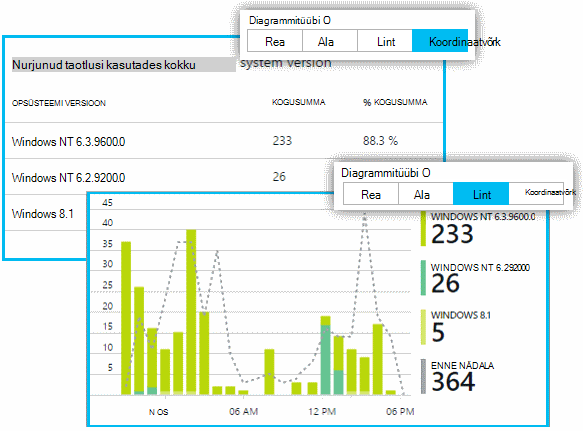

<properties 
    pageTitle="Klõpsake rakenduse ülevaated mõõdikute uurimine | Microsoft Azure'i" 
    description="Kuidas tõlgendada diagrammide argumendil Explorer ja kuidas kohandada argumendil Exploreri labad." 
    services="application-insights" 
    documentationCenter=""
    authors="alancameronwills" 
    manager="douge"/>

<tags 
    ms.service="application-insights" 
    ms.workload="tbd" 
    ms.tgt_pltfrm="ibiza" 
    ms.devlang="na" 
    ms.topic="article" 
    ms.date="10/15/2016" 
    ms.author="awills"/>
 
# Klõpsake rakenduse ülevaated mõõdikute uurimine

Klõpsake [Rakenduse ülevaated] mõõdikute[ start] on mõõdetud väärtused ja loendab sündmused, mis saadetakse telemeetria rakenduse kaudu. Need võimaldavad teil jõudlusega seotud probleemide tuvastamine ja vaadake, kuidas rakenduse kasutatakse trende. On mitmeid standard mõõdikute ja saate luua oma kohandatud mõõdikute ja sündmused.

Diagrammid, näiteks summade, keskmiste või loendab kokkuvõtlike väärtuste kuvatakse mõõdikute ja sündmuste arv.

Siin on näide diagrammi:

Segmenditud on mõned diagrammid: diagramm, mis tahes hetkel kokku kõrgus on kuvatud mõõdikud summa. Legendi Vaikimisi kuvatakse suurim kogus.

Punktiirjooni Kuva väärtus mõõdiku üks saadetakse nädal.

## Ajavahemiku

Saate muuta ajavahemiku, diagramme või mis tahes blade võrkude.

Kui te ootate andmeid, mida ei ole veel ilmunud, klõpsake nuppu Värskenda. Diagrammide värskendada ise intervalliga, kuid sagedus on pikemad suuremat kellaaja vahemike jaoks. Väljalaske režiimis, võib kuluda aega tulevad analüüsi müügivõimaluste peale diagrammi andmete jaoks.

Diagrammi osa suurendamine, lohistage üle:

Klõpsake selle taastamine nupu Võta tagasi suumi nupp.

## Väärtused granulaarsus ja punkti

Hõljutage kursorit üle diagrammi sel hetkel mõõdikud väärtuste kuvamiseks.

Teatud punktis mõõdiku väärtus liidetakse eelmise valimite intervalli. 

Tera ülaosas kuvatakse valimite intervall või "granulaarsus". 

Saate kohandada selle aja vahemiku tera olevaid.

Saadaval granulaarsused sõltuvad ajavahemiku, valite. Konkreetsete granulaarsused on "Automaatne" granulaarsus aja vahemiku alternatiivid. 

## Mõõdikute Explorer

Klõpsake mis tahes diagrammi ülevaade enne seotud diagrammide ja analüüsitabelite üksikasjalikumat kogumi kuvamiseks. Nende diagrammide ja analüüsitabelite keskenduda üksikasjad, mis teile huvi saate redigeerida.

Või klõpsake lihtsalt nuppu mõõdikute Exploreri ülevaade tera juhataja.

Näiteks klõpsake web appi nurjus taotlusi diagrammi kaudu:

## Mida tähendavad arvud?

Legendi kõrval Vaikimisi kuvatakse liidetud väärtus tavaliselt diagrammi aja jooksul. Kui hiirega üle diagrammi, see kuvatakse väärtus sel hetkel.

Iga andmepunkti diagrammil on saanud eelmise valimite intervall või "granulaarsus" andmete väärtused agregaadi. Granulaarsus tera ülaosas on kuvatud ja sõltub üldine ajaskaala diagrammi.

Mõõdikute saab liita erineval viisil: 

 * Saadud valimite intervalli või diagrammi perioodi andmepunktide väärtuste lisab **summa** .
 * **Keskmine** jagab arvu andmepunkte, mis on saanud intervalli summa.
 * **Kordumatu** loendab kasutatakse loendab kasutajatele ja kontod. Valimite intervalli või diagrammi perioodil joonisel näha selle aja jooksul erinevate kasutajate arv.

Saate muuta koondamine meetod.

Vaikemeetod iga mõõdiku jaoks on näidatud uue diagrammi loomisel või kui kõik mõõdikud on märkimata.

## Diagrammide ja analüüsitabelite redigeerimine

Tera uue diagrammi lisamine

Valige **Redigeeri** olemasolevad või uued diagrammil redigeerimiseks, mis seda näitab.

Saate kuvada rohkem kui üks mõõt diagrammi, kuigi on piirangute kohta saab kuvada koos kombinatsioonid. Kui valite ühe meetermõõdustik, mõned teised on keelatud. 

Kui te kodeeritud [kohandatud mõõdikute] [ track] rakendusse (kõned TrackMetric- ja TrackEvent) need on loetletud siin.

## Andmete segmendi

Saate tükeldada mõõdiku atribuudi – näiteks võrdlemiseks kliendid erinevate operatsioonisüsteemide kohta. 

Valige diagrammil või ruudustikus, lülitage rühmitamise ja valige atribuudi alusel rühmitamine.

> [AZURE.NOTE] Rühmitamise kasutamisel ala ja lintdiagrammi tüüpi pakuvad virnastatud kuvamine. See sobib, kus koondamine meetod on summa. Kuid kui koondamine tüüp on keskmine, valige joone või koordinaatvõrgu kuvamine tüübid. 

Kui te kodeeritud [kohandatud mõõdikute] [ track] oma rakendusse ja need sisaldavad kinnisvara, saate valida loendist atribuut.

Diagramm on liiga väike segmenditud andmete jaoks? Selle kõrgus kohandamiseks tehke järgmist.

## Andmete filtreerimine

Ainult valitud atribuudi väärtusekogumi mõõdikud vaatamiseks tehke järgmist.

Kui te ei vali kõik väärtused teatud atribuudi, on sama, valides need kõik: selle atribuudi on ei Filtreeri.

Pange tähele loendab sündmuste kõrval iga atribuudi väärtust. Ühe atribuudi väärtuste valimisel loendab muude kinnisvarahindade kõrval on kohandatud.

Filtrite rakendamine tera kõik diagrammid. Kui soovite erinevad filtrid, rakendatakse erinevaid diagramme, luua ja salvestada erinevate mõõdikute labad. Kui soovite, saate kinnitada kaudu erinevate labad diagrammide armatuurlaud, nii, et saaksite neid vaadata kõrvuti.

### Robot ja web test liikluse eemaldamine

Filtri **reaal- või sünteetilisest liikluse** ja märkige ruut **Real**.

Samuti saate filtreerida **Allikas sünteetiliste liiklust**.

### Atribuutide lisamiseks loendi filtreerimine

Kas soovite filtreerida telemeetria kategooria teie enda valitud Meilikausta? Näiteks võib-olla saate jagada kasutajate eri kategooriatesse ja soovite segmendi andmete nende kategooriate järgi.

[Oma atribuusi loomine](app-insights-api-custom-events-metrics.md#properties). Määraks [Telemeetria Initializer](app-insights-api-custom-events-metrics.md#telemetry-initializers) on see kuvatakse kõik telemeetria – sh standard telemeetria saadetud SDK mooduleid.

## Diagrammitüübi redigeerimine

Pange tähele, et saate vaheldumisi analüüsitabelite ja graafikud.

## Salvestage oma mõõdikute blade

Kui olete loonud mõne diagramme, salvestage need lisamine lemmikute hulka. Saate valida, kas selle ühiskasutusse teised meeskonna liikmed, kui kasutate organisatsioonikonto.

Tera uuesti, **minge ülevaade tera** näha ja avage lemmikud:

Kui valisite salvestatud suhteline ajavahemiku, värskendatakse tera uusima mõõdikute. Kui valisite absoluutne ajavahemiku, kuvatakse see samad andmed iga kord.

## Tera lähtestamine

Kui redigeerite tera, kuid seejärel soovite naasta algse salvestatud kogum, klõpsake lihtsalt nuppu Lähtesta.

## Reaalajas mõõdikute voo: kiirsõnumside mõõdikud jälgimine

Reaalajas mõõdikute voo kuvatakse teie rakenduste mõõdikute paremale just praegu, koos läheduses reaalajas latentsus 1 sekund. See on väga kasulik, kui olete vabastamine uue koostamine ja veenduge, et kõik oleks õigesti töötanud, või uurida reaalajas juhtum.

Erinevalt mõõdikute Explorer, kuvab Live mõõdikute voo mõõdikute kindlaksmääratud. Andmete püsib ainult seni, kuni see on diagrammi ja seejärel hüljatakse. 

Reaalajas mõõdikute voo on saadaval rakenduse ülevaateid SDK ASP.net-i versioon 2.1.0 või uuem versioon.

## Teatiste seadmine

Teavitama mis tahes meetermõõdustik ebatavalised väärtuste e-posti teel, lisage teatise. Saate valida, kas saata e-posti konto administraatorid või teatud meiliaadressid.

[Lisateavet teatiste][alerts].

## Eksport Excelisse

Saate eksportida argumendil andmeid, mis kuvatakse meetermõõdustik Exploreris Exceli faili. Eksporditud andmeid kaasab andmeid kõigi diagramme ja tabeleid, nagu näha portaalis. 

Andmeid iga diagramm või tabel on eraldi lehele Exceli faili eksportida.

Mida te näete, mida saab eksportida. Kui soovite muuta eksporditud andmevahemik, muuta ajavahemiku või filtrid. Tabelid, kui nupp **veel laadimine** on kuvatud, võite klõpsata seda enne, kui klõpsate nuppu ekspordi, on eksporditud rohkem andmeid.

*Praegu saate eksportida töötab ainult Internet Explorer ja Chrome jaoks. Töötame lisamise tugi muudes brauserites.*

## Pidev eksport

Kui soovite andmed eksportida pidevalt, et te seda väliselt töödelda, kaaluge [pidev eksportida](app-insights-export-telemetry.md).

### Power BI

Kui soovite andmete isegi rikkalikumat vaateid, saate [eksportida Power BI](http://blogs.msdn.com/b/powerbi/archive/2015/11/04/explore-your-application-insights-data-with-power-bi.aspx).

## Kasutusanalüüsi

[Kasutusanalüüsi](app-insights-analytics.md) on mitmekülgsem viis oma telemeetria võimsaid päringukeelt kasutavate analüüsimiseks. Seda kasutada, kui soovite ühendada või arvutada tulemusi mõõdikute teha, mille teie rakenduse viimatiste jõudlus – deph uurimine. Teisalt, kasutage mõõdikute Explorer, kui soovite automaatselt värskendada, diagrammide armatuurlaud ja teatisi.

## Tõrkeotsing

*Ma ei näe mingeid andmeid diagrammis.*

* Filtrite rakendamine kõik diagrammid, enne. Veenduge, et kui te kasutate keskendudes ühe diagrammi, ei määratud filter, mis ei hõlma kõik andmed teise arvutisse. 

    Kui soovite erinevate filtrite erinevaid diagramme, loomist erinevate labad, salvestage need eraldi lemmikute hulka. Kui soovite, saate kinnitada need armatuurlaud, et saaksite neid vaadata kõrvuti.

* Kui diagrammi Rühmitusalus atribuut, mis on määratletud mõõdiku, siis tekib midagi diagrammil. Kustutage 'Rühmitusalus' või valige muu rühmitamise atribuut.
* Jõudlusandmeid (CPU, IO määr jne) on saadaval Java veebiteenused, Windowsi töölauarakenduste, [IIS web rakendused ja teenused, kui installite oleku jälgimine](app-insights-monitor-performance-live-website-now.md)ja [Azure pilveteenustega](app-insights-azure.md). Pole saadaval Azure veebisaitide.

## Järgmised sammud

* [Järelevalve rakenduse ülevaated kasutamine](app-insights-overview-usage.md)
* [Diagnostika otsingu abil](app-insights-diagnostic-search.md)

<!--Link references-->

[alerts]: app-insights-alerts.md
[start]: app-insights-overview.md
[track]: app-insights-api-custom-events-metrics.md

 