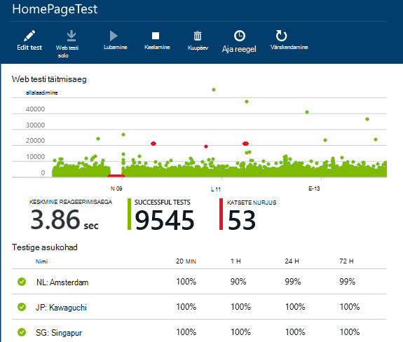
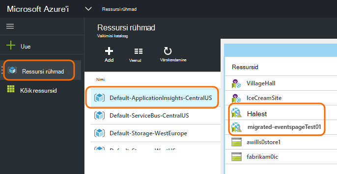
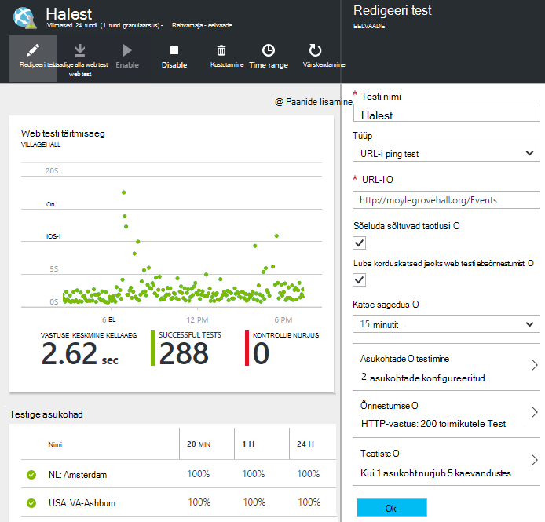

<properties 
    pageTitle="Migreerimine rakenduste ülevaateid kättesaadavus testide Azure lõpp-punkti" 
    description="Klassikaline Azure'i lõpp-punkti jälgimine kontrollib migreerimine rakendusse rakenduse ülevaated kättesaadavus testib 31 Oktoober 2016."
    services="application-insights" 
    documentationCenter=""
    authors="soubhagyadash" 
    manager="douge"/>

<tags 
    ms.service="application-insights" 
    ms.workload="tbd" 
    ms.tgt_pltfrm="ibiza" 
    ms.devlang="na" 
    ms.topic="article" 
    ms.date="07/25/2016" 
    ms.author="awills"/>
 
# Rakenduse ülevaateid kättesaadavus katsed kontrollimise Azure lõpp-punkti teisaldamine

Kas kasutate [lõpp-punkti jälgimise](https://blogs.msdn.microsoft.com/mast/2013/03/03/windows-azure-portal-update-configure-web-endpoint-status-monitoring-preview/) Azure rakendusi? *31 Oktoober 2016*, me asendada need uue ja võimsam [kättesaadavus kontrollib](app-insights-monitor-web-app-availability.md). Oleme juba loonud mõne uue testide, kuigi nad on keelatud kuni 31 Oktoober 2016. 

Saate redigeerida uue kontrollib ja teha parameetrit ise, kui soovite. Leiate need [Azure portaali](https://portal.azure.com) jaotises vaike-ApplicationInsights-CentralUS ressurss.

## Mis on kättesaadavus kontrollib?

Kättesaadavus testimine on funktsioon Azure'i, mis kontrollib pidevalt, mis tahes veebisaidi või teenus on loodud ja töötab, saates HTTP päringuid selle (ühe ping või Visual Studio web katsed) kuni 16 asukohtadest kogu maailma ulatuses. 

[Klassikaline Azure portaali](https://manage.windowsazure.com)nimetati katsed lõpp-punkti jälgimine. Need olid rohkem piiratud ulatus. Uue kättesaadavus testide on oluliselt parandada.

* Kuni 10 Visual Studio web või ping katsed rakenduse ülevaated ressursi kohta. 
* Kogu maailmas testi päringuid saata oma veebirakenduse kuni 16 asukohad. Suuremat kontrolli katse õnnestumise. 
* Mis tahes veebisaidi või teenuse – mitte ainult Azure veebirakenduste testida.
* Korduskatsed test: vähendada valepositiivsete teatiste siirdamiseks võrguprobleemide tõttu. 
* Webhooks võimalik saada teatisi HTTP POST teatised.

Lugege lisateavet [kättesaadavus kontrollib siin](app-insights-monitor-web-app-availability.md).

Kättesaadavus kontrollib on [Visual Studio rakenduse ülevaated](app-insights-overview.md), mis on laiendatav Kasutusanalüüsi teenus, mis tahes veebirakenduse jaoks.

## Mis juhtub minu lõpp-punkti nii kontrollib?

* Meil on kopeeritud oma lõpp-punkti kontrollib uue rakenduse ülevaateid kättesaadavus katsete jälgimine.
* Uue kättesaadavus testide on praegu keelatud ja vana lõpp-punkti testide töötavad.
* Funktsiooni teavitamine reeglite *ei* viida. Esialgu on loodud uue testide vaikimisi reegli abil:
 * Päästikute, kui rohkem kui 1 asukoht aruannete tõrked 5 minutit.
 * Tellimuse administraatorite saadab e-posti.

[Azure'i portaalis](https://portal.azure.com)leiate migreeritud testide ressursirühm "Vaike-ApplicationInsights-CentralUS". Testi nimed on tähistatud "Migrated-". 

## Mida on vaja teha?

* Kui me kuidagi vahele migreerimine teie, uue kättesaadavus testide on [lihtne häälestamine](app-insights-monitor-web-app-availability.md).

### V: suvand Pole vaja midagi teha. Jätke see meile.

**31 Oktoober 2016** me:

* Vana lõpp-punkti testide keelamine.
* Luba migreeritud kättesaadavus testide.

### Suvand B: saate hallata ja/või uue testide lubamine.

* Vaatama ja redigeerima uue kättesaadavus testide uue [Azure portaali](https://portal.azure.com). 
 * Vaadake üle päästik kriteeriumid
 * Meilisõnumite adressaatide läbivaatamine
* Uue testide lubamine
* Keelame pärand lõpp-punkti kontrollib 31 Oktoober 2016 jälgimine 

### Suvand C: loobuda

Kui te ei soovi kasutada kättesaadavus kontrollib, saate neid kustutada [Azure'i](https://portal.azure.com)portaalis. Olemas on ka teatise meilisõnumite allosas link Tühista tellimus.

Me endiselt vana lõpp-punkti testide 31 Oktoober 2016 kustutada. 

## Kuidas muuta uue testide?

[Azure'i portaali](https://portal.azure.com) sisse logida ja otsida web testide "Migrated-": 

Redigeerimine ja/või lubada test:

## Miks on see nii juhtub?

Parem teenus. Vana teenuse lõpp-punkti on palju kitsam. Vaid kahe URL-id võivad ette lihtsa ping kontrollib 3 geo asukohtadest Azure VM või web app. Uue testide käitamise mitme etapi web testide kuni 16 asukohad ja saate määrata kuni 10 kontrollib ühe rakenduse. Saate testida URL-i – seda ei pea olema ka Azure'i saidi.

Uue testide on konfigureeritud eraldi web appi või VM, mis teil testida. 

Me migreerimise tagamiseks uue portaali kasutamise ajal kontroll nende üle ei testide. 

## Mis on rakenduse ülevaated?

Uue kättesaadavus testide kuuluvad [Visual Studio rakenduse ülevaated](app-insights-overview.md). Siin on [2-minutilises videos](http://go.microsoft.com/fwlink/?LinkID=733921).

## Ma olen maksma uue testide?

Migreeritud testide on häälestatud on rakenduse ülevaated ressurss vaikimisi tasuta lepingus. See võimaldab kuni 5 miljonit andmepunktide kogum. Lihtne, mis hõlmab teie praegu kasutatakse andmete maht. 

Muidugi, kui teile meeldib rakenduse ülevaated ning luua rohkem kättesaadavus teste või vastu võtta rohkem jõudluse jälgimine ja diagnostika funktsioone, siis kuvatakse luua rohkem andmepunkte.  Tulem ainult oleks siiski võib klõpsamist tasuta leping piirmäära. Te ei saa arve juhul, kui valite Standard või Premium lepingud. 

[Lisateavet rakenduse ülevaated hinnad ja kvoodi jälgimise kohta](app-insights-pricing.md). 

## Mis on ja ei viida?

Säilitada oma vana lõpp-punkti katsete:

* Lõpp-punkti URL-i testitakse.
* Geo kohad, kust saadetakse taotlused.
* Katse sagedus jääb 5 minutit.
* Testi ajalõpp jääb 30 sekundit. 

Ei viida:

* Teatiste päästik reegel. Meil on loodud päästikute, kui 1 asukoht aruannete tõrked 5 minuti reegel.
* Teatiste adressaadid. Tellimuse omanikud ja kaasomanike saadetakse teatis e-kirju. 

## Kuidas leiavad uue testide?

Kui soovite, saate uute testide nüüd redigeerida. [Azure portaali](https://portal.azure.com)sisselogimine, avage **Ressursi rühmad** ja valige **Vaike-ApplicationInsights-CentralUS**. Selle rühma leiate uue web testide. [Vaadake, kuidas uue kättesaadavus testide](app-insights-monitor-web-app-availability.md).

Pange tähele, et uus teatis meilisõnumid saadetakse see aadress: rakenduse ülevaateid teatised(ai-noreply@microsoft.com)

## Mis juhtub, kui mul pole vaja midagi teha?

Valik A rakendatakse. Me lubada migreeritud testide ning eespool nimetatud vaikereeglit teatiste häälestamine. On teil mis tahes kohandatud teatiste reegleid, nagu eespool Adressaatide lisamine. Keela me jälgimine kontrollib pärand lõpp-punkti. 

## Kui anda tagasisidet selle kohta? 

Teie tagasiside. Palun [saatke meile](mailto:vsai@microsoft.com). 

