<properties
    pageTitle="Jõudlusprobleemide töötava IIS-i veebisaidil diagnoosimine | Microsoft Azure'i"
    description="Veebisaidi jõudluse jälgimist ilma seda uuesti juurutamine. Kasutage eraldi või rakenduse ülevaateid SDK sõltuvus telemeetria saada."
    services="application-insights"
    documentationCenter=".net"
    authors="alancameronwills"
    manager="douge"/>

<tags
    ms.service="application-insights"
    ms.workload="tbd"
    ms.tgt_pltfrm="ibiza"
    ms.devlang="na"
    ms.topic="get-started-article"
    ms.date="10/24/2016"
    ms.author="awills"/>

# Dokumendi veebirakenduste käitusajal rakenduse ülevaated

*Rakenduse ülevaated on eelvaade.*

Saate reaalajas veebirakenduse Visual Studio rakenduse ülevaated vahend, ilma vajaduseta muuta või Juurutage uuesti oma kood. Rakendused on majutatud kohapealse IIS-i server, installimist oleku jälgimine; või kui need on Azure veebirakenduste või mõne Azure VM käivitamiseks, saate installida rakenduse ülevaated laiendamine. (On ka eraldi artikleid instrumenting [live J2EE veebirakenduste](app-insights-java-live.md) ja [Azure pilveteenused](app-insights-cloudservices.md).)

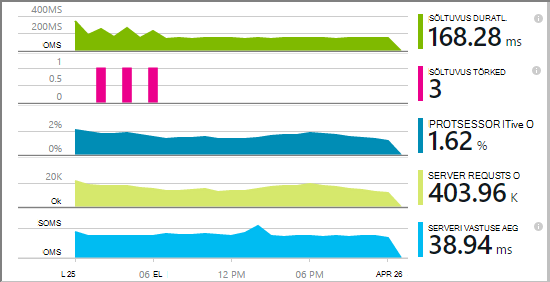

Teil on kolm marsruudib valikut rakenduse ülevaated rakendamiseks oma .net-i veebirakenduste järgmist.

* **Koostamise ajal:** [Rakenduse ülevaated SDK lisamine] [greenbrown] oma web app koodi. 
* **Käitusaeg:** Dokumendi oma veebirakenduse server, ilma taastamine ja kood tuleks allpool kirjeldatud.
* **Nii:** Luua oma web app koodi SDK ja rakendada ka käitusaja laiendid. Parima mõlema variandi. 

Siin on ülevaade iga kaudu saate:

||Aja koostamine|Käitusaeg|
|---|---|---|
|Taotlusi ja erandid|Jah|Jah|
|[Üksikasjalikumat erandid](app-insights-asp-net-exceptions.md)||Jah|
|[Sõltuvus diagnostika](app-insights-asp-net-dependencies.md)|.NET 4.6 + kohta|Jah|
|[Süsteemi jõudluse hinnale](app-insights-performance-counters.md)||IIS-i või Azure pilveteenuses, ei Azure web app|
|[Kohandatud telemeetria API][api]|Jah||
|[Jälita log integreerimine](app-insights-asp-net-trace-logs.md)|Jah||
|[Lehe vaate ja kasutajale andmed](app-insights-javascript.md)|Jah||
|Pole vaja taastada kood|Ei||

## Dokumendi oma veebirakenduse käitusajal

Teil on vaja [Microsoft Azure'i](http://azure.com) tellimust.

### Kui teie rakendus on Azure web appi või pilveteenuses

* Valige rakenduse ülevaated Azure rakenduse Juhtpaneel. 

    [Lisateavet leiate teemast](app-insights-azure.md).

### Kui teie rakendus on majutatud IIS-serveris

1. IIS-i veebiserverisse, logige sisse administraatori identimisteave.
2. Laadige alla ja käivitage [installer oleku jälgimine](http://go.microsoft.com/fwlink/?LinkId=506648).
4. Installiviisardis, logige sisse Microsoft Azure'i.

    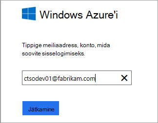

    *Ühenduse tõrkeid? Vaadake teemat [tõrkeotsing](#troubleshooting).*

5. Valige installitud veebirakenduse või veebisaiti, mida soovite jälgida, siis ressursside, mida soovite vaadata rakenduse ülevaated portaali tulemusi.

    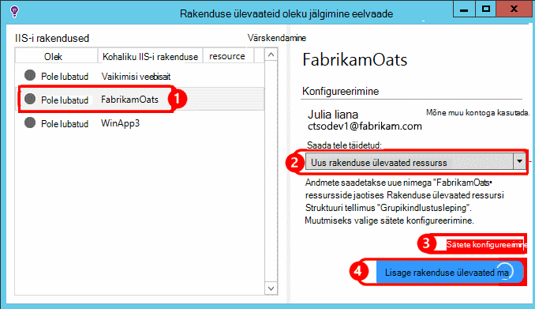

    Tavaliselt konfigureerimiseks uue ressursi ja [ressursirühm][roles].

    Muul juhul on olemasoleva ressursi kasutamine, kui olete häälestanud juba [web kontrollib] [ availability] saidi või [web kliendi jälgimine][client].

6. Taaskäivitage IIS-i.

    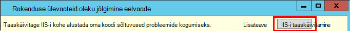

    Oma veebiteenuse katkestatakse lühikest aega.

6. Pange tähele, et ApplicationInsights.config lisada veebirakenduste, mida soovite jälgida.

    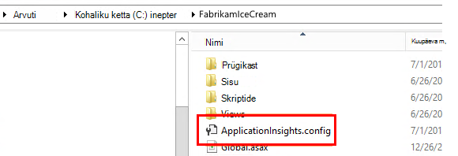

   On ka mõned muudatused web.config.

#### Kas soovite (taas) konfigureerida hiljem?

Kui olete viisardi, saate uuesti konfigureerida agent iga kord, kui soovite. Seda saab kasutada ka siis, kui installisite agent, kuid on mõned algsel installimisel probleeme.

## Vaate jõudlus telemeetria

[Azure'i portaali](https://portal.azure.com)sisse logida, liikuge rakenduse ülevaated ja avage loodud ressursi.

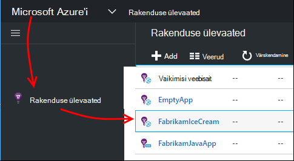

Avage jõudluse tera taotlus, aega, sõltuvus ja muude andmete kuvamiseks.

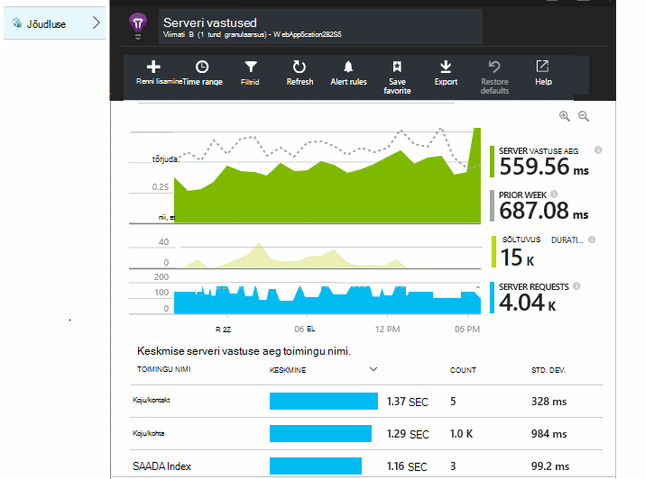

Klõpsake mis tahes diagrammi üksikasjalikuma vaate avamiseks.

Saate [redigeerimine, ümber korraldada, salvestada](app-insights-metrics-explorer.md), ja kinnitage diagrammide või kogu tera [armatuurlaud](app-insights-dashboards.md).

## Sõltuvused

Sõltuvus kestus diagramm näitab aega, mida välise komponendid, nt andmebaaside, REST API-d või Azure'i bloobimälu oma rakenduse kõned.

Et segmendi diagrammi, kõned erinevate sõltuvused: diagrammi rühmitamise sisse lülitada, redigeerimine ja seejärel Rühmitusalus sõltuvus, tüüp või sõltuvus jõudlust.

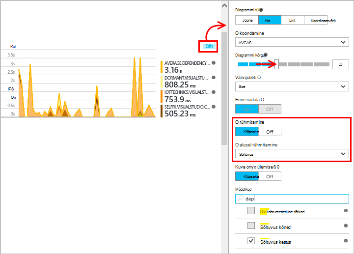

## Jõudluse hinnale 

(Pole jaoks Azure veebirakenduste.) Ülevaade enne diagrammide serveri jõudlusloendurid, nt CPU hõivatus ja mälu kasutus kuvamiseks klõpsake serverid.

Kui teil on mitu serveri eksemplari, mida soovite redigeerida diagramme rühmitada rolli astme.

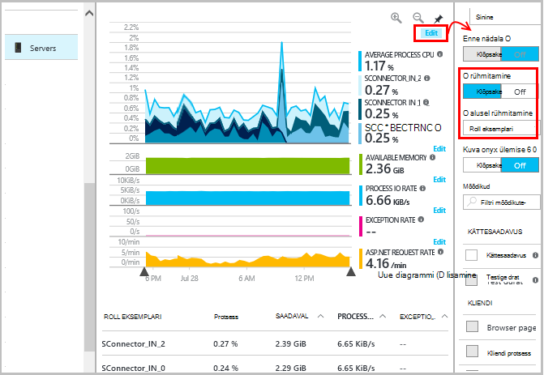

Samuti saate [muuta komplekti, mis teatatakse SDK jõudluse hinnale](app-insights-configuration-with-applicationinsights-config.md#nuget-package-3). 

## Erandid

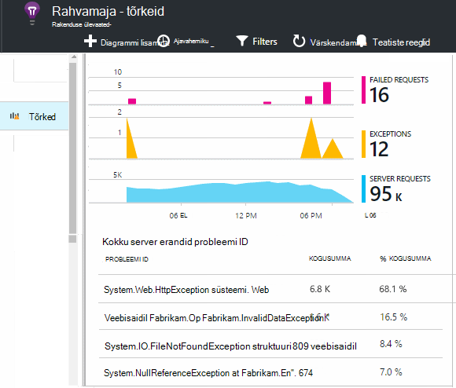

Saate minna süvitsi konkreetsed erandid (seitsme viimase päeva) ja virnas jälgi ja konteksti andmed.

## Valimite

Kui teie taotlus saadetakse palju andmeid ja kasutate rakenduse ülevaateid SDK ASP.net-i versioon 2.0.0-beta3 või uuem versioon, kohandatava valimite funktsiooni käitamiseks ja saatmine ainult teie telemeetria protsent. [Lugege lisateavet valimite.](app-insights-sampling.md)

## Tõrkeotsing

### Ühenduse tõrkeid

Peate oma serveri tulemüüri lubama oleku jälgimine töötada [mõnes väljamineva portide](app-insights-ip-addresses.md#outgoing-ports) avamine.

### Pole telemeetria?

  * Oma saidi abil saate luua mõned andmed.
  * Oodake mõni minut lasta saabuvad, seejärel klõpsake nuppu **Värskenda**andmed.
  * Avage teemast üksikute sündmuste diagnostika otsing (paani otsing). Enne andmete liitmine kuvatakse diagrammides sageli sündmuste näha diagnostika otsing.
  * Valige vasakul paanil klõpsake rakenduse avamine oleku jälgimine. Kontrollige, kas selle rakenduse "konfiguratsiooni teatised" teateid diagnostika:

  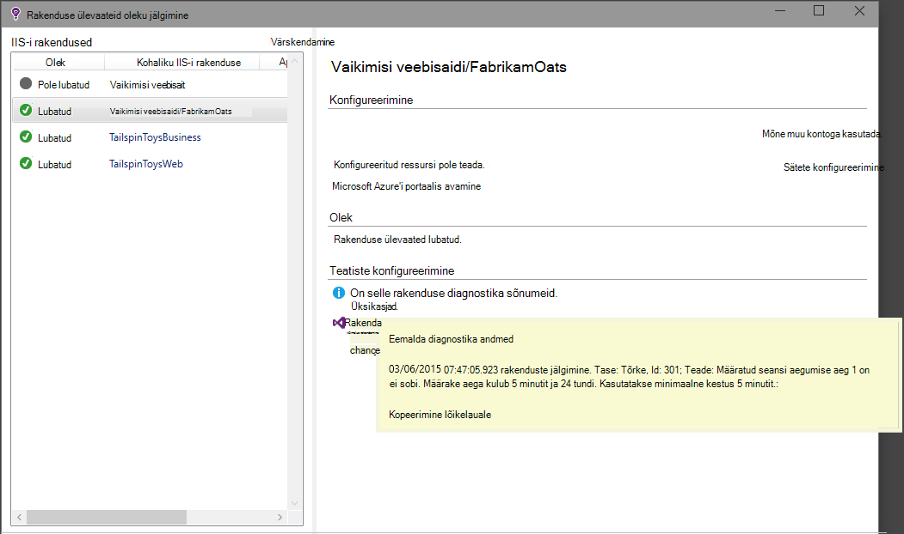

  * Veenduge, et teie serveri tulemüüri portide, eelnimetatud väljamineva liikluse.
  * Server, kui kuvatakse teade "piisavalt õigusi" kohta, proovige järgmist.
    * IIS-i valige oma rakenduse pool, avage **Täpsemad sätted**ja **Protsessi** mudeliga Märkus identiteeti.
    * Arvuti haldamine Juhtpaneel, lisage selle identiteedi jõudluse kuvari kasutajate rühma.
  * Kui teil on MMA/SCOM serverisse installitud, saate vastuollu mõne versiooni. Desinstallige SCOM nii oleku jälgimine ja uuesti installida uusimad versioonid.
  * Lugege teemat [tõrkeotsing][qna].

## Süsteeminõuded

Rakenduse ülevaateid oleku jälgimine serveris OS tugi:

- Windows Server 2008
- Windows Server 2008 R2
- Windows Server 2012
- Windows server 2012 R2

uusima SP ja .NET Framework 4.0 ja 4.5

Kliendi poolel Windows 7, 8 ja 8.1 uuesti ja .NET Framework 4.0 4.5

IIS-i tugi on: 7.5, 8, 8.5 IIS 7 (IIS-i on vajalik)

## Automaatika PowerShelli abil

Saate alustada ja jälgib IIS-i serverisse PowerShelli abil.

Esmalt importida rakenduse ülevaated mooduli.

`Import-Module 'C:\Program Files\Microsoft Application Insights\Status Monitor\PowerShell\Microsoft.Diagnostics.Agent.StatusMonitor.PowerShell.dll'`

Teada saada, millised rakendused jälgitakse:

`Get-ApplicationInsightsMonitoringStatus [-Name appName]`

* `-Name`(Valikuline) Web appi nimi.
* Kuvab rakenduse ülevaated, iga web app (või nimega rakendus) oleku jälgimine selle IIS-i serveri.

* Annab vastuseks `ApplicationInsightsApplication` iga rakenduse:
 * `SdkState==EnabledAfterDeployment`: Rakendus jälgitakse ja on varustatud mõõteriistadega tegemiseks käitusajal, kas oleku jälgimine vahend, või `Start-ApplicationInsightsMonitoring`.
 * `SdkState==Disabled`: Rakenduse ülevaated jaoks pole mõõteseadmetega rakendus. Kas see oli kunagi varustatud mõõteriistadega tegemiseks või või käitusaja jälgimise keelamist koos oleku jälgimine tööriista või `Stop-ApplicationInsightsMonitoring`.
 * `SdkState==EnabledByCodeInstrumentation`: Rakendus on varustatud mõõteriistadega tegemiseks, lisades SDK lähtekoodi. Selle SDK ei saa värskendada või lõpetada.
 * `SdkVersion`näitab versiooni kontrollimiseks see rakendus kasutab.
 * `LatestAvailableSdkVersion`kuvatakse Galerii Nugeti versioon, mis on praegu saadaval. Üleminek rakenduse versiooni, kasutage `Update-ApplicationInsightsMonitoring`.

`Start-ApplicationInsightsMonitoring -Name appName -InstrumentationKey 00000000-000-000-000-0000000`

* `-Name`IIS-i rakenduse nimi
* `-InstrumentationKey`Ikey rakenduse ülevaated ressursi, kus soovite kuvada tulemid.

* Selle cmdlet-käsu mõjutab ainult rakendusi, mis ei ole juba varustatud mõõteriistadega tegemiseks - st SdkState == NotInstrumented.

    Cmdlet ei mõjuta rakendus, mis juba mõõteseadmetega, Koosta ajal, lisades SDK kood või käitusajal cmdlet-käsu eelmise abil.

    Dokumendi rakendust kasutada SDK versioon on selles serveris viimati allalaaditud versiooni.

    Laadige alla uusim versioon, kasutage värskendus-ApplicationInsightsVersion.

* Annab vastuseks `ApplicationInsightsApplication` edu. Kui see ei õnnestu, see logib stderr jälgi.

    
          Name                      : Default Web Site/WebApp1
          InstrumentationKey        : 00000000-0000-0000-0000-000000000000
          ProfilerState             : ApplicationInsights
          SdkState                  : EnabledAfterDeployment
          SdkVersion                : 1.2.1
          LatestAvailableSdkVersion : 1.2.3

`Stop-ApplicationInsightsMonitoring [-Name appName | -All]`

* `-Name`IIS-i rakenduse nimi
* `-All`Astmed jälgimine selle IIS-i serveris, kus kõik rakendused`SdkState==EnabledAfterDeployment`

* Lõpetab määratud rakenduste jälgimine ja eemaldab instrumentation. See toimib ainult rakendusi, mis on varustatud antud mõõteriistadega tegemiseks käitusaja seisundi jälgimine tööriista või algus-ApplicationInsightsApplication abil. (`SdkState==EnabledAfterDeployment`)

* Tagastab ApplicationInsightsApplication.

`Update-ApplicationInsightsMonitoring -Name appName [-InstrumentationKey "0000000-0000-000-000-0000"`]

* `-Name`: Veebirakenduse IIS-i nimi.
* `-InstrumentationKey`(Valikuline.) Selle abil saate muuta rakenduse telemeetria saadetakse ressurss.
* Selle cmdlet-käsk:
 * Täienduste nimega rakenduse versiooni SDK viimati alla selles arvutis. (Toimib ainult siis, kui `SdkState==EnabledAfterDeployment`)
 * Kui annate mõne instrumentation vajutamisega, nimega rakendus uuesti saata telemeetria ressursi selle klahvi. (Kui töötab `SdkState != Disabled`)

`Update-ApplicationInsightsVersion`

* Rakenduse uusim ülevaateid SDK allalaadimist serverisse.

## Järgmised sammud

* [Luua web testide] [ availability] veendumaks, et teie sait jääb reaalajas.
* [Sündmuste ja logid otsimine] [ diagnostic] probleemide.
* [Lisage web kliendi telemeetria] [ usage] veebilehe koodi erandid näha ja abil saate lisada kutsete jälgimiseks.
* [Rakenduse ülevaateid SDK lisamine oma web teenuse kood] [ greenbrown] nii, et saate lisada Jälita ja log helistab serveri kood.

<!--Link references-->

[api]: app-insights-api-custom-events-metrics.md
[availability]: app-insights-monitor-web-app-availability.md
[client]: app-insights-javascript.md
[diagnostic]: app-insights-diagnostic-search.md
[greenbrown]: app-insights-asp-net.md
[qna]: app-insights-troubleshoot-faq.md
[roles]: app-insights-resources-roles-access-control.md
[usage]: app-insights-web-track-usage.md
