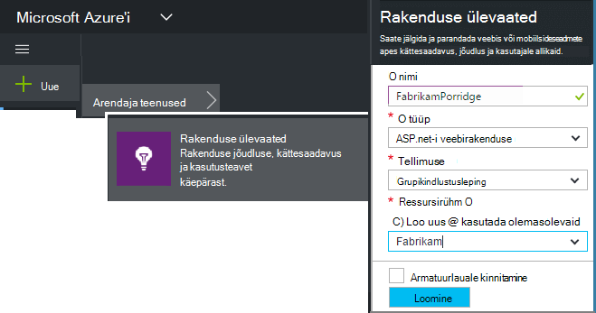

<properties
    pageTitle="Rakenduse ülevaateid SDK jälgida oma Node.js rakenduse lisamine | Microsoft Azure'i"
    description="Kasutus-ja kättesaadavus ja teie asutusesisese või Microsoft Azure'i veebirakenduse rakenduse ülevaated analüüsida."
    services="application-insights"
    documentationCenter=""
    authors="alancameronwills"
    manager="douge"/>

<tags
    ms.service="application-insights"
    ms.workload="tbd"
    ms.tgt_pltfrm="ibiza"
    ms.devlang="na"
    ms.topic="get-started-article"
    ms.date="08/30/2016"
    ms.author="awills"/>


# <a name="add-application-insights-sdk-to-monitor-your-nodejs-app"></a>Rakenduse ülevaateid SDK jälgida oma Node.js rakenduse lisamine

*Rakenduse ülevaated on eelvaade.*

[Visual Studio rakenduse ülevaated](app-insights-overview.md) jälgib reaalajas rakenduse mis aitavad teil [tuvastada ja jõudlusega seotud probleemide ja erandid diagnoosimine](app-insights-detect-triage-diagnose.md)ja [avastamine, kuidas kasutada oma rakenduse](app-insights-overview-usage.md). See toimib rakendused, mis on majutatud oma kohapealse IIS-i serverid või Azure VMs, samuti Azure veebirakenduste.


SDK pakub kogumisest sissetulevate HTTP taotluse määr ja vastuseid, jõudluse hinnale (CPU, mälu, RPS) ja töötlemata erandid. Lisaks saate lisada kohandatud kõned sõltuvused, mõõdikute või muid sündmusi.


#### <a name="before-you-start"></a>Enne alustamist

Sa vajad:

* Visual Studio 2013 või uuem versioon. Allpool on parem.
* [Microsoft Azure'i](http://azure.com)tellimust. Kui teie meeskond või ettevõte on Azure tellimuse, omanik lisamiseks saate seda oma [Microsofti kontoga](http://live.com).

## <a name="add"></a>Looge on rakenduse ülevaated ressurss

[Azure'i portaali]sisselogimine[portal], ning luua uue rakenduse ülevaated ressursi. [Ressursi] [ roles] Azure on teenuse eksemplari. Selle ressursi on, kus teie rakenduse telemeetria analüüsida ja esitatakse.



Valige muu rakenduse tüüp. Rakenduse tüüp valik määrab vaikimisi sisu ressursi noad ja atribuutide [Mõõdikute]Exploreris nähtavad[metrics].

#### <a name="copy-the-instrumentation-key"></a>Kopeerige Instrumentation võti

Võti tuvastab ressursi ja saate installida selle kiiresti SDK andmete ressursile suunamiseks.


## <a name="sdk"></a>SDK oma rakenduse installimine

```
npm install applicationinsights --save
```

## <a name="usage"></a>Kasutus

See võimaldab taotluse jälgimine, töötlemata erandi jälgimine ja süsteemi jõudluse jälgimine (CPU/mälu/RPS).

```javascript

var appInsights = require("applicationinsights");
appInsights.setup("<instrumentation_key>").start();
```

Keskkonna muutuja APPINSIGHTS_INSTRUMENTATIONKEY saab määrata ka instrumentation võti. Kui see on tehtud, pole argumenti nõutakse helistamisel `appInsights.setup()` või `appInsights.getClient()`.

Võite proovida SDK telemeetria saatmisele: instrumentation võtme seadmiseks tühi string.


## <a name="run"></a>Projekti käivitamine

Rakenduse käivitada ja seda proovida: Avage erinevate lehtede loomiseks mõned telemeetria.


## <a name="monitor"></a>Saate vaadata oma telemeetria

[Azure portaali](https://portal.azure.com) ja liikuge oma rakenduse ülevaated ressursi.


Otsige lehel ülevaade andmed. Esialgu näete ainult ühe või kaks. Näiteks:


Klõpsake mis tahes diagrammi üksikasjalikumat mõõdikute kuvamiseks. [Lugege lisateavet mõõdikute.][perf]

#### <a name="no-data"></a>Pole andmeid?

* Kasutage rakendust, avades erinevate lehtede, et see tekitab mõned telemeetria.
* Avage paani [Otsi](app-insights-diagnostic-search.md) teemast üksikute sündmuste. Mõnikord kulub sündmuste veidi pikem, et saada mõõdikute müügivõimaluste kaudu.
* Oodake paar minutit ja klõpsake nuppu **Värskenda**. Diagrammide värskendamine ise aeg-ajalt, kuid saate värskendada käsitsi kui ootate teatud andmeid kuvada.
* Lugege teemat [tõrkeotsing][qna].

## <a name="publish-your-app"></a>Rakenduse avaldamine

Nüüd juurutada rakendust IIS-i või Azure ning koguda andmeid vaadata.


#### <a name="no-data-after-you-publish-to-your-server"></a>Andmete pärast avaldada oma serveris?

Avage oma serveri tulemüüris järgmised pordid väljamineva liikluse jaoks.

+ `dc.services.visualstudio.com:443`
+ `f5.services.visualstudio.com:443`


#### <a name="trouble-on-your-build-server"></a>Teil on probleeme oma Koosta serveris?

Lugege [seda üksust tõrkeotsing](app-insights-asp-net-troubleshoot-no-data.md#NuGetBuild).


## <a name="customized-usage"></a>Kohandatud kasutus 

### <a name="disabling-auto-collection"></a>Automaatne – saidikogumi keelamine

```javascript
import appInsights = require("applicationinsights");
appInsights.setup("<instrumentation_key>")
    .setAutoCollectRequests(false)
    .setAutoCollectPerformance(false)
    .setAutoCollectExceptions(false)
    // no telemetry will be sent until .start() is called
    .start();
```

### <a name="custom-monitoring"></a>Kohandatud jälgimine

```javascript
import appInsights = require("applicationinsights");
var client = appInsights.getClient();

client.trackEvent("custom event", {customProperty: "custom property value"});
client.trackException(new Error("handled exceptions can be logged with this method"));
client.trackMetric("custom metric", 3);
client.trackTrace("trace message");
```

[Lisateavet leiate teemast telemeetria API kohta](app-insights-api-custom-events-metrics.md).

### <a name="using-multiple-instrumentation-keys"></a>Mitme instrumentation klahvide abil

```javascript
import appInsights = require("applicationinsights");

// configure auto-collection with one instrumentation key
appInsights.setup("<instrumentation_key>").start();

// get a client for another instrumentation key
var otherClient = appInsights.getClient("<other_instrumentation_key>");
otherClient.trackEvent("custom event");
```

## <a name="examples"></a>Näited

### <a name="tracking-dependency"></a>Sõltuvus jälgimine

```javascript
import appInsights = require("applicationinsights");
var client = appInsights.getClient();

var startTime = Date.now();
// execute dependency call
var endTime = Date.now();

var elapsedTime = endTime - startTime;
var success = true;
client.trackDependency("dependency name", "command name", elapsedTime, success);
```


### <a name="manual-request-tracking-of-all-get-requests"></a>Käsitsi taotluse "GET" saadetud ja jälgimine

```javascript
var http = require("http");
var appInsights = require("applicationinsights");
appInsights.setup("<instrumentation_key>")
    .setAutoCollectRequests(false) // disable auto-collection of requests for this example
    .start();

// assign common properties to all telemetry sent from the default client
appInsights.client.commonProperties = {
    environment: process.env.SOME_ENV_VARIABLE
};

// track a system startup event
appInsights.client.trackEvent("server start");

// create server
var port = process.env.port || 1337
var server = http.createServer(function (req, res) {
    // track all "GET" requests
    if(req.method === "GET") {
        appInsights.client.trackRequest(req, res);
    }

    res.writeHead(200, { "Content-Type": "text/plain" });
    res.end("Hello World\n");
}).listen(port);

// track startup time of the server as a custom metric
var start = +new Date;
server.on("listening", () => {
    var end = +new Date;
    var duration = end - start;
    appInsights.client.trackMetric("StartupTime", duration);
});
```

## <a name="next-steps"></a>Järgmised sammud

* [Jälgida oma telemeetria portaalis](app-insights-dashboards.md)
* [Kirjutage oma telemeetria üle Analytics päringud](app-insights-analytics-tour.md)


<!--Link references-->

[knowUsers]: app-insights-overview-usage.md
[metrics]: app-insights-metrics-explorer.md
[perf]: app-insights-web-monitor-performance.md
[portal]: http://portal.azure.com/
[qna]: app-insights-troubleshoot-faq.md
[roles]: app-insights-resources-roles-access-control.md
