<properties
    pageTitle="Kasutusanalüüsi rakenduse ülevaated"
    description="Rakenduse ülevaated Kasutusanalüüs ülevaade"
    services="application-insights"
    documentationCenter=""
    authors="alancameronwills"
    manager="douge"/>

<tags
    ms.service="application-insights"
    ms.workload="tbd"
    ms.tgt_pltfrm="ibiza"
    ms.devlang="multiple"
    ms.topic="article" 
    ms.date="04/08/2016"
    ms.author="awills"/>

# Kasutusanalüüsi rakenduse ülevaated

Teada, kuidas kasutada rakenduse abil saate keskenduda stsenaariumid, mis on kõige olulisem neile arengu töö ja saada ülevaate eesmärke, et need oleks lihtsam või raskem saavutada otsimine.

Rakenduse ülevaated saate anda oma rakenduse kasutamine, selge ülevaate aitab tõhustada teie kasutajate ja vastavad teie ettevõtte eesmärkide.

Rakenduse ülevaated töötab nii eraldiseisev rakendused (iOS-i, Androidi ja Windowsi) ja veebirakenduste (majutatud .net-i või J2EE). 

## Rakenduse ülevaated lisamine projekti

Alustamiseks saada tasuta konto [Microsoft](https://azure.com)Azure. (Pärast prooviperioodi, saate jätkata teenuse tasuta taseme.)

[Azure'i portaali](https://portal.azure.com)loomine on rakenduse ülevaated ressurss. See on, kus kuvatakse kasutus- ja jõudluse andmeid oma rakenduse kohta.

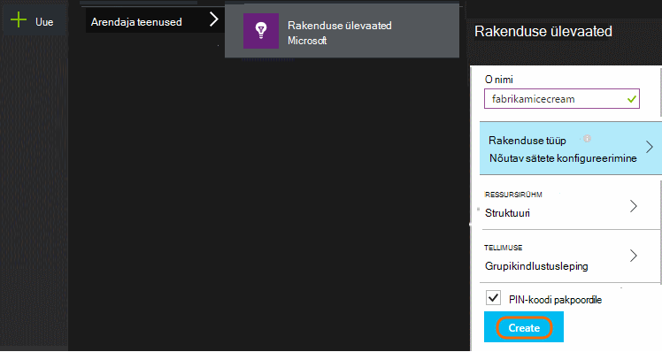

**Kui teie rakendus on seadmesse rakenduse,** lisada projekti rakenduse ülevaateid SDK. Täpse protseduur erineb sõltuvalt teie [IDE ja platvormi](app-insights-platforms.md). Windowsi rakenduste lihtsalt paremklõpsake projekti Visual Studio ja valige "Lisa rakenduse ülevaated."

**Kui see on web app,** avage Kiirkäivituse tera ja lisada veebilehtede koodilõigu saamiseks. Uuesti avaldada neid selles koodilõigu abil.

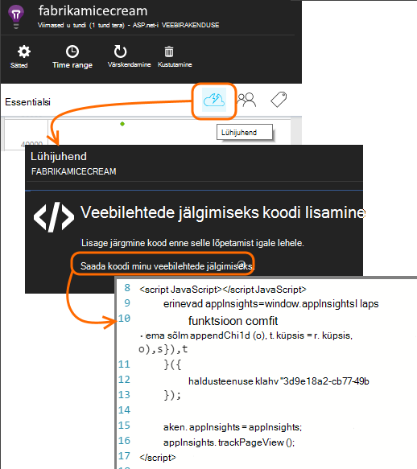

Rakenduse ülevaated saate lisada ka oma [ASP.net-i](app-insights-asp-net.md) või [J2EE](app-insights-java-get-started.md) serveri koodi nii, et kombineerida telemeetria nii kliendi kui ka serverist.

### Projekti käivitamine ja esimese tulemuste vaatamiseks

Projekti režiimi käitamine opsüsteemis silumine paar minutit, [Azure portaali](https://portal.azure.com) ja liikuge sirvides oma projekti rakenduse ülevaated ressurss.

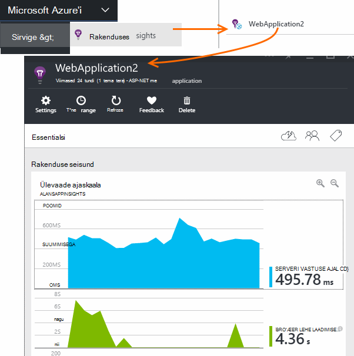

Avaldada oma rakenduse saada lisateavet telemeetria ja teada saada, mida kasutajad oma rakendusega teha.

## Kasutusanalüüsi välja kasti

Klõpsake lehe vaated paani kuvamiseks kasutusteavet.

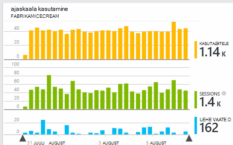

Liikuge hiirega üle tühja osa loendab teatud punktis kuvamiseks diagrammi kohal. Muul juhul arvud Kuva väärtus kokkuvõtliku perioodil, nt keskmiseks, kokku või erinevate kasutajate arv ajavahemikus.

Veebirakendusi, arvestatakse kasutajate küpsised abil. Isik, kes kasutab mitu brauserid, kustutab küpsised või kasutab funktsiooni Privaatsus loendatakse mitu korda.

Seansi web arvestatakse möllitud 30 minuti pärast. Seansi telefoni või muud seadet arvestatakse, kui rakendus on peatatud rohkem kui paar minutit.

Klõpsake mis tahes diagrammi täpsemaks vaatamiseks. Näiteks:

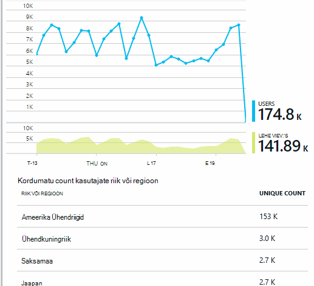

(Selles näites on veebisaidilt, kuid on diagrammid sarnanevad rakendused, mis töötavad seadmed.)

Eelmise nädala kuvamiseks, kui asjad muutuvad ja võrdlus:

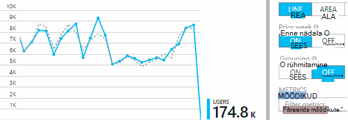

Võrrelge mõõdikud, näiteks kasutajate ja uued kasutajad:

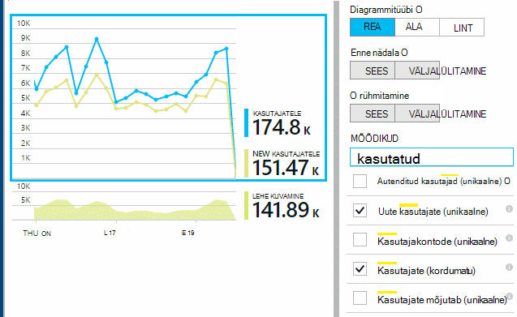

Andmete rühmitamine (lõigu), nt brauseri, operatsioonisüsteemi või City atribuut:

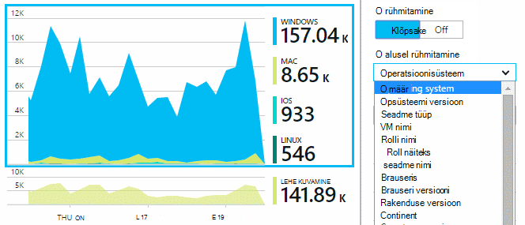

## Lehe kasutamine

Klõpsake lehe vaadete paani saada on kõige populaarsemate lehtede jaotus:

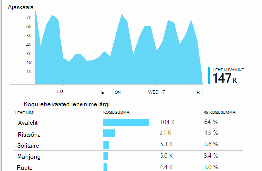

Ülaltoodud näites on visualiseerimine veebisaidilt. See kohe näeme:

* Kasutus pole täiustatud viimase nädala jooksul. Võib-olla peaksite mõtlema otsimootori optimeerimine?
* Vähem paljudele leiate lehelt visualiseerimine kui avalehele. Miks ei kodulehele meelitada mängida?
* "Ristsõna" on kõige populaarsemate aeg. Meil peaks eelistada uute ideede ja seal täiustused.

## Kohandatud jälitus

Oletame, et asemel rakendamisel iga mängu eraldi veebilehele, te otsustate refaktoorime kõik rakendusse sama ühe lehe, kus enamik funktsioone andmetena JavaScripti veebilehele. See võimaldab kasutajal kiiresti vaheldumisi üks aeg ja teine või isegi on mitu mängu ühele lehele.

Kuid soovite rakenduse ülevaated logige mitu korda iga mängu on avatud, täpselt samamoodi nagu kui need olid eraldi veebilehtedel. Mis on lihtne: lihtsalt telemeetria mooduli kõne oma JavaScripti, kuhu soovite kirje, mis on avatud uue lehe lisamiseks:

    telemetryClient.trackPageView(game.Name);

## Kohandatud sündmused

Saate kasutada telemeetria mõista, kuidas rakenduse kasutatakse mitmel viisil. Kuid te ei soovi alati lehe vaatega sõnumite segada. Selle asemel kasutada kohandatud sündmused. Neid saab saata seadme rakenduste, veebilehtede või veebiserverisse.

(JavaScript)

    telemetryClient.trackEvent("GameEnd");

(C#)

    var tc = new Microsoft.ApplicationInsights.TelemetryClient();
    tc.TrackEvent("GameEnd");

(VB)

    Dim tc = New Microsoft.ApplicationInsights.TelemetryClient()
    tc.TrackEvent("GameEnd")

Kõige sagedamini kohandatud sündmused on loetletud enne ülevaade.

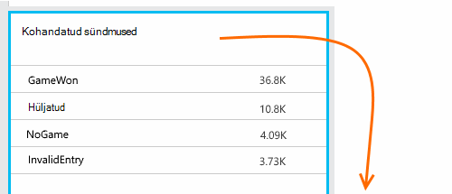

Klõpsake tabelis, et näha arvuveergude sündmuste juhataja. Diagrammi saab segmendi, erinevate atribuute, nt ürituse nime järgi:

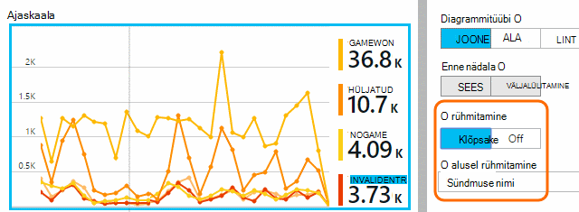

Eriti kasulik funktsioon ajaskaalade on, et te saate muudatused oleksid teiste mõõdikute ja sündmused. Näiteks ajal, mil veel visualiseerimine esitamisel ootate vaadata ka hüljatud visualiseerimine tõusu. Kuid hüljatud visualiseerimine tõusu on ebaproportsionaalselt, mida soovite teada saada, kas suure koormuse võib põhjustada probleeme, et kasutajad ei leia aktsepteeritav.

## Teatud sündmuste süvitsi

Paremini mõista, kuidas tüüpiline seansi läheb saamiseks võite keskenduda teatud kasutaja seansi, mis sisaldab teatud tüüpi sündmus.

Selles näites me kodeeritud kohandatud sündmuse "NoGame", mida nimetatakse, kui kasutaja logib alustamata tegelikult mängu. Miks kasutaja seda teha? Võib-olla kui me üldiseks mõne kindla juhud, me saame aimu.

Kohandatud sündmused, mis on saanud rakendusest on loetletud ülevaade enne nime järgi:

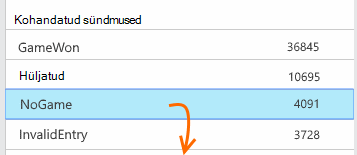

Sündmuse huvi kaudu, ja valige viimaste teatud esinemiskord.

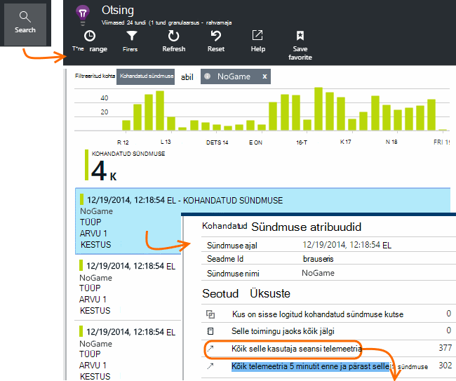

Vaatame kõik telemeetria, kus selle kindla NoGame sündmusele seanss.

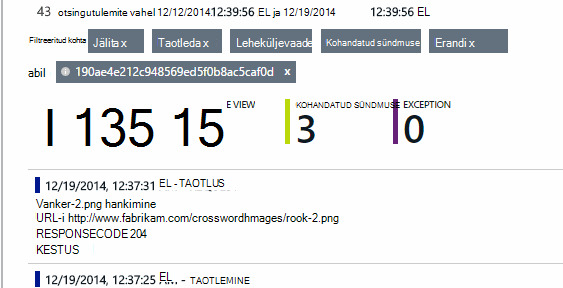

Nii, et kasutaja ei saa esitamise mõni tõrge, ei ole erandeid.

Me saate filtreerida välja igat tüüpi telemeetria lehe vaadetes peale selle seansi jaoks.

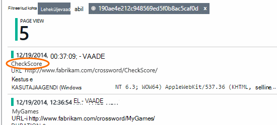

Ja nüüd näeme, lihtsalt kontrollitavad viimased hinded sisseloginud selle kasutaja. Võib-olla peaks kaaluma, arendamise kasutaja lugu, mis hõlbustab seda teha. (Ja meil tuleks rakendada kohandatud sündmuse aruandesse selle kindlat ilmnemisel.)

## Filtreerimine, otsimine ja segmendi andmete atribuudid
Saate manustada suvalise siltide ja arvväärtused sündmused.

JavaScripti kliendi

    appInsights.trackEvent("WinGame",
        // String properties:
        {Game: currentGame.name, Difficulty: currentGame.difficulty},
        // Numeric measurements:
        {Score: currentGame.score, Opponents: currentGame.opponentCount}
    );

C# server

    // Set up some properties:
    var properties = new Dictionary <string, string>
        {{"game", currentGame.Name}, {"difficulty", currentGame.Difficulty}};
    var measurements = new Dictionary <string, double>
        {{"Score", currentGame.Score}, {"Opponents", currentGame.OpponentCount}};

    // Send the event:
    telemetry.TrackEvent("WinGame", properties, measurements);

VB server

    ' Set up some properties:
    Dim properties = New Dictionary (Of String, String)
    properties.Add("game", currentGame.Name)
    properties.Add("difficulty", currentGame.Difficulty)

    Dim measurements = New Dictionary (Of String, Double)
    measurements.Add("Score", currentGame.Score)
    measurements.Add("Opponents", currentGame.OpponentCount)

    ' Send the event:
    telemetry.TrackEvent("WinGame", properties, measurements)

Atribuutide lehe vaated manustamine samal viisil:

JavaScripti kliendi

    appInsights.trackPageView("Win",
        {Game: currentGame.Name},
        {Score: currentGame.Score});

Diagnostika otsing, klõpsates kaudu üksikute esinemise sündmuse atribuutide vaatamiseks.

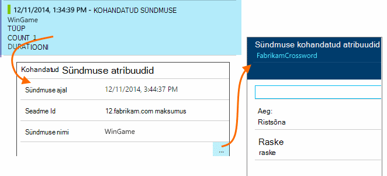

Väli otsingu abil saate vaadata sündmuse esinemisjuhud teatud atribuudi väärtus.

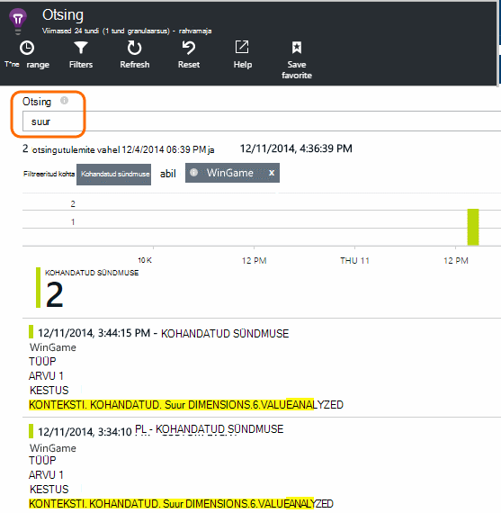

## A | B testimine

Kui te ei tea, millise variandi funktsiooni edukamaks, vabastage mõlemad, muutes iga kättesaadavaks erinevate kasutajate. Mõõtke edu iga ja seejärel liigutage ühendatud versiooni.

Selle meetodi korral manustada erinevate siltide telemeetria, iga rakenduse versiooni saadetud. Saate seda teha atribuudid määratledes aktiivse TelemetryContext sisse. Atribuutidest vaikimisi lisatakse iga telemeetria teade, mis saadab soovitud rakendus – mitte ainult oma kohandatud sõnumeid, kuid standard telemeetria ka.

Rakenduse ülevaated portaalis, mida seejärel juurde filter ja rühm (lõigu) oma andmeid silte, et võrrelda erinevaid versioone.

C# server

    using Microsoft.ApplicationInsights.DataContracts;

    var context = new TelemetryContext();
    context.Properties["Game"] = currentGame.Name;
    var telemetry = new TelemetryClient(context);
    // Now all telemetry will automatically be sent with the context property:
    telemetry.TrackEvent("WinGame");

VB server

    Dim context = New TelemetryContext
    context.Properties("Game") = currentGame.Name
    Dim telemetry = New TelemetryClient(context)
    ' Now all telemetry will automatically be sent with the context property:
    telemetry.TrackEvent("WinGame")

Üksikute telemeetria saate alistada vaikeväärtused.

Universaalne initializer saate häälestada nii, et kõik uued TelemetryClients automaatselt kasutada kontekstis.

    // Telemetry initializer class
    public class MyTelemetryInitializer : ITelemetryInitializer
    {
        public void Initialize (ITelemetry telemetry)
        {
            telemetry.Properties["AppVersion"] = "v2.1";
        }
    }

Klõpsake rakenduse initializer Global.asax.cs näiteks:

    protected void Application_Start()
    {
        // ...
        TelemetryConfiguration.Active.TelemetryInitializers
        .Add(new MyTelemetryInitializer());
    }

## Koosta - mõõt – siit saate teada

Kasutusanalüüsi kasutamisel muutub arvate, et aidata seotud probleemide lahendamine on integreeritud osa oma arengutsükli – mitte ainult midagi. Siin on mõned näpunäited.

* Määratlege võtme mõõdiku rakenduse. Kas soovite kasutajad nii palju kui võimalik või soovite võrdlemisi väike hulk väga head kasutajad? Kas soovite külastada või müük maksimeerimine?
* Mõõtke iga lugu kavandamine. Kui te visandamine Loo uus kasutaja või funktsiooni või värskendada olemasolevat lepingut alati mõelda kuidas mõõta edu muutmine. Küsi enne koodis algust, "millist mõju see on meie mõõdikute klõpsake kas see töötab? Peaks me jälgida mis tahes uute sündmuste?"
Ja muidugi, kui see funktsioon on reaalajas, veenduge, et vaadata selle Kasutusanalüüsi ja toimivad tulemused.
* Muude mõõdikute seotud võtme väärtuseks meetermõõdustik. Näiteks, kui lisate "eelistused" funktsiooni, soovite teada, kui sageli kasutajad lisamine lemmikute hulka. Kuid see on võib-olla rohkem huvitav teada, kui sageli nad tulevad tagasi oma lemmikute hulka. Ja kõige olulisem, tehke klientidele, kes kasutavad lemmikud ostavad rohkem toote?
* Kanaari testimine. Funktsiooni aktiveerimine, mis võimaldab teil teha uus funktsioon nähtav ainult teatud kasutajate häälestamine. Rakenduse ülevaated abil vaadata, kas uue funktsiooni kasutatakse nii saate kavandatud. Tehke muudatused ja seejärel vabastage see laiemalt.
* Rääkige kasutajate! Kasutusanalüüsi ei piisa oma, kuid säilitades hea kliendi seose täiendavad.

## Lisateave

* [Tuvastada, kaudu alusel järjestada ja jookseb kokku ja jõudlusega seotud probleemide rakenduse diagnoosimine](app-insights-detect-triage-diagnose.md)
* [Paljude platvormide jaoks loodud rakenduse ülevaated alustamine](app-insights-detect-triage-diagnose.md)

## Video

> [AZURE.VIDEO usage-monitoring-application-insights]

 
