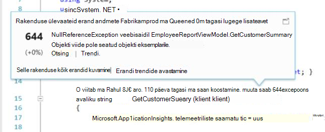

<properties 
    pageTitle="Rakenduse ülevaateid õpetuse | Microsoft Azure'i" 
    description="Kasutus- ja reaalajas veebirakenduses jõudlust jälgida.  Tuvastada, kaudu alusel järjestada ja diagnoosimine probleeme. Pidevalt jälgida ja parandada edu kasutajatega." 
    services="application-insights" 
    documentationCenter=""
    authors="alancameronwills" 
    manager="douge"/>

<tags 
    ms.service="application-insights" 
    ms.workload="tbd" 
    ms.tgt_pltfrm="ibiza" 
    ms.devlang="na" 
    ms.topic="article" 
    ms.date="10/15/2016" 
    ms.author="awills"/>
 
# Rakenduse ülevaated – Sissejuhatus

Visual Studio rakenduse ülevaated on laiendatav Kasutusanalüüsi teenus, mis jälgib reaalajas veebirakenduses. Seda saate tuvastada ning diagnoosimine jõudlusega seotud probleemide ja mõista, mida kasutajad tegelikult teha oma rakendusega. See on mõeldud arendajad, mis aitavad teil parandada pidevalt jõudlus ja kasutatavuse. See toimib rakenduste kohta, sh .net-i, Node.js ja J2EE platvormid mitmesuguseid majutatud kohapealse või pilveteenuses. 

[Heitke pilk sissejuhatav animatsioon](https://www.youtube.com/watch?v=fX2NtGrh-Y0).

## Kuidas see toimib?

Väike haldusteenuse paketi oma rakenduse installimine ja häälestamine on rakenduse ülevaated ressurss Microsoft Azure'i portaalis. Mõõteriistad jälgib rakenduse ja saadab telemeetria andmete portaali. Portaali näidatakse statistilised diagrammid ja pakub võimas otsing tööriistu, mis aitavad teil diagnoosida probleeme.

Rakenduse ülevaated on mitu [standard instrumentation moodulid](app-insights-configuration-with-applicationinsights-config.md) koguda erinevat tüüpi telemeetria, nt taotluse vastuse korda, erandid ja sõltuvus kõned. Samuti saate [saata kohandatud telemeetria koodi kirjutamine](app-insights-api-custom-events-metrics.md) portaali.

### Mis on selle pea kohal?

Oma rakenduse jõudluse mõju on väga väike. Kõnede jälgimine on-blokeerimine ja on batched ja saadetakse eraldi protsessi. 

## Mida see teeb?

Rakenduse ülevaated on suunatud arendusmeeskonnale, et aidata teil mõista, kuidas oma rakenduse toimib ja kuidas seda kasutatakse. See pakub.

Telemeetria tüüpi:

* HTTP taotluse määr, vastuse korda, edukust.
* Sõltuvus (HTTP ja SQL-i) helistage edukust, määr, vastuse korda.
* Erandi nii serveris ja kliendi jälgi.
* Diagnostika log jälgi.
* Leheküljevaade loendab kasutaja ja seansi hulk, brauseri laadimisajaga, erandid.
* AJAXI kõne hindu ja vastuse korda edukust.
* Serveri jõudluse hinnale.
* Kohandatud kliendi ja serveri telemeetria.
* Kliendi asukoht, brauseri versioon, Opsüsteemi versioon, serveri eksemplar, kohandatud mõõtmetega suuruseni ja Lisateavet osadeks.
* Kättesaadavus kontrollib

Diagnostika- ja analüütiline Tööriistad:

* Nutikas ja käsitsi teatiste tõrge hinnad ja muude mõõdikute ja kättesaadavus.
* Aja jooksul liidetud mõõdikute diagrammid.
* Diagnostika otsing eksemplarid taotlusi, erandid, kohandatud sündmused, log jälgi, lehe vaateid, sõltuvus ja AJAXI kõned. 
* Analüüsi - võimsaid päringukeele üle oma telemeetria
* Armatuurlaudade - koostamine diagramme, peate oma rakenduse komponentide jälgimiseks.

## Kuidas seda kasutada?

### Jälgimine

Installige rakenduse ülevaated kättesaadavus web testide, häälestada oma veebirakenduse ja:

* Armatuurlaua meeskonnatöö toa hoida silma peal laadi, tundlikkuse ja sõltuvused, lehe laadimise ja AJAXI kõned jõudluse häälestamine. 
* Vaadake, millised on selle parema ja enamik vastasel taotlused.
* Vaata Live voo uus versioon, mis tahes degradeerumine kohe teada juurutamisel.

### Diagnoosimine

Kui saadetakse teatis või leida probleem.

* Seostada tõrkeid erandid, sõltuvus kõnede ja jälgi.
* Uurige virnas puistab ning Jälita logid.

### Hinnake

Mõõtke tõhusust uute funktsioonide juurutamist.

* Mõõtke kliendid uue Kasutuskogemuse või business funktsioonide kasutamise plaanimine.
* Kirjutage kohandatud telemeetria kasutus logima oma koodi.
* Iga arengutsükli aluseks telemeetria andmed raske kohta.

## Alustamine

Rakenduse ülevaated on palju teenuse Microsoft Azure'i jooksul majutatud telemeetria saadetakse seal analüüsimise ja esitluse jaoks Nii, et enne, kui te ei tee midagi muud, peate [Microsoft Azure'i](http://azure.com)tellimust. See on tasuta registreerumiseks ja soovi korral saate tasuta [hinnad taseme](https://azure.microsoft.com/pricing/details/application-insights/) rakenduse ülevaated. Kui teie organisatsioonil on juba tellimus, nad selle lisada oma Microsofti kontoga. 

On mitu võimalust, et alustada. Alustage kumb töötab teie jaoks parim. Saate lisada teisi hiljem.

* **At käitusaeg: dokumendi oma veebirakenduse serveris.** Aitab vältida koodi värskendusi. Peate oma serveri administraatori juurdepääs.
 * [**Kohapealse IIS-i või VM**](app-insights-monitor-performance-live-website-now.md)
 * [**Azure'i web appi või VM**](app-insights-monitor-performance-live-website-now.md#if-your-app-runs-as-an-azure-web-app)
 * [**J2EE**](app-insights-java-live.md)
* **Arengu ajal: rakenduse ülevaated lisamine oma kood.** Võimaldab kirjutada kohandatud telemeetria ja dokumendi tagaandmebaas ja töölauarakendused.
 * [Visual Studio](app-insights-asp-net.md) 2013 update 2 või uuemad versioonid.
 * Java [Eclipse](app-insights-java-eclipse.md) või [Muud tööriistad](app-insights-java-get-started.md)
 * [Node.js](app-insights-nodejs.md)
 * [Muude platvormide jaoks loodud](app-insights-platforms.md)
* **[Dokumendi veebilehtede](app-insights-javascript.md)** leheküljevaade, AJAXI ja muude kliendipoolne telemeetria.
* **[Kättesaadavus kontrollib](app-insights-monitor-web-app-availability.md)** - ping veebisaidi regulaarselt oma serveritest.

> [AZURE.NOTE]  Selles etapis võib-olla soovite saada ja proovida. Aga kui soovite, et näha, mida saab teha rakenduse ülevaated, lugege edasi...

## Mõõdikute uurimine

Käivitage rakendus – kas silumine režiimis arengu teie arvutis või selle serveri juurutamine - ja kasutada seda aega. Seejärel logige sisse [Azure portaali](https://portal.azure.com).

Liikuge oma rakenduse rakenduse ülevaated ülevaade blade:

Ülevaatest saate kohe vaadata, kuidas oma rakenduse toimib. Abil saate võrrelda laadimine (nii taotluste määr) aeg rakenduse liiga vastata taotlused. Kui ebaproportsionaalselt tõusu kui laadi läheb üles aega, mida soovite määrata veel ressursse rakenduse. Kui veel nurjunud vastuste paremale kuvatakse pärast seda, kui olete juurutanud uus ehitada, siis võite tagasi pöörata.

#### Täpsemat teavet

Klõpsake mis tahes diagrammi, et saada täpsemat diagrammid. Näiteks serveri vastuse aeg diagrammi viib diagrammid, mis näitavad taotluse määr, vastuse korda ja vastuse korda sõltuvused (st teenused, mis nõuab rakenduse).  

Sõltuvused diagramm on kasulik, kuna see aitab teil näha, kas andmebaasid ja REST API-d, mis kasutab teie rakendus on ka vasta või põhjustavad viivitust.

#### Diagrammi kohandamine

Proovige ühte nende diagrammide redigeerida. Näiteks kui teie web app töötab serveri eksemplari kogumi, saate võrrelda vastuse korda erinevate serveri eksemplari:

1. Libistage kursoriga üle diagrammi ja klõpsake nuppu Redigeeri.
2. Valige mõõdiku. Mitme mõõdikute saab kuvada ühe diagrammi, kuid ainult teatud kombinatsioonide: võib olla vaja tühjendage ühe meetermõõdustik enne, kui saate valida soovitud variant.
3. Abil Group By segmendi mõõdiku atribuudi järgi. Selles näites me kuvada eraldi ridadele erinevaid. 

    Pange tähele, et teil on kehtiv atribuudi mõõdiku valimiseks või diagrammi andmeid ei kuvata.
4. Valige soovitud diagrammitüüp. Piirkonna- ja Lintdiagrammid virnastatud Kuva sobiva kui Kuva koondamine tüüp on "Summa".

[Lisateavet leiate teemast Avastades mõõdikute](app-insights-metrics-explorer.md).

## Andmete otsimine

Probleemi uurimiseks on kasulik kontrolli teatud sündmuste eksemplarid.

Klõpsake argumendil diagrammi koos vastavate filtrite ja ajavahemiku eksemplari andmeid otsida. Näiteks klõpsake serveri taotluse loendab isikliku taotluse aruandeid. 

Või saate otse eksemplari andmete otsingust lehel ülevaade.

Filtrite abil keskenduda konkreetset tüüpi sündmus ja valitud atribuudi väärtused:

Klõpsake nuppu "..." atribuudid täieliku loendi kuvamiseks või avada muid sündmusi, mis on seotud sama kutse. Selles näites on nurjunud taotluse seotud erand aruanne.

Avage sündmus – selles näites seotud erand - ja te saate luua tööüksust (kui Visual Studio Team Services abil saate jälgida tööülesannete). 
 

## Kasutusanalüüsi

[Kasutusanalüüsi](app-insights-analytics.md) on veelgi võimsam otsingu ja analüüsi funktsioon, kus saate kirjutada SQL-like päringute üle telemeetria andmete, kas kindlate probleemide otsimiseks või koostada statistilisi andmeid.

Avage kuueosalisest aken näha ja käivitage päringute näiteid üle andmete või lugege rohkem [kuueosalisest kiirtutvustus](app-insights-analytics-tour.md). IntelliSense'i pakub päringut, mida saate kasutada, ja on [täielik Keel viide](app-insights-analytics-reference.md). 

Päringute algavad tavaliselt telemeetria voo, nt taotlusi, erandid või sõltuvused nime. Pop avage skeemi riba saadaval telemeetria voogu loendi kuvamiseks vasakule. Päring on müügivõimaluste [päringu toiminguid](app-insights-analytics-reference.md#queries-and-operators) , näiteks `where` - kahendväärtus filtri - või `project` -avaldis, mis arvutab uue atribuudid. `summarize`[agregaadid eksemplari](app-insights-analytics-tour.md#aggregate-groups-of-rows), need funktsioonide määratlete rühmitada, ja seejärel rakendada liitmisfunktsioonid rühmitatud andmete üle.

Tulemite võib olla [tabelite või erinevat tüüpi diagrammi renderdamise](app-insights-analytics-tour.md#charting-the-results).

## Kohandatud telemeetria

Sisseehitatud telemeetria, mis kuvatakse ainult rakenduse ülevaated installides võimaldab loendab edukust, analüüsida ja web app ja sõltuvused - taotluste vastamise aeg nii st helistab teie rakenduse SQL REST API-d. Lisaks saate erandi jälgi, ja (koos oleku jälgimine serverisse) süsteemi jõudluse hinnale. Kui lisate veebilehtede koodilõigu klient, saate lehe view loeb ja laadimisajaga, kliendi erandid ja AJAXI kõne edu ja vastus. 

Kõik selles telemeetria analüüsimine öelda palju oma rakenduse jõudlus ja kasutuse kohta. Kuid mõnikord sellest ei piisa. Võite soovida jälgida pikkus järjekorda nii, et saate häälestada jõudluse; loendamine müük või segmendi nende asukoht; või kliendi poolel, vaadake, kuidas sageli kasutajad klõpsake teatud nupu nii, et saate häälestada kasutusvõimalused.

[Rakenduse ülevaateid API](app-insights-api-custom-events-metrics.md) pakub kõnede `TrackEvent(name)` ning `TrackMetric(name, value)` nii, et saate saata oma kohandatud sündmused ja mõõdikute. On samaväärne kõned kliendi poolt.

Näiteks kui teie veebilehele on ühe lehe mängu appi, võite lisada soovitud jooned logida, kui kasutaja võitis või lähevad kaotsi mängu õiges kohas:

    
    appInsights.trackEvent("WinGame");
    ...
    appInsights.trackEvent("LoseGame");

Seejärel me saate diagrammile kohandatud sündmuse loendab, tükeldada need ürituse nime järgi:

### Log jälgi

Diagnostika tarbeks on kohandatud sündmuse `TrackTrace(message)` kasutatavad täitmise jälgi. Funktsioonide Search ja analüüsi, saate otsida sisu sõnumi, mis võib olla pikem kui sündmuse nimi. 

Kui kasutate juba logimine framework, nt Log4Net, NLog, Log4J või System.Diagnostic.Trace, siis need Jälita kõned saate kaetud rakenduse ülevaated ja muude telemeetria kõrval kuvatakse. Visual Studio tööriistad automaatselt lisada vastav SDK mooduli.

## Armatuurlauad

Paljud rakendused koosneda mitmest osast, nt veebiteenusest ja üks või mitu tagasi lõppkuupäeva protsessorite. Iga komponendi jälgitakse eraldi rakenduse ülevaated ressurss. Kui teie süsteemi töötab Azure, võib teil abil - ja jälgimine - sündmuse jaoturi ja Õppekeskuse ka arvuti. 

Jälgida oma kogu süsteemi, saate valida kõige enam huvi diagrammide erinevate rakendustest ja kinnitada need Azure [armatuurlaud](app-insights-dashboards.md), mis võimaldab teil hoida silma peal kogu süsteemi pidevalt. 

Tegelikult, saate luua mitme armatuurlaudade – näiteks meeskonnatöö ruumi armatuurlaua jälgimiseks üldist süsteemi seisundi; armatuurlaua kujundus, mis keskendub kasutamist erinevaid funktsioone; eraldi armatuurlaua komponentide katse; jne.  

Armatuurlaudade, nagu ressursid, saate jagatud meeskonna liikmed.

## Visual Studio arengu

Kui kasutate arendada oma rakenduse Visual Studios, leiate mitme rakenduse ülevaated tööriista sisseehitatud. 

### Diagnostika otsing

Otsingu aken näitab sündmused, mis on sisse logitud. (Kui te sisse logitud Azure rakenduse ülevaated häälestamisel, saate küll otsida sama sündmuste portaalis.)

Otsingu tasuta teksti toimib kõik väljad sündmused. Näiteks otsida osa URL-i lehe; või väärtus atribuudi nt kliendi linn; või Jälita Logi leiduvad teatud sõnad.

Klõpsake selle üksikasjalik atribuutide kuvamiseks sündmuse.

Samuti saate avada menüü seostuvad üksused, et aidata diagnoosida nurjunud taotlusi või erandid.

### Diagnostika jaoturi

Diagnostika jaoturi (Visual Studio 2015 või uuem versioon) kuvatakse rakenduse ülevaated serveri telemeetria, nagu see on loodud. See töötab ka siis, kui te liitunud ainult installimiseks Tarkvaraarenduskomplektist, ilma ühenduse ressursi Azure'i portaalis.

### Erandid

Kui teil on [häälestamine erandi jälgimine](app-insights-asp-net-exceptions.md), kuvatakse aknas Otsing erandi aruandeid. 

Klõpsake erandi virnas jälitusteabe saamiseks. Kui rakenduse kood on avatud Visual Studios, võite klõpsata kaudu virnas teekonna koodi oluline rida.

Lisaks koodi Lens rida iga meetodi kohal, kuvatakse teile arv on sisse logitud rakenduse ülevaated viimase 24 h erandid.

### Kohalik jälgimine

(Visual Studio 2015 värskenduse 2): Kui teil pole konfigureeritud SDK saata telemeetria rakenduse ülevaated portaali (nii, et ei ole haldusteenuse võti ApplicationInsights.config) seejärel diagnostika aknas kuvatakse telemeetria Viimane silumine seansi kaudu. 

See on soovitatav, kui teil juba on avaldatud rakenduse varasema versiooni. Te ei soovi telemeetria kaudu oma silumine seansid telemeetria rakenduse ülevaated portaalis avaldatud rakendusest segada.

See on kasulik, kui teil on mõne [kohandatud telemeetria](app-insights-api-custom-events-metrics.md) , mida soovite silumine enne saatmist telemeetria portaali.

* *Esialgu ma täielikult konfigureeritud rakenduse ülevaated saata telemeetria portaali. Kuid nüüd ma soovite näha ainult Visual Studio telemeetria.*

 * Aken otsing sätetes on võimalus otsida kohalike diagnostika isegi juhul, kui teie rakendus saadab telemeetria portaali.
 * Telemeetria saadetakse portaali peatamiseks kommentaaride välja rida `<instrumentationkey>...` ApplicationInsights.config kaudu. Kui olete valmis saatma telemeetria portaali uuesti, kommenteerige välja.

## Trendide

Trendide on tööriista Visual Studio visualiseerimine rakenduse käitumise aja jooksul. 

Valige rakenduse ülevaated tööriistariba nuppu või rakenduse ülevaateid otsinguakna **Uurimine telemeetria trende** . Valige üks viis levinud päringud alustada. Saate analüüsida eri andmekomplektide telemeetria tüübid, kellaaja vahemikud ja muid atribuute. 

Andmete otsimine kõrvalekaldeid, valige üks normaalne Suvandid jaotises "Vaate tüüp" ripploend. Filtreerimise suvandite akna allosas oleks hõlpsam Viimistlege sisse oma telemeetria teatud mitmeid.

## Uus ehitada vabastamine

### Reaalajas mõõdikute voo

Reaalajas mõõdikute voo kuvatakse teie rakenduste mõõdikute paremale just praegu, koos läheduses reaalajas latentsus 1 sekund. See on väga kasulik, kui te olete vabastamine uus ehitada ning veenduge, et kõik oleks õigesti töötanud, või uurida reaalajas juhtum.

Erinevalt mõõdikute Explorer, kuvab Live mõõdikute voo mõõdikute kindlaksmääratud. Andmete püsib ainult seni, kuni see on diagrammi ja seejärel hüljatakse. 

### Marginaalid

[Väljaanne marginaalid](app-insights-annotations.md) mõõdikute diagrammide kuvamine, kus olete juurutanud uue koostamine. Need võimaldavad hõlpsalt vaadata, kas teie muudatused oli mingit mõju rakenduse jõudlus. Ta saab automaatselt luua [Visual Studio Team Services koostada süsteemi](https://www.visualstudio.com/en-us/get-started/build/build-your-app-vs)ja saate teha ka [need PowerShelli kaudu luua](#create-annotations-from-powershell).

Väljalaske marginaalid on funktsioon pilvepõhist koostamine ja vabastage teenuse Visual Studio meeskonnatöö teenuste. 

## Teatised

Kui teie rakendusega, mida soovite kohe sellest teada. 

Rakenduse ülevaated pakub kolme tüüpi teatisega, mis on esitatud e-posti.

### Aktiivne diagnostika 

[Aktiivne diagnostika](app-insights-proactive-failure-diagnostics.md) on automaatselt häälestatud – teil pole vaja seda konfigureerida. Kui saidil on piisavalt liikluse, saate e-posti, kui on nurjunud taotlusi tõusu, mis on ebatavalised päeva või taotluse määr korda. Teatise sisaldab diagnostikateave. 

Siin on näide teatis. 

Teist tüüpi aktiivne tuvastamise leiab vahel tõrkeid ja tegureid, nt asukoht, kliendi OS või brauseri tüüp.

### Argumendil teatised

Saate konfigureerida [teatiste argumendil](app-insights-alerts.md) kindlaks teha, kui mis tahes meetermõõdustik ületab läve teatud ajaks – näiteks tõrge loendab, mälu või lehe vaatamist.

### Kättesaadavus

[Kättesaadavus web testide](app-insights-monitor-web-app-availability.md) päringuid saidile meie serveritest üle maailma eri kohtadesse. Nad öelda, kui teie sait on saadaval Internetis või reageeri aeglaselt. 

## Eksportimine

On mitu võimalust, saate oma rakenduse ülevaated portaali telemeetria andmeid:

* [Pidev eksportimine](app-insights-export-telemetry.md) on optimaalne, kui soovite säilitada oma telemeetria rohkem kui standard säilitusperiood suur osa.
* [Analüüsi](app-insights-analytics.md) tulemuste [mõõdikute](app-insights-metrics-explorer.md#export-to-excel) tabelite ja otsingutulemite saab kõik eksportida Exceli arvutustabeli. 
* Andmed Accessi REST API saab otsida ja ekstrakti andmed, sh töötab Analytics päringud. API praegu privaatne eelvaade. [Vaadake eelvaate ühinemise](https://visualstudio.uservoice.com/forums/357324-application-insights/suggestions/4999529-make-data-accessible-via-apis-for-custom-processin).
* Saate eksportida [Analytics päringud Power BI](app-insights-export-power-bi.md) armatuurlauad ja tulemusi vaadata Power BI visualiseeringuid, mille saab automaatselt värskendada.

 
## Andmehaldus

Teie kasutamist rakenduse ülevaated, mis sõltuvad teatud määral hinnakirjad värviskeemi, mille valimisel piirangud puuduvad. Peamised piirangud on:

* Telemeetria määr minutis
* Count kuus andmepunkt
* Andmete

[Proovide](app-insights-sampling.md) on vähendada hind ja pidurdamise vältimiseks. See osa oma telemeetria, hoides tüüpilised valimi hüljatakse. Seotud üksuste (nt erandid ja nende põhjused taotlused) on kas säilitatakse või eemaldatakse koos. ASP.net-i rakendused, valimite on automaatne ning see rakendatakse rakenduses; muul juhul saate häälestada selle rakendatavad manustamisest portaali.

## Järgmised sammud

Töö alustamine kasutamisel käitusajal:

* [IIS-i server](app-insights-monitor-performance-live-website-now.md)
* [J2EE server](app-insights-java-live.md)

Töö alustamine arengu ajal:

* [ASP.NET-I](app-insights-asp-net.md)
* [Java](app-insights-java-get-started.md)
* [Node.js](app-insights-nodejs.md)

## Tugi- ja tagasiside

* Küsimused ja vastused:
 * [Tõrkeotsing][qna]
 * [MSDN-i Foorum](https://social.msdn.microsoft.com/Forums/vstudio/home?forum=ApplicationInsights)
 * [StackOverflow](http://stackoverflow.com/questions/tagged/ms-application-insights)
 * [Arendaja tootetugi](app-insights-get-dev-support.md)
* Teie soovitusi:
 * [UserVoice](https://visualstudio.uservoice.com/forums/357324)
* Ajaveeb:
 * [Rakenduse ülevaateid ajaveeb](https://azure.microsoft.com/blog/tag/application-insights)

## Videod

> [AZURE.VIDEO 218]

> [AZURE.VIDEO usage-monitoring-application-insights]

> [AZURE.VIDEO performance-monitoring-application-insights]

> [Sissejuhatav animatsioon](https://www.youtube.com/watch?v=fX2NtGrh-Y0)

<!--Link references-->

[android]: https://github.com/Microsoft/ApplicationInsights-Android
[azure]: ../insights-perf-analytics.md
[client]: app-insights-javascript.md
[desktop]: app-insights-windows-desktop.md
[detect]: app-insights-detect-triage-diagnose.md
[greenbrown]: app-insights-asp-net.md
[ios]: https://github.com/Microsoft/ApplicationInsights-iOS
[java]: app-insights-java-get-started.md
[knowUsers]: app-insights-overview-usage.md
[platforms]: app-insights-platforms.md
[portal]: http://portal.azure.com/
[qna]: app-insights-troubleshoot-faq.md
[redfield]: app-insights-monitor-performance-live-website-now.md

 