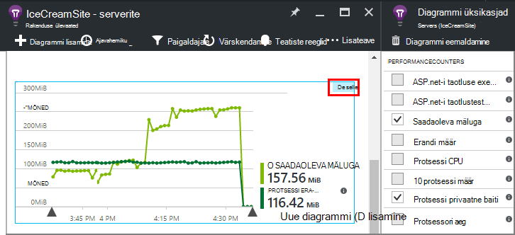

<properties 
    pageTitle="Klõpsake rakenduse ülevaated jõudluse hinnale | Microsoft Azure'i" 
    description="Jälgida süsteemi ja kohandatud .net-i jõudlusloendurid rakenduse ülevaated." 
    services="application-insights" 
    documentationCenter=""
    authors="alancameronwills" 
    manager="douge"/>

<tags 
    ms.service="application-insights" 
    ms.workload="tbd" 
    ms.tgt_pltfrm="ibiza" 
    ms.devlang="na" 
    ms.topic="article" 
    ms.date="10/11/2016" 
    ms.author="awills"/>
 
# <a name="system-performance-counters-in-application-insights"></a>Süsteemi jõudluse hinnale rakenduses rakenduse ülevaated


Windows pakub mitmesuguseid [jõudluse hinnale](http://www.codeproject.com/Articles/8590/An-Introduction-To-Performance-Counters) nagu CPU hõivatus, mälu, ketta ja võrgu kasutamine. Samuti saate määratleda oma. [Rakenduse ülevaated](app-insights-overview.md) saate kuvada nende jõudluse hinnale IIS-i, kui teie rakendus töötab kohapealse hosti või virtuaalse masina, millele teil on juurdepääs haldus. Diagrammide näitab vahetu rakenduse ressursid ja aitab tuvastada tasakaalustamata laadi serveri eksemplari vahel.

Jõudluse hinnale kuvatakse serverid teravik, mis sisaldab tabelit selle segmente serveri eksemplar.


(Jõudluse hinnale pole saadaval Azure Web Apps. Kuid saate [saata Azure'i diagnostika rakenduse ülevaated](app-insights-azure-diagnostics.md).)

## <a name="configure"></a>Konfigureerimine

Kui rakenduse ülevaateid oleku jälgimine pole veel oma serveri masinad installinud, peate installima jõudluse hinnale kuvamiseks.

Laadige alla ja käivitage [oleku jälgimine Installeri](http://go.microsoft.com/fwlink/?LinkId=506648) iga serveri eksemplar. Kui see on juba installitud, ei pea te uuesti installida.

* *Ma [installitud rakenduste ülevaateid SDK rakenduse](app-insights-asp-net.md) arendamise käigus. Kas vajan endiselt oleku jälgimine?*

    Jah, oleku jälgimine on vajalik koguda jõudluse hinnale ASP.net-i web apps. Nagu võib juba teate, oleku jälgimine saate kasutada ka [kuvari veebirakenduste, mis on juba live](app-insights-monitor-performance-live-website-now.md)installimata SDK arendamise käigus.


## <a name="view-counters"></a>Vaate hinnale

Blade serverid kuvatakse vaikimisi määratud jõudluse hinnale. 

Muude hinnale kuvamiseks redigeerimine diagrammide serverid enne, või avada uue [Mõõdikute Exploreri](app-insights-metrics-explorer.md) blade ja lisada uusi diagramme. 

Saadaval hinnale on loetletud mõõdikute diagrammi redigeerimisel.



Kõik kõige enam kasu diagrammid ühes kohas kuvamiseks [armatuurlaua](app-insights-dashboards.md) loomine ja nad kinnitada, et see.

## <a name="add-counters"></a>Hinnale lisamine

Kui soovite jõudluse näidiku ei kuvata loendis mõõdikute, on põhjus rakenduse ülevaateid SDK pole kogub see oma veebiserver. Saate konfigureerida seda teha.

1. Teada saada, milliseid hinnale on saadaval oma serveri server see PowerShelli käsu abil:

    `Get-Counter -ListSet *`

    (See [`Get-Counter`](https://technet.microsoft.com/library/hh849685.aspx).)

1. Avage ApplicationInsights.config.

 * Kui lisasite rakenduse ülevaated rakenduse arendamise käigus, projektis ApplicationInsights.config redigeerida, ja seejärel uuesti juurutada oma serverid.
 * Kui kasutasite dokumendi web appi käitusajal oleku jälgimine, leiate ApplicationInsights.config juurkaust rakenduse IIS-i. Värskendage seda seal iga serveri eksemplari.

2. Jõudluse koguja direktiivi redigeerimiseks tehke järgmist.

 ```XML

    <Add Type="Microsoft.ApplicationInsights.Extensibility.PerfCounterCollector.PerformanceCollectorModule, Microsoft.AI.PerfCounterCollector">
      <Counters>
        <Add PerformanceCounter="\Objects\Processes"/>
        <Add PerformanceCounter="\Sales(photo)\# Items Sold" ReportAs="Photo sales"/>
      </Counters>
    </Add>

```

Saate hõivata standard hinnale ja teil on rakendatud ise. `\Objects\Processes`on standardne vastuolus, näiteks saadaval operatsioonisüsteemides Windows kõik. `\Sales(photo)\# Items Sold`on kohandatud vastu, mis võivad rakendada veebiteenuse näide. 

Vorming on `\Category(instance)\Counter"`, või lihtsalt kategooria, mis pole eksemplari, `\Category\Counter`.

`ReportAs`counter nimed, mis ei vasta jaoks on vaja `[a-zA-Z()/-_ \.]+` -st neis on märgid, mis ei ole järgmised: tähed sulgudes kaldkriips, sidekriipsu, allkriips, ruumi, round dot.

Kui määrate eksemplari, kogub see dimensioonina "CounterInstanceName", teatatud meetermõõdustik.

### <a name="collecting-performance-counters-in-code"></a>Jõudluse hinnale koodi kogumine

Süsteemi jõudluse hinnale koguda ja saata rakenduse ülevaated, saate kohandada alltoodud koodilõigu:

    var perfCollectorModule = new PerformanceCollectorModule();
    perfCollectorModule.Counters.Add(new PerformanceCounterCollectionRequest(
      @"\.NET CLR Memory([replace-with-application-process-name])\# GC Handles", "GC Handles")));
    perfCollectorModule.Initialize(TelemetryConfiguration.Active);

Või sama loodud kohandatud mõõdikute abil saate teha järgmist.

    var perfCollectorModule = new PerformanceCollectorModule();
    perfCollectorModule.Counters.Add(new PerformanceCounterCollectionRequest(
      @"\Sales(photo)\# Items Sold", "Photo sales"));
    perfCollectorModule.Initialize(TelemetryConfiguration.Active);

## <a name="performance-counters-in-analytics"></a>Jõudluse hinnale Analytics

Saate otsida ja counter jõudlusearuannete [Kasutusanalüüsi](app-insights-analytics.md)kuvamine.


**PerformanceCounters** skeemi seab selle `category`, `counter` nimi ja `instance` iga Jõudluseloenduri nimi.  Telemeetria iga rakenduse, kuvatakse teile ainult hinnale, see rakendus. Näiteks kuvamiseks hinnale, mis on saadaval. 


(Näiteks"viitab siin jõudluse counter eksemplari, mitte rolli või serveri seadme eksemplari. Jõudluse counter eksemplari nimi tavaliselt segmentide hinnale nagu protsessor protsessi või rakenduse nime järgi.)

Diagrammi saadaoleva mäluga viimase jooksul saamine 


Nagu muude telemeetria **performanceCounters** on ka veeru `cloud_RoleInstance` mis näitab ID hosti serveri eksemplar, kus teie rakendus töötab. Näiteks, et võrrelda rakenduse erinevate seadmetega: 


## <a name="aspnet-and-application-insights-counts"></a>ASP.net-i ja rakenduse ülevaated kuvav

*Mis on erandi määr ja erandid mõõdikute vaheline erinevus?*

* *Erandi määr* on vastuolus süsteemi jõudluse. Funktsiooni CLR-i loendab kõigi töödeldud ja töötlemata erandid, visatakse, mis jagab kogusumma valimite intervalli intervalli pikkus. Rakenduse ülevaateid SDK järgmise tulemi kogub ja saadab portaali.
* *Erandid* on valimite intervalli diagrammi portaalis esitatud TrackException teadete arv. See sisaldab ainult töödeldud erandid, kus olete kirjutanud TrackException helistab teie koodi ja ei kaasata kõik [töötlemata erandid](app-insights-asp-net-exceptions.md). 

## <a name="alerts"></a>Teatised

Nagu muude mõõdikute, saate [Teatise seadistamine](app-insights-alerts.md) teid hoiatada, kui jõudluse vastuolus läheb väljaspool teie määratud piirmäära. Avage teatiste tera ja klõpsake lisada teatis.


## <a name="next"></a>Järgmised sammud

* [Sõltuvus jälgimine](app-insights-asp-net-dependencies.md)
* [Erandi jälgimine](app-insights-asp-net-exceptions.md)