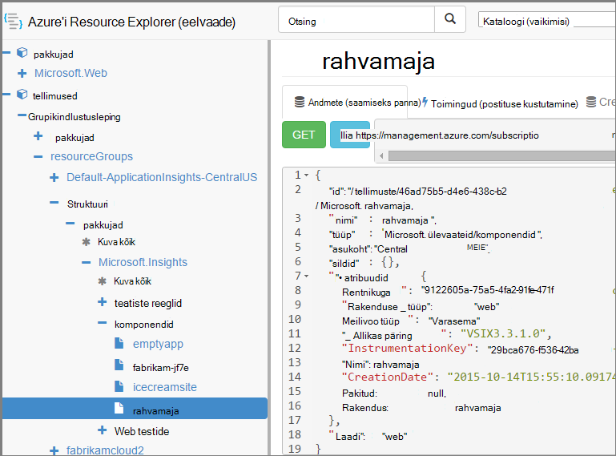

<properties 
    pageTitle="Saate luua rakenduse ülevaated ressursid PowerShelli abil" 
    description="Saate luua rakenduse ülevaated ressursid programmiliselt oma koostamine osana." 
    services="application-insights" 
    documentationCenter=""
    authors="alancameronwills" 
    manager="douge"/>

<tags 
    ms.service="application-insights" 
    ms.workload="tbd" 
    ms.tgt_pltfrm="ibiza" 
    ms.devlang="na" 
    ms.topic="article" 
    ms.date="03/02/2016" 
    ms.author="awills"/>
 
# <a name="create-application-insights-resources-using-powershell"></a>Saate luua rakenduse ülevaated ressursid PowerShelli abil

Selles artiklis kirjeldatakse, kuidas luua [Rakenduse ülevaated](app-insights-overview.md) on ressurss Azure automaatselt. Võimalik, näiteks teete Koosta käigus. Koos lihtsa rakenduse ülevaated ressurss, saate luua [kättesaadavus web testide](app-insights-monitor-web-app-availability.md), [häälestage teatised](app-insights-alerts.md), ja muude Azure ressursside loomine.

Võti luua ressursid on [Azure ressursihaldur](../powershell-azure-resource-manager.md)JSON malle. Lühidalt, on: allalaadimine JSON määratlused olemasolevaid ressursse; parameterize teatud väärtused, nt nimed; ja seejärel käivitage malli iga kord, kui soovite luua uue ressursi. Saate pakkida mitu ressursid koos, neid luua kõik ühes minna – näiteks on rakenduse kuvari kättesaadavus testide, teatiste ja salvestusruumi pidev ekspordiks. On mõned vivahteiden mõnda parameterizations, mille selgitame siin.

## <a name="one-time-setup"></a>Ühekordse häälestamine

Kui te pole kasutanud PowerShelli enne Azure'i tellimus:

Installige Azure'i PowerShelli mooduli arvutisse, kuhu soovite selle skriptide käitamiseks.

1. Installige [Microsoft Web platvormi Installer (v5 või uuem versioon)](http://www.microsoft.com/web/downloads/platform.aspx).
2. Selle abil saate Microsoft Azure'i PowerShelli installimine.

## <a name="copy-the-json-for-existing-resources"></a>Kopeerige JSON olemasolevad ressursid

1. Häälestada [Rakenduse ülevaated](app-insights-overview.md) projekti soovite luua automaatselt sarnased. Lisage web kontrollib ja teatiste, kui soovite, et need.
2. .Json uue faili loomine – kõne vaatame seda `template1.json` selles näites. Kopeerige see selle sisu.


    ```JSON

        {
          "$schema": "https://schema.management.azure.com/schemas/2015-01-01/deploymentTemplate.json#",
          "contentVersion": "1.0.0.0",
          "parameters": {
            "appName": { "type": "string" },
            "webTestName": { "type": "string" },
            "url": { "type": "string" },
            "text": { "type" : "string" }
          },
          "variables": {
            "testName": "[concat(parameters('webTestName'), 
               '-', toLower(parameters('appName')))]"
            "alertRuleName": "[concat(parameters('webTestName'), 
               '-', toLower(parameters('appName')), 
               '-', subscription().subscriptionId)]"
          },
          "resources": [
            {
              // component JSON file contents
            },
            {
              //web test JSON file contents
            },
            {
              //alert rule JSON file contents
            }
 
            // Any other resources go here
          ]
        }
    
    ```

    See mall loob ühe-saadavus testi Lisaks peamine ressurss.


2. Avage [Azure'i ressursihaldur](https://resources.azure.com/). Liikuge allapoole kuni `subscriptions/resourceGroups/<your resource group>/providers/Microsoft.Insights/components`, oma rakenduse ressursi. 

    

    *Komponendid* on lihtne rakenduse ülevaated ressursid rakenduste kuvamiseks. On seotud teatis reeglid ja kättesaadavus web testib eraldi ressursid.

3. Kopeerige JSON komponendi kohane `template1.json`.
6. Neid atribuute kustutamiseks tehke järgmist.
  * `id`
  * `InstrumentationKey`
  * `CreationDate`
4. Avage webtests ja alertrules jaotised ja kopeerige JSON Üksiküksuste jaoks malli. (Pole kopeerige webtests või alertrules sõlmed: minna vastavalt nende üksuste.)

    Iga katse web on seotud reegli, nii, et kopeerida mõlemad.

    Enne reegli sihtkoha web test.

5. Soovide skeemiga, sisestage see rida iga koodiressursi:

    `"apiVersion": "2014-04-01",`

    (Skeemi ka kurdab kohta suurtähestuse ressursside tüüp nimed `Microsoft.Insights/*` --, kuid *Ärge* muutke neid.)


## <a name="parameterize-the-template"></a>Parameterize Mall

Nüüd on teil asendada teatud nimed parameetrid. [Malli parameterize](../resource-group-authoring-templates.md), kirjutage avaldiste abil [määrata helper funktsioone](../resource-group-template-functions.md). 

Te ei saa parameterize lihtsalt osa stringi, seega kasutage `concat()` stringide koostamiseks.

Siit leiate näiteid asendust, mida soovite muuta. On mitu esinemiskordade iga asendus. Peate võib-olla teised teie malli. Nendes näidetes kasutatakse parameetrite ja muutujate meil määratletud malli ülaosas.

otsimine | Asendage
---|---
`"hidden-link:/subscriptions/.../components/MyAppName"`| `"[concat('hidden-link:',`<br/>` resourceId('microsoft.insights/components',` <br/> ` parameters('appName')))]"`
`"/subscriptions/.../alertrules/myAlertName-myAppName-subsId",` | `"[resourceId('Microsoft.Insights/alertrules', variables('alertRuleName'))]",`
`"/subscriptions/.../webtests/myTestName-myAppName",` | `"[resourceId('Microsoft.Insights/webtests', parameters('webTestName'))]",`
`"myWebTest-myAppName"` | `"[variables(testName)]"'`
`"myTestName-myAppName-subsId"` | `"[variables('alertRuleName')]"`
`"myAppName"` | `"[parameters('appName')]"`
`"myappname"`(väiketähed) | `"[toLower(parameters('appName'))]"`
`"<WebTest Name=\"myWebTest\" ...`<br/>` Url=\"http://fabrikam.com/home\" ...>"`|`[concat('<WebTest Name=\"',` <br/> `parameters('webTestName'),` <br/> `'\" ... Url=\"', parameters('Url'),` <br/> `'\"...>')]" `


## <a name="set-dependencies-between-the-resources"></a>Ressursside sõltuvuste määramine

Azure'i peaks häälestada ressursside range järjestuses. Veenduge, et ühe install on lõpule viidud, enne kui järgmine algab, lisage sõltuvus jooned.

* Veebirakenduse ressursside testimine

    `"dependsOn": ["[resourceId('Microsoft.Insights/components', parameters('appName'))]"],`

* Teatiste ressurss:

    `"dependsOn": ["[resourceId('Microsoft.Insights/webtests', variables('testName'))]"],`

## <a name="create-application-insights-resources"></a>Saate luua rakenduse ülevaated ressursid

1. Azure sisselogimine PowerShellis

    `Login-AzureRmAccount`

2. Käivitage käsk umbes järgmine:

    ```PS

        New-AzureRmResourceGroupDeployment -ResourceGroupName Fabrikam `
               -templateFile .\template1.json `
               -appName myNewApp `
               -webTestName aWebTest `
               -Url http://myapp.com `
               -text "Welcome!"
               -siteName "MyAzureSite"

    ``` 

    * -ResourceGroupName on rühma, kus soovite luua uue ressursid.
    * -templateFile peab jääma aastasse enne kohandatud parameetrid.
    * -rakendusenimi loomiseks ressursi nimi.
    * -webTestName web test loomiseks nime.
    * -URL-i oma veebirakenduse URL-i.
    * -tekst string, mis kuvatakse teie veebilehele.
    * -siteName - kasutada, kui see on Azure veebisait


## <a name="define-metric-alerts"></a>Argumendil teatiste määratlemine

On [PowerShelli meetodit teatiste seadmine](app-insights-alerts.md#set-alerts-by-using-powershell).


## <a name="an-example"></a>Näide

Siin on lõpule viidud komponent, web test ja web testi teatiste Mall, mis loodud:

``` JSON

{
  "$schema": "https://schema.management.azure.com/schemas/2015-01-01/deploymentTemplate.json#",
  "contentVersion": "1.0.0.0",
  "parameters": {
    "webTestName": { "type": "string" },
    "appName": { "type": "string" },
    "URL": { "type": "string" },
    "text": { "type" : "string" }
  },
  "variables": {
    "alertRuleName": "[concat(parameters('webTestName'), '-', toLower(parameters('appName')), '-', subscription().subscriptionId)]",
    "testName": "[concat(parameters('webTestName'), '-', toLower(parameters('appName')))]"
  },
  "resources": [
    {
      //"id": "[resourceId('Microsoft.Insights/components', parameters('appName'))]",
      "apiVersion": "2014-04-01",
      "kind": "web",
      "location": "Central US",
      "name": "[parameters('appName')]",
      "properties": {
        "TenantId": "9122605a-471fc50f8438",
        "Application_Type": "web",
        "Flow_Type": "Brownfield",
        "Request_Source": "VSIX3.3.1.0",
        "Name": "[parameters('appName')]",
        //"CreationDate": "2015-10-14T15:55:10.0917441+00:00",
        "PackageId": null,
        "ApplicationId": "[parameters('appName')]"
      },
      "tags": { },
      "type": "microsoft.insights/components"
    },
    {
      //"id": "[resourceId('Microsoft.Insights/webtests', variables('testName'))]",
      "name": "[variables('testName')]",
      "apiVersion": "2014-04-01",
      "type": "microsoft.insights/webtests",
      "location": "Central US",
      "tags": {
        "[concat('hidden-link:', resourceId('microsoft.insights/components', parameters('appName')))]": "Resource"
      },
      "properties": {
        "provisioningState": "Succeeded",
        "Name": "[parameters('webTestName')]",
        "Description": "",
        "Enabled": true,
        "Frequency": 900,
        "Timeout": 120,
        "Kind": "ping",
        "RetryEnabled": true,
        "Locations": [
          {
            "Id": "us-va-ash-azr"
          },
          {
            "Id": "emea-nl-ams-azr"
          },
          {
            "Id": "emea-gb-db3-azr"
          }
        ],
        "Configuration": {
          "WebTest": "[concat(
             '<WebTest   Name=\"', 
                parameters('webTestName'), 
              '\"  Id=\"32cfc791-aaad-4b50-9c8d-993c21beb218\"   Enabled=\"True\"         CssProjectStructure=\"\"    CssIteration=\"\"  Timeout=\"120\"  WorkItemIds=\"\"         xmlns=\"http://microsoft.com/schemas/VisualStudio/TeamTest/2010\"         Description=\"\"  CredentialUserName=\"\"  CredentialPassword=\"\"         PreAuthenticate=\"True\"  Proxy=\"default\"  StopOnError=\"False\"         RecordedResultFile=\"\"  ResultsLocale=\"\">  <Items>  <Request Method=\"GET\"         Guid=\"a6f2c90b-61bf-b28hh06gg969\"  Version=\"1.1\"  Url=\"', 
              parameters('Url'), 
              '\" ThinkTime=\"0\"  Timeout=\"300\" ParseDependentRequests=\"True\"         FollowRedirects=\"True\" RecordResult=\"True\" Cache=\"False\"         ResponseTimeGoal=\"0\"  Encoding=\"utf-8\"  ExpectedHttpStatusCode=\"200\"         ExpectedResponseUrl=\"\" ReportingName=\"\" IgnoreHttpStatusCode=\"False\" />        </Items>  <ValidationRules> <ValidationRule  Classname=\"Microsoft.VisualStudio.TestTools.WebTesting.Rules.ValidationRuleFindText, Microsoft.VisualStudio.QualityTools.WebTestFramework, Version=10.0.0.0, Culture=neutral, PublicKeyToken=b03f5f7f11d50a3a\" DisplayName=\"Find Text\"         Description=\"Verifies the existence of the specified text in the response.\"         Level=\"High\"  ExectuionOrder=\"BeforeDependents\">  <RuleParameters>        <RuleParameter Name=\"FindText\" Value=\"', 
              parameters('text'), 
              '\" />  <RuleParameter Name=\"IgnoreCase\" Value=\"False\" />  <RuleParameter Name=\"UseRegularExpression\" Value=\"False\" />  <RuleParameter Name=\"PassIfTextFound\" Value=\"True\" />  </RuleParameters> </ValidationRule>  </ValidationRules>  </WebTest>')]"
        },
        "SyntheticMonitorId": "[variables('testName')]"
      }
    },
    {
      //"id": "[resourceId('Microsoft.Insights/alertrules', variables('alertRuleName'))]",
      "name": "[variables('alertRuleName')]",
      "apiVersion": "2014-04-01",
      "type": "microsoft.insights/alertrules",
      "location": "East US",
      "dependsOn": [
        "[resourceId('Microsoft.Insights/components', parameters('appName'))]",
        "[resourceId('Microsoft.Insights/webtests', variables('testName'))]"
      ],
      "tags": {
        "[concat('hidden-link:', resourceId('Microsoft.Insights/components', parameters('appName')))]": "Resource",
        "[concat('hidden-link:', resourceId('Microsoft.Insights/webtests', variables('testName')))]": "Resource"
      },
      "properties": {
        "name": "[variables('alertRuleName')]",
        "description": "",
        "isEnabled": true,
        "condition": {
          "$type": "Microsoft.WindowsAzure.Management.Monitoring.Alerts.Models.LocationThresholdRuleCondition, Microsoft.WindowsAzure.Management.Mon.Client",
          "odata.type": "Microsoft.Azure.Management.Insights.Models.LocationThresholdRuleCondition",
          "dataSource": {
            "$type": "Microsoft.WindowsAzure.Management.Monitoring.Alerts.Models.RuleMetricDataSource, Microsoft.WindowsAzure.Management.Mon.Client",
            "odata.type": "Microsoft.Azure.Management.Insights.Models.RuleMetricDataSource",
            "resourceUri": "[resourceId('microsoft.insights/webtests', variables('testName'))]",
            "metricName": "GSMT_AvRaW"
          },
          "windowSize": "PT15M",
          "failedLocationCount": 2
        },
        "action": {
          "$type": "Microsoft.WindowsAzure.Management.Monitoring.Alerts.Models.RuleEmailAction, Microsoft.WindowsAzure.Management.Mon.Client",
          "odata.type": "Microsoft.Azure.Management.Insights.Models.RuleEmailAction",
          "sendToServiceOwners": true,
          "customEmails": [ ]
        },
        "provisioningState": "Succeeded",
        "actions": [ ]
      }

    }
  ]
}

```

## <a name="see-also"></a>Vt ka

Muud artiklid automatiseerimine

* [Loo on rakenduse ülevaated ressurss](app-insights-powershell-script-create-resource.md) - ilma malli abil kiiresti meetod.
* [Teatiste häälestamine](app-insights-powershell-alerts.md)
* [Web testide loomine](https://azure.microsoft.com/blog/creating-a-web-test-alert-programmatically-with-application-insights/)
* [Azure'i diagnostika saata rakenduse ülevaated](app-insights-powershell-azure-diagnostics.md)
* [Väljalaske marginaalid loomine](https://github.com/Microsoft/ApplicationInsights-Home/blob/master/API/CreateReleaseAnnotation.ps1)
