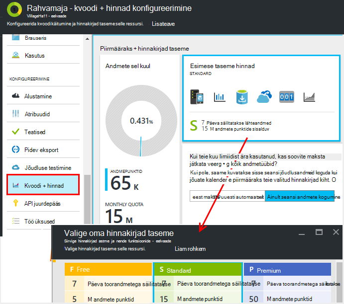

<properties 
    pageTitle="Hinnad ja kvoodi haldamine rakenduse ülevaated | Microsoft Azure'i" 
    description="Valige hind lepingut, peate telemeetria mahu haldamine" 
    services="application-insights" 
    documentationCenter=""
    authors="alancameronwills" 
    manager="douge"/>

<tags 
    ms.service="application-insights" 
    ms.workload="tbd" 
    ms.tgt_pltfrm="ibiza" 
    ms.devlang="na" 
    ms.topic="article" 
    ms.date="10/13/2016" 
    ms.author="awills"/>

# Rakenduse ülevaated hinnad ja piirmäära haldamine

*Rakenduse ülevaated on eelvaade.*

[Hinnad] [ pricing] for [Visual Studio rakenduse ülevaated] [ start] põhineb andmete maht taotluse kohta. Seal on olulisi tasuta tasandi, kus kuvatakse enamik funktsioone mõned piirangud.

Iga rakenduse ülevaated ressursi ei lisandu eraldi teenust ning aitab Azure tellimuse arve.

[Vt hinnakirjad kava][pricing].

## Vaadake üle oma rakenduse ülevaated ressursi kvoodi ja hinna kavandamine

Saate avada kvoodi + hinnad blade rakenduse ressursi sätted.

Teie valitud hinnad värviskeemi mõjutab:

* [Igakuine kvoodi](#monthly-quota) - telemeetria saate analüüsida iga kuu summa.
* [Andmete määr](#data-rate) - piirmäära, millega saab töödelda oma rakenduse andmeid.
* [Pidev eksportimine](#continuous-export) – kas saate eksportida andmed muid tööriistu ja teenuseid.

Need piirangud on esitatud eraldi iga rakenduse ülevaated ressurss.

### Premium tasuta prooviversioon

Kui loote uue rakenduse ülevaated ressursi, see algab tasuta astme.

Igal ajal, mida saab vahetada 30 päeva Premium tasuta. See annab teile Premium taseme eelised. 30 päeva pärast seda automaatselt olekusse sõltumata teie taseme olid enne - ainult juhul, kui otseselt teise taseme. Esimese taseme, mida soovite igal ajal prooviperioodil valite, kuid saate tasuta prooviversiooni kuni 30 päeva jooksul.

## Igakuine piirmäär

* Iga kalendrikuuna sõnumite rakenduse lisamine rakenduse ülevaated telemeetria kogus. Tasuta hinnakirjad taseme piirmäära on praegu 5 miljonit andmepunktide kuus ja rohkem skeemid; saate osta rohkem kui jõuate kvoodi.  Vt [hinnad värviskeemi] [ pricing] tegelik arvude jaoks. 
* Kvoodi sõltub hinnakirjad taseme, et olete valinud.
* Kvoodi arvestatakse keskööst UTC iga kuu esimesel päeval.
* Andmete punktide diagramm näitab palju meiliteavitus on kasutatud üles see kuu.
* Kvoodi on mõõdetud *andmepunktide.* Ühele andmepunktile kas kõne meetodite Jälita nimetatakse selgesõnaliselt koodi või ühe tavalise telemeetria moodulid. See võib olla mitu manustatud atribuudid ja mõõdikute.
* Andmepunktid on loodud:
 * [SDK moodulid](app-insights-configuration-with-applicationinsights-config.md) automaatselt koguda andmeid, näiteks teatada taotluse või krahh või jõudluse mõõtmiseks.
 * [API](app-insights-api-custom-events-metrics.md) `Track...` kõnesid, mida olete kirjutanud, näiteks `TrackEvent` või `trackPageView`.
 * [Kättesaadavus web testide](app-insights-monitor-web-app-availability.md) , mis on seadistatud.
* Kui te kasutate silumine, näete andmepunkti saatmist rakenduse Visual Studio väljundi aknas. Kliendi sündmused näha, avades brauseri vahekaardil võrk on silumine paan (tavaliselt F12).
* *Seansi andmeid* ei arvestata kvoodi. See hõlmab loendab kasutajad, seansid, keskkonna ja seadme andmed.
* Kui soovite arvutada kuni andmepunktide kontroll, leiate need erinevates kohtades:
 * Iga üksuse näete [diagnostika otsing](app-insights-diagnostic-search.md), mis sisaldab HTTP taotlusi, erandid, log jälgi, lehe vaateid, sõltuvus sündmused ja kohandatud sündmused.
 * Iga töötlemata mõõtmine [meetermõõdustik](app-insights-metrics-explorer.md) näiteks jõudluse vastu. (Kaartidel kuvatakse punktide on tavaliselt mitme toorandmetega punktide agregaadid.)
 * Iga diagrammil web kättesaadavus on ka mitu andmepunktide agregaadi.
* Ajal silumine saab kontrollida ka üksikuid andmepunkte allikas:
 * Kui käivitate rakenduse Visual Studio silumine režiimis, logitakse andmepunktide väljundi aknas. 
 * Kliendi andmepunktide vaatamiseks avage brauseri silumine paan (tavaliselt F12) ja avage vahekaart võrgu.
* Andmete võib olla (vaikimisi) vähendatud [kohandatava](app-insights-sampling.md)proovide. See tähendab, et teie rakendus suureneb kasutamist, mis ei telemeetria määr suurendamiseks nagu võib-olla eeldate.

### Lisatud liigses

Kui teie rakendus saadab rohkem kui kuu piirmäära, saate teha järgmist.

* Täiendavate andmete eest maksta. Vt [hinnad värviskeemi] [ pricing] üksikasju. Saate valida selle suvandi ette. See suvand pole saadaval tasuta, hinnad taseme.
* Võtke kasutusele oma hinnakirjad taseme.
* Pole vaja midagi teha. Seansi andmed on jätkuvalt kasutada, kuid muid andmeid ei kuvata diagnostika Otsi või mõõdikute Exploreris.

## Kui palju andmeid saadan?

Diagrammi allservas olevat hinnad blade kuvatakse teie taotlus andmete punkti maht, rühmitatud punkti andmetüüp. (Saate ka luua see diagramm meetermõõdustik Exploreris.)

Klõpsake nuppu Täpsemalt, diagrammi või lohistage kursor üle selle ja ajavahemiku üksikasjad nuppu (+).

Diagramm kuvab saabub rakenduse ülevaated teenuse [valimite](app-insights-sampling.md)pärast andmete maht.

Kui andmete maht jõuab kuu meiliteavitus, kuvatakse diagrammil marginaali.

## Andmete määr

Lisaks igakuine kvoodi on andmete määra ahendamise piirangud. Tasuta [hinnad taseme] [ pricing] on punktide sekundis, mis on rohkem kui 5 minuti jooksul 200 andmed ja jaoks makstud tiers 500/s on keskmiselt 1 minuti jooksul. 

On kolme ämbrid, mis arvestatakse eraldi.

* [TrackTrace kõnede](app-insights-api-custom-events-metrics.md#track-trace) ja [jäädvustata logid](app-insights-asp-net-trace-logs.md)
* [Erandid](app-insights-api-custom-events-metrics.md#track-exception)piiratud 50 punktide/s.
* Kõik muud telemeetria, (lehe vaateid, seansid, taotlusi, sõltuvused, mõõdikute, kohandatud sündmused, web testi tulemused).

*Mis juhtub, kui rakendus on suurem kui sekundis?*

* Andmed, mida teie rakendus saadab hinnatakse iga minut maht. Kui see on suurem kui sekundis minutid Keskmine, server keeldub mõned taotlused. SDK puhvri andmed ja seejärel proovib, levitada lisandus mitme minuti jooksul. Kui teie rakendus saadab pidevalt andmete kohal ahendamise määr, kõrvaldatakse mõned andmed. (ASP.net-i, Java ja JavaScripti SDK-d proovida uuesti saata nii; muude SDK-d võib lihtsalt drop rakendus andmed).

Pidurdamise juhul kuvatakse hoiatus, et see on juhtunud teatis.

*Kuidas teada, mitu andmepunkti saatmist on rakendus?*

* Avage sätted/kvoodi ja hinnakirjad diagrammi andmete maht.
* Või mõõdikute Exploreris uue diagrammi lisamine ja valige **andmepunkt helitugevuse** kui selle väärtuseks meetermõõdustik. Lülitage rühmitamise ja Rühmita **andmetüüp**.

## Oma andmete määra vähendamine

Kui teil tekib ahendamise piirangud, siin on mõned asjad, mida saate teha:

* Kasutage [valimite](app-insights-sampling.md). See tehnoloogia vähendab andmete ilma moonutamist mõõdikute oma ja katkestades võimalus otsingus seostuvate üksuste vahel liikumine.
* [Ajaxi kõned, mida saab esitada arv](app-insights-javascript.md#detailed-configuration) iga lehe või lülitage Ajaxi teatamine.
* Saidikogumi moodulid ei pea te, [redigeerides ApplicationInsights.config](app-insights-configuration-with-applicationinsights-config.md)välja lülitada. Näiteks võib juhtuda, et täitmise hinnale sõltuvus on ebaoluliste.
* Eelnevalt liitväärtuse mõõdikute. Kui lisate rakenduse TrackMetric kõnesid, saate vähendada liikluse ülekoormuse, mida aktsepteerib oma keskmise arvutamine ja standardhälve mõõtmed partii abil. Või kasutage [eelnevalt koondamisega paketi](https://www.myget.org/gallery/applicationinsights-sdk-labs). 

## Valimite

[Proovide](app-insights-sampling.md) on meetod, kus telemeetria saadetakse teie rakenduste kohta, samal ajal säilitades võimalus otsida seotud sündmused diagnostika otsingute ajal ja säilitades õige sündmuse loendab vähendamine. 

Valimite on tõhusalt vähendada kulude ja jäävad teie igakuine limiidist. Valimite algoritmi säilitab telemeetria ja seotud üksustega nii, et näiteks kui kasutate otsing, leiate seotud kindla erandi taotluse. Algoritmi säilitab ka õige loendab, nii, et näha õigete väärtuste meetermõõdustik Exploreris taotluse määr, erandi määr ja teiste loeb.

On valimi mitu vorme.

* [Kohandatavad valimite](app-insights-sampling.md) on vaikimisi ASP.net-i Tarkvaraarenduskomplektist, mis automaatselt korrigeerida või mitte telemeetria, mis saadab rakenduse maht. See toimib automaatselt teie web Appis SDK nii, et telemeetria liikluse võrgus on vähendatud. 
* *Manustamisest valimite* on alternatiivne, mille aluseks on kohas, kus teie rakenduse telemeetria siseneb rakenduse ülevaated teenuse. See ei mõjuta teie rakenduse saadetud telemeetria maht, kuid see vähendab säilitatakse teenuse maht. Saate vähendada kvoodi telemeetria brauserite ja muude SDK-d kasutatakse.

Manustamisest valimite seadmine juhtelemendi kvootide + hinnad blade:

> [AZURE.WARNING] Paani näidiseid alles kuvatud väärtus näitab ainult väärtust, mille olete manustamisest valimite. See ei kuvata valimite määr, mis töötab SDK rakenduse. 
> 
> Kui sissetulevate telemeetria on juba lahutusvõimega SDK, manustamisest valimite pole rakendatud.
 
Leida tegelikku määr sõltumata sellest, kus on rakendatud, kasutage [päringu Kasutusanalüüsi](app-insights-analytics.md) , nagu see.

    requests | where timestamp > ago(1d)
  	| summarize 100/avg(itemCount) by bin(timestamp, 1h) 
  	| render areachart 

Säilitatakse iga kirje `itemCount` näitab algse kirjed, mis tähistab see arv võrdub 1 + eelmise kasutuselt kõrvaldatud kirjete arvu. 

## Vaadake üle Azure tellimuse arve

Rakenduse ülevaateid seotud tasud lisatakse Azure arve. Saate vaadata arve arveldamine jaotises Azure portaali või [Azure arveldus portaali](https://account.windowsazure.com/Subscriptions)oma Azure'i üksikasjad. 

## Nime piirangud

1.  Kuni 200 kordumatute nimede panemine argumendil ja 200 atribuudi Kordumatud nimed rakenduse. Mõõdikute hõlmata andmeid, mis on saadetud TrackMetric kui ka muude andmetüübid, nt sündmuste mõõtmise kaudu.  [Mõõdikute-ja atribuudi] [ api] globaalse instrumentation võtme kohta.
2.  [Atribuutide] [ apiproperties] saab kasutada filtreerimiseks ja rühma poolt ainult siis, kui neil on vähem kui 100 iga atribuudi kordumatuid väärtusi. Pärast Üheste väärtuste arv ületab 100, saate otsida selle atribuudi, kuid pole enam kasutamiseks filtrid ja rühma poolt.
3.  Standardatribuudid, nt taotleda nimi ja lehe URL on piiratud nädalas 1000 kordumatuid väärtusi. Pärast 1000 kordumatuid väärtusi väärtused täiendav on märgitud "Muud väärtused". Algväärtused saab endiselt täisteksti otsingu ja filtreerimise.

Kui leiate, et teie taotlus on üle need piirangud, kaaluge vahel eri instrumentation võtmed - st [luua uue rakenduse ülevaated ressursid](app-insights-create-new-resource.md) andmed ja saata mõned andmed uus instrumentation võtmed. Võib juhtuda, et tulemus on struktureeritud. [Armatuurlaudade](app-insights-dashboards.md#dashboards) abil saate tuua erinevate mõõdikute sama ekraanile, nii, et seda lähenemisviisi ei piirata teie võimalus erinevate mõõdikute võrdlemine. 

## Piirangud Kokkuvõte

[AZURE.INCLUDE [application-insights-limits](../../includes/application-insights-limits.md)]

<!--Link references-->

[api]: app-insights-api-custom-events-metrics.md
[apiproperties]: app-insights-api-custom-events-metrics.md#properties
[start]: app-insights-overview.md
[pricing]: http://azure.microsoft.com/pricing/details/application-insights/

 