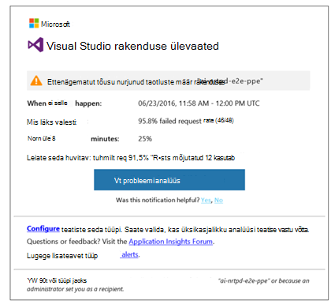
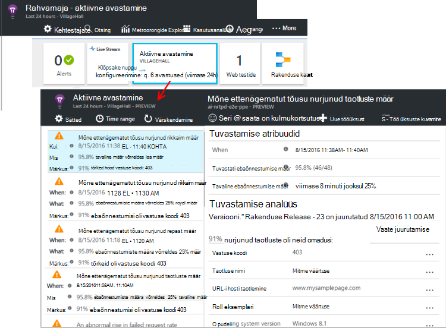

<properties 
    pageTitle="Klõpsake rakenduse ülevaated aktiivne diagnostika | Microsoft Azure'i" 
    description="Rakenduse ülevaated sooritab automaatse sügavat analüüsi oma rakenduse telemeetria ja hoiatab potentsiaalseid probleeme." 
    services="application-insights" 
    documentationCenter="windows"
    authors="rakefetj" 
    manager="douge"/>

<tags 
    ms.service="application-insights" 
    ms.workload="tbd" 
    ms.tgt_pltfrm="ibiza" 
    ms.devlang="na" 
    ms.topic="article" 
    ms.date="08/15/2016" 
    ms.author="awills"/>

#  Klõpsake rakenduse ülevaated aktiivne diagnostika

 Aktiivne diagnostika hoiatab automaatselt, saate oma veebirakenduse võimalike jõudlusprobleemide. Tehtav telemeetria, mis saadab rakenduse [Visual Studio rakenduse ülevaated](app-insights-overview.md)tark analüüs. Kui mõne ootamatu tõrge tõus või kliendi või serveri jõudluse ettenägematut mustrite, saate teatise. See funktsioon vajab pole konfigureerimine. See toimib, kui teie rakendus saadab piisavalt telemeetria.

Pääsete aktiivne tuvastamise teatiste kaudu saate e-kirju ja aktiivne tuvastamise keelest.

## Vaadake üle oma aktiivne avastused

Võite avastada avastused kahel viisil:

* **Saate meili** rakenduse ülevaated. Siin on tüüpiline näide:

    

    Klõpsake suurt nuppu Täpsemalt avamiseks portaalis.

* **The aktiivne tuvastamise paani** oma rakenduse ülevaade blade kuvatakse arv Viimatised teatised. Klõpsake paani tehtud teatiste loendi kuvamiseks.

Valige teatise üksikasjade kuvamiseks.

## Millised probleemid avastatakse?

On kolme tüüpi tuvastamise.

* [Aktiivne tõrge määr diagnostika](app-insights-proactive-failure-diagnostics.md). Kasutame kohapeal õppida on nurjunud taotluste oma rakenduse oodatud määra tõestusmeetodid laadimine ja ka muud tegurid. Kui ebaõnnestumise määr läheb väljaspool oodatud ümbrik, saadame teatise.
* [Aktiivne jõudluse diagnostika](app-insights-proactive-performance-diagnostics.md). Me otsida Anomaalne mustrite vastamise aeg ja tõrke iga päev. Me oleksid nende atribuutide, näiteks kliendi OS, asukoht, brauseri probleeme, serveri eksemplar ja kellaaeg.
* [Azure'i Cloud Services](https://azure.microsoft.com/blog/proactive-notifications-on-cloud-service-issues-with-azure-diagnostics-and-application-insights/). Saate teatisi, kui teie rakendus on majutatud Azure'i pilveteenustega ja roll eksemplari on käivitamise nurjumine, sagedased ringlussevõtu või käitusaja jookseb.

(Spikrilingid iga teatise teid asjakohaseid artikleid.)

## Järgmised sammud

Järgmisi diagnostikatööriistu aidata telemeetria rakenduste uurimine.

* [Argumendil explorer](app-insights-metrics-explorer.md)
* [Otsingu explorer](app-insights-diagnostic-search.md)
* [Analüüsi - võimsaid päringu keel](app-insights-analytics-tour.md)

Aktiivne diagnostika on täiesti automaatne. Aga võib-olla soovite häälestada mõne rohkem teatisi?

* [Käsitsi konfigureerida teatiste argumendil](app-insights-alerts.md)
* [Kättesaadavus web testide](app-insights-monitor-web-app-availability.md) 

