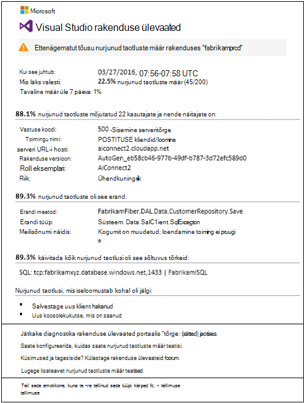
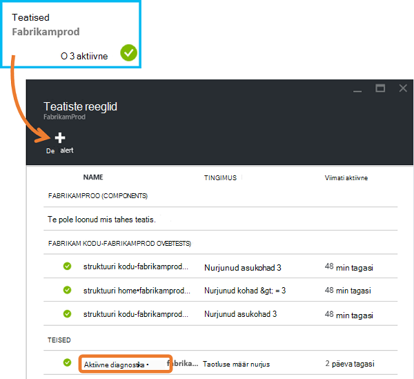
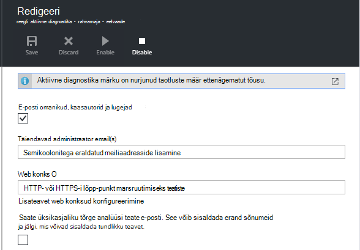
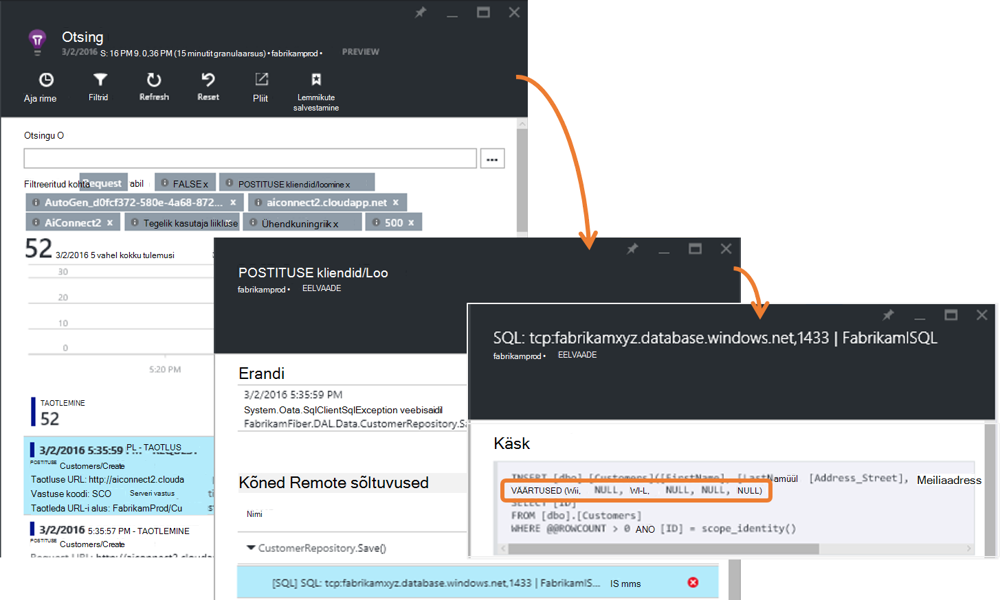
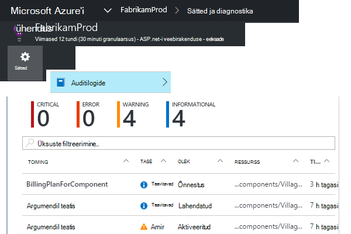
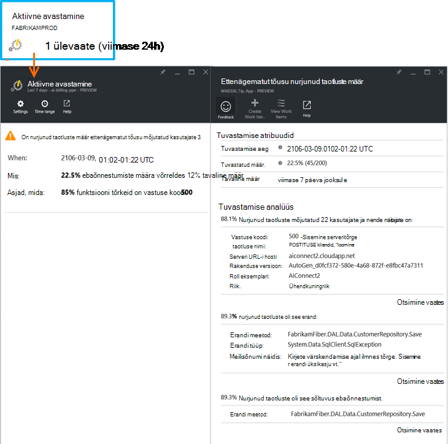

<properties 
    pageTitle="Aktiivne tõrge määr diagnostika rakenduses rakenduse ülevaated | Microsoft Azure'i" 
    description="Annab teile ebatavalised muudatused nurjunud taotluste oma veebirakenduse määra ja diagnostika analüüsi. Pole konfigureerimine on vaja." 
    services="application-insights" 
    documentationCenter=""
    authors="yorac" 
    manager="douge"/>

<tags 
    ms.service="application-insights" 
    ms.workload="tbd" 
    ms.tgt_pltfrm="ibiza" 
    ms.devlang="na" 
    ms.topic="article" 
    ms.date="10/12/2016" 
    ms.author="awills"/>
 
# Aktiivne tõrge määr diagnostika

[Visual Studio rakenduse ülevaated](app-insights-overview.md) automaatselt märku peaaegu reaalajas oma veebirakenduse kui ka ettenägematut tõusu nurjumise sagedus. Tuvastatakse on ebatavalised tõusu määr HTTP päringuid teatatud nurjus. Need on tavaliselt need vastuse koodiga sisse 400 - ja 500-vahemikke. Aitavad kaudu alusel järjestada ja probleemi diagnoosida, nurjunud taotlusi ja seotud telemeetria analüüs on esitatud teatise. Samuti on rakenduse ülevaated portaali täpsemaks diagnoosimise viited. Funktsioon peab ülesseadmine ega konfiguratsiooni, tavaline ebaõnnestumise määr prognoosida kasutab masina õ algoritmide kohta.

See funktsioon toimib Java ja ASP.net-i veebirakenduste, pilveteenuses või teie enda serverites majutatud. See töötab ka minirakenduse, mis on genereeritud taotluse telemeetria – näiteks, kui teil on töötaja rolli, mis kutsub [TrackRequest()](app-insights-api-custom-events-metrics.md#track-request). 

Pärast seadistamist [Rakenduse ülevaated projekti](app-insights-overview.md)ning esitatud rakenduse genereeritud minimaalne teatud telemeetria, aktiivne tõrge diagnostika võtab 24 tunni teavet rakenduse, tavaline toimimist enne, kui see on sisse lülitatud ja sõnumite teatised.

Siin on näide teatis. 

> [AZURE.NOTE] Vaikimisi saate lühemaks vormingus e-post kui selles näites. Kuid saate [seda üksikasjalik vormingut üle minna](#configure-alerts).

Pange tähele, et see ütleb teile.

* Ebaõnnestumiste määra võrreldes tavaline rakenduse käitumine.
* Mitu kasutajat mõjutab – nii, et te ei tea, kui palju muretsema.
* Iseloomustav mustri seostatud ebaõnnestumisi. Selles näites on kindla vastuse koodi, taotluse nimi (toiming) ja rakenduse versiooni. Kohe aru, mida kust otsida koodi. Muud võimalused võib olla teatud brauseris või kliendi operatsioonisüsteem.
* Erandi, log jälgi ja sõltuvus tõrge (andmebaasid ja muud välise komponendid), et näivad olevat iseloomustatud seostatud nurjus taotlused.
* Lingid otse rakenduse ülevaated telemeetria otsingute jaoks oluline.

## Aktiivne teatiste eelised

Tavaline [argumendil teatiste](app-insights-alerts.md) öelda, võib olla probleem. Aga aktiivne tõrge diagnostika hakkab diagnostika teile täidab palju analüüsi, mida oleks muidu ise teha. Saate tulemused korralikult pakitud, aitavad teil saada kiiresti probleemi juurkausta.

## Kuidas see toimib

Reaalajas aktiivne diagnostika kuvari lähedal telemeetria saanud rakenduste, eriti nurjunud taotluste määr. Selle mõõdiku loendab taotluste arv, mille on `Successful request` atribuut on väär. Vaikimisi `Successful request== (resultCode < 400)` (välja arvatud kirjutanud kohandatud koodi [filtreerida](app-insights-api-filtering-sampling.md#filtering) või luua oma [TrackRequest](app-insights-api-custom-events-metrics.md#track-request) kõned). 

Teie rakendus on tüüpilised mustri käitumist. Mõned taotlused võib sisaldada rohkem tõrge kui teised; ja Üldine tõrge määr võib minna laadimine suureneb. Aktiivne tõrge diagnostika kasutab masina Õppekeskuse neid kõrvalekaldeid leidmiseks. 

Nagu telemeetria tuleb rakenduse ülevaated web appi, aktiivne tõrge diagnostika võrdleb praegune käitumine viimase mõne päeva jooksul näinud mustriga. Kui mõni ettenägematut tõusu ebaõnnestumise määr on võrreldes varasemate jõudluse, käivitatakse analüüs.

Analüüsi käivitamisel teostab teenuse kobar analüüsi proovimiseks tuvastamiseks mustri väärtused, mis iseloomustab ebaõnnestumisi nurjunud soovi korral. Ülaltoodud näites on analüüsi avastanud, et enamik tõrkeid on teatud tulemuse kood taotluse nimi serveri URL-i hosti ning rolli eksemplari kohta. Seevastu analüüsi on avastanud, et atribuudi kliendi operatsioonisüsteem on jaotatud mitme väärtuse ja seega ei ole loetletud.

Kui teie teenus on need telemeetria kinnitatakse, leiab analüsaator erandi ja sõltuvus tõrge, mis on seotud taotlustest kobar, see on kindlaks, mis tahes Jälita logid seotud taotlused, näiteks.

Tulemiks oleva analüüsi saadetakse teile teatis, juhul, kui olete konfigureerinud seda mitte teha.

[Teatiste käsitsi määramine](app-insights-alerts.md), nt saate teatise oleku kontrollimine ja konfigureerida teatiste tera oma rakenduse ülevaated ressursi. Kuid erinevalt muud teatised ei pea saate häälestada ja konfigureerida aktiivne tõrge diagnostika. Soovi korral saate välja lülitada või muuta selle target meiliaadressid.

## Teatiste konfigureerimine 

Saate keelata aktiivne diagnostika, muuta meilisõnumite adressaatide, on webhook luua või valida, kas sisse üksikasjalikuma teatisi.

Avage leht teatised. Aktiivne diagnostika on lisatud koos teatisi, mis on käsitsi määramine ning saate vaadata, kas see on praegu teatiste olekus.

Klõpsake selle konfigureerida teatist.

Teate, et saate keelata aktiivne diagnostika, kuid seda ei saa kustutada (või luua teise).

#### Üksikasjalik teatised

Kui valite "Saada üksikasjalikku analüüsi" siis e-posti sisaldavad lisateavet diagnostika. Mõnikord te saa diagnoosida probleemi lihtsalt meilisõnumis andmete põhjal. 

On väike risk, et üksikasjalikumat teatis võib sisaldada tundlikku teavet, kuna see sisaldab sõnumeid erand ja jälgi. Aga see oleks ainult siis, kui teie kood võib lubada tundlikku teavet nende sõnumitele. 

## Vigade sõelumine ja diagnoosimise teatise

Teatise näitab, et tuvastati on nurjunud taotluste määr ettenägematut tõusu. Tõenäoliselt on olemas mõned probleem panemine või selle keskkonnas.

Protsendi alusel taotlusi ja mõjutatud kasutajate arv, saate otsustada, kuidas kiiresti probleem on. Ülaltoodud näites ebaõnnestumise määr 22,5% võrdleb tavalise määra 1%, näitab, et midagi valesti toimub. Teisalt, mõjutab ainult 11 kasutajad. Kui teie rakendus, saate oleks võimalik hinnata, kuidas raske on.

Paljudel juhtudel saab kiiresti kaudu taotluse nimi, erand, sõltuvus tõrge ja jälgida andmetest probleemi diagnoosida. 

Seal on mõni muu vihjeid. Näiteks sõltuvus ebaõnnestumise määr selles näites on sama, mis erand rate (89,3%). See näitab, et erand tuleneb otse sõltuvus - annab teile selge ülevaate kust otsida koodi.

Täiendavalt uurida iga jaotise lingid viivad teid otse [otsingu lehele](app-insights-diagnostic-search.md) filtreeritud asjakohaseid taotlusi, erand, sõltuvus või jälgi. Või saate Avage [Azure portaali](https://portal.azure.com), liikuge rakenduse ülevaated ressursi oma rakenduse ja avage tera tõrkeid.

Selles näites "Sõltuvus tõrkeid üksikasjade kuvamine" lingi klõpsamisel avatakse rakenduse ülevaated otsingu blade SQL-lause koos põhjus: nullide kui juures kohustuslikud ja ei liigu valideerimise ajal salvestamine toiming.

## Keskmiseks hiljutiste teatised

Portaali teatiste vaatamiseks avage **sätted, auditilogid**.

Klõpsake mis tahes teatise oma üksikasjalikult kuvamiseks.

Või klõpsake **aktiivse tuvastamise** otse viimase teatise saada.

## Mis vahe on...

Aktiivne tõrge määr diagnostika täiendab muid sarnaseid kuid rakenduse ülevaated erinevate funktsioone. 

* [Meetermõõdustik teatiste](app-insights-alerts.md) määratud teid ja saate jälgida mitmesuguseid mõõdikute nagu CPU hõivatus, taotluse määr, lehtede laadimisajaga ja jne. Saate neid hoiatada, näiteks, kui soovite lisada veel ressursse. Seevastu aktiivne tõrge diagnostika katta väike hulk kriitilised mõõdikute (praegu ainult nurjunud taotluste määr), saate reaalajas viisil kui web appi nurjus lähedal taotlemine määr suureneb märkimisväärselt võrreldes web appi tavaline käitumine teatada loodud.

    Aktiivne tõrge määr diagnostika automaatselt selle piirmäära vastuseks olemasolevate tingimustega.

    Aktiivne tõrge määr diagnostika käivitage diagnostika tööd. 
* [Aktiivne jõudluse diagnostika](app-insights-proactive-performance-diagnostics.md) kasutab ka arvuti ärianalüüsi ebatavalised mustreid oma mõõdikute leida ja ei ole konfiguratsioon, mida on vaja. Kuid erinevalt aktiivne tõrge määr diagnostika, aktiivne jõudluse diagnostika eesmärk on leida mõnda kindlat tüüpi brauseri segmente oma kasutus Magistraaltoru, mis võib halvasti kätte – näiteks kindlate lehekülgede alusel. Analüüsi tehakse iga päev, ja kui mis tahes tulemus on leitud, see on tõenäoliselt palju vähem olulisem kui teatise. Seevastu aktiivne tõrge diagnostika analüüsi sooritatakse pidevalt sissetulevate telemeetria ja teid teavitatakse minuti jooksul kui server tõrge hinnad on suurem kui oodatud.

## Kui saate teatise aktiivne tõrge määr diagnostika

*Miks see teade saanud?*

*   Me ei tuvastata on nurjunud taotlusi määr võrreldes eelmise perioodi tavaline võrdlusalus ettenägematut tõusu. Pärast ebaõnnestumist ja seotud telemeetria analüüs, me arvate, et on probleem, mida peaksite uurima. 

*Teate tähendab kindlasti mul on probleem?*

*   Me proovige Teavita rakenduse häirete või degradeerumine, kuigi ainult saate täielikult aru semantika ja mõju rakenduse või kasutajatele.

*Nii, et te Vaata minu andmetel?*

*   Ei. Teenus on täiesti automaatne. Ainult saate teatised. Teie andmed on [Privaatne](app-insights-data-retention-privacy.md).

*Mul teemasse tellida?* 

*   Ei. Iga rakenduse saatmise taotluse telemeetria on selle reegli.

*Saate tellimuse tühistamine või hoopis kolleegidele saadetud teatised saada?*

*   Jah, teatiste sisse reeglid nuppu aktiivne diagnostika reegel konfigureerida. Teatise keelamine või adressaatide teatise muutmine. 

*Kaotsi läinud meilisõnum. Kust leida teatised portaali?*

*   Klõpsake auditilogide. Sätted auditilogid, klõpsake mis tahes Teavita kuvamiseks esinemise, kuid piiratud üksikasjalik vaade.

*Ma ei soovi saada teatisi on teadaolevate probleemide.*

*   Meil on meie mahajäämus teatiste allasurumine.

## Järgmised sammud

Järgmisi diagnostikatööriistu aidata telemeetria rakenduste uurimine.

* [Argumendil explorer](app-insights-metrics-explorer.md)
* [Otsingu explorer](app-insights-diagnostic-search.md)
* [Analüüsi - võimsaid päringu keel](app-insights-analytics-tour.md)

Aktiivne avastused on täiesti automaatne. Aga võib-olla soovite häälestada mõne rohkem teatisi?

* [Käsitsi konfigureerida teatiste argumendil](app-insights-alerts.md)
* [Kättesaadavus web testide](app-insights-monitor-web-app-availability.md) 

