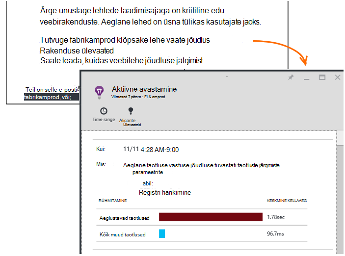

<properties 
    pageTitle="Rakenduse ülevaated: Aktiivne jõudluse diagnostika | Microsoft Azure'i" 
    description="Rakenduse ülevaated sooritab oma rakenduse telemeetria sügavat analüüsi ja hoiatab potentsiaalseid probleeme." 
    services="application-insights" 
    documentationCenter="windows"
    authors="antonfrMSFT" 
    manager="douge"/>

<tags 
    ms.service="application-insights" 
    ms.workload="tbd" 
    ms.tgt_pltfrm="ibiza" 
    ms.devlang="na" 
    ms.topic="article" 
    ms.date="08/31/2016" 
    ms.author="awills"/>

#  Aktiivne jõudluse diagnostika

*Rakenduse ülevaated on eelvaade.*

[Visual Studio rakenduse ülevaated](app-insights-overview.md) sooritab oma rakenduse telemeetria sügavat analüüsi ja teid hoiatada võimalike jõudlusprobleemide. Saate ilmselt lugeda see kuna olete saanud ühte meie aktiivne teatiste e-posti teel. 

See funktsioon ei vaja setup ja on automaatselt aktiivne, kui teie rakendus loob piisavalt telemeetria.

## Mis on aktiivne jõudluse diagnostika?

Aktiivne jõudluse diagnostika leiab ebatavalised mustrid oma rakenduse jõudluse telemeetria, mis rakenduse saadab rakenduse ülevaated analüüsida. 

Eelkõige leiab jõudlusprobleemide, mis mõjutavad ainult teatud kasutajate või mõnel juhul kasutajaid mõjutavad.

Näiteks see saab märku, kui palju aeglase laadimise rakenduse lehtede ühte tüüpi brauseris, kui teised või taotlusi serveeritakse aeglasemalt kindla serverist. See ka avastada kombinatsioonid atribuudid seotud probleeme, nagu aeglane lehe laadimise geograafiliste ühes alas teatud aegadel.

Kõrvalekaldeid, nagu need on väga raske avastada lihtsalt andmete kontrollimise käigus, kuid on rohkem levinud, kui arvate, võib. Sageli need ainult pinna, kui kliendid kurdavad. Selleks on hiljaks: kasutajatel on juba teie konkurentide aktiveerida!

Praegu pilk meie algoritmide laadimise ajal, taotluse vastuse korda server ja sõltuvus vastuse korda.  

Teil pole mõni läved ja konfigureerimiseks reeglid. Seadme õppimine ja andmete kaevandamine algoritmide kasutatakse ettenägematut mustrite tuvastamiseks. 

Meil on väga soovivad teie tagasisidet. Andke meile teada, kuidas see aitab teil, kuidas saaksime aktiivne tuvastamise ja lisavõimalused, mida soovite meil lisada. Võite saada tagasisidet anda naeratuse/kulmukortsutuse portaalis või saatke meile AppInsightsML@microsoft.com. 

## Aktiivse teatise kohta

* *Miks see e-posti saanud?*
 * Aktiivne tuvastamise analüüsida telemeetria rakenduse saadetud rakenduse ülevaated ja JÕUDLUSPROBLEEM ei tuvastata oma rakenduse. 
* *Teate tähendab kindlasti mul on probleem?*
 * Ei. See on lihtsalt soovitus midagi võiksite rohkem lähemalt. 
* *Mida teha?*
 * [Vaatame allpool esitatud andmed](#responding-to-an-alert). Läbi aja jooksul ja hulgidiagrammis täiendavad mõõdikute mõõdikute Exploreri abil. Kasutage otsingut filtreerida teatud sündmused, mis aitavad teil tuvastada põhjus. 
* *Nii, et te Vaata minu andmetel?*
 * Ei. Teenus on täiesti automaatne. Ainult saate teatised. Teie andmed on [Privaatne](app-insights-data-retention-privacy.md).

## Tuvastamisprotsessi

* *Millist liiki jõudluse kõrvalekaldeid avastatakse?*
 * Mustreid, mis teil leiaksid selle aeganõudev kontrollida enda jaoks. Näiteks kehva jõudlus teatud asukohta kombinatsiooni, kellaaeg ja platvorm.
* *Kas te analüüsida kõik rakenduse ülevaated abil kogutud andmete?*
 * Praegu ei. Praegu saame analüüsida taotluse vastuse aeg, sõltuvus aega ja lehe laadimise ajal. Täiendavad mõõdikute analüüs on tulekul. 
* *Saate luua oma normaalne tuvastamise reeglid?*
 * Mitte veel. Kuid saate:
 * [Häälestage teatised,](app-insights-alerts.md) et kindlaks teha, kui mõõdiku ületab läve.)
 * [Ekspordi telemeetria](app-insights-export-telemetry.md) [andmebaasi](app-insights-code-sample-export-sql-stream-analytics.md) või [PowerBI](app-insights-export-power-bi.md) või [muud](app-insights-code-sample-export-telemetry-sql-database.md) tööriistad, kus saate analüüsida seda ise.
* *Kui sageli analüüsi läbi?*
 * Võtame analüüsi telemeetria eelmise päeva iga päev.
* * Nii, et see asendada [argumendil teatiste](app-insights-alerts.md)?
 * Ei.  Me ei kinnita iga käitumine, mida võiksite ettenägematut tuvastamiseks.

## Kuidas uurida küsimusi

Avage aruanne, diagnostika, e-posti ega kõrvalekaldeid loendist.

* **Kui** kuvatakse aeg on tuvastatud probleem.
* **Mida** kirjeldatakse
 * Mis on tuvastatud probleem
 * Omaduste komplekti sündmused, mis on leitud, kuvatakse probleemi käitumine.
* Tabeli võrdleb halvasti läbimiseks määramine koos kõigi muude sündmuste Keskmine toimimist.

Klõpsake linke avamiseks meetermõõdustik Explorer ja otsige asjakohased aruanded, filtreeritud aja ja aeglane tegelik määramine atribuudid.

Ajavahemiku ja filtrid uurida telemeetria muuta.

## Kuidas parandada jõudlust?

Aeglane ja nurjunud vastused on üks suurim selgepilguliselt veebisaidi kasutajatele, nagu te teate oma kogemusest. Seega on oluline küsimusi.

### Olulisuse alusel järjestamine

Esmalt oluline? Kui leht on alati aeglase laadimise, kuid ainult 1% teie saidi kasutajad kunagi seda vaadata, võib-olla peate veel olulist asja mõelda. Teisalt, kui ainult 1% kasutajad avada, kuid põhjustab erandid iga kord, mis võib olla väärt uurida.

Mõju lause kasutamine e-posti üldise juhendina, kuid võtke arvesse, et see pole kogu lugu. Muud kogumiseks kinnitamiseks.

Kaaluge probleemi parameetrid. Geograafia sõltuv korral häälestamine [kättesaadavus kontrollib](app-insights-monitor-web-app-availability.md) sh piirkonnas: olemas olla lihtsalt võrguprobleemide selle ala. 

### Lehe aeglase laadimise diagnoosimine 

Kus on probleem? Server on aeglane vastata, on väga pikaks leht või brauseri on palju tööd selle kuvamiseks seda?

Avage brauser argumendil tera. [Segmenditud kuvamine brauseris laadimise ajal](app-insights-javascript.md#explore-your-data) näitab, kus plaanitakse aeg. 

* Kui **Saada taotlus aeg** on kõrge, server vasta aeglaselt või kutse on palju andmeid posti. Vaadake [jõudluse mõõdikute](app-insights-web-monitor-performance.md#metrics) uurida vastuse korda. 
* Kas on aeglane on välisteenused või andmebaasi saate seadistada [sõltuvus jälgimine](app-insights-dependencies.md) .
* Põhiline **Vastuvõtmine vastuse** korral on pikad saidil ja selle sõltuvad osade - JavaScript, CSS-i, pilte, jne (kuid mitte asünkroonselt laaditud andmed). Häälestamine on [kättesaadavus testimine](app-insights-monitor-web-app-availability.md)ja veenduge, et laadida sõltuvad osade suvandi seadmine. Kui mõni tulemuste saamiseks avage tulemuse üksikasjad ja laiendada, et näha laadimisajaga eri faile.
* Kõrge **Klient töötlemise ajal** soovitab skriptide on aeglased. Kui põhjus pole selge, kaaluge mõned ajastuse koodi lisamist ja saatmine aegade trackMetric kõned.

### Parandada aeglane lehed

Seal on web täis nõu parandada oma serveri vastuste ja laadimise ajal, siis me ei proovida kõiki siin korrata. Siin on mõned näpunäited, mida ilmselt juba teate kohta, et saaksite mõtlete.

* Aeglase laadimise tõttu suuri faile: laadimine skripte ja mujal asünkroonselt. Kasutage skripti komplekteerimine. Vidinad, mille laadimine oma andmeid eraldi põhilehe murda. Ära saada lihtsat vana HTML-i jaoks pikki tabeleid: skripti abil taotleda andmete JSON-või muu tihendatud vorming ja seejärel täitke tabel kohas. On suur raamistiku abiks olla kõik. (Samuti hõlmavad need suur skriptide, muidugi.)
* Aeglane serveri sõltuvused: kaaluge oma komponendid geograafiline asukoht. Näiteks kui kasutate Azure, veenduge, et veebiserver ja andmebaas on samas piirkonnas. Teha päringuid tuua rohkem teavet, kui need on vaja? Kas vahemällu või partiide abi?
* Võimsuse probleemid: serveri mõõdikute vastuse korda vaadata ja taotluse loendab. Kui vastus korda maksimumi ebaproportsionaalselt koos peaks taotluse arvu, on tõenäoline, et teie serverid on tõmmatud. 

## Teatis e-kirju

* *Mul teatiste saamiseks selle teenuse tellida?*
 * Ei. Meie robot perioodiliselt küsitlused rakenduse ülevaated kõik kasutajate andmed ja teatisi, kui tuvastatakse probleeme.
* *Saate tellimuse tühistamine või saada teatisi, selle asemel kolleegidele saata?*
 * Teatise või e-posti linki Tühista tellimus. 
 
    Praegu nad saadetakse neile, kellel on [juurdepääs rakenduse ülevaated ressursi](app-insights-resources-roles-access-control.md).

    Saate redigeerida ka aktiivne tuvastamise tera adressaatide loend sätted.
* *Ma ei soovi toimuda teadetest.*
 * Need on ainult üks kord päevas kõige asjakohasemad probleemi, mida me pole veel kohta aru. Te ei saa kordub, mis tahes sõnumit.
* *Kui ei tee midagi, kas ma saan meeldetuletuse?*
 * Ei, kuvatakse teade iga probleemi kohta ainult üks kord. 
* *Kaotsi läinud meilisõnum. Kust leida teatised portaali?*
 * Klõpsake rakenduse ülevaade rakenduse ülevaated **Aktiivne tuvastamise** paani. Seal saate võimalik otsida üles kõik teatised, mis 7 päeva tagasi.

## Järgmised sammud

Järgmisi diagnostikatööriistu aidata telemeetria rakenduste uurimine.

* [Argumendil explorer](app-insights-metrics-explorer.md)
* [Otsingu explorer](app-insights-diagnostic-search.md)
* [Analüüsi - võimsaid päringu keel](app-insights-analytics-tour.md)

Aktiivne avastused on täiesti automaatne. Aga võib-olla soovite häälestada mõne rohkem teatisi?

* [Käsitsi konfigureerida teatiste argumendil](app-insights-alerts.md)
* [Kättesaadavus web testide](app-insights-monitor-web-app-availability.md) 

