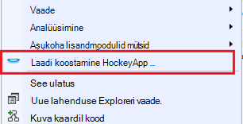
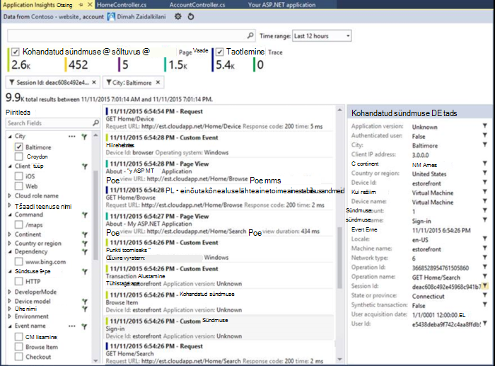

<properties
    pageTitle="Visual Studio laiend arendaja Analytics väljalaskemärkmed"
    description="Visual Studio tööriistad arendaja Analyticsi uusimaid värskendusi."
    services="application-insights"
    documentationCenter=""
    authors="acearun"
    manager="douge"/>
<tags
    ms.service="application-insights"
    ms.workload="tbd"
    ms.tgt_pltfrm="ibiza"
    ms.devlang="na"
    ms.topic="article"
    ms.date="06/09/2016"
    ms.author="acearun"/>

# Arendaja Analytics tööriistade väljalaskemärkmed
Mis on uut: rakenduse ülevaated ja HockeyApp analytics Visual Studios.
## Versiooni 7.0
### Visual Studio rakenduse ülevaateid trendide
Visual Studio rakenduse ülevaated on uue tööriista Visual Studios, mille abil saate aitavad analüüsida, kuidas teie rakendus töötab aja jooksul. **Rakenduse ülevaated** tööriistariba nuppu või rakenduse ülevaateid otsinguakna alustamiseks valige **Uurimine telemeetria trende**. Või, klõpsake menüüd **Vaade** , klõpsake nuppu **Muud Windows**ja klõpsake **Rakenduse ülevaateid trende**. Valige üks viis levinud päringud alustada. Saate analüüsida eri andmekogumi telemeetria tüübid, aeg vahemike ja muid atribuute. Andmete otsimine kõrvalekaldeid, valige üks suvanditest normaalne ripploendist **Vaate tüüp** . Filtreerimise suvandite akna allosas oleks hõlpsam Viimistlege sisse oma telemeetria teatud mitmeid.

### CodeLens erandid
Nüüd kuvatakse erand telemeetria CodeLens. Kui olete loonud projekti rakenduse ülevaated teenusega, kuvatakse iga meetodi valmistamisel viimase 24 tunni jooksul ilmnenud erandid arv. CodeLens, kaudu saate liikuda otsingu ja -trende erandid lähemalt uurida.

### ASP.net-i Core tugi
Rakenduse ülevaated toetab nüüd ASP.net-i Core RC2 projektide Visual Studios. Rakenduse ülevaated saate lisada uue Core ASP.net-i RC2 projektide **Uue projekti** dialoogiboksi nagu järgmine pilt. Või saate lisada projekti, paremklõpsake Solution Exploreris projekti ja seejärel käsku **Lisa rakendus ülevaateid telemeetria**.

ASP.net-i 5 RC1 ja ASP.net-i Core RC2 projektide on ka diagnostikatööriistu aknas uus tugi. Näete rakenduse ülevaated sündmusi, näiteks taotlusi ja erandid ASP.net-i rakenduse ajal saate silumine kohalikult PC-arvutis. Iga sündmuse nuppu **Otsi** Lisateavet süvitsi.

### HockeyApp Universal Windows rakendused
Lisaks beeta jaotus ja kasutajale tagasiside HockeyApp pakub symbolicated aruandluse Universal Windows rakenduste krahh. Me tehtud veelgi hõlpsam HockeyApp SDK lisamine: Paremklõpsake Universal Windows projekt edeneb, ja seejärel klõpsake **Hockey App – luba ootamatult sulguda Analytics**. See installib SDK, häälestab krahh saidikogumi ja HockeyApp ressursi pilves, ilma rakenduse üleslaadimine teenusesse HockeyApp sätted.

Muud uued funktsioonid:

* Oleme teinud rakenduse ülevaateid otsingut kiirem ja selgem. Nüüd aja vahemiku ja üksikasjad filtrid rakendatakse automaatselt valimisel neid.
* Ka rakenduse ülevaateid otsingus nüüd on võimalus liikuda otse taotluse telemeetria kood.
* Oleme teinud HockeyApp sisselogimine täiustused.
* Diagnostikatööriistu, kuvatakse telemeetria tooteteabe erandite jaoks.

## Versioon 5,2
Oleme tulemusega HockeyApp stsenaariumid Visual Studio Sissejuhatus teatada. Esimese integreerimine on Beetajaotuse Universal Windowsi rakendused ja Windowsi vormide rakendused Visual Studio.

Beetajaotuse, mille saadate rakenduste varasemad versioonid HockeyApp jaotuse alamhulk valitud klientide või testijad. Beetajaotuse, koos HockeyApp krahhi kogumine ja kasutajale tagasiside funktsioone, saab teile väärtuslik teavet rakenduse enne laialdane väljaanne. Seda teavet probleemide lahendamiseks saate kasutada oma rakendusega, et saate vältida või minimeerida tulevaste probleeme, näiteks madal rakenduse hinnangute, negatiivne tagasiside ja jne.

Vaadake, kui lihtne on üles laadida koostab beeta jaotamise Visual Studio.
### Universaalne veerupäist.
Universaalne Windowsi rakenduse projekti sõlm kontekstimenüü sisaldab nüüd üles laadida oma Koosta HockeyApp soovitud suvand.

Valige üksus ja HockeyApp, avatakse dialoogiboks Laadi üles. Peate HockeyApp konto üles laadida oma koostamine. Kui olete uus kasutaja, ärge muretsege. Konto loomine on lihtne.

Kui olete loonud, näete üleslaadimise vormi dialoogiboksis.

Valige sisu üles laadida (.appxbundle või .appx-fail) ja valige viisardis väljalasked. Soovi korral saate lisada väljalaskemärkmed järgmisel leheküljel. Valige **valmis** alustama üles.

Kui üleslaadimine on lõpule jõudnud, kuvatakse teavitus HockeyApp kinnitus ja link rakenduse HockeyApp portaalis.

See on õige! Ainult üleslaadimist ehitada jaoks Beetajaotuse vaid mõne hiireklõpsuga.

Saate hallata rakenduse mitmel moel HockeyApp portaalis. See hõlmab, kutsudes kasutajad, krahh aruannete ja tagasiside, muutes üksikasjad jne.

Rakenduse haldamise kohta lisateabe saamiseks [HockeyApp teabebaasi](http://support.hockeyapp.net/kb/app-management-2) artiklist.

### Windowsi vormide rakendused
Kontekstimenüü Windows vormi projekti sõlm sisaldab nüüd üles laadida oma Koosta HockeyApp soovitud suvand.

Avatakse HockeyApp üles dialoog, mis on sarnane Universal Windows prognooside.

Pange tähele rakenduse versiooni määratlemiseks uue välja selle viisardi juhiseid. Universaalne Windowsi rakendused, lisatakse teave manifestist. Windowsi vormide rakendusi, siis kahjuks pole see funktsioon on samaväärsed. Peate käsitsi määrata.

Ülejäänud voogu sarnaneb Universal Windowsi rakendused: valige koostamine ja vabastage suvandid, lisada Väljalaske märkmed üles laadida, ja hallata HockeyApp portaalis.

Oleks võimalikult lihtne. Proovige järele ja andke meile teada, mida te arvate.
## Versiooni 4.3
### Otsingu telemeetria kaudu kohaliku silumine seansid
Selles versioonis, saate nüüd otsida rakenduse ülevaated telemeetria loodud Visual Studio silumine seanss. Enne, võite kasutada otsingu ainult siis, kui registreerisite oma rakenduse rakenduse ülevaated. Nüüd rakenduse ainult peab olema installitud otsida kohalike telemeetria rakenduse ülevaateid SDK.

Kui teil on rakenduse ülevaateid SDK ASP.net-i rakenduse, tehke järgmist kasutada otsingut.

1. Rakenduse silumine.
2. Avage rakendus ülevaateid otsing ühel järgmistest viisidest:
    - Klõpsake menüüd **Vaade** , klõpsake nuppu **Muud Windows**ja klõpsake **Rakenduse ülevaateid otsing**.
    - Klõpsake tööriistaribal nuppu **Rakenduse ülevaated** .
    - Solution Exploreris, laiendage **ApplicationInsights.config**ja seejärel klõpsake nuppu **Otsi silumine seansi telemeetria**.
3. Kui te pole veel registreerunud rakenduse ülevaated, avatakse aken otsing silumine seansi telemeetria režiimis.
4. Klõpsake oma kohaliku telemeetria kuvamiseks ikooni **Otsi** .

## Versioon 4.2
Selles väljaandes lisasime otsimiseks hõlpsamaks kontekstis sündmusi, võimaluse liikuda koodi rohkem andmeid sündmuste ja sundimatu kogemus logimine andmete saatmiseks rakenduse ülevaated funktsioone. Sellele laiendile värskendatakse iga kuu. Kui teil on tagasiside või funktsiooni taotlusi, saatke see aidevtools@microsoft.com.
### Ei – klõpsake logimine kogemus
Kui kasutate juba NLog, log4net või System.Diagnostics.Tracing, pole teil teisaldada kõik jälitusandmete rakenduse ülevaated muretsema. Selles väljaandes oleme integreeritud rakenduse ülevaated logimine adapterit tavaline Otsingukonfiguratsiooni kogemus.
Kui teil juba on üks neid logimine raamistiku konfigureeritud, järgmises jaotises kirjeldatakse hankimine.
**Kui olete juba lisanud rakenduse ülevaated:**
1. Paremklõpsake sõlme projekti ja seejärel klõpsake **Rakenduse ülevaated**ja klõpsake **Rakenduse ülevaated konfigureerimine**. Veenduge, et te ei näe lisada õiget adapterit konfiguratsiooni aknas.
2. Teise võimalusena kui koostate lahenduse, Pange tähele hüpikaknas ülemises paremas nurgas oma Kuva ja valige **Konfigureeri**.

Kui teil on logimine adapterit, mis on installitud, rakenduse käivitada ja veenduge, et näha andmeid, klõpsake menüüs diagnostikatööriistu umbes järgmine:

### Liikuda või leida koodi, kus on kiiratav telemeetria sündmuse atribuut
Uue väljaandesse kasutaja klõpsata mingit väärtust sündmuse üksikasjad ja see otsib praeguse avatud lahenduse sobitamine string. Tulemused kuvatakse Visual Studio "Otsimine tulemused" loend, nagu allpool näidatud:

### Kui te pole sisse logitud uue otsingu aken
Me täiustatud funktsioonid aitavad teie andmeid otsida, samal ajal soovitud rakendus on valmistamisel ülevaateid Otsi akna ilmet.

### Vaadake kõigi telemeetria sündmuste sündmusega seostatud
Oleme lisanud päringutega eelmääratletud kõigi andmete telemeetria üritusega seotud kasutaja on sündmuse üksikasju lehesaki kõrval asuvat uuel vahekaardil. Näiteks taotlus on väljal nimega **Toimingu ID -d**. Iga sündmuse seotud taotlus on sama väärtuse jaoks **Toimingu ID -d**. Erandi juhul kui toiming on päringu töötlemise erandiks on esitatud sama toimingu ID taotlusega oleks lihtsam leida. Kui vaatate taotluse, klõpsake **selle toimingu jaoks kõik telemeetria** avada uus vahekaart, mis kuvab uue otsingu tulemused.

### Edasi ja tagasi väljale Otsi ajalugu
Nüüd saate tagasi minna, otsingutulemite vahel.

## Versioon 4.1
See väljaanne sisaldab mitmeid uusi funktsioone ja värskendusi. Peate olema installitud selle väljaande installimiseks 1.

### Erandi hüpata lähtekoodi meetod
Nüüd, kui vaatate erandid tootmise rakenduste ülevaateid Otsi aknas, saate liikuda meetodit koodi esinemise erand. Ainult peab teil olema laaditud õige projekti ja rakenduse ülevaated hoolitseb ülejäänud! (Rakenduse ülevaateid otsinguakna kohta lisateabe saamiseks vaadake seda väljalaskemärkmed versiooni 4.0 järgmistes lõikudes.)

Kuidas see toimib? Isegi siis, kui lahenduse pole avatud, saate kasutada rakenduste ülevaateid otsing. Virnas Jälita ala kuvab teate ja paljude üksuste virnas jälitus pole saadaval.

Kui faili teave on seejärel kättesaadav, mõni üksus võib olla linke, kuid lahenduse teabe üksus on jätkuvalt nähtav.

Kui klõpsate hüperlinki, saate liikuda valitud asukoha koodi. Võib olla erinev versiooninumber, kuid funktsiooni liikumiseks õiget versiooni kood, tulevad hiljem versioonidega.

### Uue kirje osutab otsing kogemusi Solution Exploreris
Nüüd saate kasutada otsingu kaudu Solution Exploreris.

### Kuvab teatise, kui avaldamine on lõpule viidud
Hüpikakende kuvatakse dialoogiboks kui projekt on avaldatud veebis, nii et saate vaadata rakenduse ülevaated andmete valmistamisel.

## Versiooni 4.0

### Visual Studio rakenduse ülevaated andmeid otsida.
Funktsiooni search rakenduse ülevaated portaalis nüüd Visual Studio saate filtreerida ja sündmuste tüübid, kinnisvarahindade ja teksti otsimine, näiteks ja seejärel kontrollige üksikute sündmuste.

### Lugege teemat andmete toomiseks diagnostikatööriistu kohalikus arvutis

Visual Studio diagnostikatööriistu lehel saate vaadata oma telemeetria lisaks muud silumine andmed. Toetatakse ainult ASP.net-i 4.5.

### SDK lisamine projekti ilma Azure sisselogimine

Teil enam rakenduse ülevaated pakettide lisamiseks **Uue projekti** dialoogiboksi kaudu või projekti kontekstimenüüst projekti Azure'i sisse logida. Kui teil sisse logida, kuvatakse SDK installinud ja konfigureerinud telemeetria saatmiseks enne portaali. Kui te pole sisse logida, SDK lisatakse projekti ja see loob telemeetria diagnostika jaoturi jaoks. Kui soovite, saate selle hiljem konfigureerida.

### Seadme tugi

Veebisaidil 2015, *ühendage ();* me [teada](https://azure.microsoft.com/blog/deep-diagnostics-for-web-apps-with-application-insights/) seadmete jaoks kogemused mobiilsideseadmete arendaja ei HockeyApp. HockeyApp aitab teil levitamine beetaversiooni järgud oma testrid, koguda ja analüüsida kõik jookseb rakenduste ja tagasiside kogumise otse oma klientidele.
HockeyApp toetab rakenduse sellest, millist platvormi valite koostamiseks, olgu see iOS-i, Android, või Windowsi või mitu platvormi lahenduse nagu Xamarin, Cordova või ühtsuse.

Tulevikus versioonides rakenduse ülevaated laiend, kuvatakse tutvustame integreeritud kogemus HockeyApp ja Visual Studio vahel. Nüüd, saate alustada HockeyApp lisamine Nugeti viide. Lugege lisateavet [dokumentatsiooni](http://support.hockeyapp.net/kb/client-integration-windows-and-windows-phone) .
