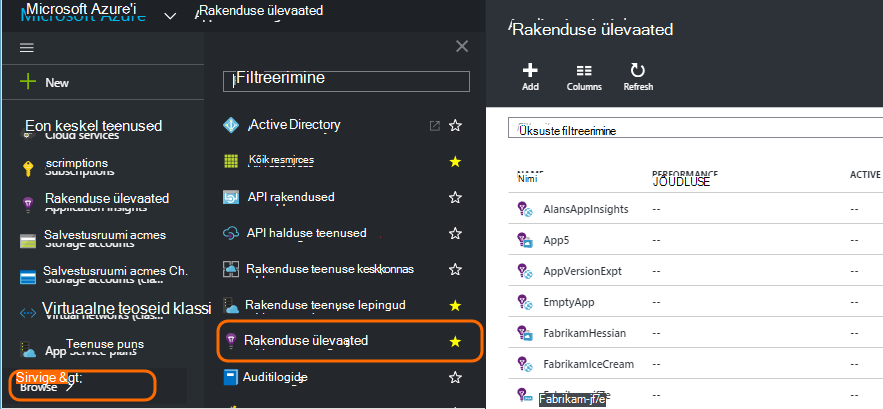
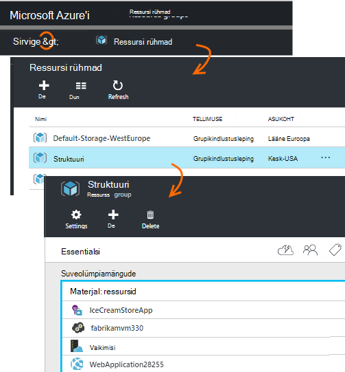
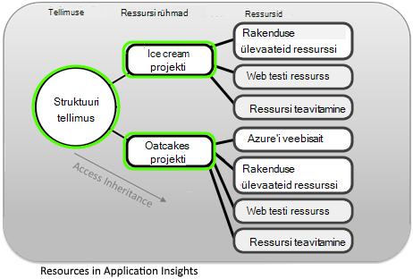
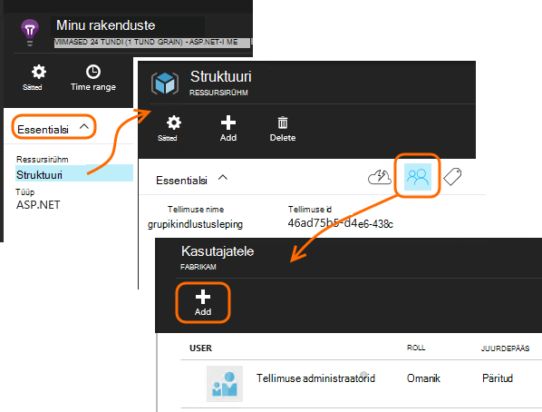
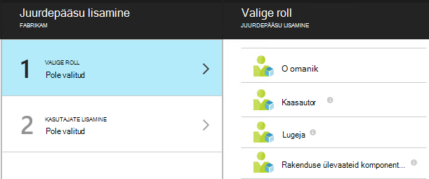
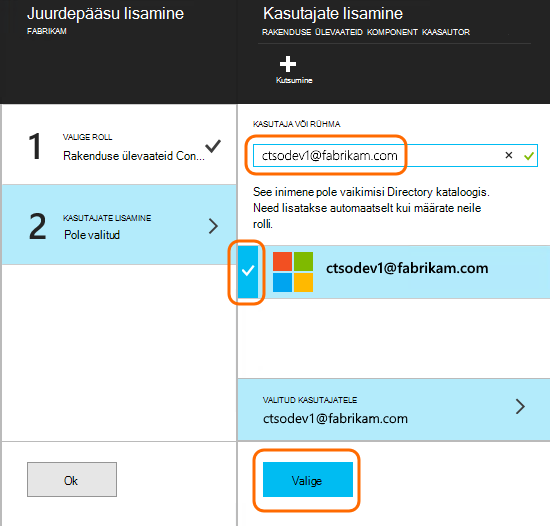

<properties
    pageTitle="Ressursid, rollid ja rakenduse ülevaated juurdepääsu juhtimine"
    description="Omanikud, kaasautorid ja ettevõtte ülevaateid lugejatele."
    services="application-insights"
    documentationCenter=""
    authors="alancameronwills"
    manager="douge"/>

<tags
    ms.service="application-insights"
    ms.workload="tbd"
    ms.tgt_pltfrm="ibiza"
    ms.devlang="na"
    ms.topic="article"
    ms.date="05/07/2016"
    ms.author="awills"/>

# Ressursid, rollid ja rakenduse ülevaated juurdepääsu juhtimine

Saate määrata, kes on lugemis- ja Accessi Visual Studio [Rakenduse ülevaated]andmete värskendamine[start], [Rollipõhine juurdepääsu reguleerimine Microsoft Azure](../active-directory/role-based-access-control-configure.md)abil.

> [AZURE.IMPORTANT] Juurdepääs kasutajatele **ressursirühm või tellimuse** kuhu oma ressurssi kuulub - ei ressursile ise määrata. Saate määrata **Rakenduse ülevaated komponent kaasautori** roll. See tagab ühtse juhtimise access web kontrollib ja teatiste koos oma ressurssi. [Lisateavet leiate teemast](#access).

## Ressursid, rühmad ja tellimused

Esmalt mõni määratlusi.

* **Ressursi** - teenus Microsoft Azure'i eksemplari. Oma rakenduse ülevaated ressursi kogub, analüüsib ja kuvab koguda andmeid, mis saadetakse teie taotlus.  Muud tüüpi Azure ressursse kaasata veebirakenduste, andmebaasid ja VMs.

    Kõigi oma ressursse nägemiseks valige [Azure portaali][portal], logige sisse ja klõpsake nuppu Sirvi.

    

* [**Ressursirühm** ] [ group] -iga ressurss kuulub ühe rühma. Rühm on mugav viis hallata seotud ressursid, eriti juurdepääsu reguleerimine. Näiteks sisse ühe ressursirühm võib pange Web Appi, on rakenduse ülevaated ressurss rakenduse jälgimiseks ja salvestusruumi ressursi eksporditud andmeid hoida.

    

* [**Tellimuse**](https://manage.windowsazure.com) - kasutada rakenduse ülevaated või muud Azure ressursid Azure tellimuse sisselogimiseks. Iga ressursirühma kuulub üks Azure'i tellimus, kus valida oma pakett hind ja, kui see on ettevõtte tellimuse valige liikmed ja nende juurdepääsuõigusi.
* [**Microsofti konto** ] [ account] -kasutajanimi ja parool, mida kasutada Microsoft Azure'i tellimused, XBox Live, Outlook.com-i ja muude Microsofti teenuste sisse logida.

## Ressursi jaotises juurdepääsu haldamine

On oluline, et aru saada, et lisaks ressursi loodud rakenduse, on ka eraldi peidetud ressursid web kontrollib ja teatiste. Need on lisatud rakenduse samasse [Ressursirühma](#resource-group) . Võite ka sisestatud muude Azure'i teenuste seal, nt veebisaidid või salvestusruumi.

Need ressursid on seega soovitatav juurdepääsu juhtimiseks tehke järgmist.

* **Ressursirühm või tellimuse** tasemel juurdepääsu kontrollimiseks.
* Kasutajatele määrata **rakenduse ülevaateid komponent kaasautori** roll. See võimaldab nende redigeerimiseks web testide, teatiste ja rakenduse ülevaated ressursse, mis tahes muud teenused jaotises juurdepääsu võimaldamata.

## Juurdepääsu teisele kasutajale

Peab teil olema tellimus või ressursirühma omaniku õigused.

Kasutaja peab olema [Microsofti konto][account], või oma [Ettevõtte Microsofti kontoga](..\active-directory\sign-up-organization.md). Saate sisestada Accessi üksikisikute ja ka kasutaja määratletud Azure Active Directory rühma.

#### Liikuge ressursirühma

Lisage kasutaja seal.

Või võib minema teise taseme ja kasutaja lisamiseks tellimuse.

#### Valige roll

Roll | Klõpsake jaotises ressurss
---|---
Omanik | Saate muuta midagi, sh kasutajate juurdepääsu
Kaasautor | Saate redigeerida midagi, kaasa arvatud kõik ressursid
Rakenduse ülevaateid komponent kaasautor | Saate muuta rakenduse ülevaated ressursid, web kontrollib ja teatised
Lugeja | Saate vaadata, kuid ei saa midagi muuta

"Redigeerimise sisaldab loomine, kustutamine ja värskendamine.

* Ressursid
* Web testide
* Teatised
* Pidev eksport

#### Valige kasutaja

Kui soovite kasutajale pole kataloogi, saate kutsuda igaüks, kellel on Microsofti konto.
(Nt Outlook.com, OneDrive, Windows Phone või XBox Live teenuste kasutamisel, nad on Microsofti konto.)

## Kasutajate ja rollide

* [Rollipõhise juurdepääsu reguleerimine Azure](../active-directory/role-based-access-control-configure.md)

<!--Link references-->

[account]: https://account.microsoft.com
[group]: ../resource-group-overview.md
[portal]: https://portal.azure.com/
[start]: app-insights-overview.md
