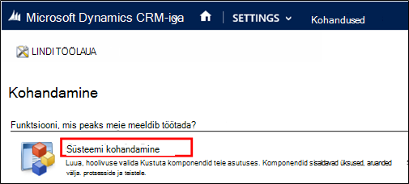
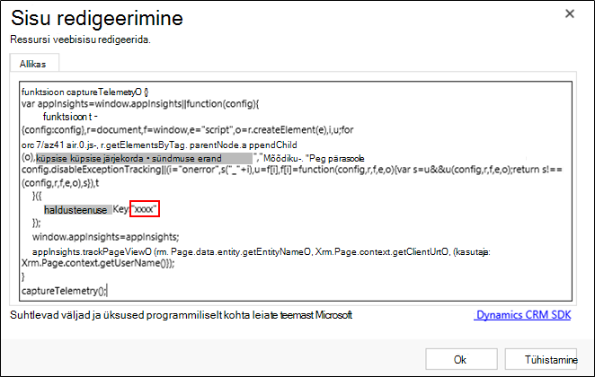
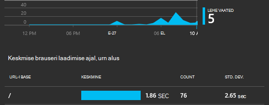
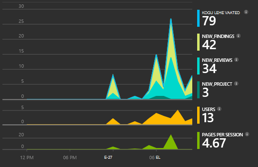

<properties 
    pageTitle="Juhend: Jälgimine Microsoft Dynamics CRM-i rakenduse ülevaated" 
    description="Telemeetria toomine Microsoft Dynamics CRM Online'i abil rakenduse ülevaated. Samm-sammult juhendi häälestamise saada andmeid, visualiseerimine ja ekspordi." 
    services="application-insights" 
    documentationCenter=""
    authors="mazharmicrosoft" 
    manager="douge"/>

<tags 
    ms.service="application-insights" 
    ms.workload="tbd" 
    ms.tgt_pltfrm="ibiza" 
    ms.devlang="na" 
    ms.topic="article" 
    ms.date="11/17/2015" 
    ms.author="awills"/>
 
# Juhend: – Unsafe for Microsoft Dynamics CRM Online'i abil rakenduse ülevaated telemeetria

Selles artiklis kirjeldatakse, kuidas telemeetria andmete toomiseks [Microsoft Dynamics CRM Online'i](https://www.dynamics.com/) abil [Visual Studio rakenduse ülevaated](https://azure.microsoft.com/services/application-insights/). Selgitame kogu protsessi rakenduse ülevaated skripti lisamine rakenduse, andmete ja andmete visualiseerimine.

>[AZURE.NOTE] [Sirvige valimi lahendus](https://dynamicsandappinsights.codeplex.com/).

## Rakenduse ülevaated lisamine uude või olemasolevasse CRM Online'i eksemplari 

Rakenduse jälgida, saate lisada ka rakenduse ülevaateid SDK rakenduse. SDK saadab telemeetria [Rakenduse ülevaated portaali](https://portal.azure.com), kus saate kasutada meie võimsate analüüsiriistade ja diagnostikatööriistu või andmete eksportimine salvestusruumi.

### Azure on rakenduse ülevaated ressurss loomine

1. Saada [konto Microsoft Azure](http://azure.com/pricing). 
2. [Azure'i portaali](https://portal.azure.com) sisse logida ja lisada uue ressursi rakenduse ülevaated. See on, kus teie andmeid töödeldakse ja kuvada.

    

    ASP.net-i valida rakenduse tüüp.

3. Avage vahekaart Kiirkäivituse ja avage skripti kood.

    

**Koodileht lahti jätta** ajal teha järgmine juhis mõnes muus brauseriaknas. Peate koodi varsti. 

### JavaScripti web ressursi Microsoft Dynamics CRM-i loomine

1. Avage oma CRM Online'i eksemplari ja logige sisse administraatoriõigustega.
2. Avatud Microsoft Dynamics CRM-i sätted, kohandusi, süsteemi kohandamine

    
    
    

    

3. Saate luua JavaScripti ressursi.

    

    Pange nimi, valige **Script (JScripti)** ja avage tekstiredaktor.

    
    
4. Kopeeri kood rakenduse ülevaated. Kopeerimise ajal veenduge, et ignoreerida skripti sildid. Vaadake allpool pildil:

    

    Kood sisaldab instrumentation klahvi, mis tuvastab teie teadmisi ressurssi.

5. Salvesta ja avalda.

    

### Dokumendi vormid

1. Avage Microsoft CRM Online'i vormi konto

    

2. Avage vorm atribuudid

    

3. Saate lisada JavaScripti web ressursi loodud

    

    

4. Salvestamine ja avaldamine vormi kohandused.

## Jäädvustatud mõõdikud

Nüüd olete seadistanud telemeetria jäädvustada vormi. Iga kord, kui seda kasutatakse, saadetakse teie rakenduse ülevaated ressursi andmed.

Siit leiate näited andmed, mida näete.

#### Rakenduse seisund

Brauseri erandid:

Klõpsake diagrammi, et saada rohkem üksikasju:

#### Kasutus

#### Brauserid

#### Geograafiline asukoht

#### Kollased lehe vaate taotlus

## Proovi kood

[Sirvige proovi kood](https://dynamicsandappinsights.codeplex.com/).

## Power BI

Saate teha ka põhjalikult analüüsida, kui [Microsoft Power BI andmed eksportida](app-insights-export-power-bi.md).

## Valimi Microsoft Dynamics CRM-i lahendus

[Siin on rakendatud Microsoft Dynamics CRM-i valimi lahendus] (https://dynamicsandappinsights.codeplex.com/).

## Lisateave

* [Mis on rakenduse ülevaated?](app-insights-overview.md)
* [Rakenduse ülevaated veebilehtedel](app-insights-javascript.md)
* [Lisateavet näidiseid ja juhendavad tutvustused](app-insights-code-samples.md)

 
