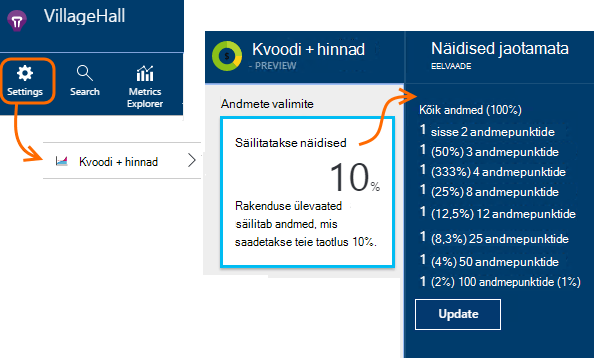

<properties 
    pageTitle="Telemeetria proovide rakenduse ülevaated | Microsoft Azure'i" 
    description="Kuidas hoida mahu kontrolli all hoidmiseks telemeetria." 
    services="application-insights" 
    documentationCenter="windows"
    authors="vgorbenko" 
    manager="douge"/>

<tags 
    ms.service="application-insights" 
    ms.workload="tbd" 
    ms.tgt_pltfrm="ibiza" 
    ms.devlang="na" 
    ms.topic="article" 
    ms.date="08/30/2016" 
    ms.author="awills"/>

#  <a name="sampling-in-application-insights"></a>Klõpsake rakenduse ülevaated valimite

*Rakenduse ülevaated on eelvaade.*


Valimite [Visual Studio rakenduse ülevaated](app-insights-overview.md) funktsioon, on soovitatav viis vähendada telemeetria liikluse ja salvestusruumi säilitades statistiliselt õigesti rakenduse andmeid analüüsida. Filtri valib üksused, mis on seotud nii, et saate liikuda vahel, kui teete uuringute käigus.
Kui argumendil loendab toodud portaalis, on need renormalized arvesse võtmine mingit mõju statistika minimeerimiseks.

Valimite vähendab liikluse, aitab hoida iga kuu andmete kvoodi piires ja aitab vältida ahendamine.

## <a name="in-brief"></a>Lühidalt:

* Valimite säilitab *n* kirjete 1 ja ülejäänud hüljatakse. Näiteks võib ta alles 1 5 sündmuste puhul 20%. 
* Valimite toimub automaatselt, kui teie rakendus saadab palju telemeetria, veebirakendustes ASP.net-i serveri.
* Saate määrata ka proovide käsitsi, kas portaalis lehel hinnakirjad; või ASP.net-i SDK .config failis ka vähendada võrguliiklust.
* Kui logite kohandatud sündmused ja soovite veenduda, et kogumi sündmused on kas säilitatakse või eemaldatakse koos, veenduge, et neil on sama OperationId väärtuse.
* Valimite jagaja *n* on esitatud iga kirje atribuudi `itemCount`, mis otsingus kuvatakse jaotises sõbralik nimi "taotluse count" või "sündmuste arv". Kui valimite pole tehe `itemCount==1`.
* Kui kirjutate Analytics päringud, peaksite [arvestama valimite](app-insights-analytics-tour.md#counting-sampled-data). Eelkõige asemel lihtsalt kirjete loendamine, peaksite kasutama `summarize sum(itemCount)`.


## <a name="types-of-sampling"></a>Valimite tüübid


On kolme alternatiivne valimite meetodit.

* **Kohandatavad valimite** automaatne helitugevuse telemeetria saadetud SDK ASP.net-i rakenduse kaudu. Vaikimisi SDK v 2.0.0-beta3. ASP.net-i serveripoolne telemeetria ainult praegu saadaval. 
* **Fixed suurusega valimite** vähendab telemeetria saadetud nii ASP.net-i serverisse ja teie kasutajate brauseritest mahtu. On määra. Kliendi ja serveri sünkroonib oma valimite nii, et otsima, seas saate liikuda seotud lehe vaadete ja kutsed.
* **Manustamisest valimite** vähendab telemeetria säilitatakse rakenduse ülevaated teenus, määr, mille määrasite määratud mahtu. See ei vähenda telemeetria liikluse, kuid aitab hoida oma igakuine kvoodi piires. 

Kui määr Adaptive või püsiv valimite on kasutusel, manustamisest valimite on keelatud.

## <a name="ingestion-sampling"></a>Manustamisest valimite

Seda tüüpi valimite töötab kohas, kus telemeetria oma veebiserverisse, brauserid ja seadmed jõuab rakenduse ülevaated teenuse lõpp-punkti. Kuigi see ei vähenda telemeetria liiklus teie rakenduse saadetud, see vähendada töödeldav ja säilitatakse (ja tasu), rakenduse ülevaated.

Kasutage seda tüüpi valimite, kui rakenduse sageli läheb üle selle kuu kvoodi ja teil pole võimalus kasutada ühte valimite SDK põhinev tüüpi. 

Määra valimite kvootide ja hinnad blade:



Nagu muud tüüpi valimite algoritmi säilitab seotud telemeetria üksused. Näiteks otsing telemeetria kontrollides saate küll leida taotluse seotud kindla erand. Meetermõõdustik loendab nagu taotluse määr ja erandi määr õigesti säilitatakse.

Andmepunktid, mis on kasutuselt kõrvaldatud proovide ei ole saadaval, mis tahes rakenduse ülevaated funktsiooni, näiteks [Pidev eksportida](app-insights-export-telemetry.md).

Manustamisest valimite ei tööta kui SDK põhinev kohandatava või kindlaksmääratud valimite töötab. Kui määr valimite SDK on vähem kui 100%, ignoreeritakse manustamisest valimite määr, mida saate määrata.

> [AZURE.WARNING] Paani kuvatud väärtus näitab väärtus, mida saate seada manustamisest valimite. See ei tähistavad tegelikku määra, kui kasutusel on SDK valimite.


## <a name="adaptive-sampling-at-your-web-server"></a>Kohandatavad valimite teie web server

Kohandatava valimite on saadaval rakenduse ülevaateid SDK ASP.net-i v 2.0.0-beta3 ja uuema versiooni ja on vaikimisi sisse lülitatud. 


Kohandatavad valimite mõjutab telemeetria saadetud web Appist serveri rakenduse ülevaated teenuse maht. Helitugevus on kohandatud automaatselt hoidmist liikluse määratud piirmäär.

See ei töötamist väikese mahu telemeetria, et rakendus silumine või veebilehe vähese kasutuse ei mõjuta.

Target maht saavutamiseks osa loodud telemeetria kõrvale. Kuid nagu muud tüüpi valimite algoritmi säilitab seotud telemeetria üksused. Näiteks otsing telemeetria kontrollides saate küll leida taotluse seotud kindla erand. 

Meetermõõdustik loendab nagu taotluse määr ja erandi määr on kohandatud hüvitamine valimite määr, nii, et need kuvataks ligikaudu õigete väärtuste meetermõõdustik Exploreris.

**Värskendage oma projekti Nugeti** pakette *väljalaske-eelse* rakenduse ülevaated uusim versioon: Paremklõpsake Solution Exploreris projekt, valige Halda Nugeti pakette, märkige ruut **kaasa väljalaske-eelne** ja otsige Microsoft.ApplicationInsights.Web. 

[ApplicationInsights.config](app-insights-configuration-with-applicationinsights-config.md), saate reguleerida, mitu parameetrite soovitud `AdaptiveSamplingTelemetryProcessor` sõlm. Esitatud arvud on vaikeväärtused.

* `<MaxTelemetryItemsPerSecond>5</MaxTelemetryItemsPerSecond>`

    Target (sihtkoht) määr kohandatava algoritmi eesmärk on **iga server hosti**jaoks. Kui teie web app töötab palju hosts, vähendada selle väärtust nii, et jäävad teie target määr liikluse rakenduse ülevaated portaal.

* `<EvaluationInterval>00:00:15</EvaluationInterval>` 

    Intervall, mille praeguse telemeetria on uuesti hinnata. Jooksva keskmise sooritatakse hindamiseks. Võite ajavahemik lühendamise, kui teie telemeetria puruneb ootamatut.

* `<SamplingPercentageDecreaseTimeout>00:02:00</SamplingPercentageDecreaseTimeout>`

    Kui proovide protsent väärtus muutub, kui kiiresti pärast me lubatakse langetada valimite protsent uuesti, et jäädvustada vähem andmeid.

* `<SamplingPercentageIncreaseTimeout>00:15:00</SamplingPercentageIncreaseTimeout>`

    Kui proovide protsent väärtus muutub, kuidas varsti pärast on meil lubatud suurendamiseks valimite protsent uuesti, et koguda rohkem andmeid.

* `<MinSamplingPercentage>0.1</MinSamplingPercentage>`

    Proovide protsent erineb, mis on me lubada määrata väikseima väärtuse.

* `<MaxSamplingPercentage>100.0</MaxSamplingPercentage>`

    Proovide protsent erineb, mis on me lubada määramiseks suurima väärtuse.

* `<MovingAverageRatio>0.25</MovingAverageRatio>` 

    Jooksva keskmise arvutamisel, kaalust määratud viimase väärtuse. Kasutage väärtust, mis on võrdne või väiksem kui 1. Väiksemad väärtused muuta algoritmi vähem reaktiivne ootamatut abil.

* `<InitialSamplingPercentage>100</InitialSamplingPercentage>`

    Kui rakendus on hakanud määratud väärtus. Ei vähenda see samal ajal, kui te kasutate silumine. 

### <a name="alternative-configure-adaptive-sampling-in-code"></a>Teise võimalusena: konfigureerimine kohandatava valimite kood

Asemel reguleerimine valimite .config faili, saate kasutada koodi. See võimaldab teil määrata tagasihelistamise funktsioon, mis on vaja järgida iga kord, kui valimite on uuesti hinnata. Võite seda, näiteks teada valimite intressimäära, mida kasutatakse.

Eemaldamine on `AdaptiveSamplingTelemetryProcessor` sõlm .config failist.


*C#:*

```C#

    using Microsoft.ApplicationInsights;
    using Microsoft.ApplicationInsights.Extensibility;
    using Microsoft.ApplicationInsights.WindowsServer.Channel.Implementation;
    using Microsoft.ApplicationInsights.WindowsServer.TelemetryChannel;
    ...

    var adaptiveSamplingSettings = new SamplingPercentageEstimatorSettings();

    // Optional: here you can adjust the settings from their defaults.

    var builder = TelemetryConfiguration.Active.TelemetryProcessorChainBuilder;
    
    builder.UseAdaptiveSampling(
         adaptiveSamplingSettings,

        // Callback on rate re-evaluation:
        (double afterSamplingTelemetryItemRatePerSecond,
         double currentSamplingPercentage,
         double newSamplingPercentage,
         bool isSamplingPercentageChanged,
         SamplingPercentageEstimatorSettings s
        ) =>
        {
          if (isSamplingPercentageChanged)
          {
             // Report the sampling rate.
             telemetryClient.TrackMetric("samplingPercentage", newSamplingPercentage);
          }
      });

    // If you have other telemetry processors:
    builder.Use((next) => new AnotherProcessor(next));

    builder.Build();

```

([Telemeetria protsessorite kohta teabe saamiseks lugege](app-insights-api-filtering-sampling.md#filtering).)


<a name="other-web-pages"></a>
## <a name="sampling-for-web-pages-with-javascript"></a>Veebilehtede JavaScript valimite

Saate konfigureerida veebilehti kindlaksmääratud valimite mis tahes serverist. 

Kui saate [konfigureerida veebilehtede jaoks rakenduse ülevaated](app-insights-javascript.md), muuta koodilõigu, mille saate rakenduse ülevaated portaali. (ASP.net-i rakendustes, väljavõte tavaliselt läheb _Layout.cshtml.)  Lisa rida nagu `samplingPercentage: 10,` enne instrumentation võti:

    <script>
    var appInsights= ... 
    }({ 


    // Value must be 100/N where N is an integer.
    // Valid examples: 50, 25, 20, 10, 5, 1, 0.1, ...
    samplingPercentage: 10, 

    instrumentationKey:...
    }); 
    
    window.appInsights=appInsights; 
    appInsights.trackPageView(); 
    </script> 

Valimite protsenti, valida protsendi lähedane 100/N, kus N on täisarv.  Praegu proovide ei toeta muid väärtusi.

Kui lubate ka laheneb valimite server, sünkroonib kliendid ja serveri nii, et otsima, seas saate liikuda seotud lehe vaadete ja kutsed.


## <a name="fixed-rate-sampling-for-aspnet-web-sites"></a>Kindlaksmääratud valimite ASP.net-i veebisaitide

Fikseeritud valimite vähendab liikluse, saadetakse teie veebiserver ja veebibrauserite kaudu. Erinevalt kohandatava valimite, vähendab see telemeetria teie poolt fikseeritud määra. See ka sünkroonib kliendi ja serveri proovide nii, et seostuvad üksused säilitatakse – näiteks nii, et kui vaatate lehe vaate otsingus, leiate selle seotud taotluse.

Valimite algoritmi säilitab seostuvad üksused. Iga HTTP nõude sündmus, seda ning selle seotud sündmused on kasutuselt kõrvaldatud või edastatav teave. 

Mõõdikute Exploreris, määr, nt taotlus ja erandi hulk on aastaväärtus hüvitamine valimite määr, et need oleksid õiged ligikaudu.

1. **Värskendage oma projekti Nugeti pakettide** *väljalaske-eelse* rakenduse ülevaated uusim versioon. Paremklõpsake Solution Exploreris projekt, valige Halda Nugeti pakettide, märkige ruut **kaasa väljalaske-eelne** ja otsige Microsoft.ApplicationInsights.Web. 

2. **Keelake kohandatava valimite**: [ApplicationInsights.config](app-insights-configuration-with-applicationinsights-config.md), eemaldada või välja kommenteerimine on `AdaptiveSamplingTelemetryProcessor` sõlm.

    ```xml

    <TelemetryProcessors>
    <!-- Disabled adaptive sampling:
      <Add Type="Microsoft.ApplicationInsights.WindowsServer.TelemetryChannel.AdaptiveSamplingTelemetryProcessor, Microsoft.AI.ServerTelemetryChannel">
        <MaxTelemetryItemsPerSecond>5</MaxTelemetryItemsPerSecond>
      </Add>
    -->
    

    ```

2. **Kindlaksmääratud valimite mooduli lubada.** [ApplicationInsights.config](app-insights-configuration-with-applicationinsights-config.md)selle koodilõigu lisamiseks tehke järgmist.

    ```XML

    <TelemetryProcessors>
     <Add  Type="Microsoft.ApplicationInsights.WindowsServer.TelemetryChannel.SamplingTelemetryProcessor, Microsoft.AI.ServerTelemetryChannel">

      <!-- Set a percentage close to 100/N where N is an integer. -->
     <!-- E.g. 50 (=100/2), 33.33 (=100/3), 25 (=100/4), 20, 1 (=100/100), 0.1 (=100/1000) -->
      <SamplingPercentage>10</SamplingPercentage>
      </Add>
    </TelemetryProcessors>

    ```

> [AZURE.NOTE] Valimite protsenti, valida protsendi lähedane 100/N, kus N on täisarv.  Praegu proovide ei toeta muid väärtusi.


### <a name="alternative-enable-fixed-rate-sampling-in-your-server-code"></a>Lahendus: lubada kindlaksmääratud valimite serveri koodi


Asemel parameetri valimite .config faili, saate kasutada koodi. 

*C#:*

```C#

    using Microsoft.ApplicationInsights.Extensibility;
    using Microsoft.ApplicationInsights.WindowsServer.TelemetryChannel;
    ...

    var builder = TelemetryConfiguration.Active.GetTelemetryProcessorChainBuilder();
    builder.UseSampling(10.0); // percentage

    // If you have other telemetry processors:
    builder.Use((next) => new AnotherProcessor(next));

    builder.Build();

```

([Telemeetria protsessorite kohta teabe saamiseks lugege](app-insights-api-filtering-sampling.md#filtering).)


## <a name="when-to-use-sampling"></a>Millal kasutada valimit?

Kohandatavad valimite automaatselt lubatud, kui kasutate ASP.net-i SDK versioon 2.0.0-beta3 või uuem versioon. Sõltumata sellest, millist SDK versiooni kasutate, saate kasutada manustamisest valimite (meie server).

Te ei pea valimite enamik väikestele ja keskmise suurusega rakendusi. Kõige enam kasu diagnostikateave ja kõige täpsem statistika saadakse andmete kogumine oma kasutaja tegevuste kohta. 

 
On valimi peamisi eeliseid.

* Rakenduse ülevaateid teenuse langeb ("pidurdab") andmepunktid kui rakenduse saadab väga kõrge telemeetria lühike kellaaeg intervall. 
* Hoida oma hinnakirjad kiht andmepunktide [kvoodi](app-insights-pricing.md) . 
* Telemeetria kollektsioonist vähendada võrguliiklust. 

### <a name="which-type-of-sampling-should-i-use"></a>Mis tüüpi proovide tuleks kasutada?


**Kasutage manustamisest proovide kui:**

* Sageli läbida oma kuu piirmäära telemeetria.
* Kasutate versiooni Tarkvaraarenduskomplektist, mis ei toeta valimite – nt, Java SDK või ASP.net-i versioonide varem 2.
* Kostub telemeetria palju teie kasutajate veebibrauser.

**Kasutage laheneb proovide kui:**

* Kasutate rakenduse ülevaateid SDK ASP.net-i web services versioon 2.0.0 või uuem versioon ja
* Soovite sünkroonitud proovide kliendi ja serveri vahel nii, et [Otsing](app-insights-diagnostic-search.md)sündmuste uurimisel seas saate liikuda seotud sündmused klient ja server, nt lehe vaated ja http päringuid.
* Olete kindel, sobiv valimite protsentuaalse oma rakenduse. See peaks olema piisavalt suur, et saada täpne mõõdikute, kuid väiksem kui, mis ületab hinnakirjad meiliteavitus ja ahendamise piirangud. 


**Kasutage kohandatava valimite.**

Muul juhul soovitatav kohandatava valimite. See on vaikimisi ASP.net-i serveri SDK versioon 2.0.0-beta3 või uuem versioon. See ei vähenda liikluse teatud alammäära, kuni nii, et see ei mõjuta saidi madal kasutamiseks.


## <a name="how-do-i-know-whether-sampling-is-in-operation"></a>Kuidas teada saada, kas kasutusel on valimite?

Leida tegelikku määr sõltumata sellest, kus on rakendatud, kasutage [päringu Kasutusanalüüsi](app-insights-analytics.md) , nagu see.

    requests | where timestamp > ago(1d)
  	| summarize 100/avg(itemCount) by bin(timestamp, 1h) 
  	| render areachart 

Säilitatakse iga kirje `itemCount` näitab algse kirjed, mis tähistab see arv võrdub 1 + eelmise kasutuselt kõrvaldatud kirjete arvu. 


## <a name="how-does-sampling-work"></a>Valimite tööpõhimõtted

Kindlaksmääratud ja kohandatava valimite on funktsioon SDK ASP.net-i versioonides 2.0.0 aastast kaudu. Manustamisest valimite on funktsioon rakenduse ülevaated teenuse ja võib olla toiminguga kui SDK ei toimi valimite. 

Valimite algoritmi otsustab loobuda telemeetria üksused ja millised neist alles jätta (kas see on SDK või rakenduse ülevaated teenuse). Valimite otsus põhineb mitme reeglid, mis eesmärk on kõik omavahel seotud andmepunktide samaks, säilitades diagnostika teenuses rakenduse ülevaated, mis on vaidlustatavad ja usaldusväärne, isegi kui tasute vähendatud andmehulgas. Näiteks kui nurjunud taotlus rakenduse saadab telemeetria täiendavate üksuste (nt erand ja selle taotluse logitud jälgi), valimite kuvatakse ei tükeldatud taotlus ja muude telemeetria. See hoiab või need kõik koos langeb. Seetõttu, kui vaatate rakenduse ülevaated taotluse üksikasjad, saate alati vaadata taotluse koos sellega seotud telemeetria üksused. 

Rakenduste, mis määratlevad "kasutaja" (st kõige tüüpilised veebirakenduste), valimite otsus põhineb kasutaja id, mis tähendab, et kõik telemeetria teatud kasutajate on alles või lähevad räsi. Soovitud tüüpi rakendusi, mis pole määratleda kasutajad (nt veebiteenused) põhineb valimite otsust taotluse toimingu ID-d. Lõpuks telemeetria üksused, mida ei ole kasutaja ega toiming ID-d määramine (näide telemeetria üksuste teatatud asünkroonne Teemad koos konteksti pole http kaudu) jaoks valimite lihtsalt sisaldab iga tüüpi telemeetria üksuste protsendina. 

Telemeetria esitamise teile reguleerib rakenduse ülevaated teenuse mõõdikud puuduvad andmepunktide hüvitamine saidikogumi, ajal kasutatud sama valimite protsendi võrra. Seega vaadates rakenduse ülevaated telemeetria, kasutajad saavad vaadata statistiliselt õige lähendus, mis on väga lähedal real arvud.

Ühtlustamise täpsuse sõltub suuresti konfigureeritud valimite protsenti. Rakendusi, mis sooritavad suure hulga üldjuhul sarnaselt taotluste suure hulga kasutajate suureneb ka, täpsust. Teisalt, rakendusi, mis ei tööta märgatavat laadi, valimite ei ole vaja need rakendused tavaliselt saab saata kõigi nende telemeetria andmed ei lähe kaotsi kaudu pidurdamise kvoodi, jäädes. 

Tähele, et rakenduse ülevaated ei Kuulake mõõdikute ja seansid telemeetria tüübid, kuna selliste failitüüpide, vähendamine täpsus võib olla soovimatud. 

### <a name="adaptive-sampling"></a>Kohandatavad valimite

Kohandatavad valimite lisab komponent, mis jälgib praeguse määra edastamise SDK ja reguleerib valimite protsenti ja proovige jäävad target piirmäära. Kohandamine arvutatakse ümber intervalliga ja jooksva keskmise Väljamineva meili edastamine määra põhjal.

## <a name="sampling-and-the-javascript-sdk"></a>Valimite ja JavaScripti SDK

Kliendipoolne (JavaScript) SDK osaleb kindlaksmääratud valimite serveripoolne SDK koos. Seadistatud lehtede saadab ainult kliendipoolne telemeetria sama kasutajatelt, mille serveripoolne tehtud otsustanud "proovi." See loogika on mõeldud säilitada usaldusväärsus kasutaja seansi üle kliendi - ja serveri-poole. Selle tulemusena rakenduse ülevaated üksusest mis tahes kindla telemeetria leiate kõigi telemeetria üksuste selle kasutaja või seansi jaoks. 

*Minu klient ja Serveripoolsed telemeetria ära kuva koordineeritud näidised, kui teil on kirjeldatud ülal.*

* Veenduge, et te lubatud laheneb valimite nii serveri klient.
* Veenduge, et SDK versioon on 2.0 või uuem.
* Veenduge, et te sama valimite protsendi klient ja server.


## <a name="frequently-asked-questions"></a>Korduma kippuvad küsimused 

*Miks pole proovide mõne lihtsa "kogu X protsenti iga tüüpi telemeetria"?*

 *  Kuigi see lähenemine valimite annaks väga kõrge täpsusega argumendil lähendus sisse, selle oleks murda võimalus oleksid Diagnostikaandmete kasutaja, seansi ja taotlus, mis on oluline diagnostika. Seetõttu proovide töötab paremini "kõik telemeetria kleebitavate üksuste kogumine jaoks X protsenti rakenduse kasutajate" või "kogub kõik telemeetria jaoks X protsendi rakendusetaotluste" loogika. Telemeetria üksuste pole seotud taotlusi (nt taust asünkroonne töötlemine), on sügis tagasi "kogu X protsenti iga telemeetria tüübi kõik üksused." 

*Saate aja jooksul muutuda valimite protsent?*

 * Jah, täitesse kohandatava valimi põhjal praegu tuvastatud maht telemeetria valimite protsenti.

 

*Kui kasutamiseks kindlaksmääratud valimite kuidas teada saada, millist valimite protsent ei tööta minu rakenduse jaoks kõige paremini?*

* Üks võimalus on alustada kohandatava valimite teada, mis hindamine see kaob (vt ülal küsimus), ning aktiveerige kindlaksmääratud proovide määra abil. 

    Muul juhul peate mõelda. Teie praegune telemeetria kasutamine AI analüüsida, jälgida, mis tahes pidurdamise korral ja prognoosimiseks kogutud telemeetria maht. Need kolm sisendina teie valitud hinnakirjad esimese taseme koos soovitamine, võiksite kogutud telemeetria mahu vähendamine. Siiski võib teie kasutajate arv suureneb või mõne muu shift telemeetria mahu seadmele oma hinnangu.

*Mis juhtub, kui konfigureerida valimite protsent on liiga nõrk?*

* Liiga nõrk valimite protsent (over-aggressive valimite) vähendab täpsuse kasutades, kui rakenduse ülevaated proovib kompenseeri andmete mahu vähendamiseks andmete visualiseerimine. Diagnostika kogemus võivad negatiivselt mõjutada ka, nagu mõned harva suuda või aeglane taotlusi võib proove välja.

*Mis juhtub, kui konfigureerida valimite protsent liiga suur?*

* Konfigureerimise liiga suur valimite protsent (pole piisavalt agressiivne) põhjustab on piisavalt kogutud telemeetria maht. Võisite telemeetria andmete kaotsimineku seotud pidurdamise ja rakenduse ülevaated kasutamisega võib olla suurem kui planeeritud aegunud kulude tõttu.

*Millist platvormide saate valimite kasutada?*

* Manustamisest valimite võib ilmneda automaatselt mis tahes telemeetria kohal maht, kui SDK ei toimi valimite. See teeks, näiteks, kui teie rakendus kasutab Java server või kui kasutate ASP.net-i SDK varasem versioon.

* Kui kasutate ASP.net-i SDK versioonid 2.0.0 ja kohal (majutatud Azure'i või oma serverisse), saate kohandatava proovide vaikimisi, kuid mida saab vahetada kindlaksmääratud ülalpool kirjeldatud. Kindlaksmääratud valimite, kus brauseris SDK sünkroonib automaatselt seotud sündmused proovi. 

*On teatud harvaesinevate sündmuste tahan alati näha. Kuidas saan neid eelmiste valimite mooduli?*

 * Lähtestage eraldi eksemplari TelemetryClient koos uue TelemetryConfiguration (mitte vaikimisi aktiivne). Mille abil saate saata oma harvaesinevate sündmused.


## <a name="next-steps"></a>Järgmised sammud

* [Filtreerimine](app-insights-api-filtering-sampling.md) saate sisestada rohkem range kontrolli, mis saadetakse teie SDK.
